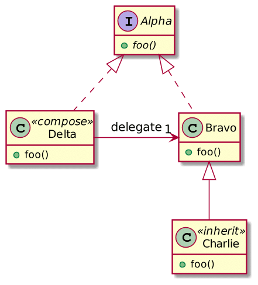

Kotlin offers many exciting features. In general, developers tend to cite null safety as their favorite. For me, it's function extensions. But delegation comes a close second.

## The delegation pattern

The delegation pattern is described in the book:
> *Delegation* is a way to make composition as powerful for reuse as inheritance \[Lie86, JZ91\]. In delegation, *two* objects are involved in handling a request: a receiving object delegates operations to its *delegate* . This is analogous to subclasses deferring requests to parent classes. But with inheritance, an inherited operation can always refer to the receiving object through the `this` member variable in C++ and `self` in Smalltalk. To achieve the same effect with delegation, the receiver passes itself to the delegate to let the delegated operation refer to the receiver.



Delegation is critical when one chooses *composition* over *inheritance*.



## Manual and native delegation

In Java, you need to code delegation manually. The example above translates into the following code:

```java
interface A {
    void foo();
}

class B implements A {
    @Override
    public void foo() {
    }
}

class Composition implements A {
    private final B b;

    Composition(B b) {
        this.b = b;
    }

    @Override
    public void foo() {
        b.foo();
    }
}
```

Kotlin handles the delegation natively using the keyword `by`. You can write the same code in Kotlin like this:

```kotlin
interface A {
    fun foo()
}

class B : A {
    override fun foo() {}
}

class Delegate(b: B) : A by b  // 1
```

1. With this, you can call `foo()` on any `Delegate` instance

As explained in the docs:
> The by-clause in the supertype list for `Delegate` indicates that `b` will be stored internally in objects of `Delegate`, and the compiler will generate all the methods of `B` that forward to `b`.
>
> -- [Delegation](https://kotlinlang.org/docs/reference/delegation.html)

## Delegated properties

Kotlin also offers **delegated properties** , a property that delegates its getter (and its setter if a `var`) to "something else". A delegated property also uses the `by` keyword.

A couple of out-of-the-box delegates are available through the standard library.

* Non-null delegate: A non-`null` delegate behaves the same way as the `lazyinit` keyword: if one uses the variable before one has initialized it to a non `null` value, it will throw an `IllegalStateException`.

```kotlin
var notNull: String by Delegates.notNull()
```

* Lazy delegate: A lazy delegate computes the value *on the first access* , stores it, and then returns the stored value. As its name implies, you use `lazy` when the value is expensive to compute and doesn't change after computation.

```kotlin
val lazy: String by lazy { "An expensive computation" }
```

* Observable: An observable delegate offers a hook when the value is accessed so you can execute code **afterward** .

```kotlin
val observed = "Observed"
val observable: String by Delegates.observable(observed) {
    _, old, new -> println("old: $old, new: $new")
}
```

* Vetoable: A vetoable delegate is the opposite of the observable. It offers a hook that executes **before** . If this hook returns `true`, the set of the value executes as expected; if it returns `false`, the set doesn't happen.

```kotlin
val vetoable: String by Delegates.vetoable(observed) {
    _, _, _ -> Random.nextBoolean()
}
```

  Here, the set fails randomly 50% of the time. It's not helpful but fun to debug for your colleagues.

## Your own delegated property

If you want to create your own delegated property, it needs to point to a class that has:

1. An `operator fun getValue(thisRef: T, prop: KProperty): U` *operator* function for fields whose value is immutable
2. An extra `operator fun getValue(thisRef: T, prop: KProperty, value: U)` if it's mutable

* `T` is the class' type
* `U` the property's
* `thisRef` is the class instance
* `value` is the new value
* `prop` is the property itself

As an illustration, let's implement a distributed cache delegated property based on Hazelcast IMDG.

```kotlin
class HazelcastDelegate<T>(private val key: String) {

  private val map: IMap<String, Any> by lazy {                          // 1
    val config = Config().apply {
      instanceName = "Instance"
    }
    Hazelcast.getOrCreateHazelcastInstance(config).getMap("values")
  }

  operator fun getValue(thisRef: T, prop: KProperty<*>) = map[key]      // 2

  operator fun setValue(thisRef: T, prop: KProperty<*>, value: Any?) {
      map[key] = value                                                  // 3
  }
}
```

1. Create a reference to a Hazelcast `IMap`
2. Get the value from the `IMap`
3. Set the value in the `IMap`

Using the above delegate is straightforward:

```kotlin
class Foo {
  var cached: Any? by HazelcastDelegate<Foo>("cached")
}

fun main() {
  val foo = Foo()
  foo.cached = "New value"
  println(foo.cached)
}
```

## Conclusion

The delegate pattern is ubiquitous in the Object-Oriented Programming world. Some languages, such as Kotlin, provides a native implementation.

But delegation doesn't stop at the class level. Kotlin does provide delegation at the property level. It provides some out-of-the-box delegates, but you can easily create your own.

*Original published at [A Java Geek](https://blog.frankel.ch/kotlin-delegation/) on April 18^th^, 2021*

*[GoF]: Gang of Four
