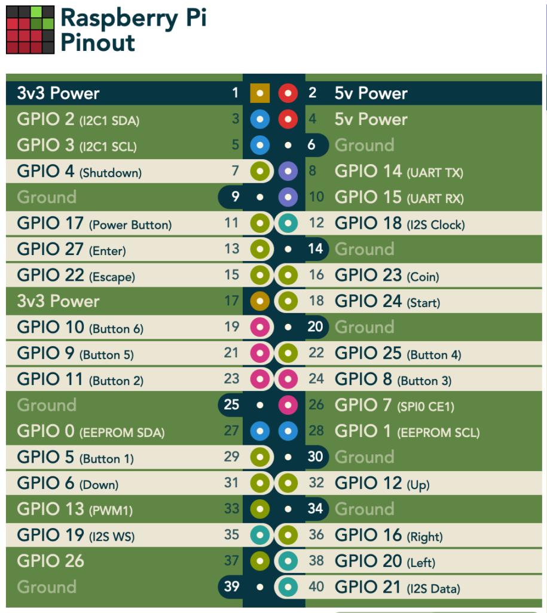
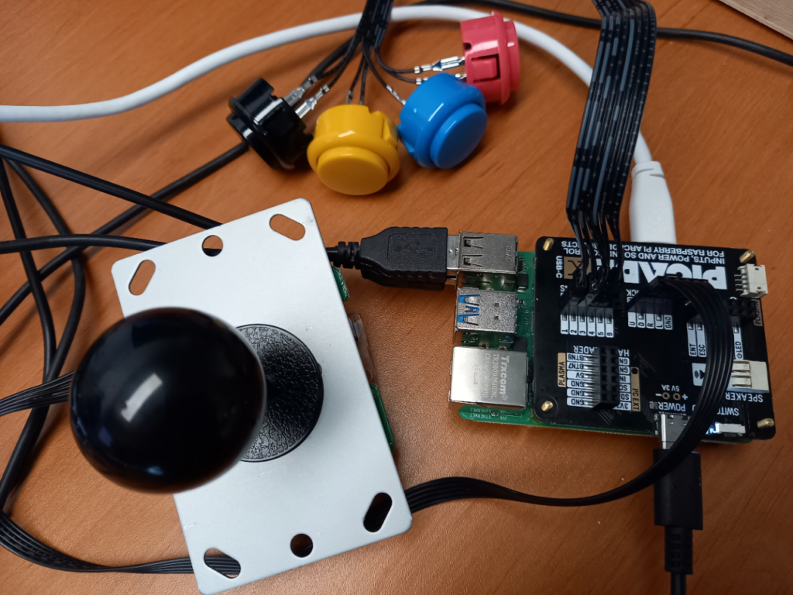
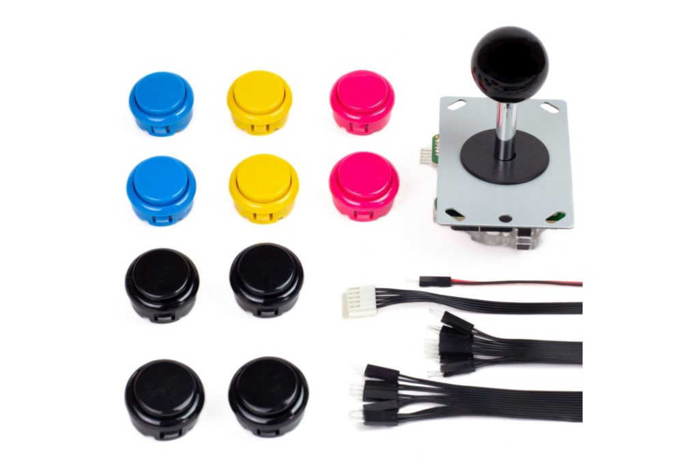
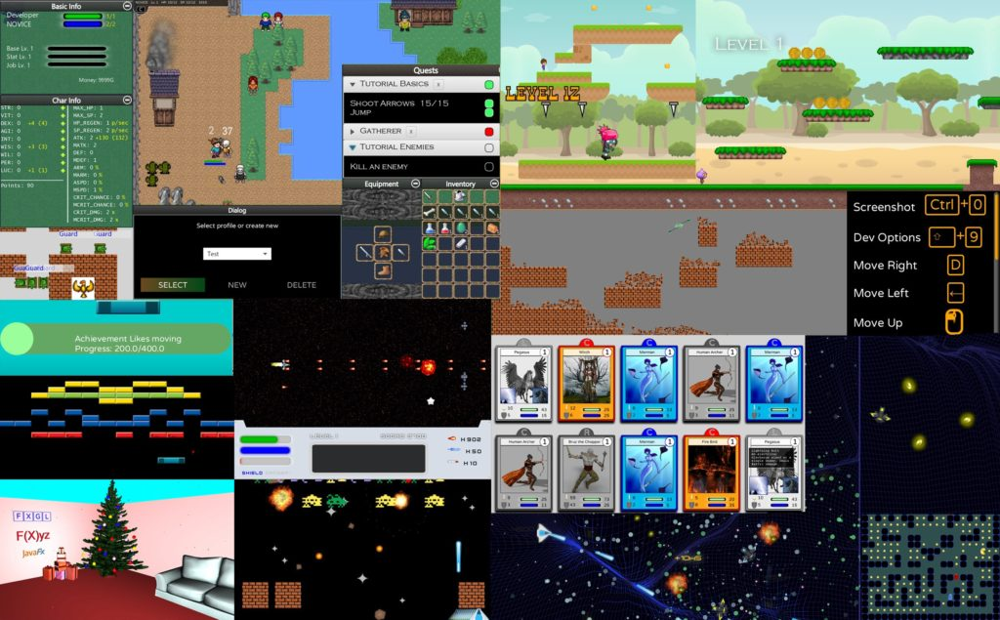

In this article, Almas and I will show you how to start with an idea for a game and bring it to life in a prototype application. We will then modify the application to run on a Raspberry Pi and on a mobile device.

To give some background, some time ago my 10y old son challenged me to create a Snake-like game with emojis. He selected the emoji images and I "only" needed to do the programming bit, the easy part... Luckily Almas asked me if I had a topic for some pair-programming for his [YouTube channel](https://www.youtube.com/channel/UCmjXvUa36DjqCJ1zktXVbUA/videos), and his question turned into a three-part series. My son is delighted because his idea is now a real game!

Creating the Basics of a Snake Game {#h2-0-creating-the-basics-of-a-snake-game}
-------------------------------------------------------------------------------

For the first video, we started from a minimal project I prepared, containing the images selected by my son and some basic code. The first challenge to be tackled was making a snake out of multiple elements. By using a fixed grid for the locations of the snake head and body elements, making a growing snake turned out to be pretty straightforward and easy to manipulate.



* Game code:
  * <https://github.com/FDelporte/JavaFXGameSnake>
* FXGL:
  * [https://github.com/AlmasB/FXGL](https://www.youtube.com/redirect?event=video_description&redir_token=QUFFLUhqa2JJRk5OWmZfY3N0WDFZcEl0ekRvNk41NUdKZ3xBQ3Jtc0ttVGJCSFlMN3BvZjByNHlTbTJvXzY0Y01lYUFRNWRvTmsyTDF0OFJRaElLd3prWEp1NU5Hc0VpR1dkMF94YjlLOXA5NUxtZ002UDJ4MWM5NUt0cVpuVEIwWHc4a01JZnBYbG5uYXdGUXdwSXgzVUszYw&q=https%3A%2F%2Fgithub.com%2FAlmasB%2FFXGL)

Controlling the Game with a Joystick on Raspberry Pi {#h2-1-controlling-the-game-with-a-joystick-on-raspberry-pi}
-----------------------------------------------------------------------------------------------------------------

Wouldn't it be fun to control the game with a real joystick? That was the challenge in our second video where we used the sources of the first one to extend them and make them run them on a Raspberry Pi with a physical controller.

<figure class="wp-block-gallery columns-3 is-cropped wp-block-gallery-1 is-layout-flex wp-block-gallery-is-layout-flex">
 <ul class="blocks-gallery-grid">
  <li class="blocks-gallery-item">
   <figure>
    
   </figure></li>
  <li class="blocks-gallery-item">
   <figure>
    
   </figure></li>
  <li class="blocks-gallery-item">
   <figure>
    
   </figure></li>
 </ul>
</figure>

The Pi4J project provides a **friendly object-oriented I/O API and implementation libraries for Java Programmers** to access the **full I/O capabilities of the Raspberry Pi platform**. This makes it the ideal starting point to integrate it into our Snake game.

Thanks to some clever methods provided by FXGL, it's possible to handle the GPIO (General-Purpose Input/Output) changes as key-presses. This way the game behaves exactly the same with both keyboard-presses and joystick-events, which makes it easy to test and play on your development PC and on the Raspberry Pi with the Arcade joystick and buttons.

<pre class="EnlighterJSRAW" data-enlighter-language="java" data-enlighter-theme="" data-enlighter-highlight="" data-enlighter-linenumbers="" data-enlighter-lineoffset="" data-enlighter-title="" data-enlighter-group="">import static com.almasb.fxgl.dsl.FXGLForKtKt.getExecutor;

var input = pi4j.create(DigitalInput.newConfigBuilder(pi4j)
   .id(id)
   .address(bcm)
   .pull(PullResistance.PULL_UP)
   .debounce(3000L)
   .provider("pigpio-digital-input"));
input.addListener(e -&gt; {
   if (e.state() == DigitalState.LOW) {
      console.println("Input change for " + id);
      getExecutor().startAsyncFX(() -&gt; getInput().mockKeyPress(keyCode));
   } else {
      getExecutor().startAsyncFX(() -&gt; getInput().mockKeyRelease(keyCode));
   }
});</pre>



* Sources extended with Pi4j
  * [https://github.com/Pi4J/pi4j-example-fxgl](https://www.youtube.com/redirect?event=video_description&redir_token=QUFFLUhqazZWellmNFZLZ2RtVTk2cHpkLWZxS1dzQng5UXxBQ3Jtc0tsYjhkek03RmxlSENncm04TVFMY19sclpHM18tV0owaTh3ZVBSdFItT0x3c0NpWHJXQ2FPaGU1Ujc3eUxmNmhHa0JOcE16M3A2M2dSd1Z6cTNGWHp3cGREV1Byb2UxZXNfNDh0ZThrc3NYUS1sdVd2NA&q=https%3A%2F%2Fgithub.com%2FPi4J%2Fpi4j-example-fxgl)
* Arcade kit + HAT
  * [https://www.kiwi-electronics.nl/pim-471?search=arcade\&description=true](https://www.youtube.com/redirect?event=video_description&redir_token=QUFFLUhqbmwteDVCMVprWmt5b0ZJSWVFd19xcEZBUFpid3xBQ3Jtc0treldrbFhTZHZCT2FRQU9oNi1QSHNJcmpzUlV6YkN1OXh4WXByS2g1a2VWZ056TUEtSGxKX0Z2RTRXYlp1TTZYelRLcFhOYllUUUtqY1ZSSUdRQzdwUjN4STFZeWQwY3NObzhDdlRMWElkc1ZLRExUSQ&q=https%3A%2F%2Fgithub.com%2FPi4J%2Fpi4j-example-fxgl)
  * [https://www.kiwi-electronics.nl/index.php?route=product/product\&search=arcade\&description=true\&product_id=4337](https://www.kiwi-electronics.nl/index.php?route=product/product&search=arcade&description=true&product_id=4337)
* Arcade HAT GPIO numbers
  * <https://pinout.xyz/pinout/picade_hat>
* Pi4J website: Getting started, installing Visual Studio Code, example projects...
  * <https://pi4j.com/getting-started/>
* Raspberry Pi 4
  * <https://www.raspberrypi.org/products/raspberry-pi-4-model-b/>
* Raspberry Pi OS + Imager tool
  * <https://www.raspberrypi.org/software/>

Turning the Game into a Mobile App {#h2-2-turning-the-game-into-a-mobile-app}
-----------------------------------------------------------------------------

In the third video, we extended the game with food and made it playable on smartphones by integrating the Gluon tools and an on-screen joystick. The GitHub project contains workflows to build native applications for Mac OS, Windows, Linux, and Android. That last one also publishes new versions to Google Play. This was inspired by the Foojay article ["Native Applications for Multiple Devices from a Single JavaFX Project with Gluon Mobile and GitHub Actions"](https://foojay.io/today/native-applications-for-multiple-devices-from-a-single-javafx-project-with-gluon-mobile-and-github-actions/).



* Sources of the game with GitHub actions to build and deploy to Google Play:
  * <https://github.com/FDelporte/JavaFXGameSnakeApp>
* Google Play Store link:
  * <https://play.google.com/store/apps/details?id=be.webtechie.emojisnakegameapp>

Conclusion {#h2-3-conclusion}
-----------------------------

**Java for game development? Of course!** These videos only show you some getting started techniques, but the possibilities are endless.

Check out these links for more information:

* FXGL Games:
  * [https://github.com/AlmasB/FXGLGames](https://www.youtube.com/redirect?event=video_description&redir_token=QUFFLUhqa3pZZ0dzQVNaSC1lSlpaNHFsZVNTM3JPRkIyUXxBQ3Jtc0ttRUVnUGdZazFaYkZ2QXlHTENPVVpsNGl0b3JheEJOZlNxSDZZRVNFNTU0VmdJWXBjU0p4V2dCWlh3R1dkWHJHYlRBc2pKWnlCVFgxMkVsY2VUbGFOUnMwQUcxX2k3SHdaQW9TU2J1YldDbmJrNUIwOA&q=https%3A%2F%2Fgithub.com%2FAlmasB%2FFXGLGames)
* FXGL Game Engine:
  * [https://github.com/AlmasB/FXGL](https://www.youtube.com/redirect?event=video_description&redir_token=QUFFLUhqbER2eTg2bzRvZDNjam11ZVNlTVhpcDRNR3pGZ3xBQ3Jtc0trM29HOV93S01HeVdrUGg2X2RBU090LVdCLUtXZjdWVXMwcTBuMzYtRzlGaDc2LUMzbGxpWG4zUGw0M0NFMWdScHZoRkh4WWE5Z1prOElTNWxzTzlJckVBdDY5akVvRzY1Y2F4aC00SHkzMGp5bHpzOA&q=https%3A%2F%2Fgithub.com%2FAlmasB%2FFXGL)

That's all from us folks! Stay tuned for our future game development adventures!

