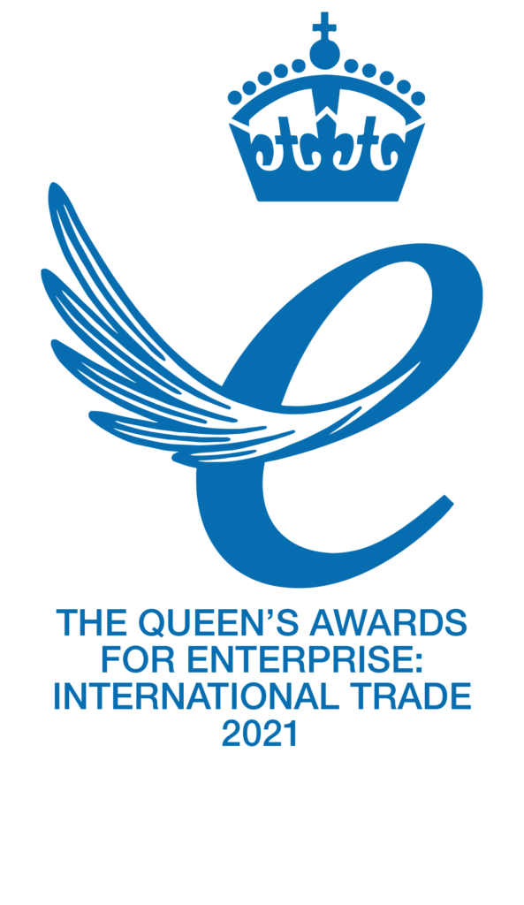
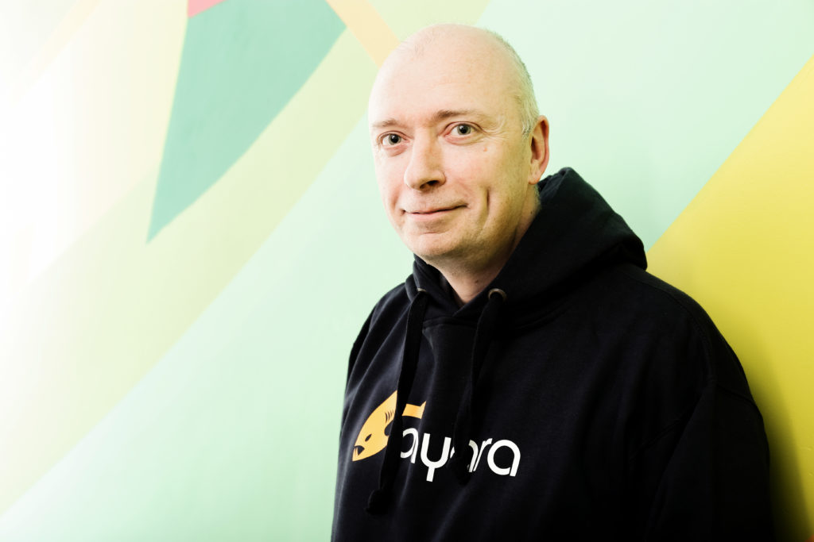
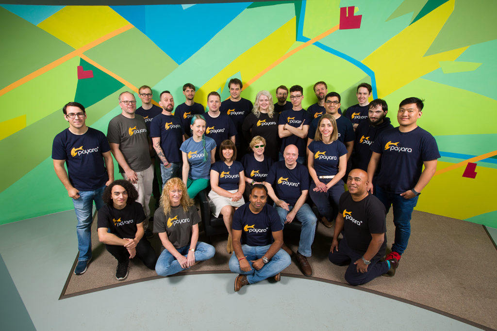

Micro-multinational open source software company, Payara Services, has been commended for its achievements within global trading and exporting with the Queen's Award for Enterprise for International Trade.  

<figure class="alignright size-large is-resized">
 
</figure>

Now in its 55^th^ year, the Queen's Award for Enterprise: International Trade is the UK's most prestigious business award, honouring organisations that have excelled in overseas exports whilst maintaining the highest standards in social, economic, and environmental activity.

Payara's win attests to the growing success of the open source software business model. Payara's open source product offering, the Payara Platform, is based on the global initiatives of the Jakarta EE and MicroProfile standards. Community users can download the Payara Platform Community Edition for their development projects and containerized Jakarta EE and MicroProfile applications, while the fully supported, subscription based Payara Enterprise Edition is designed for mission critical systems in production and containerized Jakarta EE and MicroProfile applications.

As one of just 205 businesses across the country to have received this accolade personally approved by Her Majesty The Queen, often called the 'knighthood for businesses', Payara can utilise the esteemed Queen's Award emblem within its marketing and promotional activity for the next five years.  

<figure class="alignleft size-large is-resized">
 
</figure>

**Steve Millidge, Founder and CEO of Payara Services Ltd,** commented:
> "We're thrilled to win a Queen's Award for International Trade. Payara was born global and has team members in many countries. This award recognises their commitment to the mission of delivering trusted, supported, enterprise software to customers worldwide."

**Payara's Marketing Manager, Dominika Tasarz-Sochacka,** added:
> "This prestigious award enhances our global reputation and builds on the exceptional growth we've experienced overseas in the last three years."

Since it was founded in 2016, Payara has implemented a strategy for overseas trade, with 95% of its services currently exported to a total of nine countries, including the USA, Japan, South Africa, and Germany.

Headquartered in Worcestershire, with a secondary EU office in Funchal, Portugal, Payara Services is recognised for its creation of innovative infrastructure software including the delivery of 24/7 production, development and migration support to customers around the world, including BMW Group, Hermes, and Rakuten Card.  

<figure class="alignright size-large is-resized">
 
</figure>

The firm's leading team of tech experts -- or 'Payarans' -- have worked incredibly hard to increase annual revenue by 107% over the last three years, with export sales more than doubling from 33% to 75%. The Payara Server has now become one of the fastest-growing open source platforms globally, with a community of over 320,000 users.

Payara continues to expand its global customer base to reach new markets and has several innovative projects in the pipeline, including the Payara Cloud. September of 2021, Payara Cloud is the next generation of cloud-native application server and all-in-one PaaS provides a more efficient way to run Jakarta EE apps on the cloud with no Kubernetes knowledge required.

<https://www.payara.fish>

<https://www.gov.uk/queens-awards-for-enterprise>
