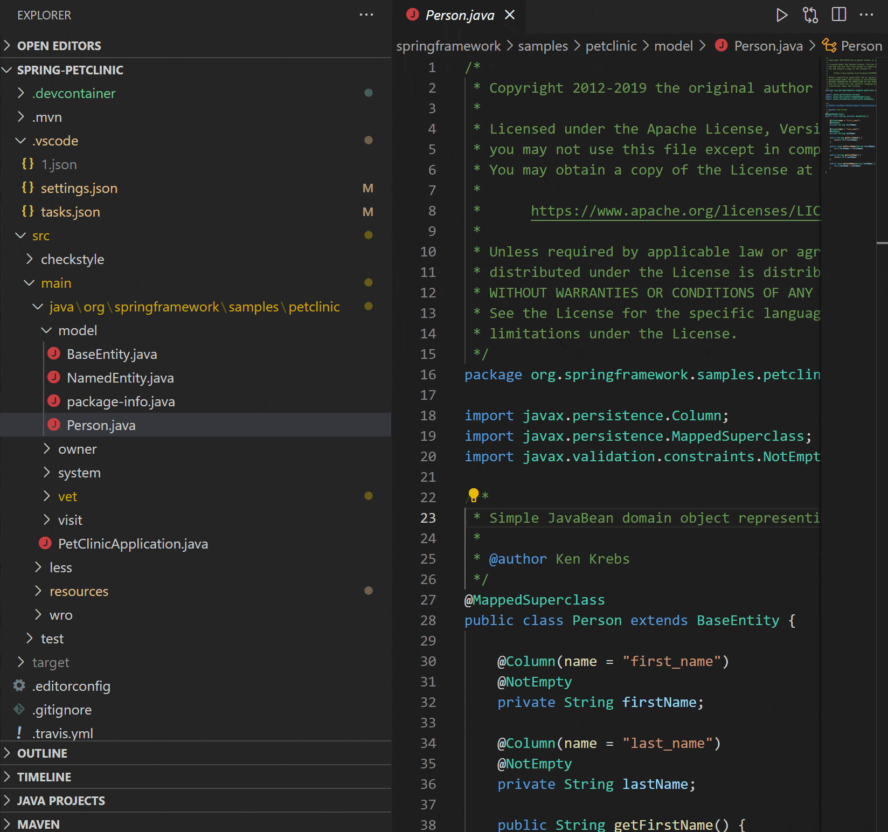
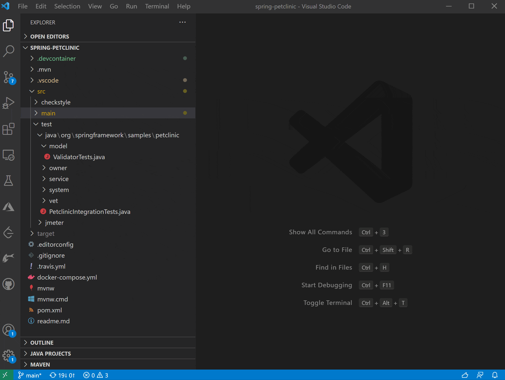
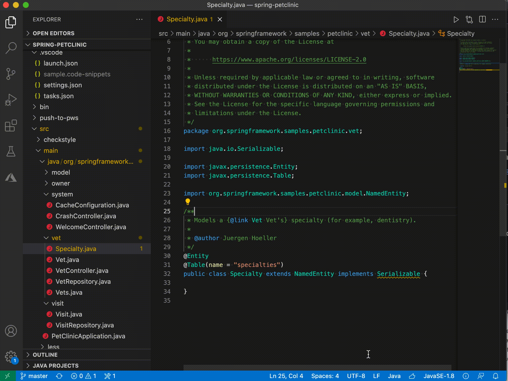
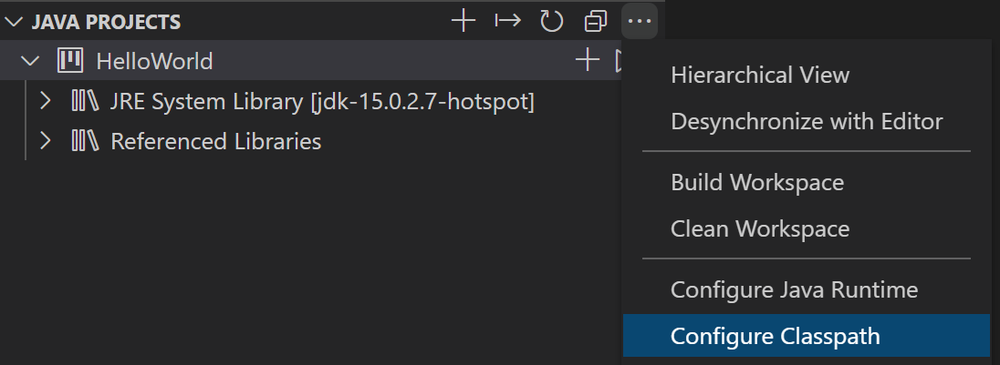
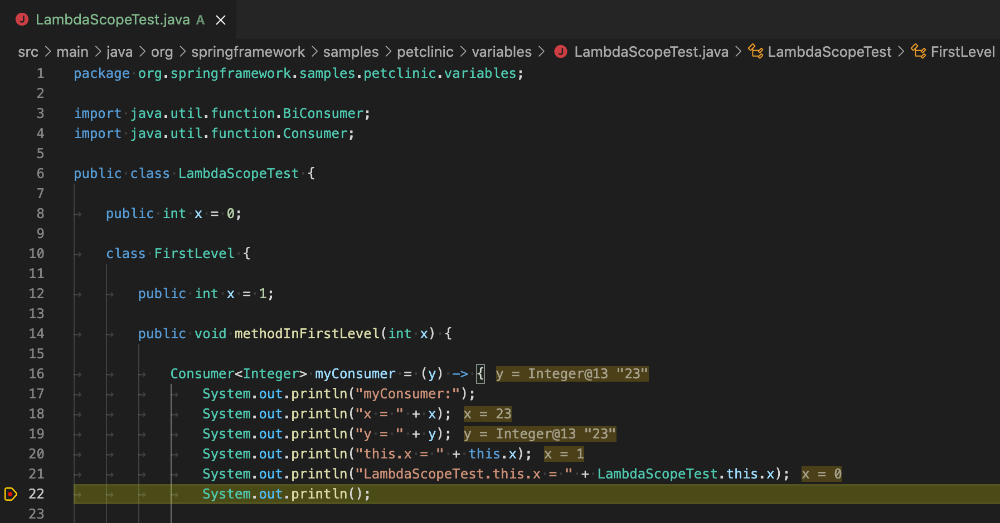
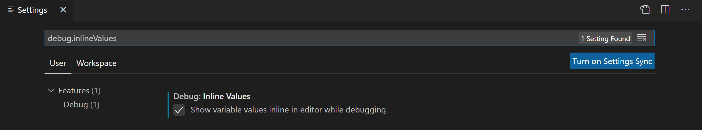
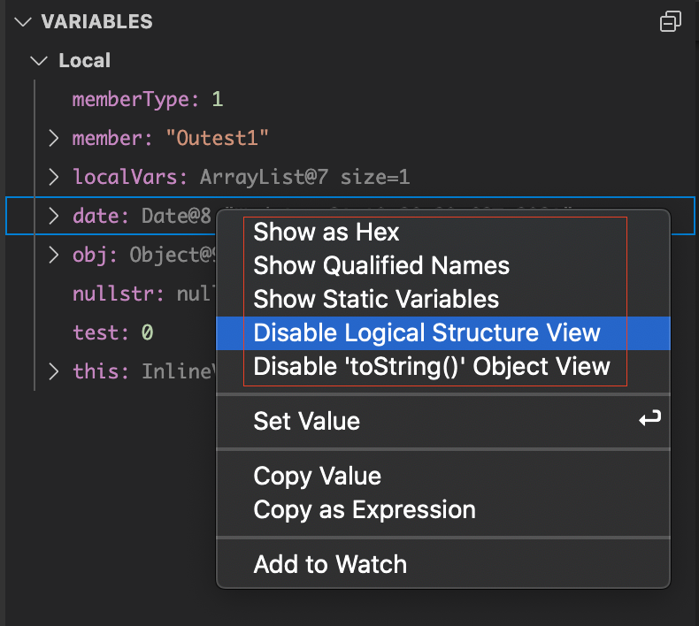
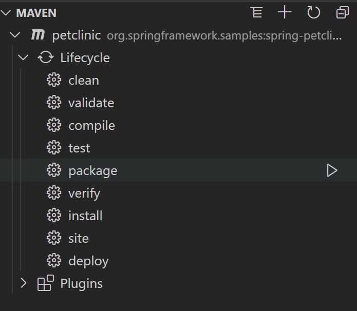
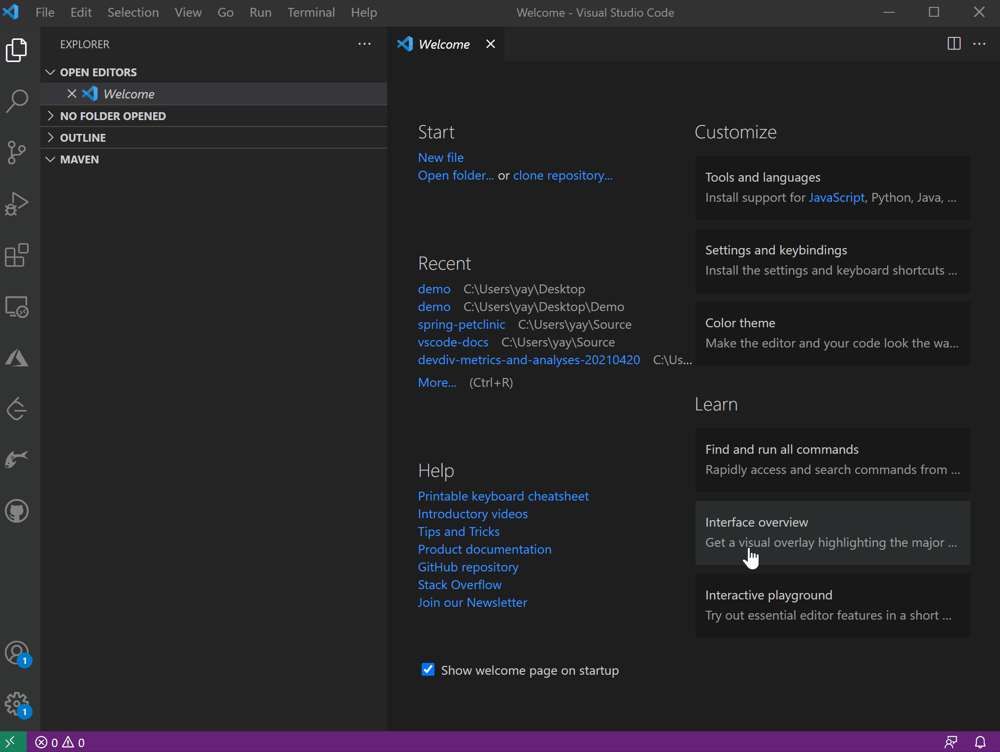

VS Code is getting better and better for Java. In the last two months, we have made progresses in all key areas including core language support, testing, debugging, refactoring and project management. Let's uncover the new hidden and less hidden gems!

### Type hierarchy

VS Code has already supported call hierarchy for Java, so what about type hierarchy?

Together with Red Hat, we are very happy to announce type hierarchy is publicly available from the latest release of [Language Support for Java published by Red Hat](https://marketplace.visualstudio.com/items?itemName=redhat.java "Language Support for Java published by Red Hat").

The feature allows you to view type hierarchy in class, supertype, or subtype view:

### Generating tests

Automatically generating testing method templates and importing testing packages is a handy feature to improve coding efficiency.

Starting from April, you can generate the method templates directly from a test file. In May, we will also add support for generating from a source file.To generate testing method templates, open or create a test file under project's test folder, right-click on file editor to invoke context menu, select "**Source Action...** " and then "**Generate Test...**", and finally select methods to generate:

  
**Note:** for generating from a test file, testing dependency need be added into your project.

### Package refactoring when moving file

When a .java file is moved from one folder to another, VS Code can automatically update package declaration and importing statements.

The latest release of [Language Support for Java published by Red Hat](https://marketplace.visualstudio.com/items?itemName=redhat.java "Language Support for Java published by Red Hat") now supports this feature. In addition to automatic updating, the feature also allows you to review and undo package changes:

### Classpath configuration

Managing path for source code, output, runtime, and libraries is an important project management task, almost every Java developer will perform. For those using build tool like Maven or Gradle, the tool allows managing these paths through its configuration file.

However, for those not using the build tool, especially like students, they need rely on IDE/editor tool to manage. Responding to that need, we released classpath configuration feature. You can launch the classpath configuration from "**JAVA PROJECTS** " explorer or by clicking **Ctrl** +**Shift** +**P** to open command palette and then typing "**configure classpath**" on the palette.

This feature is released as part of [Java Extension Pack](https://marketplace.visualstudio.com/items?itemName=vscjava.vscode-java-pack "Java Extension Pack"). Please, make sure you have installed the latest version of the pack.

### Debugging enhancements

#### Inline values

[Debugger for Java](https://marketplace.visualstudio.com/items?itemName=vscjava.vscode-java-debug "Debugger for Java") extension is now able to show variable values inline in editor when stepping through source code:

You can enable this feature by selecting **Files** -\>**Preferences** -\>**Settings** menu, searching for "**debug.inlineValues**" on settings view, and selecting the option.

#### Customized variables view

You can right-clicking the view to bring up customization menu.

Debugging enhancements were demonstrated at [VS Code 1.56 Release Party](https://channel9.msdn.com/Shows/VS-Code-Livestreams/1-56-Release-Party#time=20m55s "VS Code 1.56 Release Party").

### Maven enhancements

#### Lifecycle support

Now, you can directly execute common lifecycle phases from Maven explorer view by clicking the run icon next to a phase:

#### Refined creating project experience

Until next time, happy coding!
