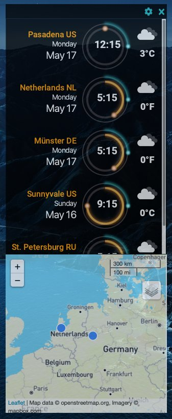
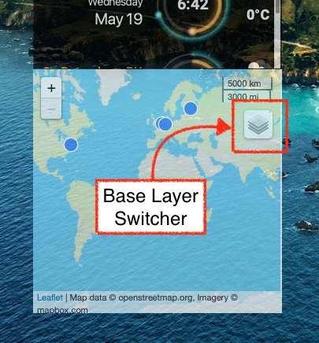
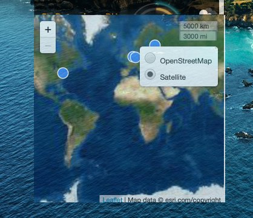
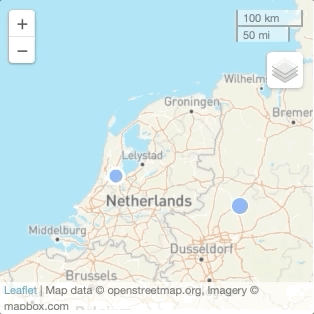
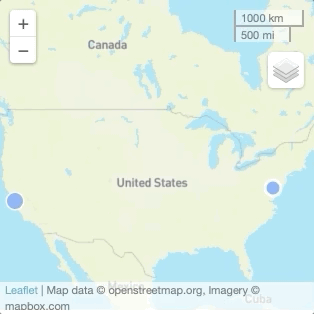
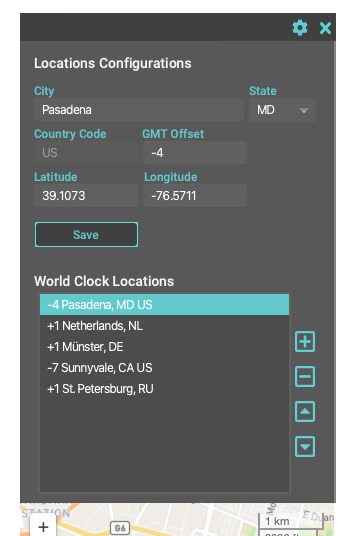

> "The good cartographer is both a scientist and an artist. He must have a thorough knowledge of his subject and model, the Earth…. He must have the ability to generalize intelligently and to make a right selection of the features to show. These are represented by means of lines or colors; and the effective use of lines or colors requires more than knowledge of the subject – it requires artistic judgement." \~ Erwin Josephus Raisz (1893 – 1968)

Hello, and welcome back to this series of articles on creating a JavaFX world clock. In Part 5 below, we will be looking at JavaFX's [`WebView`](https://openjfx.io/javadoc/16/javafx.web/javafx/scene/web/WebView.html "<code>WebView</code>") API to display an HTML Web page containing a 2D map ([Mercator projection](https://en.wikipedia.org/wiki/Mercator_projection "Mercator projection")).

To render the 2D map I will be using the popular Leaflet JS library. This will enable the World Clock App to let the user explore map locations based on GPS coordinates (latitude \& longitude).

If you are new to this series you can visit Part [1](https://foojay.io/today/creating-a-javafx-world-clock-from-scratch-part-1/ "1"), [2](https://foojay.io/today/creating-a-javafx-world-clock-from-scratch-part-2/ "2"), [3](https://foojay.io/today/creating-a-javafx-world-clock-from-scratch-part-3/ "3") \& [4](https://foojay.io/today/creating-a-javafx-world-clock-from-scratch-part-4/ "4") first.  


JavaFX World Clock Part 5

## Getting started

If you want to jump right into the code just head over to <https://github.com/carldea/worldclock>

## Requirements:

* Java 16 - An OpenJDK with OpenJFX (bundled with JavaFX modules)
  * [Azul Zulu with JavaFX](https://www.azul.com/downloads/zulu-community/?package=jdk-fx "Azul Zulu with JavaFX")
  * [Bellsoft Liberica with JavaFX](https://bell-sw.com/pages/downloads/#/java-16-current "Bellsoft Liberica with JavaFX") (full version)
* JavaFX 16 – <https://openjfx.io/openjfx-docs/#install-javafx>
* [Maven](https://maven.apache.org/download.cgi "Maven") 3.6.3 or greater
* [SDKMan](https://sdkman.io "SDKMan") (optional)

I recommend using an OpenJDK distro that already contains the JavaFX modules pre-bundled. Because the Java and JavaFX modules are bundled together there is no need to separately download `OpenJFX` module dependencies from Maven Central.

So, you should notice inside of the Maven [`pom.xml`](https://github.com/carldea/worldclock/blob/main/pom.xml "<code>pom.xml</code>") file I've commented out the OpenJFX dependencies.

If you want to use OpenJFX as a separate download you are likely using an installed OpenJDK distribution without the JavaFX modules. In that case you'll have to uncomment the section so the modules can be downloaded from Maven Central. When building and developing (IDE) the application the modules must be the same (in sync).

Instead of looking back at the earlier blog entries on how to obtain the JFX worldclock repo, let me reiterate the instructions below.

## Clone project

```bash
$ git clone https://github.com/carldea/worldclock
```

## Updating an upstream Repo

As I mentioned in [Part 4](https://foojay.io/today/creating-a-javafx-world-clock-from-scratch-part-4/ "Part 4") whenever I make a change to the JFX World Clock repo your locally cloned repo can be stale or out of date. So, every now and then you can update your local from the upstream repo (mine). Below, is how to add the original repo as a remote upstream branch if you've not done so. This allows you to do a pull to get the latest from my main branch.

```bash
$ git remote add upstream https://github.com/carldea/worldclock
$ git remote -v
$ git pull upstream main
```

## Run the App

If you use [SDKMan](https://sdkman.io "SDKMan") you can easily do the following:

```bash
$ sdk install java 16.0.0.fx-zulu
$ sdk use java 16.0.0.fx-zulu
$ mvn javafx:run
```

## A RoadBlock

Before we get started I wanted mention a road block that I had encountered in Part 4 regarding Java's `jlink` and `jpackage` command line tool on the Mac Operating system as it relates to the JavaFX module `javafx.web`. If you remember from [Part 4](https://foojay.io/today/creating-a-javafx-world-clock-from-scratch-part-4/), jlink is responsible for creating a custom Java Runtime image bundled with a JavaFX application (JFX World Clock). Then jpackage would package things as an executable installer such as a .dmg file.

While adding the JavaFX WebView node packaged as part of a native MacOS app, it appears the `index.html` file containing the map tries to call out to a remote map tile service ([MapBox](https://www.mapbox.com "MapBox")/[Esri](https://www.esri.com/en-us/home "Esri")), however the base layers of map tiles did not render properly (blank). It didn't show any errors or output to logs mentioning the problem. My suspicion is likely due to MacOS' new security requirements preventing an app from going out on the internet.

Because Apple's security model has changed in Big Sur, it now requires a notarization step to approve authors \& their applications. Because of this and other security steps (certs \& signing), I will look into this at a later time. But for now just use the following command line to run the JFX World Clock project locally and you'll see the map rendered without any issues:

```bash
$ mvn javafx:run
```

Okay back to Part 5, Working with WebView

## WebView \& WebEngine \[Java calling JavaScript\]

JavaFX's module `javafx.web` contains the `WebView` node that allows you to render HTML, CSS, and JavaScript. Most of the code that renders the the map is contained within the index.html file. To load the index.html file from Java code it is as simple as:

```java
WebView webView = new WebView();
webView.getEngine().load("http://foojay.io");
```

Of course, the JFX World Clock has more advanced use cases where I added a listener to the WebEngine to know when the page has finished loading. When loading is complete the code will add markers to the map indicating locations or point of interests (POI).

The following listing is the creation of the WebView node to be placed on the scene graph.

```java
WebView webView = new WebView();
WebEngine webEngine = webView.getEngine();

// Allows Java code to talk to JavaScript code
webEngine.setJavaScriptEnabled(true);

// A debugging trick to output messages from JavaScript code
webEngine.setOnAlert(webEvent -> {
    System.out.println("WebKit Alert: " + webEvent.getData());
});

webEngine
        .getLoadWorker()
        .stateProperty()
        .addListener((observable, oldValue, newValue) -> {
            if (newValue == Worker.State.SUCCEEDED) {
                System.out.println("index.html loaded successfully");
                // lambda to add markers onto the map.
                addPointMarkers.accept(webEngine);
            } else {
                System.out.println("WebEngine state " + newValue);
            }
        }
);
webEngine.load(getClass().getResource("index.html").toExternalForm());
```

## What's happening?

The code steps from the above listing are shown below:

1. Creates a WebView instance and obtain its WebEngine
2. Enable the JavaScript bridge to allow Java code to make JavaScript calls
3. Setup a web event handler to respond to JavaScript function alert()
4. Create a change listener to observe the loading page state
5. Once the State is 'SUCCEEDED' add markers to the map
6. Perform a page load of the file index.html

In step 5 the `addPointMarkers.accept()` function is invoked. The lambda is defined as follows:

```java
Consumer<WebEngine> addPointMarkers = (webEngine) -> {
   for (Location location:locations) {
   // Call JS function addMarker to add pins to the map based on locations.
   webEngine.executeScript("addMarker(\"%s\", %3.8f, %3.8f)"
                  .formatted(location.getFullLocationName(), location.getLatitude(), location.getLongitude()));
   }
};
```

Above you'll notice the `webEngine.executeScript()` function calling a JavaScript function. Here, it calls the function `addMarker()` and passes as parameters a location's name, latitude and longitude. This function will add markers onto the map. Each marker also contains a tooltip popup whenever the user hovers over a marker.

## Index.html w/ LeafletJS

As mentioned earlier the `WebView` and `WebEngine` APIs are responsible for loading an `index.html` file located in the resources directory (collocated in the same classpath). The index.html contains JavaScript code that primarily fetches map tile data and renders the map using the popular JavaScript library LeafletJS. Let's look at what the index.html looks like from a high-level standpoint.

```html
<!DOCTYPE html>
<html>
<head>
    <title>JavaFX World Clock</title>
    <meta charset="utf-8" />
    <meta name="viewport" content="width=device-width, initial-scale=1.0">
    <link rel="shortcut icon" type="image/x-icon" href="docs/images/favicon.ico" />
    <link rel="stylesheet" href="leaflet.css"/>
    <script src="leaflet.js"></script>
    <style>
    /* eliminate perimiter surrounding webview viewport */
    body {
        margin: 0;
        overflow-x: hidden;
        overflow-y: hidden;
    }
    /* CSS animation */

    </style>
</head>
<body>
   <div id="worldclock-map" style="width: 314px; height: 314px;"></div>
   <script>
      // JavaScript code using Leaflet JS to do the following:
      //    1. Initialize Leaflet map, with scale and baselayer controls
      //    2. Fetch Tile data
      //    3. Render and Style map
      //    4. Functions to add/remove markers
   </script>
</body>
</html>
```

Nothing is out of the ordinary of the code listing above. It's pretty standard stuff in the `<head/>` element section. As most JavaScript libraries CSS and JavaScript files are loaded into the page using a `<link>` and a `<script>` element respectively. The link element references a CSS file and the script element references a js file such as the following:

```html
<link rel="stylesheet" href="leaflet.css"/>
<script src="leaflet.js"></script>
```

The two files `leaflet.css` and `leaflet.js` have been downloaded and stored locally to the app to avoid fetching files over the network.

## Styling WebView `CSS <style> BODY`

By default the WebView node has a white opaque border around the web page. To make things look seamless, this white border needed to be eliminated by setting the margin as zero.

## DIV me a map!

Continuing with looking at the index.html code beneath the `<body>` element is a single `<div>` element with a unique id 'worldclock-map'. This div element is where the Leaflet's API, will create and render a 2d mercator map as shown below.

```html
<div id="worldclock-map" style="width: 314px; height: 314px;"></div>
```

Check out the full listing of the JavaScript code here: <https://github.com/carldea/worldclock/blob/main/src/main/resources/com/carlfx/worldclock/index.html>

For more details on LeafletJS go to: <https://leafletjs.com>

## LeafletJS

When initializing and creating a map in Leaflet the code does the following: (high-level steps)

1. Create base layers
2. Create a map
3. Create a scale control
4. Create a base layer switcher control
5. Create a custom marker
6. Add marker function
7. Remove marker function
8. View location on map function

Because this blog is getting a little longer than expected, I will only touch on some of the more interesting functions that I encountered in JavaScript working with LeafletJS.

### Creating a Base Layer Switcher Control

This control allows the user to select two types of map views. By default is a readable vector tile map that displays text overlayed as shown below. The second base layer option displays a satellite view of the map.  


BaseLayer Switcher control

The satellite view is shown below:  


Satellite View

The code listing for creating a base layer switcher.

```java
// [Base layer or Layer 1] using Open street map for data and Mapbox api to style map.
const osmBaseLayer = L.tileLayer('https://api.mapbox.com/styles/v1/{id}/tiles/{z}/{x}/{y}?access_token=YOUR_TOKEN', {
    maxZoom: 18,
    minZoom: 1,
    attribution: 'Map data © openstreetmap.org, ' +
     'Imagery © mapbox.com',
    id: 'mapbox/streets-v11',
    tileSize: 512,
    zoomOffset: -1,
    accessToken: 'YOUR_TOKEN'
});
// [Base layer or Layer 1] satellite view base layer using ESRI for data and Leaflet to display map
const arcgisBaseLayer = new L.TileLayer('https://server.arcgisonline.com/ArcGIS/rest/services/World_Imagery/MapServer/tile/{z}/{y}/{x}',{
    maxZoom: 18,
    minZoom: 1,
    attribution: 'Map data © esri.com/copyright',
    id: 'leaflet',
    tileSize: 512,
    zoomOffset: -1
});

const baseLayers = {
    "OpenStreetMap": osmBaseLayer,
    "Satellite": arcgisBaseLayer
}
const layers = [osmBaseLayer, arcgisBaseLayer];

// [Layer 3] switch base layer control
L.control.layers(baseLayers).addTo(mymap);
```

In the above code I used the L.TileLayer() function to create the map layers and then invoked the L.control.layers(baseLayers).addTo(myMap) to add the base layer switcher control to the map.

### Custom Markers (Pulsing Blue Point)

A custom marker with an animated pulsing effect.

#### Creating a CSS Animation

```css
/* CSS animation to pulse an SVG icon of a selected point on the map. */
@-webkit-keyframes pulse {
    0% {-webkit-transform: scale(0.1, 0.1) translate(-.01, -.01); opacity: 0.0;}
    50% {opacity: 1.0;}
    100% {-webkit-transform: scale(2, 2) translate(-50, -50); opacity: 0.0;}
}

.pulse {
    animation: pulse 2s infinite;
}
```

When using the selector class `pulse` as defined above, it is applied to an SVG `circle` shape (blue). This animated effect basically will decrease and increase the size of the circle indefinitely. The shrinking and growing makes the marker appear as it was pulsing. This occurs when a user selects a marker on the map or double clicks on a particular location (clock row).  


A Pulsing Marker Location

#### Creating a custom Leaflet marker

The following listing is the JavaScript code that creates SVG styled nodes apearing with a blue center area and a stroke color of white. I create one that will have a pulsing like effect using CSS animation. And the other marker is a non pulsing marker without the effect applied (does not contain the CSS class `pulse`).

```java
// an animated svg pin for a Leaflet icon.
       const animatedPin = (isPulse) => {
           const pulseCss = isPulse ? "pulse" : "";
           return `<div><svg  height="20" width="20"><circle class="" cx="10" cy="10" r="8" stroke="white" stroke-width="3" fill="#3F88F7" /><circle class="${pulseCss}" cx="10" cy="10" r="8" fill="#3F88F7" /></svg></div>`
       }

       // A pulsing point
       const pulsingPoint = L.divIcon({
           className: 'css-icon',
           html: animatedPin(true)
           // Set marker width and height
           ,iconSize: [20,20]
       });

       // a non pulsing pin
       const nonPulsingPoint = L.divIcon({
           className: 'css-icon',
           html: animatedPin(false)
           // Set marker width and height
           ,iconSize: [20,20]
       });
               const marker = new L.Marker([lat, lon], {icon: nonPulsingPoint} )
                   .on('click', (e) => {
                       viewMapLocation(name);
                   })
                   .on('mouseover', customTip)

               mymap.addLayer(marker);
```

## Flying to a Location on the Map

When viewing to a new map location the following will animate the fly over effect to locations.

```javascript
mymap.flyTo(latLng, 13);
```



Leaflet's FlyTo function

## Adding Locations

It's no fun if you only have one location (your timezone clock). If it's the first time running the World Clock application, it will create at least one clock with your local time. At this point you will have to edit the location entry (click the gear). You should see the form as shown below:  


Adding/Editing Locations

Once the selected location under 'World Clock Locations' is highlighted you can begin editing the entry. To edit the location, you will have to update the following fields:

* City
* Country Code
* GMT Offset
* Latitude and Longitude

Once finished click on the Save button.

To add some more locations you can hit the plus button to clear the form for you to enter more locations. When you have a good amount of timezoned locations you can test the `flyTo()` location function to fly around each location on the map. To go to a location make sure you are in the world clock view screen showing the clocks (each in a row). There you can double click a clock (to trigger the fly to location feature). Or you can select the blue point (marker) on the map. The wheel mouse allows you to zoom in and out, and drag and drop allows you to pan.

Well, there you have it a way to see a timezone location on a map!

## Conclusion

Working with WebView was super fun. I was able to easily load HTML5 pages that could talk to JavaScript code with very few lines of code. I did find it a little difficult to debug HTML \& CSS (styling code) inside of a WebView node, but I was capable of debugging JavaScript code by adding a handler/listener to WebKit's JavaScript `alert()` function.

All in all it was a nice experience using the LeafletJS library. I especially liked the flyTo() function when viewing locations on the map. Although, LeafletJS currently does not support a map rotation feature, I still find it a great JavaScript library (tool) for most use cases involving Mercator style maps.

Happy coding, please like, share and comments are always welcome.
