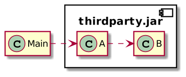

The JVM ecosystem is mature and offers plenty of libraries, so you don't need to reinvent the wheel. Basic - and not so basic - functionalities are just a dependency away. Sometimes, however, the dependency and your use-case are slightly misaligned.

The correct way to fix this would be to create a Pull Request. But your deadline is tomorrow: you need to make it work *now*! It's time to hack the provided API.

In this article, we are going through some alternatives that allow you to make third-party APIs behave in a way that their designers didn't intend to.

Reflection {#h2-0-reflection}
-----------------------------

Imagine that the API has been designed to follow the open-closed principle:
> In object-oriented programming, the open--closed principle states "software entities (classes, modules, functions, etc.) should be open for extension, but closed for modification"; that is, such an entity can allow its behaviour to be extended without modifying its source code.
>
> -- [Open-closed principle](https://en.wikipedia.org/wiki/Open%E2%80%93closed_principle)

Imagine that the dependency's public API does not fit your use case. You need to extend it, but that's not possible because the design disallows it - on purpose.

To cope with that, the oldest trick on the JVM in the book is probably reflection.
> Reflection is a feature in the Java programming language. It allows an executing Java program to examine or "introspect" upon itself, and manipulate internal properties of the program. For example, it's possible for a Java class to obtain the names of all its members and display them.
>
> -- [Using Java Reflection](https://www.oracle.com/technical-resources/articles/java/javareflection.html)

In our scope, reflection allows you to access state that was not meant to be accessed, or call methods that were not meant to be called.

<pre class="EnlighterJSRAW" data-enlighter-language="java">public class Private {

  private String attribute = "My private attribute";

  private String getAttribute() {
    return attribute;
  }
}

public class ReflectionTest {

  private Private priv;

  @BeforeEach
  protected void setUp() {
    priv = new Private();
  }

  @Test
  public void should_access_private_members() throws Exception {
    var clazz = priv.getClass();
    var field = clazz.getDeclaredField("attribute");                             // 1
    var method = clazz.getDeclaredMethod("getAttribute");                        // 2
    AccessibleObject.setAccessible(new AccessibleObject[]{field, method}, true); // 3
    field.set(priv, "A private attribute whose value has been updated");         // 4
    var value = method.invoke(priv);                                             // 5
    assertThat(value).isEqualTo("A private attribute whose value has been updated");
  }
}</pre>

1. Get a reference to a `private` field of the `Private` class
2. Get a reference to a `private` method of the `Private` class
3. Allow to use `private` members
4. Set the value of the `private` field
5. Invoke the `private` method

Yet, reflection has some limitations:

* The "magic" happens with `AccessibleObject.setAccessible`. One can disallow this at *runtime* with an adequately configured Security Manager. I admit that during my career, I've never seen the Security Manager in use.
* The module system restricts the usage of the Reflection API. For example, both the caller and the target classes must be in the same module, the target member must be `public`, etc. Note that many libraries do not use the module system.
* Reflection is good if you directly use the class that has private members. But it's no use if you need to change the behavior of a dependent class: if your class uses a third-party class `A` that itself requires a class `B` and you need to change `B`.

Classpath shadowing {#h2-1-classpath-shadowing}
-----------------------------------------------

A long post could be dedicated solely to Java's class loading mechanism. For this post, we will narrow it down to the *classpath* . The classpath is an **ordered** list of folders and JARs that the JVM will look into to load previously unloaded classes.

Let's start with the following architecture:



The simplest command to launch the application is the following:

```bash
java -cp=.:thirdparty.jar Main
```

For whatever reason, imagine we need to change the behavior of class `B`. Its design doesn't allow for that.

Regardless of this design, we could hack it anyway by:

1. Getting the source code of class `B`
2. Changing it according to our requirements
3. Compiling it
4. Putting the compiled class **before** the JAR that contains the original class on the classpath

When launching the same command as above, the class loading will occur in the following order: `Main`, `B` from the filesystem, and `A` from the JAR; `B` in the JAR will be skipped.

This approach also has some limitations:

* You need the source code of `B` - or at least a way to get it from the compiled code.
* You need to be able to compile `B` from source. That means you need to re-create all necessary dependencies of `B`.

Those are technical requirements. Whether it's legally possible is an entirely different concern and outside of the scope of this post.

Aspect-Oriented Programming {#h2-2-aspect-oriented-programming}
---------------------------------------------------------------

Contrary to C++, the Java language offers single inheritance: a class can inherit from a single superclass.

In some cases, however, multiple inheritance is a must. For example, we would like to have logging methods for different log levels across the class hierarchy. Some languages adhere to the single inheritance principle but offer an alternative for cross-cutting concerns such as logging: Scala provides traits, while Java's and Kotlin's interfaces can have properties.

"Back in the days", was quite popular to add cross-cutting features to classes that were not part of the same hierarchy.
> In computing, aspect-oriented programming (AOP) is a programming paradigm that aims to increase modularity by allowing the separation of cross-cutting concerns. It does so by adding additional behavior to existing code (an advice) without modifying the code itself, instead separately specifying which code is modified via a "pointcut" specification, such as "log all function calls when the function's name begins with 'set'". This allows behaviors that are not central to the business logic (such as logging) to be added to a program without cluttering the code core to the functionality. AOP forms a basis for aspect-oriented software development.
>
> -- [Aspect-oriented programming](https://en.wikipedia.org/wiki/Aspect-oriented_programming)

In Java, [AspectJ](https://www.eclipse.org/aspectj/) is the AOP library of choice. It relies on the following [GitHub](https://github.com/nickwongdev/aspectj-maven-plugin):

* A **join point** defines a certain well-defined point in the execution of the program, *e.g.*, the execution of methods
* A **pointcut** picks out specific join points in the program flow, *e.g.* , the execution of any method annotated with `@Loggable`
* An **advice** brings together a pointcut (to pick out join points) and a body of code (to run at each of those join points)

Here are two classes: one represents the public API and delegates its implementation to the other.

<pre class="EnlighterJSRAW" data-enlighter-language="java">public class Public {

  private final Private priv;

  public Public() {
    this.priv = new Private();
  }

  public String entryPoint() {
    return priv.implementation();
  }
}

final class Private {

  final String implementation() {
    return "Private internal implementation";
  }
}</pre>

Imagine we need to change the private implementation.

<pre class="EnlighterJSRAW" data-enlighter-language="java">public aspect Hack {

  pointcut privateImplementation(): execution(String Private.implementation()); // 1

  String around(): privateImplementation() {                                    // 2
    return "Hacked private implementation!";
  }
}</pre>

1. Pointcut that intercepts the execution of `Private.implementation()`
2. Advice that wraps the above execution and replaces the original method body with its own

AspectJ offers different implementations:

1. Compile-time: the bytecode is updated during the build
2. Post-compile time: the bytecode is updated just after the build. It allows updating not only project classes but also dependent JARs.
3. Load-time: the bytecode is updated at runtime when classes are loaded

You can set up the first option in Maven like this:

<pre class="EnlighterJSRAW" data-enlighter-language="xml">&lt;build&gt;
  &lt;plugins&gt;
    &lt;plugin&gt;
      &lt;artifactId&gt;maven-surefire-plugin&lt;/artifactId&gt;
      &lt;version&gt;2.22.2&lt;/version&gt;
    &lt;/plugin&gt;
    &lt;plugin&gt;
      &lt;groupId&gt;com.nickwongdev&lt;/groupId&gt;
      &lt;artifactId&gt;aspectj-maven-plugin&lt;/artifactId&gt;
      &lt;version&gt;1.12.6&lt;/version&gt;
      &lt;configuration&gt;
        &lt;complianceLevel&gt;${java.version}&lt;/complianceLevel&gt;
        &lt;source&gt;${java.version}&lt;/source&gt;
        &lt;target&gt;${java.version}&lt;/target&gt;
        &lt;encoding&gt;${project.encoding}&lt;/encoding&gt;
      &lt;/configuration&gt;
      &lt;executions&gt;
        &lt;execution&gt;
          &lt;goals&gt;
            &lt;goal&gt;compile&lt;/goal&gt;
          &lt;/goals&gt;
        &lt;/execution&gt;
      &lt;/executions&gt;
    &lt;/plugin&gt;
  &lt;/plugins&gt;
&lt;/build&gt;
&lt;dependencies&gt;
  &lt;dependency&gt;
    &lt;groupId&gt;org.aspectj&lt;/groupId&gt;
    &lt;artifactId&gt;aspectjrt&lt;/artifactId&gt;
    &lt;version&gt;1.9.5&lt;/version&gt;
  &lt;/dependency&gt;
&lt;/dependencies&gt;</pre>

AOP in general and AspectJ, in particular, represent the nuclear option. They practically have no limits though I must admit I didn't check how it works with Java modules.

However, the official AspectJ Maven plugin from Codehaus handles the JDK only up to version 8 (included) as nobody has updated since 2018. Somebody has forked the code on [GitHub](https://github.com/nickwongdev/aspectj-maven-plugin) that handles later versions. The fork can handle the JDK up to version 13 and the AspectJ library up to 1.9.5.

Java agent {#h2-3-java-agent}
-----------------------------

AOP offers a high-level abstraction when you want to hack. But if you want to change the code in a fine-grained way, there's no other way than to change the *bytecode* itself. Interestingly enough, the JVM provides us with a standard mechanism to change bytecode when a class is loaded.

You've probably already encountered that feature in your career: they are called Java agents. Java agents can be set statically on the command-line when you start the JVM or attached dynamically to an already running JVM afterward. For more information on Java agents, please check [this post](https://hazelcast.org/blog/an-experiment-in-streaming-bytecode-continuous-deployment/) (section "Quick Introduction to Java Agents").

Here's the code of a simple Java agent:

<pre class="EnlighterJSRAW" data-enlighter-language="java">public class Agent {

    public static void premain(                      // 1
            String args,                             // 2
            Instrumentation instrumentation){        // 3
        var transformer = new HackTransformer();
        instrumentation.addTransformer(transformer); // 4
    }
}</pre>

1. `premain` is the entry-point for statically-set Java agents, just like `main` for regular applications
2. We get arguments too, just like with `main`
3. `Instrumentation` is the "magic" class
4. Set a transformer that can change the bytecode before the JVM loads it

A Java agent works at the bytecode level. An agent provides you with the byte array that stores the definition of a class according to the JVM specification and, more precisely, to the [class file format](https://docs.oracle.com/javase/specs/jvms/se15/html/jvms-4.html). Having to change bytes in a byte array is not fun. The good news is that others have had this requirement before. Hence, the ecosystem provides ready-to-use libraries that offer a higher-level abstraction.

In the following snippet, the transformer uses [Javassist](https://www.javassist.org/):

<pre class="EnlighterJSRAW" data-enlighter-language="java">public class HackTransformer implements ClassFileTransformer {

  @Override
  public byte[] transform(ClassLoader loader,
              String name,
              Class&lt;?&gt; clazz,
              ProtectionDomain domain,
              byte[] bytes) {                                            // 1
    if ("ch/frankel/blog/agent/Private".equals(name)) {
      var pool = ClassPool.getDefault();                                 // 2
      try {
        var cc = pool.get("ch.frankel.blog.agent.Private");              // 3
        var method = cc.getDeclaredMethod("implementation");             // 4
        method.setBody("{ return \"Agent-hacked implementation!\"; }");  // 5
        bytes = cc.toBytecode();                                         // 6
      } catch (NotFoundException | CannotCompileException | IOException e) {
        e.printStackTrace();
      }
    }
    return bytes;                                                        // 7
  }
}</pre>

1. Byte array of the class
2. Entry-point into the Javassist API
3. Get the class from the pool
4. Get the method from the class
5. Replace the method body by setting a new one
6. Replace the original byte array with the updated one
7. Return the updated byte array for the JVM to load

Conclusion {#h2-4-conclusion}
-----------------------------

In this post, we have listed four different methods to hack the behavior of third-party libraries: reflection, classpath shadowing, Aspect-Oriented Programming, and Java agents.

With those, you should be able to solve any problem you encounter. Just remember that libraries - and the JVM - have been designed this way for a good reason: to prevent you from making mistakes.

You can disregard those guard rails, but I'd suggest that you keep those hacks in place for the shortest period required and not one moment longer.

The complete source code for this post can be found on [Github](https://github.com/ajavageek/hack-jvm-api) in Maven format.

**To go further:**

* [Using Java Reflection](https://www.oracle.com/technical-resources/articles/java/javareflection.html)
* ["Java Platform Module System: setAccessible is broken?"](https://medium.com/swlh/java-platform-module-system-953cc88658fb)
* [Starting AspectJ](https://www.eclipse.org/aspectj/doc/released/progguide/starting-aspectj.html)
* [Intro to AspectJ](https://www.baeldung.com/aspectj)

*Originally published at [A Java Geek](https://blog.frankel.ch/hacking-third-party-api-jvm/) on May 23^rd^, 2021*

*[AOP]: Aspect-Oriented Programming
