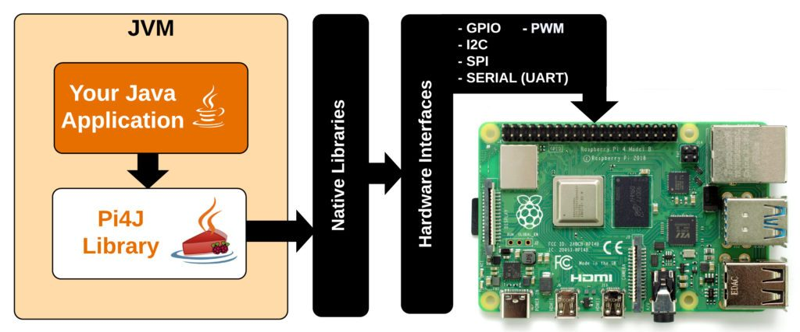
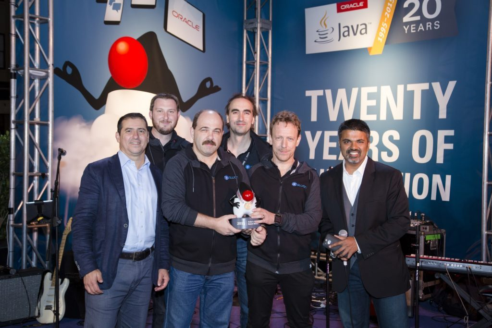
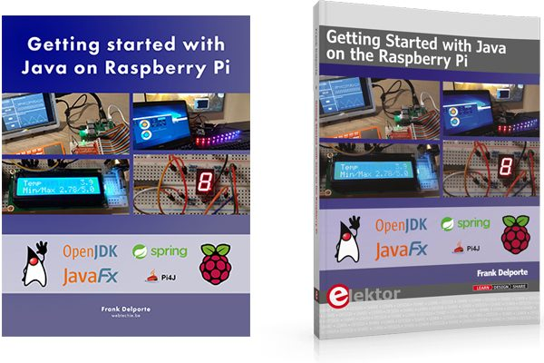

> This post is part of an [article published (in German) in Java Magazine](https://kiosk.entwickler.de/java-magazin/java-magazin-6-2021/status-quo-und-expertenstimmen/).
> You can get a 25% discount for a new kiosk subscription with the following code: delporte_kiosk25

Here on Foojay.io, you can find already [a long list of articles about Java on the Raspberry Pi](/today/category/raspberry-pi/). As you may know, already I'm a big fan of this combination. The Raspberry Pi on one side is a very cheap computer that allows you to experiment with electronic components thanks to the Pi4J library. And on the other hand, JavaFX is the ideal framework to build user interfaces that can directly control these components, all in one application!

But maybe you don't have / want to believe me? So let's ask two experts what they think is the future of [#JavaOnRaspberryPi](https://twitter.com/search?q=%23JavaOnRaspberryPi&src=typed_query).

## Pi4J, the Java I/O library for the Raspberry Pi

[The Pi4J project](https://pi4j.com/) aims to unite Java programming with electronics. The project started in 2012. Version 1.3 was released in February 2021 to support the newest Raspberry Pi boards (4, 400, and Compute 4) and is the last version that is based on Java 8. V1.4 is targeting Java 11 and in the final test.

By using the Pi4J-dependency in a project, controlling electronic components connected to the GPIO (General Purpose Input/Output) pins of the Raspberry Pi can be controlled as objects in the Java-code. Pi4J uses native libraries to control the GPIOs so you as a programmer don't need to fully be aware of all the "magic" which relates to hardware communication.

Work is ongoing for a totally refactored V2 which will bring modules and improved architecture to make the project easier to maintain, test and release. In the next articles in this series, we will use this V2 to show you how to program on the Raspberry Pi and control different electronic components.

## Interview with Robert Savage

Robert is the founding father of the Pi4J project. He started in 2012 and quickly got a lot of attention from the Java community. Pi4J is now actively in use in a lot of projects. He also presented his work in the Devoxx 2014 and Oracle Code One 2019 conferences.


github-pi4j-search-1024x901.png
robert-savage-devoxx-2014-1024x768.jpg
robert-savage.jpg


**The very first version of Pi4J dates from 2012. What was your trigger to start using Java on the Raspberry Pi and build this framework?**

Starting in the early 80's with my first Commodore VIC-20, I have enjoyed tinkering with computers and figuring out ways to get them to do useful tasks for me.

When I first learned about the Raspberry Pi and its mission to provide a very affordable platform for education and hobbyists that struck a chord with me and sparked my interest to get involved in some way. Professionally, I had been involved for many years with embedded computers and microcontrollers but the Raspberry Pi represented something new (at that time)... a very powerful embedded computing device at a fraction of the cost of most embedded development platforms. I recognized this type of new device would be a game changer in the hobbyist community. Shortly after the first java runtime was announced for the Raspberry Pi (back in the days of soft-float ABI), I immediately started looking for Java libraries to interact with the GPIO capabilities of the Pi. There were a couple of small projects out there but none that felt like Java programming. None offered an object-oriented approach to interact with the I/O. So in this void, I decided to create Pi4J and provide a more traditional API that Java users would be more comfortable and familiar with.

**Java was considered a long time to be a "big memory- and cpu-consuming beast". So why do you think it is a good programming language to use on the Raspberry Pi?**

Java is a very capable and widely adopted language in the commercial world and has a long history in the embedded space. Continued improvements in the JVM on the ARM architecture make Java more relevant today than when Pi4J was first created. However, my original goals with Pi4J were not to eek out performance because it simply can't compete with native programming for high performance or high speed I/O requirements. Pi4J was created to simply enable Java programmers to enjoy access to the Raspberry Pi's I/O capabilities and allow Java programmers to participate in the maker/hobbyist revolution of Linux-driven ARM-based SoCs brought on by the Raspberry Pi platform.

**The Pi4J project is fully open-source and totally free. How do you manage to combine this with your professional and personal life?**

When I started the Pi4J project, there were a lot of synergies with my professional life and was at a time in my life prior to having children where I could burn the midnight oil without too many consequences/repercussions. In the past couple of years committing the time needed to the project has become more difficult due to kids and trying to find a better work-life balance. I still very much enjoy working on the project and enjoy getting my hands dirty --- but time is a bit more difficult to find. That is why I'm thankful that others have stepped in with a renewed interest in helping to move the project forward. We are trying to position the next version of Pi4J so that it's a more community-led and driven effort and I'm not an obstacle or gatekeeper to forward progress.

**The Java world is now quickly evolving thanks to the 6-month release cycle and the new features that are being added. Do you see a match here with embedded programming?**

That is a tricky question. By nature, at least historically speaking, embedded systems tend to move very slowly to embrace changes. In the embedded world, stability and security are the primary goals. However, it can't be denied that all modern development moves at a more rapid pace. I do think that as a library, Pi4J would still lag behind the bleeding edge just because you want to offer a solution that is widely compatible with the majority of user's installed runtimes. As a library you don't want to be the forcing function that mandates a user's application upgrade to the latest cutting-edge Java runtime version. So there is a balancing act that is required to embrace new runtime and language features but not cause upgrade pain points for your users. I think adopting the long term support (LTS) releases are best practice for library projects like Pi4J.

**What is the future for Pi4J and Java on the Raspberry Pi?**

My sincere hope is that Pi4J remains a viable and relevant resource for Java enthusiasts and continues to provide a simple object-oriented approach to interacting with the low-level IO offered on the RaspberryPi. I have always thought of Pi4J as the conduit allowing Java programmers to interact with the physical world and help abstract as much of the low-level complexity as possible. With greater community involvement and a new software architecture established in Pi4J version 2, I think we are much better positioned to embrace future changes and greater extensibility.

## Building user interfaces with JavaFX

An important plus for Java on the Raspberry Pi is JavaFX. This framework allows you to build beautiful user interfaces which look and behave exactly the same on all devices, yes, also our Raspberry Pi! This means you only need to master one programming language for both the logic of your application, the user interface and controlling electronic components when combined with Pi4J.

Although in the current trend a backend is mostly combined with a loosely coupled web-user interface, I strongly believe that one integrated solution is more performant and easier to build and maintain. That's where Java and JavaFX are a perfect match.

## Interview with Johan Vos

We asked Johan Vos, co-founder of Gluon, why Java on embedded devices is a hot topic. Gluon is the company leading the open-source development of JavaFX within the openjfx.io project. On [their website](https://gluonhq.com/developers/samples/), you can also find a lot of tools, documentation, and samples to get started with JavaFX.

**Java on embedded seems a controversial subject. Why do you believe Java, JavaFX, and the Raspberry Pi still are a perfect match?**

We have to distinguish between a few areas: branding and technical.

From a branding point, although Java started on embedded, it became popular in the enterprise and on backend/cloud systems. That sort of created the idea that Java was mainly suited for those big systems, and not for the resource constrained devices. The server-side market is very different from the embedded, and that results in a different image/branding. However, the technology is the same.

From a technical point, Java was not very suited for small embedded devices for a long time, because of the overhead needed when a JDK had to be installed on every device. Fortunately this is not anymore valid today. Thanks to AOT compilers (e.g. GraalVM native-image), it is possible to create native executables that contain everything that is needed to run a Java app on embedded devices.

Thanks to JavaFX, it is also possible to create a UI for embedded devices, using 100% the same Java API's as desktop systems. In the past, the UI API's for desktop (AWT/Swing) were different from the ones on embedded (e.g. PJava,...). With JavaFX, there is a clear separation between the top-level API's and the low-level, platform-specific implementation. Especially on embedded, the JavaFX low-level implementations leverage the GPU and low-level stack to benefit from hardware acceleration.

In combination, this allows Java developers to create responsive applications for embedded, using the same tools they use for other Java applications.

**Java and JavaFX follow the same 6-months release cycle. Which improvements and new features are aiming at embedded platforms?**

The main goal is to keep the Java API the same for all platforms. Adding features that are specific to desktop, mobile or embedded would break this idea. However, it should be possible to leverage specific (low-level) functionality for specific devices. We do this in a project called [Gluon Attach](https://github.com/gluonhq/attach) where a top-level Java API abstracts the low-level "details".

**What can we expect in the near future for the Raspberry Pi in JavaFX?**

We're working on more hardware-acceleration for the Pi and embedded in general. This will lead to even more performance improvements and startup time.

The Gluon JavaFX 11 LTS program is also supporting embedded devices, which is an important guarantee that investments in Pi and embedded in general are secure for the next coming years.

**"Write once, run everywhere" has always been the goal of Java. Can we also include JavaFX and embedded in this story?**

Yes, that is the idea from the previous questions: we don't want specific API's, we want Java API's that have different implementations on different devices. Developers use those Java API's and don't have to worry about how they are implemented.

## Conclusion

Indeed, Java and JavaFX are a great match with the Raspberry Pi. Maybe you are not convinced yet, but in the next articles in Java Magazine, and here on Foojay you can find a lot of examples to get you started!

If you want to learn more, I can highly recommend you (of course ;-)) [my book "Getting Started with Java on the Raspberry Pi"](https://webtechie.be/books/) which will give you even deeper insights.  

