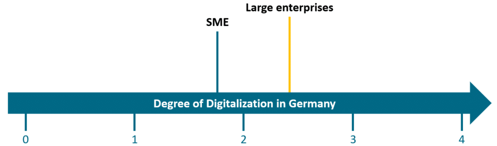
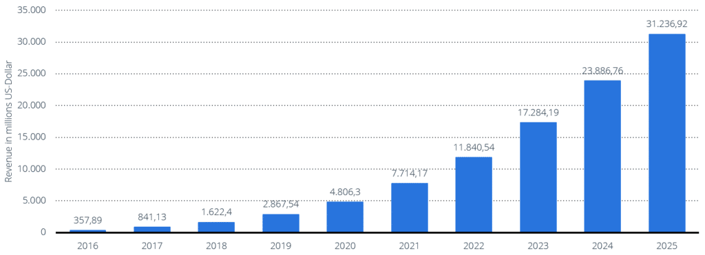
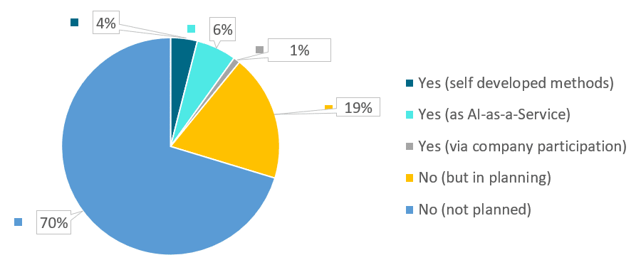

Time-traveling cyborgs and robots that are able to love. These interesting and romantic ideas emerged from the imagination of Hollywood film directors. Nevertheless, many people are afraid of Artificial Intelligence (AI). This also can be seen in the economic world. Small and medium-sized enterprises (SMEs) in particular see AI as a threat to their own business. Surprisingly however, all different-sized companies are able to see the potential of AI when it comes to penetrating the national and global market. ^\[1\]^

The goal of my research at [Hochschule Pforzheim](https://www.hs-pforzheim.de/en/), summarized in this article, is to explore how SMEs can be sensitized to the topic of AI with the help of Open Source Tools. Firstly, the relevance of AI for SMEs will be addressed. Afterwards, relevant Open Source Tools are identified and a decision aid for SMEs will be provided. The focus of this article is on German SMEs, but the learnings can be applied all over the globe.

## Relevance of Artifical Intelligence for SMEs

### Current state of Digitalization

Small and medium-sized enterprises play a key role in the German economy. More than 99% of all German companies are SMEs. In addition, more than half of all employees in Germany are employed in these companies. ^\[2\]^

|--------------------|-------------------------|-----|---------------------|----|------------------------|
| **Company Size**   | **Number of employees** | and | **Turnover €/year** | or | **Balance Sum €/year** |
| Micro enterprises  | Up to 9                 |     | Up to 2 millions    |    | Up to 2 millions       |
| Small enterprises  | Up to 49                |     | Up to 10 millions   |    | Up to 10 millions      |
| Medium enterprises | Up to 249               |     | Up to 50 millions   |    | Up to 43 millions      |
| **= SME**          | Under 250               |     | Up to 50 millions   |    | Up to 43 millions      |

Definition of SME ^\[3\]^

However, SMEs are generally not up to date with digitalization compared to large companies. A study by Sames and Diener shows a significant correlation between company size and the degree of digitalization. They determined an average value to all questions about business processes in a company. In general, a maximum average of 4 can be achieved on their scale. For companies with more than 1,000 employees, the average value is at 2.31. Companies with fewer than 500 employees cannot exceed an average value of 1.83. Nonetheless, the degree of digitalization for both average values is still too low. ^\[4\]^
 Degree of Digitalization by size class in Germany ^\[4\]^

### Artificial Intelligence from an Economic Perspective

One way to increase the level of digitalization is to use a future key technology: Artificial Intelligence. In the context of Industry 4.0, the following advantages of AI can be concluded:

* the increase of productivity,
* Predictive Maintenance,
* the optimization of production and manufacturing processes,
* the increase of product quality,
* better scalability and
* the reduction of costs. ^\[5\]^

However, AI should not be treated exclusively as a growth potential. It can also serve as a profitable business model for companies. In 2016, the market research company Tractica forecast an expected global turnover of 4.8 billion US-Dollar for the year 2020 in the field of AI. They also determined an increase in sales up to 31.2 billion US-Dollar by the year 2025. ^\[6\]^
 Revenue from business applications in the field of AI worldwide by 2025 ^\[6\]^

### Uses of Artificial Intelligence

Both SMEs and large corporations are aware of the potential of AI. Yet, SMEs have difficulties transferring the potential to their own business model. That is why only about 9% of all SMEs use AI, despite the significant benefits. For large companies, the percentage is almost twice as high in comparison. \[1\] Nevertheless, AI is only used by around 10% of all German companies. In addition, only 6% of German companies procure AI services from third-party providers. \[1\] These services are also called AI-as-a-Service. ^\[7\]^ However, these services are mainly used by large companies while SMEs only use them sporadically. ^\[8\]^
 Use of AI in German companies ^\[1\]^

For an efficient use of AI, companies need a good management of their data. An enormous amount of data is processed in a company every day. However, this is only 20% of the total data collected. The remaining 80% of the data usually remains unused and is therefore also referred to as dark data. ^\[9\]^

Due to this reason a sensible and structured handling of this mass of data is an important issue. DalleMulle and Davenport have developed two ways of handling data: a defensive and an offensive data strategy. The defensive strategy focuses on data control. In contrast the offensive data strategy has a focus on the profitable and efficient use of data. ^\[10\]^ SMEs tend to be more defensive, while large companies often use an offensive data handling approach additionally to a defensive strategy. ^\[11\]^

If AI is to be used in the company, there are essential requirements for the IT system:

* data quality,
* data sovereignty and its access,
* the interoperability of AI processes and their data,
* the use of sensor technology,
* the use of Cloud Computing,
* the robustness of the algorithms in unexpected situations and
* IT security.

If these prerequisites are successfully implemented, it can be assumed that AI will be used efficiently in the company.^\[8\]^

In addition to fulfilling the technical requirements, it is also important to overcome skepticism about AI. This includes the consequences for the future work environment, the personal living environment, and ethical issues. ^\[1\]^

Other barriers for the use of AI include the available investment limit \[1\], lack of experts, and the scarcity of in-house knowledge. ^\[8\]^ To reduce this lack of expertise, SMEs could offer more training in AI for their employees. Likewise, collaborations with existing partners can be used to increase internal knowledge. ^\[12\]^ Another problem is the difficulty of accurately estimating the amount of the investment. This depends above all on the degree of digitalization of the company and the in-house expertise. In addition, previous acquisitions and current investments areas also play an important role. A study by Demary and Goecke conducted a survey on this subject. According to this survey, companies currently only spend around 1% of their annual revenue on the use of AI. ^\[1\]^

But how can SMEs integrate AI into their business model? Around 40% of all SMEs still see AI as a threat. However, an equally large proportion of SMEs see AI as an opportunity for themselves and their industry. ^\[1\]^ Above all, these companies need a cost-effective AI solution. At this point, it would be an option for SMEs to consider Open Source Tools.

## Open Source Tools for Articial Intelligence

### Overview of Open Source Tools

The Open Source Tools are classified in the following table based on the categories AI area, framework and license model. The order of the tools is irrelevant, as they are sorted alphabetically:

|--------------------------------------------------------------|---------------------------------------------------------------------------|--------------------------------------------------------------------------------------------|--------------------------------------------------|--------------------------------------------|
| **Open Source Tools**                                        | **Provider**                                                              | **AI Areas**                                                                               | **Framework**                                    | **Licence** **model**                      |
| Accord.NET ^\[13\]^                                          | César Souza                                                               | - Computer Vision - Machine Learning                                                       | C#                                               | GNU „Lesser" General Public License (LGPL) |
| AzureML^\[14\]^                                              | Microsoft                                                                 | - Computer Vision - Deep Learning - Machine Learning                                       | Python, R                                        | MIT License                                |
| Caffe ^\[15\]^                                               | Berkeley AI Research (BAIR)                                               | - Computer Vision - Deep Learning                                                          | CUDA, C++, MATLAB, Python                        | BSD License                                |
| Chainer ^\[16\]^                                             | Seiya Tokui                                                               | - Computer Vision - Deep Learning - Reinforcement Learning                                 | CUDA, Python                                     | MIT License                                |
| Cognitive Toolkit (CNTK) ^\[17\]^                            | Microsoft                                                                 | - Deep Learning                                                                            | C++, C#, Python                                  | MIT License                                |
| Deep Scalable Sparse Tensor Network Engine (DSSTNE) ^\[18\]^ | Amazon                                                                    | - Deep Learning - Machine Learning                                                         | C, CUDA, C++, Java, Python                       | Apache License 2.0                         |
| Deeplearning4j ^\[19\]^                                      | Alex D. Black, Adam Gibson, Vyacheslav Kokorin, Josh Patterson            | - Deep Learning                                                                            | Java, Scala                                      | Apache License 2.0                         |
| Deep Netts Community ^\[45\]^                                | Zoran Sevarac, Jelena Sevarac                                             | - Computer Vision                                                                          | Java                                             | GNU General Public License (GPL)           |
| Distributed Machine Learning Toolkit (DMTK) ^\[20\]^         | Microsoft                                                                 | - Machine Learning                                                                         | C++, Python                                      | MIT License                                |
| Gensim ^\[21\]^                                              | Radim Řehůřek                                                             | - Natural Language Processing                                                              | Cython, Python                                   | GNU „Lesser" General Public License (LGPL) |
| H2O ^\[22\]^                                                 | H20.ai                                                                    | - Deep Learning - Machine Learning                                                         | Apache Hadoop, Maven, Python, R, Spark           | Apache License 2.0                         |
| Keras ^\[23\]^                                               | François Chollet                                                          | - Deep Learning                                                                            | Python                                           | MIT License                                |
| Mahout ^\[24\]^                                              | Apache                                                                    | - Machine Learning                                                                         | Java, Scala                                      | Apache License 2.0                         |
| MXNet ^\[25\]^                                               | Apache                                                                    | - Computer Vision - Deep Learning - Machine Learning - Natural Language Processing         | Clojure, C++, Java, Julia, Per, Python, R, Scala | Apache License 2.0                         |
| Mycroft ^\[26\]^                                             | Mycroft AI Team                                                           | - Machine Learning - Natural Language Processing - Speech Recognition                      | Python                                           | Apache License 2.0                         |
| Natural Language Toolkit (NLTK) ^\[27\]^                     | Steven Bird, Ewan Klein, Edward Loper                                     | - Natural Language Processing                                                              | Python                                           | Apache License 2.0                         |
| NEON ^\[28\]^                                                | NeonGecko.com Inc.                                                        | - Speech Recognition                                                                       | HTML, JS, PHP, Python, Ubuntu                    | GNU General Public License (GPL)           |
| Numenta Platform for Intelligent Computing (NuPic) ^\[29\]^  | Numenta                                                                   | - Machine Learning                                                                         | Clojure, C++, Java, Python                       | AGPL-3.0 License                           |
| ONNX^\[30\]^                                                 | Group of 41 companies: i.e. Alibaba, Facebook, IBM, Microsoft             | - Deep Learning                                                                            | C++, Jupyter Notebook, PureBasic, Python, R      | MIT License                                |
| OpenCV^\[31\]^                                               | Intel                                                                     | - Computer Vision                                                                          | C++, Java, Python                                | BSD License                                |
| OpenNN ^\[32\]^                                              | Artelnics                                                                 | - Machine Learning                                                                         | C++                                              | GNU „Lesser" General Public License (LGPL) |
| Oryx 2 ^\[33\]^                                              | Sean Owen                                                                 | - Machine Learning                                                                         | Java                                             | Apache License 2.0                         |
| PaddlePaddle ^\[34\]^                                        | Baidu                                                                     | - Deep Learning                                                                            | C++, Python                                      | Apache License 2.0                         |
| PyTorch ^\[35\]^                                             | Adam Paszke, Sam Gross, Soumith Chintala, Gregory Chanan                  | - Compute Vision - Machine Learning - Natural Language Processing - Reinforcement Learning | CUDA, C++, Python                                | BSD License                                |
| Ray ^\[36\]^                                                 | Robert Nishihara, Eric Liang                                              | - Deep Learning - Machine Learning - Reinforcement Learning                                | Clojure, C++, Java, Python                       | Apache License 2.0                         |
| Scikit-learn ^\[37\]^                                        | David Cournapeau                                                          | - Machine Learning                                                                         | Python                                           | BSD License                                |
| Shogun ^\[38\]^                                              | Heiko Strathmann, Sergey Lisitsyn, Viktor Gal                             | - Machine Learning                                                                         | C#, Java, Lua, Octave, Python, R, Ruby, Scala    | GNU General Public License (GPL)           |
| SystemDS ^\[39\]^                                            | Apache                                                                    | - Deep Learning - Machine Learning                                                         | Python, R                                        | Apache License 2.0                         |
| TensorFlow ^\[40\]^                                          | Google                                                                    | - Machine Learning                                                                         | C++, Python                                      | Apache License 2.0                         |
| Theano ^\[41\]^                                              | Montreal Institute for Learning Algorithms (MILA), University of Montreal | - Machine Learning                                                                         | CUDA, Python                                     | BSD License                                |
| Waikato Environment for Knowledge Analysis (WEKA) ^\[42\]^   | University of Waikato                                                     | - Machine Learning                                                                         | Java                                             | GNU General Public License (GPL)           |

Identified Open Source Tools for AI

### Choosing an Open Source Tool

If SMEs choose an open source tool as a way to use AI, there are numerous applications on the market. But which tool should be chosen? The following four steps should serve as a guide:

1. At the beginning, it should be narrowed down which area of AI could be relevant for the company: Machine Learning, Deep Learning, Reinforcement Learning, Speech Recognition, Natural Language Processing and/or Computer Vision.
2. The second step is to determine the type of Open Source License. There are considerable differences in the type of license to be selected. Some of the most commonly used licenses are: Apache Licence 2.0, BSD Licence, GNU General Public License (GPL), GNU „Lesser" General Public License (LGPL) and MIT License. ^\[43\]^
3. Now the Open Source Tools still in question needs to be filtered on the basis of the framework. Framework in this case means in which programming language the tool can be processed. In addition to the common languages in AI such as Python, C++ and R, Java, CUDA and Scala can also be considered.
4. The common and widespread Open Source Tools today are platform-independent. When a platform is independent, the software is interoperable with any company's internal IT systems. ^\[44\]^ Therefore, when choosing a tool, one should pay attention to the dependency on the internal operating systems.

Once all these steps have been followed, a narrowed down selection of tools should then be available. In the next step, these should be compared with the company's investment plan and readiness for AI. Only then can SMEs make a final decision in favor of a particular Open Source Software. In this way, they can exploit the potential of AI.

## Conclusion

The purpose of this article is to raise awareness of AI among SMEs with the help of Open Source Tools.

It was found that AI is a growth potential for SMEs. In order to bypass the typical barriers, such as the high costs of investing in a new technology, Open Source Tools were identified as a possibility for SMEs to use AI.

In general, SMEs can be recommended to increase their research activities in the field of AI. The state can also intervene here by reducing legal obstacles for implementation and getting SMEs involved in funded AI projects.

Artificial Intelligence was, is and will be a relevant topic of digitalization. Therefore, not only SMEs, but all companies should follow this trend and implement AI in their companies.

## Sources

\[1\] Demary, Vera und Goecke, Henry (2019): Künstliche Intelligenz: Deutsche Unternehmen zwischen Risiko und Chance. In: IW-Trends -- Vierteljahresschrift zur empirischen Wirtschaftsforschung. 46. Jg. Nr.4. S.3-18. Cologne

\[2\] Statistisches Bundesamt (2020): Kleine und mittlere Unternehmen. 57% in kleinen und mittleren Unternehmen tätig. URL: https://www.destatis. de/DE/Themen/Branchen-Unternehmen/Unternehmen/ Kleine-Unternehmen-Mittlere-Unternehmen/aktuell-beschaeftigte.html (accessed on 19.11.2020)

\[3\] IfM Bonn (2020): KMU-Definition der Europäischen Kommission. URL: https://www.ifm-bonn.org/definitionen/kmu-definition-der-eu-kommission#:\~:text=Kleinstunternehmen%2C%20kleine%20und%20mittlere%20Unternehmen,maximal%2043%20Millionen%20%E2%82%AC%20aufweist. (accessed on 24.11.2020).

\[4\] Sames, Gerrit und Diener, Arthur (2018): Stand der Digitalisierung von Geschäftsprozessen zu Industrie 4.0 im Mittelstand -- Ergebnisse einer Umfrage bei Unternehmen. THM-Hochschulschriften Band 9. Gießen.

\[5\] Bitkom (2019): Industrie 4.0 -- jetzt mit KI. URL: https://www.bitkom.org/sites/default/files/2019-04/bitkom-pressekonferenz_ industrie_ 4.0_01_04_2019_prasentation_0.pdf (accessed on 19.11.2020)

\[6\] Tractica (2016): Prognose zum Umsatz mit Unternehmensanwendungen im Bereich künstliche Intelligenz weltweit von 2016 bis 2025. URL: https://de.statista.com/statistik/daten/studie/620443/umfrage/umsatz-mit-unternehmensanwendungen-im-bereich-kuenstliche-intelligenz-weltweit/ (accessed on 19.11.2020)

\[7\] Graf Ballestrem, Johannes u.a. (2020): Künstliche Intelligenz. Rechtsgrundlagen und Strategien in der Praxis. Wiesbaden.

\[8\] Bundesministerium für Wirtschaft und Energie (2018): Potenziale der Künstlichen Intelligenz im produzierenden Gewerbe in Deutschland. Berlin.

\[9\] Econsultancy und IBM Watson Marketing (2018): Marketing in the Dark: How organisations are dealing with dark data. URL: https://econsultancy.com/marketing-in-the-dark-how-organisations-are-dealing-with-dark-data/ (accessed on 19.11.2020)

\[10\] DalleMulle, Leandro und Davenport, Thomas Hayes (2017): What's Your Data Strategy? In: Harvard Business Review. 6. Jg. Nr.3. S.112-121. Watertown.

\[11\] Krotova, Alevtina (2020): Datennutzung: Offensive Großunternehmen, defensiver Mittelstand. IW-Kurzbericht. Nr. 74/2020. Köln.

\[12\] Wangermann, Tobias (2020): KI in KMU. Rahmenbedingungen für den Transfer von KI-Anwendungen in kleine und mittlere Unternehmen. Nr.381. Berlin.

\[13\] Accord.Net Framework (2020): Machine learning made in a minute. URL: http://accord-framework.net/index.html (accessed on 20.11.2020)

\[14\] Microsoft Azure (2020): Azure Machine Learning. Machine-Learning-Dienst für Unternehmen zur schnelleren Erstellung und Bereitstellung von Modellen. URL: https://azure.microsoft.com/de-de/services/machine-learning/ (accessed on 20.11.2020)

\[15\] Berkeley AI Research (2020): Caffe. Deep learning framework by BAIR. URL: https://caffe.berkeleyvision.org/ (accessed on 20.11.2020)

\[16\] GitHub (2020): chainer/chainer. URL: https://github.com/chainer/chainer (accessed on 20.11.2020)

\[17\] Microsoft (2020): The Microsoft Cognitive Toolkit. URL: https://docs.microsoft.com/en-us/cognitive-toolkit/ (accessed on 20.11.2020)

\[18\] GitHub (2020): amazon-archives/amazon-dsstne. URL: https://github.com/amazon-archives/amazon-dsstne (accessed on 20.11.2020)

\[19\] DL4J (2020): Deep Learning for Java. URL: https://deeplearning4j.org/(accessed on 20.11.2020)

\[20\] GitHub (2020): Microsoft/DMTK. URL 3: https://github.com/microsoft/DMTK (accessed on 20.11.2020)

\[21\] Gensim (2020): Topic modelling for humans. URL: https://radimrehurek.com/gensim/ (accessed on 20.11.2020)

\[22\] H2O.ai (2020): Open Source, Distributed Machine Learning for Everyone. URL: https://www.h2o.ai/products/h2o/#overview (accessed on 20.11.2020)

\[23\] Keras (2020): Keras. Simple. Flexible. Powerful. URL: https://keras.io/(accessed on 20.11.2020)

\[24\] The Apache Software Foundation (2020): Mahout. For Creating scalable Performant Machine Learning Applications. URL: http://mahout.apache.org/ (accessed on 20.11.2020)

\[25\] MXNet (2020): A flexible and efficient library for deep learning. URL:https://mxnet.apache.org/versions/1.7.0/ (accessed on 20.11.2020)

\[26\] Mycroft AI (2020): The open and private voice assistant. URL: https://mycroft.ai/?cn-reloaded=1 (accessed on 20.11.2020)

\[27\] NLTK Project (2020): Natural Language Toolkit. URL: https://www.nltk.org/(accessed on 20.11.2020)

\[28\] Neon AI (2020): Demonstration Videos. URL: https://neon.ai/ (accessed on 20.11.2020)

\[29\] Numenta.org (2020): Home of the HTM Community. URL: https://numenta.org/ (accessed on 20.11.2020)

\[30\] The Linux Foundation (2020): Open Neural Network Exchange. URL: https://onnx.ai/ (accessed on 20.11.2020)

\[31\] OpenCV (2020): About. URL: https://opencv.org/about/ (accessed on 20.11.2020)

\[32\] Artificial Intelligence Techniques, Ltd. (2020): Build the most powerful models with C++. URL: https://www.opennn.net/ (accessed on 20.11.2020)

\[33\] Oryx 2 (2020): Oryx 2. URL: http://oryx.io/ (accessed on 20.11.2020)

\[34\] GitHub (2020): PaddlePaddle/Paddle. URL: https://github.com/ PaddlePaddle/Paddle (accessed on 20.11.2020)

\[35\] GitHub (2020): pytorch/pytorch. URL 5: https://github.com/ pytorch/pytorch(accessed on 20.11.2020)

\[36\] Ray (2020). Fast and Simple Distributed Computing. URL: https://ray.io/(accessed on 20.11.2020)

\[37\] Scikit-learn (2020): scikit-learn. Machine Learning in Python. URL: https://scikit-learn.org/stable/ (accessed on 20.11.2020)

\[38\] NumFOCUS (2020): Unified and efficient machine learning library. URL: https://www.shogun-toolbox.org/ (accessed on 20.11.2020)

\[39\] Apache SystemDS (2020): Apache SystemDS. A machine learning platform optimal for big data. URL: https://systemds.apache.org/ (accessed on 20.11.2020)

\[40\] Google (2020): An end-to-end open source machine learning platform. URL: https://www.tensorflow.org/ (accessed on 20.11.2020)

\[41\] GitHub (2020): Theano/Theano. URL 6: https://github.com/Theano/Theano (accessed on 20.11.2020)

\[42\] WekaIO (2020): Artificial Intelligence \& Machine Learning. URL: https://www.weka.io/solutions/ai-analytics/ (accessed on 20.11.2020)

\[43\] Open Source Initiative (2020): Licenses \& Standards. URL: https://opensource.org/licenses (accessed on 20.11.2020)

\[44\] Bundesministerium des Innern (2007): Plattformunabhängigkeit von Fachanwendungen. Leitfaden für Beschaffung, Entwicklung und Betrieb von plattformunabhängigen Fachanwendungen in der öffentlichen Verwaltung. Version 1.0. Berlin.

\[45\] GitHub (2021): Open Source Deep Learning in Java -- Deep Netts Community Edition. URL: https://www.deepnetts.com/blog/deep-netts-community-edition (accessed on 09.12.2021)
