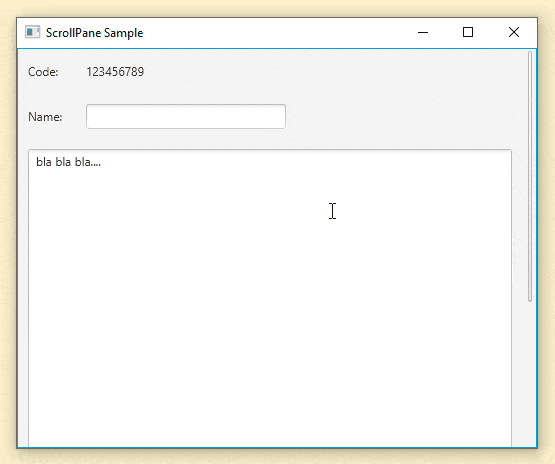

A new Java / JavaFX library has been released. It's called FXSkins.

FXSkins is a collection of new Skins for existing JavaFX controls. These Skins will add more functionality to the controls used in your applications with almost no need to make changes to your application's code.

This library is targeted for the most recent Java versions.

## FXSkins Details

FXSkins is a Java / JavaFX library targeted for Java 11 and above, up until the most recent Java version (but should also work with Java 9 and 10). It is currently being built and tested using the current LTS Java version which is Java 11.

Please check out [FXSkins documentation page](https://pixelduke.com/fxskins/) for all the information about this library. All details are described there.

This library builds upon the architectural principle of [JMetro](https://pixelduke.com/java-javafx-theme-jmetro/). JMetro defines an architecture for a JavaFX theme where features and looks are added to your application with minimal code changes from your part and minimal coupling. This is achieved by leveraging JavaFX `Skin` API originating what can be called a "pluggable" JavaFX theme. Term used by Michael Paus ([@MichaelPaus](https://twitter.com/MichaelPaus)) to describe JMetro, which I really like and will start adopting. Besides being spot on, it also makes this sound cooler 😎.

All this means you'll still be using the standard API of the controls. Meanwhile, "behind the curtain", FXSkins switches the Skins of these Controls adding in new features and looks. Nevertheless, you'll still be able to get this new `Skin`, through the `Control` API, cast it and call the new Skin's API.

FXSkins provides the pluggable part of JMetro separated into its own library that can be used by any theme, be it the default JavaFX Modena theme or your own custom made theme.

I've made sure, by defining new styles, that by default FXSkins new features and looks will look in harmony with Modena.

I've also took the opportunity to add one new Skin to FXSkins (non existing in JMetro), the Conscious ScrollPane Skin, which you can see in the animated image above. You can check out more details about it in the [FXSkins documentation page](https://pixelduke.com/fxskins/). Personally, I think, this can be a nice new addition.

## Wrapping Up

JMetro will, in a near future version, start using FXSkins. This means I'll be removing all Skins currently present in JMetro repository. JMetro will also add its own new style for the new Conscious ScrollPane Skin through CSS.

Finally, as a side note, I'd like to mention that due to limited available time I'll stop supporting JMetro Java 8 version. Having to support two versions at the same time is a bit time consuming, specially since some of the changes are not easily migrated to the other version (JavaFX Skin code has changed between Java 8 and Java 9). So from now on, I'll only be adding new features, fixes, etc, to JMetro version 11.

If you'd like me to back port any change or fix any bug with JMetro for version 8 please consider sponsoring those changes.
