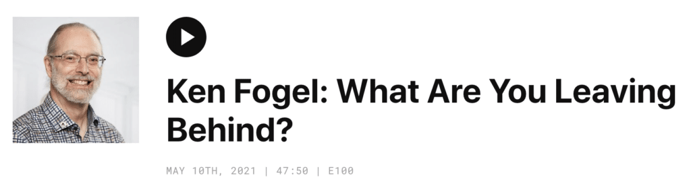

I recently had the good fortune to be interviewed by Robbie Russel on his podcast "Maintainable: The Art of Improving Existing Software" ([@_maintainable](https://twitter.com/_maintainable)).

### EPISODE SUMMARY

Robby speaks with Ken Fogel, College Instructor, JCP EC member, and Java Champion. They discuss the benefits of unit testing, how Dawson approaches internship placement, and the importance of code documentation. Ken also talks about how software is about more than just getting things to work, and why it's important to focus on the long-term impact of coding decisions.

### EPISODE NOTES

Robby speaks with Ken Fogel, College Instructor, JCP EC member, and Java Champion. They discuss the benefits of unit testing, how Dawson approaches internship placement, and the importance of code documentation. Ken also talks about how software is about more than just getting things to work, and why it's important to focus on the long-term impact of coding decisions.

You can find it at <https://maintainable.fm/episodes/ken-fogel-what-are-you-leaving-behind>.
