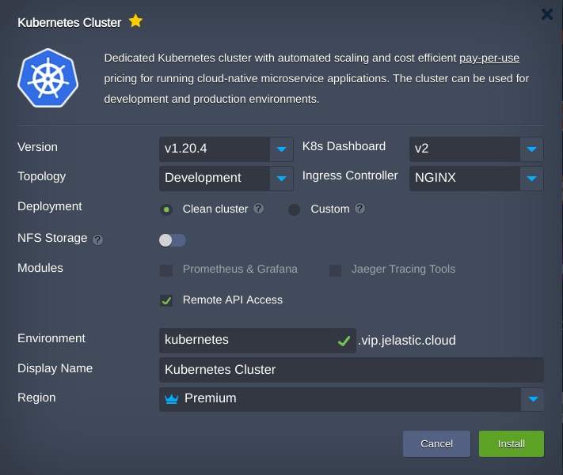
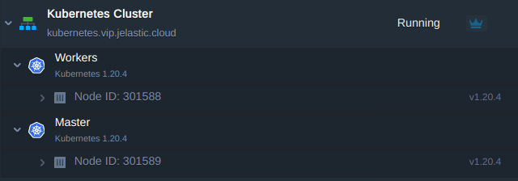
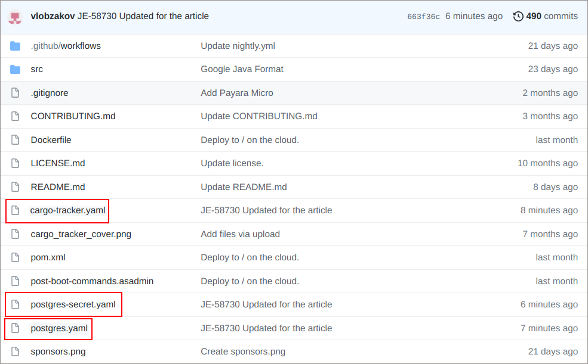
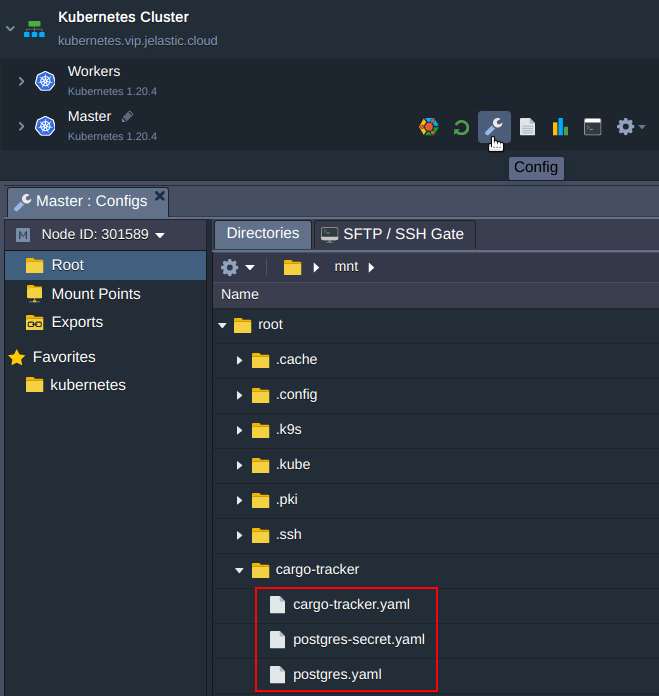
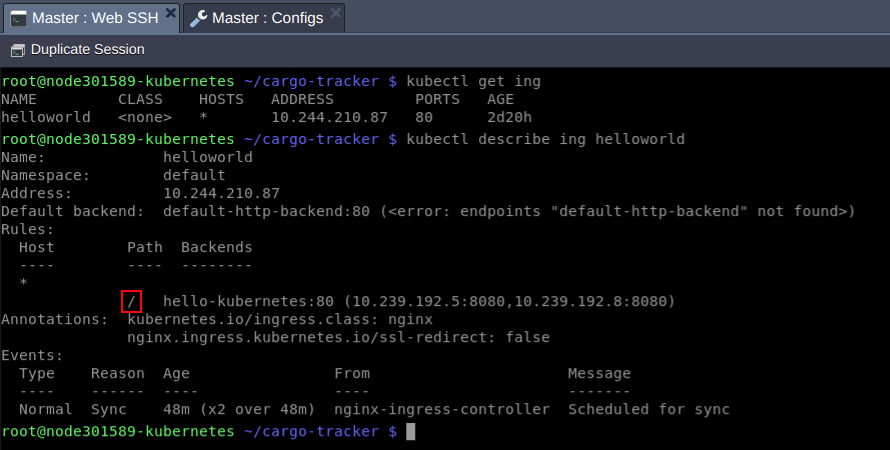
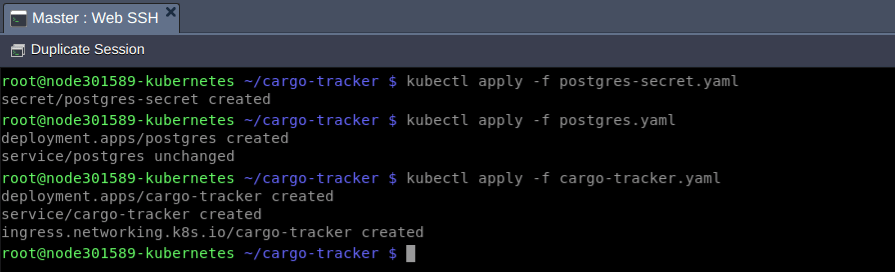
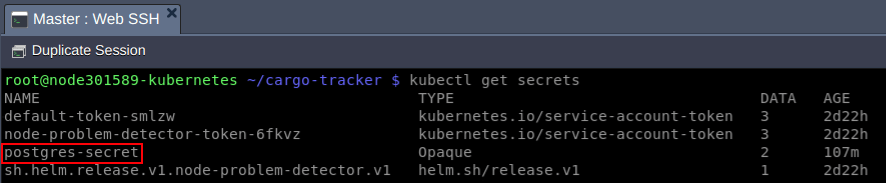
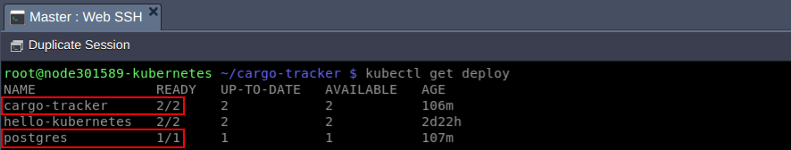
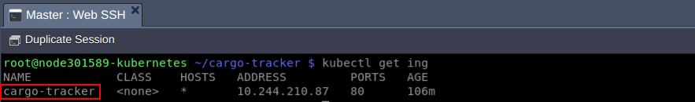
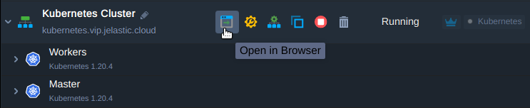

Recently, we were asked to sponsor cloud hosting of a Jakarta EE project, called [Cargo Tracker](https://cargo-tracker.j.scaleforce.net/). Being a member of Jakarta EE Working Group, Jelastic wanted to support the community and thus we started to run this application at one of our service providers ([Scaleforce](https://jelastic.cloud/details/scaleforce/)).

<figure class="wp-block-embed is-type-rich is-provider-twitter wp-block-embed-twitter">
 

  <blockquote class="twitter-tweet" data-width="500" data-dnt="true">
   
Cargo Tracker is now deployed to Kubernetes on the cloud using GitHub Actions. Thanks sponsors Jelastic and Scaleforce! <a target="_blank" href="https://t.co/zhnmj0TB7Z">https://t.co/zhnmj0TB7Z</a> // <a target="_blank" href="https://twitter.com/Jelastic?ref_src=twsrc%5Etfw">@Jelastic</a>, <a target="_blank" href="https://twitter.com/scaleforce?ref_src=twsrc%5Etfw">@scaleforce</a> <a target="_blank" href="https://t.co/BRGkwxban2">pic.twitter.com/BRGkwxban2</a>
— Reza Rahman ☮️ (@reza_rahman) <a target="_blank" href="https://twitter.com/reza_rahman/status/1391804314033733632?ref_src=twsrc%5Etfw">May 10, 2021</a>
  </blockquote>
 

</figure>

Cargo Tracker is created with the help of Domain-Driven Design (DDD) approach that focuses on the study of a subject area (domain) and its business processes. Regular programming stipulates writing the code paying more attention to technologies and infrastructure. Of course, these aspects are important but they are secondary compared to business itself. DDD approach helps developers to speak business language, so called Ubiquitous language.

Jelastic team deployed the Cargo Tracker application to the Kubernetes environment using GitHub Actions workflows. The deployment and all data is automatically refreshed nightly. On the cloud, the application is running on a PostgreSQL database. The GitHub Container Registry is used to publish Docker images.

In this article, we would like to show how to deploy the Jakarta EE projects to the Kubernetes cluster within Jelastic PaaS using Cargo Tracker as an example. The source code of the project can be found in our repository: <https://github.com/jelastic/cargotracker>

## Kubernetes Installation

First, let's create a Kubernetes cluster from the Jelastic marketplace. It's a fully automated process, so just follow our tutorial [Kubernetes Cluster Setup with Automated Scaling and Pay-per-Use Pricing](https://jelastic.com/blog/kubernetes-cluster-scaling-pay-per-use-hosting/).

The topology of a simple development cluster can look like as follows:

## Jakarta EE Project Deployment

1. To deploy a project, get three config files from the repository:

* The **postgres-secret.yaml** provides database username and password encoded with [Base64](https://en.wikipedia.org/wiki/Base64). This demo project uses the same value "**postgres**" for both.
* The **postgres.yaml** will create a PostgreSQL database.
* The **cargo-tracker.yaml** will deploy highly available topology of Jakarta EE application which consists of 2 replicas.

2. Use a configuration file manager to create these files on the Control plane node (formerly known as Master) of Kubernetes cluster.

With help of these files you will create the K8s resources:

* **postgres-secret**
* **postgres** deployment
* **postgres** service
* **cargo-tracker**deployment
* **cargo-tracker** service
* **cargo-tracker** ingress

3. Log in to the Control plane node via [WebSSH](https://docs.jelastic.com/web-ssh-client/) and apply the files. But first let's see whether the ROOT context path "/" is taken by any ingress or not.

To do this Issue:

**$ kubectl get ing**

As we can observe the **helloworld** application's ingress is holding the "/" context path.

Let's release the path for Cargo-tracker application deleting an existing ingress resource:

**$ kubectl delete ing helloworld**

After ingress deletion, apply all of the mentioned files in the order as follows:

**$ kubectl apply -f postgres-secret.yaml**   
**$ kubectl apply -f postgres.yaml**   
**$ kubectl apply -f cargo-tracker.yaml**

## Jakarta EE Project Testing

Wait for a minute and check whether the mentioned above resources have been created and are running:

**$ kubectl get secrets**

**$ kubectl get deploy**

**$ kubectl get svc**

Finally, press the **Open in Browser** button to get to your application and check its workability.



You can check how the system works using demo Tracking ID **ABC123**.



Congratulations! Application setup is finished successfully. Feel free to run your Jakarta EE projects inside Kubernetes clusters with [Jelastic PaaS Providers](https://jelastic.cloud/).
