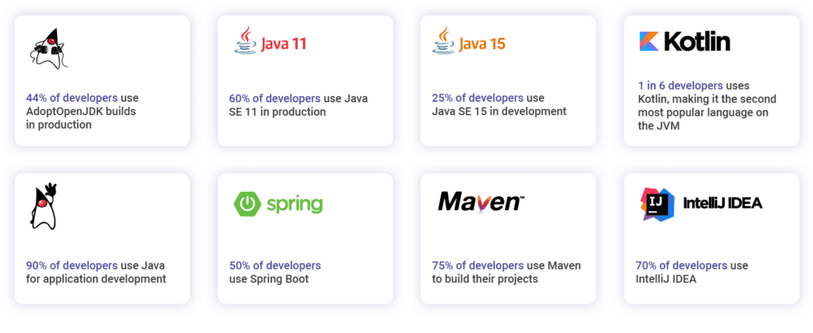

Snyk has just released the annual JVM ecosystem report! This report presents the results of the largest annual survey on the state of the JVM ecosystem.

This year's survey is a cooperation between [Snyk](https://snyk.io/) and [Azul](https://www.azul.com/) and was slightly different from the previous surveys. We aimed for the survey to be more concise and focus only on the most important aspects of JVM developers today. Additionally, this year every participant was allowed to choose multiple options. We believe that the way the 2021 survey was designed, we have a better and more comprehensive view of the current JVM ecosystem. In this report, we also looked at different open data sources like GitHub and Google Trends to see how that data compares to the survey results.  

Next to the results, there are some great highlight stories in this report like:

* ***Java, Changing Faster Than Ever After 26 Years*** by [Simon Ritter](https://twitter.com/speakjava)
* ***The State of Spring*** by [Josh Long](https://twitter.com/starbuxman)

## Report Highlights:

We would like to thank everyone who participated and offered their insights on Java and JVM-related topics. Big shoutout to [Foojay.io](https://foojay.io/), the [VirtualJUG](https://virtualjug.com/), and other Java communities for the invaluable help. This massive effort results in an impressive number of developers participating in the survey, giving great insight into the current state of the JVM ecosystem.  
[Go to the report](https://snyk.io/jvm-ecosystem-report-2021/)
