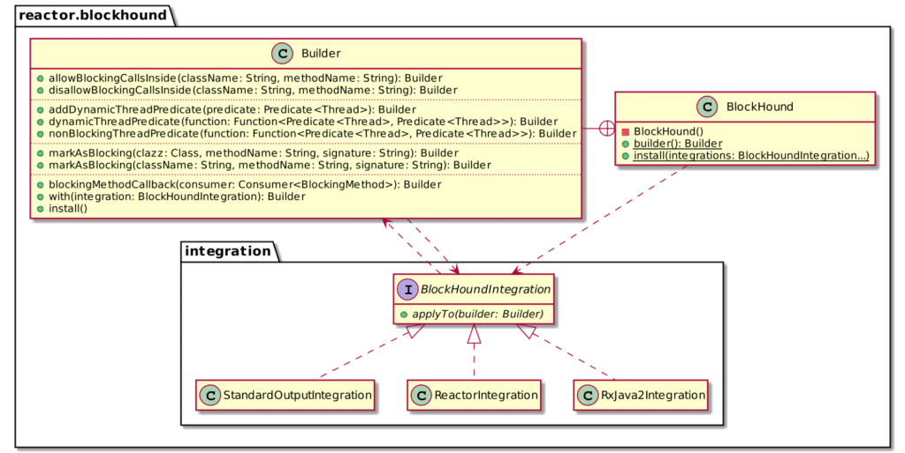
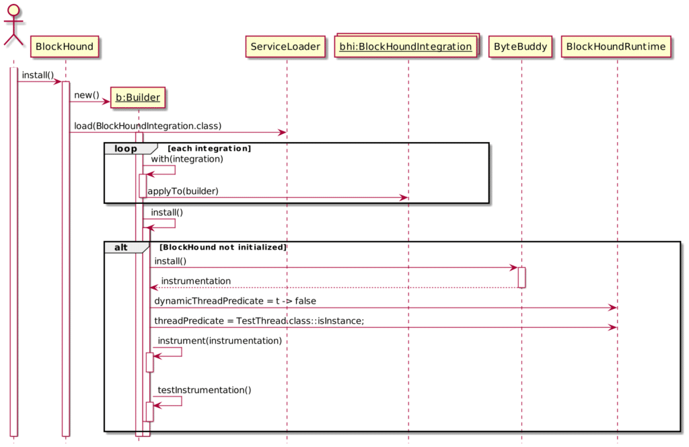
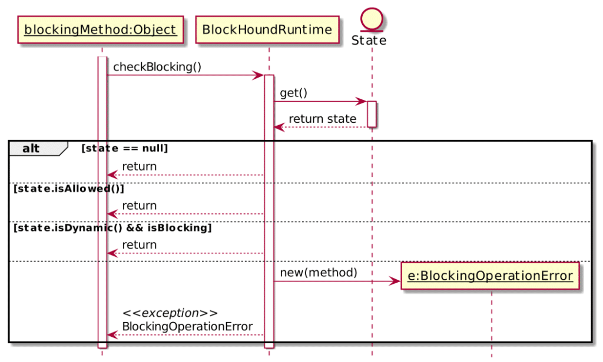

One of the talks in my current portfolio is [Migrating from Imperative to Reactive](https://www.papercall.io/speakers/nicolasfrankel/speaker_talks/194232-migrating-from-imperative-to-reactive). The talk is based on a [demo](https://github.com/hazelcast-demos/imperative-to-reactive/) migrating from Spring WebMVC to Spring WebFlux in a step-by-step approach. One of the steps involves installing [BlockHound](https://github.com/reactor/BlockHound): it allows to check whether a blocking call occurs in a thread it shouldn't happen and throws an exception at runtime when it happens.

I've presented this talk several times in the previous week, both in its Java version and its Kotlin one. One such presentation was at [Javaday Istanbul](https://www.javaday.istanbul/). After the talk, one of the questions I received was, "How does BlockHound work?" I admit that at the time, I couldn't remember. After the surprise had passed, but too late, I remembered it involved a Java agent. But I wanted to go down the rabbit hole.

This post tries to explain what I discovered.

## Why BlockHound?

Reactive Programming is based on asynchronous message passing. Different frameworks/libraries will differ in their approach: for example, in Project Reactor, an API call is not a blocking request-response call but a subscription to a message(s) that the publisher will deliver in the future.

A standard call chain rarely involves only a publisher and a subscriber. In general, there are multiple steps between them. Each intermediate step, called a processor, acts as a subscriber for the next step and a producer for the previous one. When the target producer emits, it sends a message to its subscriber, which sends a message to its subscriber, and so on, up to the first subscriber in the chain.

If one call in the chain is blocking, it "freezes" the whole chain until the work has finished. In that case, it dramatically diminishes the benefits of the Reactive approach. Enter [BlockHound](https://github.com/reactor/BlockHound):
> BlockHound will transparently instrument the JVM classes and intercept blocking calls (e.g. IO) if they are performed from threads marked as "non-blocking operations only" (ie. threads implementing Reactor's `NonBlocking` marker interface, like those started by `Schedulers.parallel()`). If and when this happens (but remember, this should never happen!😜), an error will be thrown.

In few words, BlockHound checks for blocking calls in places where there shouldn't be.

## Using BlockHound

Using BlockHound is straightforward:

* Add the dependency to your classpath
* Call `BlockHound.install()`

At this point, I naively figured that every blocking call would throw an exception. That's not the case. You can see for yourself by executing the following code:

```java
public static void main(String[] args) throws InterruptedException {
    BlockHound.install();
    Thread.currentThread().sleep(200);
}
```

Though `sleep()` is blocking, the program executes normally.

Getting a bit into BlockHound's [source code](https://github.com/reactor/BlockHound/blob/1.0.6.RELEASE/agent/src/main/java/reactor/blockhound/BlockHound.java#L126-L130) reveals that `sleep()` is indeed configured as blocking (along with several others):

```java
public static class Builder {

    private final Map<String, Map<String, Set<String>>> blockingMethods = new HashMap<String, Map<String, Set<String>>>() {{
        put("java/lang/Thread", new HashMap<String, Set<String>>() {{
            put("sleep", singleton("(J)V"));
            put("yield", singleton("()V"));
            put("onSpinWait", singleton("()V"));
        }});
}
```

So, what's the problem?

## Blocking calls on the "main" thread

Blocking calls are not a problem *per se*. A lot of calls are blocking but required anyway. It wouldn't be possible to throw on every blocking call.

The problem is to waste CPU cycles unnecessarily:

1. You call a blocking method
2. The method takes a long time to finish, *e.g.*, make an HTTP call
3. Until the call returns, you cannot execute other block sections

Hence, blocking methods should run on their dedicated thread. This approach wastes nothing.

Because of that, BlockHound doesn't throw on every blocking call but only on such calls that happen on threads that should be non-blocking. To mark a thread as non-blocking, we need to configure a predicate.

```java
public static void main(String[] args) throws InterruptedException {
    BlockHound.install(builder -> {
        builder.nonBlockingThreadPredicate(current ->
                current.or(thread -> thread.getName().equals("main"))); // 1
    });
    Thread.currentThread().sleep(200);
}
```

1. The `main` thread is marked as non-blocking

Running the above code expectedly throws the following:

```
Exception in thread "main" reactor.blockhound.BlockingOperationError: \
  Blocking call! java.lang.Thread.sleep
    at java.base/java.lang.Thread.sleep(Thread.java)
    at ch.frankel.blog.blockhound.B.main(B.java:11)
```

To be entirely sure, let's tweak our code to mark another thread only as non-blocking. `sleep()` in `main` shouldn't throw while `sleep()` in this other thread should.

```java
public static void main(String[] args) throws InterruptedException {
    var name = "non-blocking";
    BlockHound.install(builder -> {
        builder.nonBlockingThreadPredicate(current ->
                current.or(thread -> thread.getName().equals(name)));   // 1
    });
    var thread = new Thread(() -> {
        try {
            System.out.println("Other thread started");
            Thread.currentThread().sleep(2000);                         // 2
            System.out.println("Other thread finished");
        } catch (InterruptedException e) {
            e.printStackTrace();
        }
    }, name);
    thread.start();                                                     // 3
    Thread.currentThread().sleep(200);                                  // 4
    System.out.println("Main thread finished");
}
```

1. Flag threads with the parameterized name as non-blocking
2. Expected to throw
3. Start the new thread
4. Expect *not* to throw

As expected, the previous code outputs the following log:

```
Other thread started
Exception in thread "non-blocking" reactor.blockhound.BlockingOperationError: \
  Blocking call! java.lang.Thread.sleep
    at java.base/java.lang.Thread.sleep(Thread.java)
    at ch.frankel.blog.blockhound.C.lambda$main$3(C.java:16)
    at java.base/java.lang.Thread.run(Thread.java:829)
Main thread finished<code></code>
```

## BlockHound is only as good as its configuration

Though its artifact's `groupId` is `io.projectreactor`, BlockHound is generic:

* The JAR is self-contained. The only dependency is ByteBuddy, which BlockHound shades.
* BlockHound provides an **integration** abstraction. Integrations allow providing configuration bits. It can be generic or specific to a framework, *e.g.* RxJava, Reactor, etc.
* Integrations are loaded with the Java's [service loader](https://docs.oracle.com/javase/8/docs/api/java/util/ServiceLoader.html)

With that, it's time to check the BlockHound API a bit.



For example, the `RxJava2Integration` integration configures BlockHound for RxJava 2:

```java
builder.nonBlockingThreadPredicate(current -> current.or(NonBlockingThread.class::isInstance));
```

## But how does it work?

It's time to get back to our original question, how does BlockHound work?

Here's what happens when you call `BlockHound.install()`:



The magic happens in the `instrument()` method. There, BlockHound uses bytecode instrumentation to inject a code snippet in front of every method marked as blocking. A method is blocking if:

* We explicitly mark it as such by calling `Builder.markAsBlocking()`
* An automatically-loaded integration calls the above API for us

The snippet's code flow looks like this:



1. If the call is allowed, the flow continues normally.
2. If the call is dynamic, it also continues normally.
3. Otherwise, *i.e.* , the call is blocking *and* not dynamic, BlockHound throws.

## Conclusion

Using BlockHound *is* straightforward, *i.e.* , `BlockHound.install()`. A short explanation is that BlockHound is a Java agent.

But in this post, we dug a bit under the cover to understand how this simple call worked.

1. BlockHound's instrumentation adds code to methods marked as blocking.
2. When they run in non-dynamic threads, BlockHound throws.

Thanks a lot to [Violeta Georgieva](https://twitter.com/violeta_g_g) for her review!

**To go further**:

* [How it works](https://github.com/reactor/BlockHound/blob/master/docs/how_it_works.md)
* [Custom integrations](https://github.com/reactor/BlockHound/blob/master/docs/custom_integrations.md)

*Originally published at [A Java Geek](https://blog.frankel.ch/blockhound-how-it-works/) on June 20^th^ 2021*
