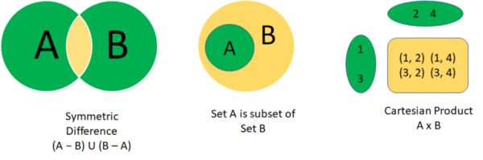

Primitive Set Operations in Eclipse Collections - Part 2

Continuing [from Part 1](https://foojay.io/today/primitive-set-operations-in-eclipse-collections/), in the Eclipse Collections 11.0 release, we will have the following Set operations `union`, `intersect`, `difference`, `symmetricDifference`, `isSubsetOf`, `isProperSubsetOf`, `cartesianProduct` on primitive collections.



Set Operations that will be available on primitive sets in Eclipse Collections 11.0.

These APIs are already available on Sets on the object side, but my goal was to implement these methods for Sets supporting primitive types namely `IntSet`, `LongSet`, `ShortSet`, `DoubleSet`, `FloatSet`, `CharSet`, `BooleanSet`, `ByteSet`. Additionally, the above operations will be available in both mutable and immutable interfaces.

I covered the first three operations (`union`, `intersect` and `difference`) in this [blog](https://pratha-sirisha.medium.com/primitive-set-operations-in-eclipse-collections-b126c9121d15?source=friends_link&sk=8c6645ba69f66b01c18796fa21b0163f). I will talk about the remaining operations here.

### Symmetric Difference — What does this operation do?

Method signature: `setA.symmetricDifference(setB)`

This operation returns a set that contains elements that are in either one of the two sets but not **both**. In other words, (Set A — Set B) U (Set B — Set A).



Set A — 1, 2, 3.

Set B — 2, 3, 4.

A — B = 1.

B — A= 4.

Symmetric Difference — 1, 4.

### Symmetric Difference — Code Implementation

🛈 Eclipse Collections has an existing API that allows us to `reject` that returns all the elements that evaluate false for the given`Predicate` and results are added to a target collection. Predicate here is `this::contains` and target collection is the set returned from `this.difference(set)`.

At this point of implementing `symmetricDifference`, we already had an API that can compute `difference` of Set A and Set B.

```java
default MutableIntSet symmetricDifference(IntSet set)
{
    return set.reject(this::contains, this.difference(set));
}
```

### Symmetric Difference — Usage

```java
@Test
public void symmetricDifference()
{
    MutableIntSet setA = IntSets.mutable.with(1, 2, 3);
    MutableIntSet setB = IntSets.mutable.with(2, 3, 4);
    MutableIntSet expected = IntSets.mutable.with(1, 4);
    MutableIntSet actual = setA.symmetricDifference(setB);
    Assert.assertEquals(expected, actual);
}
```

Test cases covering various scenarios can be found [here](https://github.com/eclipse/eclipse-collections/blob/75b93337df25915794d613c216042c36df6f0be3/eclipse-collections-code-generator/src/main/resources/test/set/mutable/abstractImmutablePrimitiveSetTestCase.stg#L387).

### Is Subset of — What does this operation do?

Method signature: `setA.isSubsetOf(setB)`

This operation returns true if all elements from Set A are present in Set B.



Set A — 1, 2.

Set B — 1, 2, 3.

Is Set A a subset of Set B — true.

### Is Subset Of — Code Implementation

🛈 Eclipse Collections has an existing API called `containsAll` that evaluates to true if all the values in `this` are present in `set`.

```java
default boolean isSubsetOf(IntSet set)
{
    return this.size() <= set.size() && set.containsAll(this);
}
```

### Is Subset of — Usage

```java
@Test
public void isSubsetOf()
{
    MutableIntSet setA = IntSets.mutable.with(1, 2);
    MutableIntSet setB = IntSets.mutable.with(1, 2, 3);
    Assert.assertTrue(setA.isSubsetOf(setB));

    MutableIntSet setC = IntSets.mutable.with(1, 2, 3);
    MutableIntSet setD = IntSets.mutable.with(1, 2, 3);
    Assert.assertTrue(setC.isSubsetOf(setD));
}
```

Test cases covering various scenarios can be found [here](https://github.com/eclipse/eclipse-collections/blob/75b93337df25915794d613c216042c36df6f0be3/eclipse-collections-code-generator/src/main/resources/test/set/mutable/abstractPrimitiveSetTestCase.stg#L615).

### Is Proper Subset of — What does this operation do?

Method signature: `setA.isProperSubsetOf(setB)`

This operation returns true if all elements of Set A are present in Set B but the two sets are not equal i.e. there is at least one element in Set B that is not present in Set A.

### Is Proper Subset of —Code Implementation

```java
default boolean isProperSubsetOf(IntSet set)
{
    return this.size() < set.size() && set.containsAll(this);
}
```

### Is Proper Subset of — Usage

```java
@Test
public void isProperSubsetOf()
{
    MutableIntSet setA = IntSets.mutable.with(1, 2);
    MutableIntSet setB = IntSets.mutable.with(1, 2, 3);
    Assert.assertTrue(setA.isProperSubsetOf(setB));

    MutableIntSet setC = IntSets.mutable.with(1, 2, 3);
    MutableIntSet setD = IntSets.mutable.with(1, 2, 3);
    Assert.assertFalse(setC.isProperSubsetOf(setD));
}
```

Test cases covering various scenarios can be found [here](https://github.com/eclipse/eclipse-collections/blob/75b93337df25915794d613c216042c36df6f0be3/eclipse-collections-code-generator/src/main/resources/test/set/mutable/abstractPrimitiveSetTestCase.stg#L655).

### Cartesian Product — What does this operation do?

Method Signature: `setA.cartesianProduct(setB)`

Cartesian Product of Set A and Set B is the set of all possible ordered pairs where the first element of the pair is from Set A and the second element from Set B.



Set A — 1, 3.

Set B — 2, 4.

Cartesian Product —

{(1, 2), (1, 4), (3, 2). (3, 4)}.

### Cartesian Product — Code Implementation

🛈 Eclipse Collections has a static utility class called `IntSets` and equivalent classes for other primitive set collections.

```java
@Override
public LazyIterable<IntIntPair> cartesianProduct(IntSet set)
{
    return IntSets.cartesianProduct(this, set);
}
```

Below code is the underlying `cartesianProduct` implementation.

```java
public static <A, B, C> LazyIterable<C> cartesianProduct(IntSet set1, IntSet set2, IntIntToObjectFunction<C> function)
{
    return set1.asLazy()
            .flatCollect(first ->
                set2.asLazy()
                    .collect(second -> function.value(first, second)));
}
```

### Cartesian Product — Usage

```java
@Test
public void cartesianProduct()
{
    MutableIntSet setA = IntSets.mutable.with(1, 3);
    MutableIntSet setB = IntSets.mutable.with(2, 4);
    MutableSet<IntIntPair> expected = Sets.mutable.with(
            PrimitiveTuples.pair(1, 2),
            PrimitiveTuples.pair(1, 4),
            PrimitiveTuples.pair(3, 2),
            PrimitiveTuples.pair(3, 4));
    Assert.assertEquals(expected, 
            setA.cartesianProduct(setB).toSet());
}
```

Test cases covering various scenarios can be found [here](https://github.com/eclipse/eclipse-collections/blob/75b93337df25915794d613c216042c36df6f0be3/eclipse-collections-code-generator/src/main/resources/test/set/mutable/abstractPrimitiveSetTestCase.stg#L695).

*I am a committer for the* [*Eclipse Collections*](https://github.com/eclipse/eclipse-collections)*OSS project at Eclipse Foundation.* [*Eclipse Collections*](https://github.com/eclipse/eclipse-collections)*is open for contributions*and if you like our library, let us know by starring our GitHub repository.
