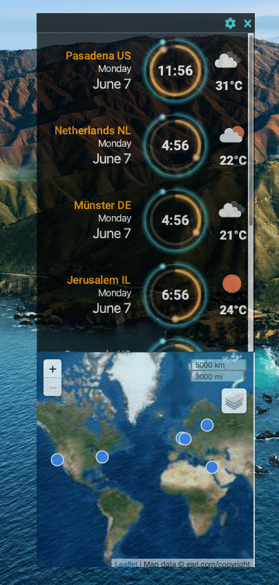
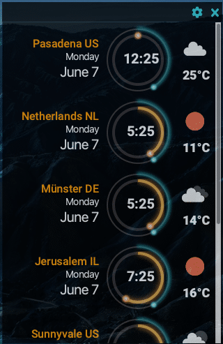

> Wherever you go, no matter what the weather, always bring your own sunshine. -- Anthony J. D'Angelo

Hello, and welcome to the last part of this series of articles on creating a JavaFX World Clock from scratch!

In this part, I will show you how to make WebService calls (RESTful) to retrieve weather data based on geographic locations.

If you remember, [in Part 5](https://foojay.io/today/creating-a-javafx-world-clock-from-scratch-part-5/) you learned how to use the JavaFX WebView and the popular mapping library Leaflet JS enabling the user to discover geographic locations. In Part 6, I will show you how I used Java 11's Http Client to retrieve and display weather content. If you are new to this series, you can visit Part [1](https://foojay.io/today/creating-a-javafx-world-clock-from-scratch-part-1/ "1")-[5](https://foojay.io/today/creating-a-javafx-world-clock-from-scratch-part-5/ "5").  


JFX World Clock Part 6

## Getting started

If you want to jump right into the code just head over to <https://github.com/carldea/worldclock>

## Requirements

* Java 16 - An OpenJDK with JavaFX (bundled with JavaFX modules)
  * [Azul Zulu](https://www.azul.com/downloads/?package=jdk-fx "Azul Zulu") with JavaFX
  * [Bellsoft Liberica](https://bell-sw.com/pages/downloads/#/java-16-current "Bellsoft Liberica") with JavaFX (full version)
  * JavaFX 16 – (optional) <https://openjfx.io/openjfx-docs/#install-javafx>
* [Maven 3.6.3](http://maven.apache.org/ "Maven 3.6.3") or greater
* (optional) [SDKMan](https://sdkman.io "SDKMan")
* Register to [OpenWeatherMap.org](https://openweathermap.org/ "OpenWeatherMap.org") to get your free API key.

I recommend using an OpenJDK build that already contains the JavaFX modules. Because the Java and JavaFX modules are bundled together there is no need to download OpenJFX modules from Maven Central as dependencies.

Before we begin, I want to mention some additional prerequisites or steps that need to be taken in order to execute the JavaFX World Clock application successfully. The application needs to obtain an API key provided by OpenWeatherMap.org. You'll need to follow the instructions below.

## Add API key (appid) to a resource file

Because the World Clock app uses a weather service, the app will need to obtain an **appid** from a file **you'll need to create locally** . After registering and obtaining your API key you'll need to add the API key into a text file named `openweathermap-appid.txt`. The file must be located in the project's directory at: `src/main/resources/com/carlfx/worldclock/`.

The appid (API key) file is private (local) and will be ignored by GitHub (not checked into GitHub). An entry will exist to ignore the appid file via the `.gitignore` file. So, when you build the application local to you the appid file will be included into your build.

## Testing the application

```
$ mvn javafx:run
```

Assuming you have valid locations having geo coordinates (lat/lon) for a given clock face row you should see a weather icon and it's associated temperature displayed as shown below.  


OpenWeatherMap Icons

## OpenWeatherMap's API for the Daily Weather forecast

In order to make REST API calls to fetch for weather information the API key will need to be applied to the http url request parameter like the following.

```
https://api.openweathermap.org/data/2.5/weather?units=metric&lat={lat}&lon={lon}&appid={API key}
```

For more info on OpenWeatherMap APIs visit the link below:

<https://openweathermap.org/current#geo>

## Using Java 11's HttpClient

In the listing below I created a utility method to use Java 11's standard HttpClient API to fetch JSON data from the weather service. Because it returns a `CompletableFuture` this call will defer its results (JSON String) at a later time. As you'll see later, the caller of this function will be able to apply or chain additional functions to the future to do further processing such as when fetching is complete.

```java
public CompletableFuture<String> fetch(String uri) {
    HttpClient client = HttpClient.newHttpClient();
    HttpRequest request = HttpRequest.newBuilder()
            .uri(URI.create(uri))
            .timeout(java.time.Duration.ofMillis(3000))
            .build();
    return client.sendAsync(request, HttpResponse.BodyHandlers.ofString())
            .thenApply(HttpResponse::body);
}
```

## Fetching the Current Weather forecast

For convenience I've created a `getWeatherOutlook()` method that will prepare the `URL` to be passed to the `fetch()` function described above. As you can see in the listing below having a final step of using the function `.whenComplete()`. It is responsible for parsing and populating the UI (`updateWeatherUI`).

```java
CompletableFuture<String> fetchWeather = getWeatherOutlook(location);
firstWeatherJsonFetch.whenComplete(updateWeatherUI);
```

You'll notice the lambda `updateWeatherUI` is passed into the `.whenComplete()`. The signature takes a `BiConsumer<String, Throwable>`. What's nice about this function is that you can handle both a success and failure of the call from the HTTP request. Later, I will show you the `updateWeatherUI` lambda function, where it parses JSON using the Jackson library and subsequently populating the UI.

## The function `getWeatherOutlook()`

I created a *business-y* function `getWeatherOutlook()` that takes a `Location` object's GPS coordinates, obtains the API key(appid) and prepares a GET request call to OpenWeatherMap.org.

```java
/**
 * An async fetch to get current weather as a JSON string.
 * @param location Location containing the latitude and longitude.
 * @return CompletableFuture<String> a future with a JSON response.
 */
private CompletableFuture<String> getWeatherOutlook(Location location) {
    if (location.getLatLong() == null || (location.getLongitude() == 0f) && location.getLatitude() == 0f) {
        return CompletableFuture.failedFuture(new Throwable("No lat long defined"));
    }

    double lat = location.getLatitude();
    double lon = location.getLongitude();
    DecimalFormat df = new DecimalFormat("###.######");
    try {
        String appId = new String(Files.readAllBytes(Paths.get(getClass().getResource("openweathermap-appid.txt").toURI())));
        if (appId == null) {
            return CompletableFuture.failedFuture(new Throwable("Error. No API token (appid) set a file called openweathermap-appid.txt."));
        }
        return fetch("https://api.openweathermap.org/data/2.5/weather?units=metric&lat=%s&lon=%s&appid=%s".formatted(df.format(lat), df.format(lon), appId));
    } catch (IOException | URISyntaxException e) {
        return CompletableFuture.failedFuture(new Throwable("Error. No API token (appid) set a file called openweathermap-appid.txt."));
    }
}
```

## Updating the UI after fetch is complete

After fetching the JSON response from the webservice it's time to update the UI. In the listing below is a `BiConsumer<String, Throwable>` lambda function `updateWeatherUI` that is passed into the `.whenComplete()` function of the `CompletableFuture` (async call). The following will parse JSON and begin to update the UI elements.

```java
BiConsumer<String, Throwable> updateWeatherUI =  (dayForecastJson, err) -> {
    try {
        // Parse weather JSON to obtain icon and weather temp info.
        ObjectMapper mapper = new ObjectMapper();
        Map<String, Object> dayForecast = mapper.readValue(dayForecastJson, Map.class);
        List<Map<String, Object>> weatherInfo = (List<Map<String, Object>>) dayForecast.get("weather");
        Map<String, Object> weatherIconInfo = weatherInfo.size() > 0 ? weatherInfo.get(0) : null;
        Map<String, Object> tempInfo = (Map<String, Object>) dayForecast.get("main");
        // Load weather icon asynchronously
        Image weatherIcon = new Image("https://openweathermap.org/img/wn/%s@2x.png".formatted(weatherIconInfo.get("icon")), true);
        weatherIconImageView.setImage(weatherIcon);

        // Apply Tooltip
        if (weatherToolTip != null) {
            Tooltip.uninstall(weatherIconImageView, weatherToolTip);
        }
        weatherToolTip = new Tooltip(weatherIconInfo.get("description").toString());
        Tooltip.install(weatherIconImageView, weatherToolTip);
        // Apply Text of temp in celsius
        String tempType = location.getTempType() == Location.TEMP_STD.CELSIUS || location.getTempType() == null ? "°C" : "°F";
        String tempText = "%d%s".formatted( Math.round(Float.parseFloat(tempInfo.get("temp").toString())), tempType);
        temperatureText.setText(tempText);
    } catch (JsonProcessingException e) {
        e.printStackTrace();
    }
```

## How it works?

As you can see above the code will parse the weather info and do the following:

1. Parse JSON to obtain Weather info
2. Load Weather Icon image
3. Set the ImageView to display the new image
4. Apply a tooltip showing the weather description on mouse hover
5. Set the JavaFX temperature text node.

In step 1, it will parse the json string using Jackson into a `Map` of `Map`s instead of creating many POJO classes. Steps 2 \& 3, the code creates and sets the icon image of the weather icon by using the Image's constructor that does loads the image in the background.

In step 4, ImageView will get a Tooltip applied using the function

```java
Tooltip.install(weatherIconImageView, weatherToolTip);
```

Some JavaFX UI components don't have a `setTooltip()` function such as ImageView, so this function is used to apply tooltips to non form input type controls.

Lastly, (step 5) is applying the temperature info into a simple JavaFX Text node.

Well, there you have it a sci-fi looking, JavaFX World Clock created from scratch! While I did use one 3rd party dependency (Jackson) and an API key from a weather service, it at least is easy to maintain with low complexity.

It was fun working with Java 11's HttpClient API to make web requests. I found it a little challenging but very important to get familiar with Java's `CompletableFutures` API. CompletableFutures are often used when making Http requests asynchronously (non-blocking calls to a web service). By making asynchronous calls this most inevitably enhance the user experience of UI applications.

While I've only touched the surface (so to speak) on the daily forecast APIs from OpenWeatherMap.org, I did notice other APIs that provided even more weather data. All in all, I had a lots of fun sharing this project with others.

### Are we there yet?

Well, it all depends… This is just a fun side project. There's always enhancements and bug fixes, but as a cool project and useful app, this serves my needs at the moment. At some point I would like to put it out on an App store or Market place.

Happy coding and any comments are always welcome!
