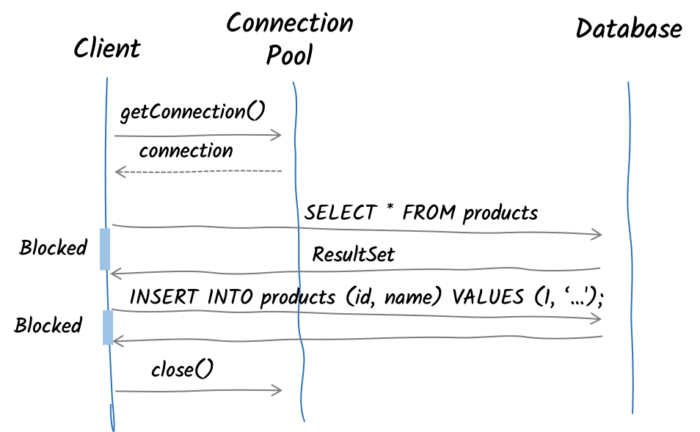
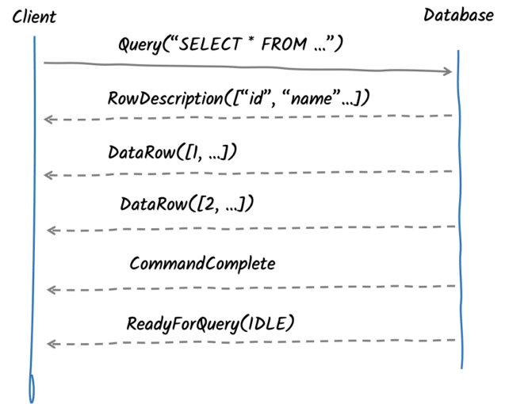

Database performances have been massively documented in the literature. Every week, a new blog post or article explains why database X is better than database Y. And, no, this post is not about that. This article summarizes the interactions between your database client (sometimes called driver) and the database server. It is essential to understand the principles of these exchanges to comprehend the limitations of the API the driver can expose safely.

But wait, isn't each database different? Yes, they are. Here, we are only talking about relational databases. But even in this class of databases, each of them defines their proprietary access protocol. Fortunately, some databases document their protocols. That's the case for PostgreSQL, MySQL, or Microsoft SQL Server. To have looked at others, they are all based on the same set of ideas. In this article, we will use PostgreSQL, which provides detailed [documentation](https://www.postgresql.org/docs/9.3/protocol.html) of its protocol and is quite popular. But again, you can apply the principles to other databases. Although they have different protocols, they share the same interactions, such as connection initialization and negotiation, simple query execution, and statement preparation and execution.

Don't be scared; we won't go too deep. The essential part is the high-level interactions between the client and the server, not how the frames transiting on the network are structured. To better understand the principles, we will draw a parallel with a well-known protocol that everybody uses: HTTP.

The HTTP protocol and database protocols are both request-response protocols. Studying the evolution of the HTTP protocol gives an interesting perspective about database access protocols.

This article is also going to talk about performances. There are several ways to measure performances, and in this article, we will focus on concurrency: the number of operations performed by the client at the same time. Concurrency is an essential characteristic of modern software. Your concurrency level defines how many users, requests, or messages you can handle simultaneously.

### HTTP performance evolution

The HTTP protocol was created between 1989 and 1991. Yes, 30 years ago! Performance was not a primary focus.  

In the initial version, the client establishes a connection for every request it makes to the server. As depicted in the next figure, after every request, the server closes the connection, and so the client must create a new one for the subsequent request. Creating and establishing a connection with the server are expensive operations, far from being ideal.

[



](http1-connection-lifecycle.png)

In 1996, HTTP/1.0 was officially released. It introduced *persistent connections*. That's an essential step toward better performance: it allows the client to reuse connections! Once a connection has been used, that connection is released and placed in a pool of connections. So, we can reuse the connection to perform another request. It does not change the interactions between client and server, but it significantly improves performance by saving the expensive connection creations:

[



](connection-pool-sequence-1.png)

Let's go back to concurrency.

With this pooling mechanism, the limiting factor for concurrency is the maximum number of connections that the client can open simultaneously and the latency between the client and the server.

In 1997, HTTP/1.1 was released and made another step toward better performance with HTTP pipelining. Pipelining allows the client to serialize multiple HTTP requests on a **single** connection. It gets respective responses in the same order the requests were sent, assuming the server will send the responses in the same order the client sent the requests.

As servers usually process each request upon reception and send the response just after the processing, HTTP pipelining saves network time. The client does not need to wait for the server's response to send another request. It can send multiple requests over the same connection and get responses one by one:

[



](http-pipelining.png)

While pipelining is not a silver bullet, it can increase concurrency. It provides noticeable performance improvements when the round-trip time (RTT, the time to go from the client to the server and back) is greater than the processing latency. Noteworthy is that HTTP pipelining is never used on the web since some HTTP proxies will not respect the FIFO order mandated by this technique.

In 2015, HTTP/2 was released. HTTP/2 does not impact the semantics of HTTP exchanges; instead, the entire specification defines the encoding and decoding of HTTP messages to increase concurrency and performance of interactions between client and server. The game-changer is multiplexing.

Multiplexing is a fundamental technique that combines several data streams over a single connection.

Multiplexing takes away the hard coupling between a request and a connection. In practice, the client no longer needs a connection pool and can utilize a single connection to perform multiple requests simultaneously.

How many requests can a client achieve with this single connection?

It is constrained by the server, which informs the client about the number of inflight requests it can send over the connection.

Noteworthy, previously, the client defined the concurrency (the connection pool size or a browser opening up to 5 connections per host). Since HTTP/2, the concurrency is defined by the server.

### Database access performance

Let's go back to databases.

As said above, the PostgreSQL protocol, as most database protocols, is a request-response protocol similar to HTTP.

When using an API such as JDBC, you are limited by the API. First, you need to acquire a database connection (from a connection pool). With this connection, you perform operations such as queries, insertions, and so on. These operations are blocking, and your code waits until you get the responses. Once done, you release the connection to the pool. So, the mechanism is similar to the HTTP/1.x: request, wait for the response, next request…​

To understand how we can improve the situation, let's briefly focus on PostgreSQL, highlighting the request/response paradigm. The execution of a PostgreSQL query involves sending a few messages over the wire to the PostgreSQL and then processing the responses:

The synchronous and blocking nature of JDBC prevents any potential optimization of the connection. Each query has to wait for its result before being able to execute another statement. This is also the case when there is no dependency between the statements. So, we can't use pipelining.

However, the protocol itself does not prevent it; the API does. Based on this observation, the [Vert.x PostgreSQL Client](https://vertx.io/docs/vertx-pg-client/java/), an asynchronous client for PostgreSQL, implements pipelining for PostgreSQL. With this client, you can increase the concurrency by enqueuing multiple statements in a single exchange with the database.

Whether PostgreSQL supports message pipelining is a legitimate concern. The PostgreSQL client protocol uses a length-prefix framing technique. Thus, it knows precisely how many bytes to read to process a message. When PostgreSQL processes a message, it reads the exact amount of bytes for this message. Then it writes the response message and resumes message processing. When the client pipelines several messages, PostgreSQL only reads the first message and then reads the following message once it has written the response message; the only difference lies in the fact that the client did not wait for the response to send a message:

[



](database-pipelining.png)

The Vert.x PostgreSQL Client supports connection-level pipelining and pool-level pipelining:

* Connection-level pipelining allows pipelining queries on the same connection.
* Pool-level pipelining exposes a client API backed by a connection pool. It can pipeline several queries on any connection of the pool. The pool can apply optimizations such as choosing the most appropriate connection (e.g., the connection with the less inflight commands)

Let's have a look at the effect of pipelining on the client.

We developed a [benchmark](https://github.com/vietj/pg-client-concurrency-benchmark) measuring the execution of 5000 queries on a single PostgreSQL connection; each execution is configured to use different levels of pipelining.

This benchmark was executed on Kubernetes running on AWS.

The client and the database run in different pods but running on the same node.

[



](benchmark.png)

The first result shows pipelining at level 1 and provides a baseline for the test. This is equivalent to a non-pipelining connection since, at most, one query will be sent to the database.

The second (pipelining level 2) and third (pipelining level 4) results show the benefit of pipelining. It significantly increases the performance.

The last result shows that greater levels of pipelining (16) have a minimal effect on performance in practice.

### Summary

Like HTTP, database protocols were created during the '80s and share similar protocol limitations.

PostgreSQL's protocol is currently at version 3, and there are concerns about improving the protocol in this regard. The [V4 wire protocol changes](https://wiki.postgresql.org/wiki/Todo#Wire_Protocol_Changes_.2F_v4_Protocol) and the [wanted features for V4](https://github.com/pgjdbc/pgjdbc/blob/95ba7b261e39754674c5817695ae5ebf9a341fae/backend_protocol_v4_wanted_features.md) documents share concerns about version 4 with pipelining and multiplexing in mind. PostgreSQL also has a proposed feature called [Protocol hooks](https://commitfest.postgresql.org/32/3018/) that decouples PostgreSQL from the current protocol. It aims to provide [extensibility of the wire protocol](https://postgrespro.com/list/thread-id/2527503). Such a feature could be an enabler for multiplexing.

It took 25 years to deliver HTTP/2 and introduce multiplexing to increase performance drastically. Most database protocols have not followed the same path yet and remain in the stone age of connection pooling (at least databases with an openly documented protocol). Multiplexed database protocols could improve performance, and make connection pools a thing of the past. It would also provide the foundation for efficient data streaming from databases.
