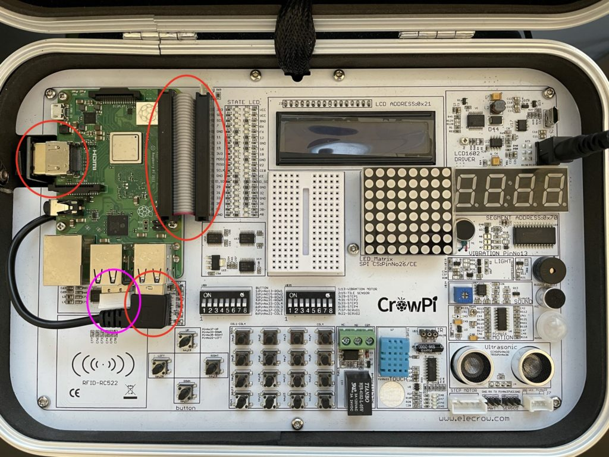
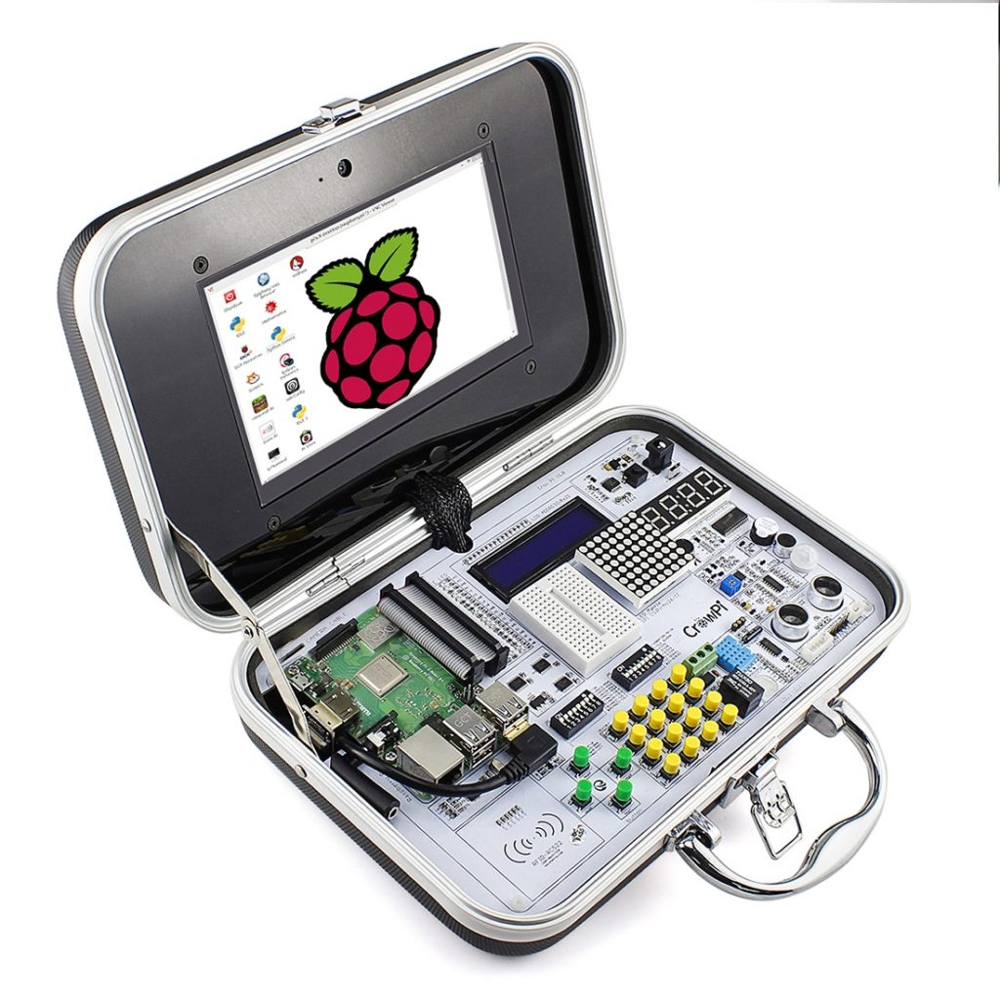
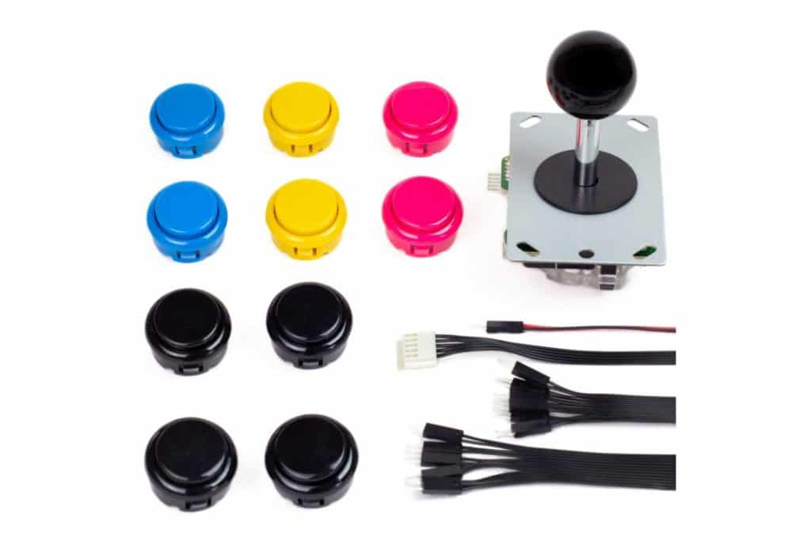
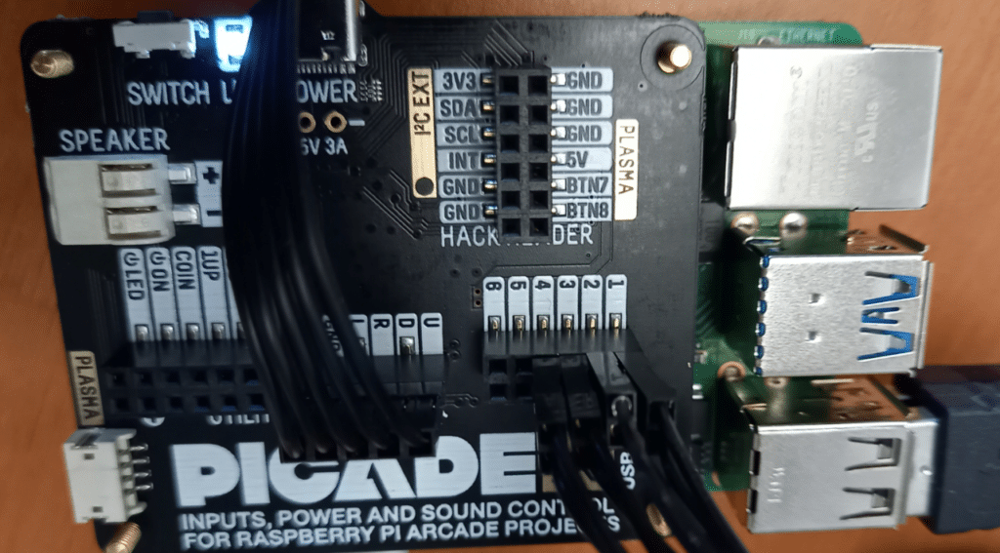
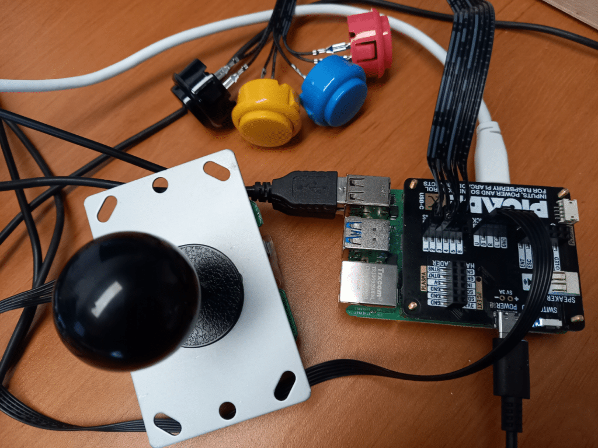
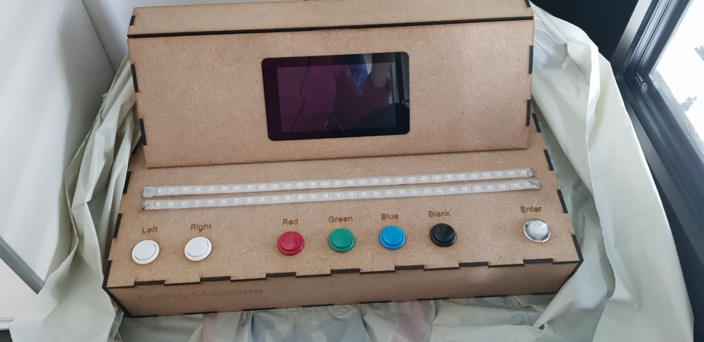
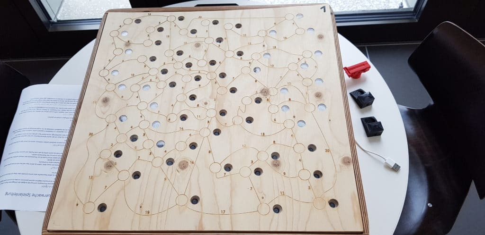
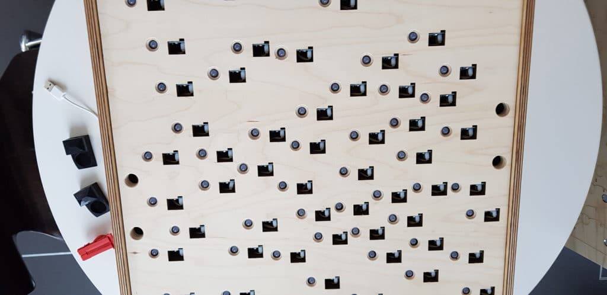
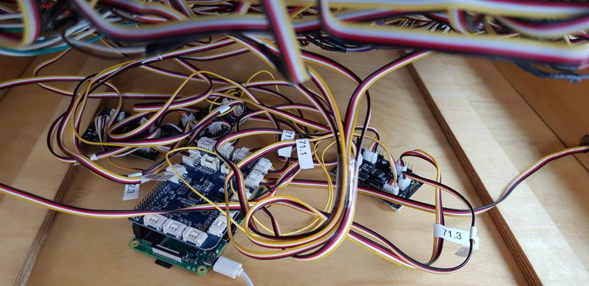

> The interviews in this post are [part of an article published (in German) in Java Magazine](https://kiosk.entwickler.de/java-magazin/java-magazin-7-2021/java-pi4j-und-raspberry-pi-in-der-bildung/).
> You can get a 25% discount for a new kiosk subscription with the following code: delporte_kiosk25

Although a lot of universities and high schools focus on Python and C# in their program, there are luckily a lot of others who go "full Java". Don't get me wrong, I definitely don't want to start a "programming-languages-war", but Java is the language I used myself more than any other for the last 10 years. Setting up a new project or building a proof-of-concept for a new idea, is a matter of hours. And there is always a solution for the problem I need to solve. This is probably true for each developer who has enough experience in the language used the most. But having used and experimented with many other languages, I still keep returning to my "one true love", being Java, as it always delivers the result I'm aiming for, with the right amount of code to be readable, understandable, and testable!

At the [University of Applied Sciences and Arts Northwestern Switzerland (FHNW)](https://www.fhnw.ch/en) a very interesting approach has been taken by combining Java with Raspberry Pi and the Pi4J library to combine theoretical subjects with programming assignments.

This year two projects focused on the integration of Pi4J V2:

CrowPi Goes Java
----------------

The CrowPi is a platform that allows taking first steps in programming combined with hardware. The main goal of this project was to implement a library with examples and documentation which allows beginners to take their first steps in Java in a fun new way.

<figure class="wp-block-gallery columns-3 is-cropped wp-block-gallery-1 is-layout-flex wp-block-gallery-is-layout-flex">
 <ul class="blocks-gallery-grid">
  <li class="blocks-gallery-item">
   <figure>
    
   </figure></li>
  <li class="blocks-gallery-item">
   <figure>
    
   </figure></li>
  <li class="blocks-gallery-item">
   <figure>
    
   </figure></li>
 </ul>
</figure>

The full documentation and example code is provided [on the Pi4J website](https://pi4j.com/getting-started/crowpi/).

JavaFX Game on the Raspberry Pi with a Joystick Controller
----------------------------------------------------------

The second project started from [the Snake FXLG game which was already handled here on Foojay](https://foojay.io/today/creating-a-snake-game-with-javafx-fxgl-in-three-pair-programming-sessions/) and got further extended and was used to compare the rendering speed with different JavaFX versions and startup arguments.

<figure class="wp-block-gallery columns-3 is-cropped wp-block-gallery-2 is-layout-flex wp-block-gallery-is-layout-flex">
 <ul class="blocks-gallery-grid">
  <li class="blocks-gallery-item">
   <figure>
    
   </figure></li>
  <li class="blocks-gallery-item">
   <figure>
    
   </figure></li>
  <li class="blocks-gallery-item">
   <figure>
    
   </figure></li>
 </ul>
</figure>

Interviews with Barbara Scheuner and Dieter Holz
------------------------------------------------

To me, it seems obvious that Java is also a perfect language when you start learning to program. But let's find out why the FHNW university has chosen this path... And why they use it on the Raspberry Pi.

**Dr. Barbara Scheuner** is Lecturer and Head of Computer Science Program ad interim. She studied [Computer Science at ETH](https://inf.ethz.ch/) from 2000 until 2005, after which she started to teach Computer Science at different schools. In 2014 she finished her PhD at ETH in the field of "Visual Literacy" and started Programming with Pascal and Delphi. Since she moved to FHNW in 2010, she is teaching Java in the first year of the Computer Science Bachelors Program.

**Dr. Dieter Holz** is Lecturer and a software developer with more than 40 years of experience. He co-founded Canoo, a Software-Boutique based in Basel, Switzerland (now known as Karakun) where he was the colleague of several Java-Champions. For 9 years he teaches at FHNW Java and JavaFX in the context of real-world business applications, and - since last year - Kotlin and Jetpack Compose for native Android-Apps.

<figure class="wp-block-gallery columns-2 is-cropped wp-block-gallery-3 is-layout-flex wp-block-gallery-is-layout-flex">
 <ul class="blocks-gallery-grid">
  <li class="blocks-gallery-item">
   <figure>
    
   </figure></li>
  <li class="blocks-gallery-item">
   <figure>
    
   </figure></li>
 </ul>
</figure>

***Thanks for sharing your story with us! Can you describe the FHNW University and the IT-related programs?***

**B. Scheuner:**The FHNW is a school of applied science. The major group of students finished an apprenticeship and holds a diploma of higher education. Our students finish with a Bachelors Degree.

We offer several [IT-related programs](https://www.fhnw.ch/en/degree-programmes/computer-science-information-technology) showing the big impact computer science has nowadays. We are engaged in the "traditional" computer science program with the fields of Software Engineering, Web Engineering, Information Visualization, Human Computer Interaction, Software Project Management, etc.  

***Universities and high schools seem to select either C# or Java as their main coding language. Why did FHNW choose Java?***

**B. Scheuner:** Honestly I don't know when and how this decision has been made. But as most of the responsible persons have been developers in the industry they have brought this technology to our school when they became lecturers.

**D. Holz:** When I joined FHNW this decision was already taken and I was very satisfied with it. Java is a "good enough" object-oriented language, is widely used in industry - especially in Switzerland -, it is stable - that's important for educating beginners - and has a vivid community. With JavaFX, we have a UI-Toolkit capable of realizing huge business applications. It's sad to see that even though lots of students are well educated, JavaFX remains to be a niche technology, that mainly makes the community happy but isn't widely adopted in the industry. For a University of applied science, this is a problem. Things have to change in the near future, otherwise, we have to switch to another technology stack in our base programming lectures.  

***In a lot of your projects, you're using Java in combination with the Raspberry Pi. What is the main benefit of this approach?***

**B. Scheuner:**First of all I have to explain what kind of projects we are doing with our students. At FHNW we start in the first semester with projects related to a real customer. These real projects had become very diverse in technology and level of difficulty during the last decade. In some years one group had to reinvent a CMS-Tool with frontend and backend in different technologies and languages and another group had to configure WordPress. So we decided to go in another direction and find customers for projects that follow more tightly the curriculum of the first year.

In 2019 we started to do projects around Java and the Raspberry Pi, as Java is the main language we teach in the first year, and on the Raspberry Pi the students can learn about operating systems, on a low level.  

***Can you give some examples of such a project and how they are linked to certain study fields?***

**B. Scheuner:**The new customers are lecturers of our school that wanted to have a physical representation of a non-physical theory or a game to learn about a certain theory. In the first year, we had a lot of projects on theoretical computer science problems as shortest path, knapsack, and touring machine. The shortest path project was the only one that has been finished as we had to stop due to Corona. There the students have connected about 20 RGB-LEDs and magnetic switches to illustrate the problem with a map and a fire station. The user then had to find the shortest path between his fire station and a fire, represented by a red led-light. The main pity for us was that they finished it with Python. So we had to improve on the connection of Java and the Pi.

<figure class="wp-block-gallery columns-3 is-cropped wp-block-gallery-4 is-layout-flex wp-block-gallery-is-layout-flex">
 <ul class="blocks-gallery-grid">
  <li class="blocks-gallery-item">
   <figure>
    
   </figure></li>
  <li class="blocks-gallery-item">
   <figure>
    
   </figure></li>
  <li class="blocks-gallery-item">
   <figure>
    
   </figure></li>
  <li class="blocks-gallery-item">
   <figure>
    
   </figure></li>
 </ul>
</figure>

**D. Holz:** Another example project is ["GPIOSimulator" (2020)](https://github.com/FHNW-IP5-IP6/GPIOSimulator) which contains component classes for using sensors and actuators in Java with the Raspberry Pi. Additionally, it has a rich tutorial to support new developers to try Java for their [GPIO Raspberry Pi projects](https://github.com/FHNW-IP5-IP6/GPIOSimulator/blob/dev/docs/Tutorial.adoc). It supports full compatibility with the [Grove Base Hat, Sensors,](https://wiki.seeedstudio.com/Grove/) and Actuators and contains a sample project that shows how the components can work together.  

***There are a few projects in progress that use the new Pi4J V2-library. Can you share some feedback on the experiences you have with this totally reviewed version and the switch to Java 11+?***

**D. Holz:** We started these projects in February. Until now all our expectations were exceeded. We got almost no bugs in V2 and the awesome support from the Pi4J V2 team. By the end of June, these projects should be finished, and the sources will be shared. They will also be added as documentation to the Pi4J website as a way to contribute back to this project.  

***What are the challenges your students face with Java? Are they related to the language itself or more to the principles of programming?***

**D. Holz:** In the first year it's mainly the principles of programming. After that, the programming language becomes more important. But the main challenge is probably to remain motivated to use such an "old-fashioned technology" like Java. As everybody knows, there is one rule: "New is always better".  

***How do you look at the future of Java? Although the language has been declared death a*** ***lot of times, the switch to a 6-month release cycle of new Java versions a few years ago seems to have revived the interest in Java "the language".***

**D. Holz:** Well, if Java is dead or will die in the near future, who killed it? We have probably the best technology stack for Real-World Desktop Applications. But, for example, packaging and delivering these applications is a huge pain. Does it really help to reduce the startup time of an application from 2 sec to 0.5 sec, if the application will be used the whole day? Is it really worth the effort to reduce the application size? Does it help to introduce a very, very complex module system with the consequence that lots of Java projects stick to good old Java 8 for years? So, there might be a bright future for the Java ecosystem, but we should stop some of these technology-driven habits and have a closer look at what helps and is really needed in real projects.  

***What future ideas do you have for Java, Raspberry Pi, and Pi4J at FHNW?***

**D. Holz:** As long a Java is the main programming language, Pi4J is a perfect match. For the students, it's good to have only one programming language in the first year. Using, for example, Python for the Raspberry Pi projects would be counterproductive. So we want to provide proper "learning materials" around Pi4J, establish even better coaching for the student projects using it, and tightly integrate it in current lectures and other interesting libraries, like the [JavaFX game library FXGL](http://almasb.github.io/FXGL/). All that to increase the fun the students have when they learn how to program.
