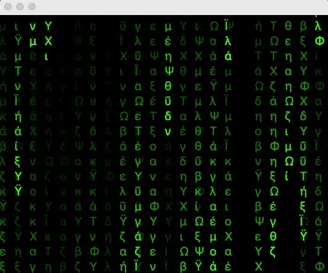
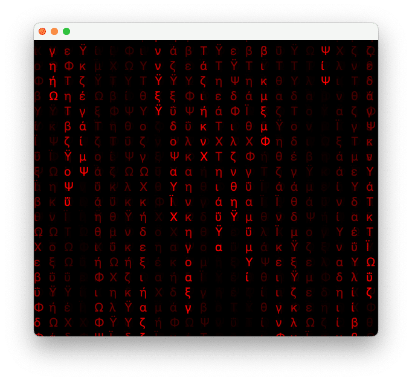

> **Spoon boy** : Do not try and bend the spoon. That's impossible. Instead... only try to realize the truth.  
> **Neo** : What truth?  
> **Spoon boy** : There is no spoon.  
> **Neo** : There is no spoon?  
> **Spoon boy** : Then you'll see, that it is not the spoon that bends, it is only yourself.

-- The Matrix, a conversation between Neo and Spoon boy.



In the classic science fiction movie, The Matrix, there's a cool special effect better known as the *falling* or *raining green code* effect. In [one scene](https://youtu.be/MvEXkd3O2ow?t=27 "one scene") the character named **'Cypher'** played by [Joe Pantoliano](https://www.imdb.com/name/nm0001592/ "Joe Pantoliano") explains how they can monitor activity inside the **matrix** by looking at the patterns as the code rains down. He claims it's done this way to simplify seeing people in the matrix than other means due to the fact that there is just way too much data (movie scifi magic talk).

In this article, I will demonstrate how to use JShell and JavaFX in an interactive way. No IDE or Build tools are needed.

## Requirements

Java 11 or greater (JDK builds containing JavaFX modules).

I typically download one binary containing Java and JavaFX at [Azul](https://www.azul.com "Azul"): <https://www.azul.com/downloads/?package=jdk-fx>

To jump right into the code, as a Maven project you'll want to clone the project at GitHub <https://github.com/carldea/matrixfx>. There you'll see the pom.xml file using the latest plugin from the [GluonHQ](http://gluonhq.com/ "GluonHQ") team. To learn more about using the plugin or generating a project from scratch head over to <https://start.gluon.io>

Before we start the stop watch here's a quick introduction to jshell.

## Introduction to JShell

Once you've installed Java 11 or greater the JDK provides a command line tool for the Java language called `jshell`. Similar to Python's command line REPL tool, you will be able to interact with a Java runtime environment.

To begin a jshell session get to your terminal or console command prompt and type `jshell` and hit enter.

```
$ jshell
|  Welcome to JShell -- Version 11.0.9
|  For an introduction type: /help intro
```

**Note:** Assuming your system's `JAVA_HOME` environment variable is properly set the typical executables should be available at the command line prompt: `java`, `javac`, and `jshell`.

What's nice about using jshell is you don't have to create any Java specific coding ceremony such as a `public static void main (String[] args)` method or having to create a class surrounding the main() method. You can simply do the following:

```
jshell> System.out.println("JavaFX Rocks!")
JavaFX Rocks!
```

Another nice feature is the **autocomplete** ability when hitting the tab key to show available method signatures.

Below is showing the available `println()` methods.

```
jshell> System.out.println(
Signatures:
void PrintStream.println()
void PrintStream.println(boolean x)
void PrintStream.println(char x)
void PrintStream.println(int x)
void PrintStream.println(long x)
void PrintStream.println(float x)
void PrintStream.println(double x)
void PrintStream.println(char[] x)
void PrintStream.println(String x)
void PrintStream.println(Object x)

<press tab again to see documentation>
```

Next, let's try a simple variable assignment by assigning a primitive **5** into a variable **x**.

```
jshell> var x = 5
x ==> 5
```

After an assignment you can do arithmetic statements like the following:

```
jshell> x + 1
$2 ==> 6
```

Whenever you don't assign a variable to a result as shown above (after hitting the carrage return), JShell will assign a reference variable (a number prefixed with a $ dollar sign) such as `$2`. To verify the result (`$2`) again just enter the reference variable and hit enter to output the value inside as shown below:

```
jshell> $2
$2 ==> 6
```

So, how do you know what packages and classes are available in the current `jshell` session?

That's simple: enter the `/imports` command. You should see something like the following:

```
jshell> /imports
|    import java.io.*
|    import java.math.*
|    import java.net.*
|    import java.nio.file.*
|    import java.util.*
|    import java.util.concurrent.*
|    import java.util.function.*
|    import java.util.prefs.*
|    import java.util.regex.*
|    import java.util.stream.*
```

How do you import a class not among the ones shown above. You either use `/open` (load Java file) or add a 3rd party library to your classpath before you launch `jshell` as shown below:

```
$ jshell --class-path /opt/libs/log4j.jar:/opt/libs/commons-lang3.jar
```

After 3rd party libraries are on the classpath you can now import them.

Shown below is an example of how to import the `StringUtils` class from [Apache commons](https://commons.apache.org "Apache commons").

```
jshell> import org.apache.commons.lang3.StringUtils
```

You can now perform the following:

```
jshell> StringUtils.isEmpty("")
$6 ==> true
```

Now that you are more familiar with jshell let's see how to launch a JavaFX application.

## JShell in 60 Seconds

In the following steps you will learn how to run a JavaFX application and interact with it during runtime using JShell.

**Step 1:** Make sure you have Java 11 or greater with JavaFX modules.

Do the following to check to make sure:

```
java --list-modules | grep javafx
```

You should see something like the following:

```
javafx.base@11.0.9
javafx.controls@11.0.9
javafx.fxml@11.0.9
javafx.graphics@11.0.9
javafx.media@11.0.9
javafx.swing@11.0.9
javafx.web@11.0.9
```

If you don't see the modules shown above, you probably downloaded just the JDK itself (not containing JavaFX's modules). (Head over to Azul to download Zulu builds with JavaFX here: <https://www.azul.com/downloads/?package=jdk-fx>.)

**Step 2:** Copy and Paste the following code into a file named `Main.java` into a directory:

```java
import javafx.animation.AnimationTimer;
import javafx.application.Application;
import javafx.scene.Scene;
import javafx.scene.canvas.Canvas;
import javafx.scene.canvas.GraphicsContext;
import javafx.scene.layout.StackPane;
import javafx.scene.paint.Color;
import javafx.scene.text.Font;
import javafx.stage.Stage;
import java.util.Random;

/**
 * A JavaFX application using the Canvas API to create the Matrix falling/raining green code effect.
 */
public class Main extends Application {
    public static String color = "#00ff00"; // the color green

    @Override
    public void start(Stage stage) {
        StackPane root = new StackPane();

        Canvas canvas = new Canvas(1280, 640);

        // bind the width and height properties when screen is resized.
        canvas.widthProperty().bind(root.widthProperty());
        canvas.heightProperty().bind(root.heightProperty());

        init(canvas);

        root.getChildren().add(canvas);

        Scene scene = new Scene(root, 1280, 640);
        stage.setScene(scene);
        stage.show();
    }

    private void init(Canvas canvas) {
        GraphicsContext gc = canvas.getGraphicsContext2D();
        int fontSize = 25; // font size in pixels

        // Animate the matrix effect
        new AnimationTimer() {
            long lastTimerCall = 0;
            final long NANOS_PER_MILLI = 1000000; //nanoseconds in a millisecond
            final long ANIMATION_DELAY = 50 * NANOS_PER_MILLI; // convert 50 ms to ns

            // Capture current dimensions of the Canvas
            int prevWidth = (int) canvas.getWidth();
            int prevHeight = (int) canvas.getHeight();

            // Keeps track of each column's y coordinate for next iteration to draw a character.
            int[] ypos = resize(gc, fontSize);

            // Random generator for characters and symbols
            Random random = new Random();

            @Override
            public void handle(long now) {
                // elapsed time occurred so let's begin drawing on the canvas.
                if (now > lastTimerCall + ANIMATION_DELAY) {
                    lastTimerCall = now;

                    int w = (int) canvas.getWidth();
                    int h = (int) canvas.getHeight();

                    // did resize occur?
                    if (w != prevWidth || h != prevHeight) {
                        // clear canvas and recalculate ypos array.
                        ypos = resize(gc, fontSize);
                        prevWidth = w;
                        prevHeight = h;
                    }

                    // Each frame add a small amount of transparent black to the canvas essentially
                    // creating a fade effect.
                    gc.setFill(Color.web("#0001"));
                    gc.fillRect(0, 0, w, h);

                    // Set an opaque color for the drawn characters.
                    gc.setFill(Color.web(color));
                    gc.setFont(new Font("monospace", fontSize-5));

                    // Based on the stored y coordinate allows us to draw the character next (beneath the previous)
                    for (int i = 0; i < ypos.length; i++) {
                        // pick a random character (unicode)
                        //char ch = (char) random.ints(12353, 12380) // Japanese
                        //char ch = (char) random.ints(12100, 12200) // Chinese
                        char ch = (char) random.ints(932, 960) // Greek
                                .findFirst()
                                .getAsInt();
                        String text = Character.toString(ch);

                        // x coordinate to draw from left to right (each column).
                        double x = i * fontSize;

                        // y coordinate is based on the value previously stored.
                        int y = ypos[i];

                        // draw a character with an opaque color
                        gc.fillText(text, x, ypos[i]);

                        // The effect similar to dripping paint from the top (y = 0).
                        // If the current y is greater than the random length then reset the y position to zero.
                        if (y > 100 + Math.random() * 10000) {
                            // (restart the drip process from the top)
                            ypos[i] = 0;
                        } else {
                            // otherwise, in the next iteration draw the character beneath this character (continue to drip).
                            ypos[i] = y + fontSize;
                        }
                    }
                }
            }
        }.start();
    }

    /**
     * Fill the entire canvas area with the color black. Returns a resized array of y positions
     * that keeps track of each column's y coordinate position.
     * @param gc
     * @param fontSize
     * @return
     */
    private int[] resize(GraphicsContext gc, int fontSize) {
        // clear by filling the background with black.
        Canvas canvas = gc.getCanvas();
        gc.setFill(Color.web("#000"));
        gc.fillRect(0, 0, canvas.getWidth(), canvas.getHeight());

        // resize ypos array based on the width of the canvas
        int cols = (int) Math.floor(canvas.getWidth() / fontSize) + 1;
        int[] ypos = new int[cols];
        return ypos;
    }

    public static void main(String[] args) {
        launch(args);
    }
}
```

**Things to notice:**

* No package namespace at the top
* One `public static String` variable denoting the color for the text color.
* It's a relatively small one file application

**Step 3:** Launch the JShell (command-line tool) and load the `Main.java` file in the current session.

**Note:** In your terminal (console) be sure to be in the directory location where the `Main.java` file was created from the previous step.

```
$ jshell Main.java
|  Welcome to JShell -- Version 11.0.9
|  For an introduction type: /help intro

jshell>
```

Or just type jshell , then on the command prompt type the following:

```
jshell> /open Main.java
```

This will simply load the file into the current `jshell` session.

To see more commands, type `/help`.

**Step 4:** Instantiate a `Main` class (JavaFX Matrix Application object):

```
jshell> Main app = new Main()
```

Here you'll notice there is no semicolon at the end of the statement. Semicolons are optional for simple one line statements.

In the JavaFX Matrix application, I created one `public static String` variable named `color` that will allow us to change its value dynamically all the while the application is running. The string variable will have a hex value representing an RGB color. The color is used to paint (fill) the characters on the canvas. Below is the code that will convert the string hex value color into a `javafx.scene.paint.Color` instance.

```
gc.setFill(Color.web(color));
```

Next, you'll check the current color value used.

Do the following:

```
jshell> System.out.println(app.color)
```

You should see the hex value for the color green:

```
jshell> System.out.println(app.color)
#00ff00
```

Since it's using the `RGB` color model the hex `FF` bits are turned on for green, red and blue bytes are set to zero. The format of the hex value is prefixed with the hash '#' symbol.

Later, we will change the color from green to red during runtime, but let's learn how to properly launch a JavaFX application within jshell.

**Step 5:** Create a `Thread` instance to invoke the `Main.main()` method.

```
jshell> new Thread(() -> app.main(null)).start()
```

Or you can do the following:

```
jshell> new Thread(() -> app.main(null))
```

Then you'll see a reference variable assigned to the new `Thread` instance (dollar symbol and number). It should output something similar to the following:

```
$13 ==> Thread[Thread-0,5,main]
```

To start the thread instance type the following into the command prompt:

```
jshell> $13.start()
```

Since the application starts on a new thread JShell's command prompt will not be blocked thus allowing you to interact with the runtime environment (main thread).

**Step 6:** Change the `color` variable interactively. Set the color to **red**.

```
jshell> app.color = “#ff0000”
```

This should dynamically output the following while the application is running.



**Step 7:** Stopping the JavaFX Application. Click on the close button to exit. Next, you'll need to `reset` the jshell session.

Type the following in jshell:

```
jshell> /reset
|  Resetting state.
```

A reset will kill the JavaFX Application thread and clear all objects in the current `jshell` session.

To rerun the application simply type the following:

```
jshell> /open Main.java
```

Another convenience is the ability to recall previously used commands. By using the **up** and **down** arrow keys you can cycle through commands or statements previously entered. This will help you save some time typing ;-).

To do simple edits, you can also type the command `/edit`. This will launch an simple text editor type UI allowing you to edit the current program in memory (current session). Subsequently, you can type the command `/save` to save changes.

## Observations

If you run the application by entering `new Main().main(null)` on the jshell prompt instead of a `new Thread(...).start()` you'll notice the jshell command line will **block** (not allowing you to type or interact). Therefore, I included a step to create a thread instance to run separately.

After stopping the application, you'll need to enter a `/reset` command to kill the JavaFX application thread. If you do not enter `/reset` and attempt to rerun the application the runtime environment will complain and you'll get the following error message:

```
jshell> Main.main(null)
|  Exception java.lang.IllegalStateException: Application launch must not be called more than once
|        at LauncherImpl.launchApplication (LauncherImpl.java:175)
|        at LauncherImpl.launchApplication (LauncherImpl.java:156)
|        at Application.launch (Application.java:296)
|        at Main.main (#11:123)
|        at (#13:1)
```

```

```

## Conclusion

We started with an introduction of the basics of using jshell. Next, you got a chance to learn how to run a JavaFX application file from a terminal command prompt and from within jshell's command prompt.

After that, launching the application we were able to change the color interactively by setting the `public static` member variable `color`.

Lastly, we learned how to stop a JavaFX application properly via `/reset` command.

Happy coding! If you have any questions comments are always welcome.
