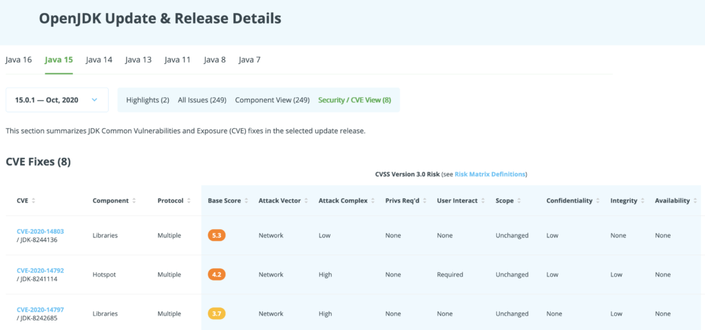

What is the [Common Vulnerability Scoring System](https://www.first.org/cvss/v3.0/specification-document) (CVSS), who is behind it, what are we doing with it, and what does a CVSS Value mean for you?

On Foojay, you can apply the insights below to understand the [Security/CVE Views in the OpenJDK Update \& Release Details pages](https://foojay.io/java-15/?quarter=102020&tab=cve&version=15.0.1), such as the one shown here:

I will explain how a CVSS Score is calculated, what the different elements of it mean, and what are the differences between the different CVSS versions.

### **The Basic Idea Of CVSS**

The basic idea behind CVSS is to provide a general classification of the severity of a security vulnerability. This is about the classification and evaluation of weak points. But what does the abbreviation CVSS mean?

***What does the abbreviation CVSS mean?*** The letters stand for the words: Common Vulnerability Scoring System. That means something like a general vulnerability rating system. Here, the weak points found are evaluated from various points of view. These elements are weighted against each other so that a standardized number between 0 and 10 is obtained at the end.

***For what do you need such a rating system?*** A rating system that provides us with a standardized number allows us to evaluate different weak points abstractly and derive follow-up actions from them. The focus here is on standardizing the handling of these weak points. As a result, you can define actions based on the value ranges. Here I mean processes in the value creation sources that are affected by this weak point.

***What is the basic structure of this assessment?*** In principle, CVSS can be described so that the probability and the maximum possible damage are related using predefined factors. The basic formula for this is: **risk = probability of occurrence x damage**
> If you want, you can check out my video on Youtube about CVSS as well.  
> 

### **The Basic Values From 0..10**

The evaluation in CVSS is based on various criteria, called "metrics". For each metric, one or more values is selected from a firmly defined selection option. This selection then results in a value between 0.0 and 10.0. Where 0 is the lowest and 10 is the highest risk value. The entire range of values ​​is then subdivided into groups and are labelled "**None** ", "**Low** ", "**Medium** ", "**High** ", and "**Critical**". These metrics are divided into three areas that are weighted differently from one another. These are the areas "Basic Metrics", "Temporal Metrics", and "Environmental Metrics". Here, different aspects are queried in each area, which must be assigned a single value. The weighting among each other and the subsequent composition of the three group values ​​gives the final result.

However, all component values ​​that lead to this result are always supplied. This behaviour ensures that there is transparency at all times about how these values ​​originally came about.

Next, the three sub-areas will be explained individually in detail below.

### 1. **Basic Metrics**

The basic metrics form the foundation of this rating system. The aim is to record the technical details of the vulnerability that will not change over time. You can imagine it to be an assessment that is independent of other changing elements. Different parties can carry out the calculation of the base value. It can be done by the discoverer, the manufacturer of the project or product concerned or by a party (CERT) charged with eliminating this weak point. One can imagine that, based on this initial decision, the value itself will turn out differently since the individual groups pursue different goals.

***Necessary requirements:*** The base value evaluates the prerequisites that are necessary for a successful attack via this security gap. This is, for example, the distinction between whether a user account must be available on the target system for an attack that is used in the course of the attack or whether the system can be compromised without the knowledge about a system user. It also plays a significant role in whether a system is vulnerable over the Internet or whether physical access to the affected component is required.

***Complexity of the attack:*** The base value should also reflect how complex the attack is to carry out. In this case, the complexity relates to the necessary technical steps and includes assessing whether the interaction with a regular user is essential. Is it sufficient to encourage any user to interact, or does this user have to belong to a specific system group (e.g. administrator)? At this point, it is already evident that the assessment of a new vulnerability requires exact knowledge of this vulnerability and the systems concerned. The correct classification is not a trivial process.

***Assessment of the damage:*** The basic metrics also take into account the damage that this attack could cause to the affected component. This means the possibilities to extract the data from the system, manipulate it, or completely prevent the system's use. One speaks here of the three areas;

* Confidentiality
* Integrity
* Availability

However, you have to be careful here concerning the weighting of these possibilities. In one case, it can be worse when data is stolen than it is changed. In another case, the unusability of a component can be the worst damage to be assumed.

***Scope metric:***The scope metric has also been available since CVSS version 3.0. This metric looks at the effects of an affected component on other system components. For example, one can imagine that a compromised element in a virtualized environment enables access to the carrier system. A successful change of this scope represents a greater risk for the overall system and is therefore also evaluated using this factor. This point alone clearly shows that the interpretation of the values also requires adjusting to one's situation. And so we come to the "temporal" and "environment" metrics.

### 2. **Temporal Metrics**

The time-dependent components of the vulnerability assessment are brought together in the group of temporal metrics. The peculiarity at this point is that the base value can be reduced by the temporal components only. The initial rating is intended to represent the worst-case scenario.

This has both advantages and disadvantages if you bear in mind that it is during the initial assessment of a vulnerability that can give very different interests. At this point, there are two things that need to be highlighted;

***1) Which factors influence the temporal metrics?***The elements that change over time influence the "Temporal Metrics". On the one hand, this refers to changes concerning the availability of tools that support the exploitation of the vulnerability. These can be exploits or step-by-step instructions. A distinction must be made whether a chess point is theoretical or whether a manufacturer has officially confirmed it. All of these events change the base value.

***2) Influence of the initial evaluation?*** The influence on the initial evaluation comes about through external framework conditions. These take place over an undefined time frame and are not relevant for the actual basic assessment. Even if an exploit is already in circulation during the base values survey, this knowledge will not be included in the primary assessment. However, the base value can only be reduced by the temporal metrics. This approach takes a little getting used to and is often the subject of criticism. The reason why you decided on it is understandable from the theoretical point of view. The base value is intended to denote the most excellent possible damage.

And this is where a conflict arises. The person or group that has found a security gap tries to set the base value as high as possible. A highly critical loophole is better to sell and better exploited in the media. The reputation of the person/group who found this gap increases as a result. The affected company or the affected project is interested in exactly the opposite assessment. It, therefore, depends on who finds the security gap, how the recycling should take place and by which body the first evaluation is carried out. The only offsetting component is the Environmental Metrics.

### **3. Environmental Metrics**

In the case of environmental metrics, the own system landscape is set in relation to the security gap. This means that the evaluation is adjusted based on the real situation. In contrast to Temporal Metrics, Environmental Metrics can correct the base value in both directions. The environment can therefore lead to a higher classification and must also be constantly adapted to your own changes. The combination now gives rise to purely practical questions.

Let's assume that there is a patch from the manufacturer for a security hole. The mere presence of this modification leads to a lowering of the total value in the Temporal Metrics. However, as long as the patch has not been activated in your own systems, the overall value must be drastically corrected upwards again via the Environmental Metrics. Why did I say at this point that the value has to be increased drastically? As soon as a patch is available, this patch can be used to better understand the security gap and its effects. The attacker has more and more detailed information that can be used. This reduces the resistance of the not yet hardened systems.

### **The Final Score**

At the end of an evaluation, the final score is obtained, calculated from the three previously mentioned values. At this point, I will not explain the calculation details, there will be a separate article on this. The resulting value is then assigned to a value group. But there is one more point that is very important to me personally. In many cases, I see that the final score is simply carried over.

The individual adjustments utilizing the environmental score do not take place. Instead, the value one to one is adopted as the risk assessment. In many cases, this behaviour leads to a dangerous evaluation which is incorrect for the overall system concerned.

### **Conclusion**

We now come to the management summary! With CVSS, we have a value system for evaluating security gaps in software. Since there are no alternatives, the system has been in use worldwide for over ten years and is constantly being developed, it is a defacto standard. The evaluation consists of three components.

* First, there is the basic score, which is there to depict a purely technical worst-case scenario.
* The second component is the evaluation of the time-dependent corrections based on external influences. This is about the evaluation of whether there are further findings, tools or patches for this security gap. The peculiarity of this point is that the base score can only be reduced with this value.
* The third component is the assessment of your own system environment with regard to this weak point. With this consideration, the security gap is adjusted in relation to the real situation on site. This value can be lower or higher than the base rating.

Last but not least, an overall evaluation is made from these three values, which results in a number between 0.0 to 10.0. This final value can be used to control your own actions to defend against the security gap in the overall context.

At first glance, everything is quite abstract. It takes some practice to get a feel for the figures it contains. And the CVSS can only develop its full effect if it deals more deeply with this matter within your own system.
