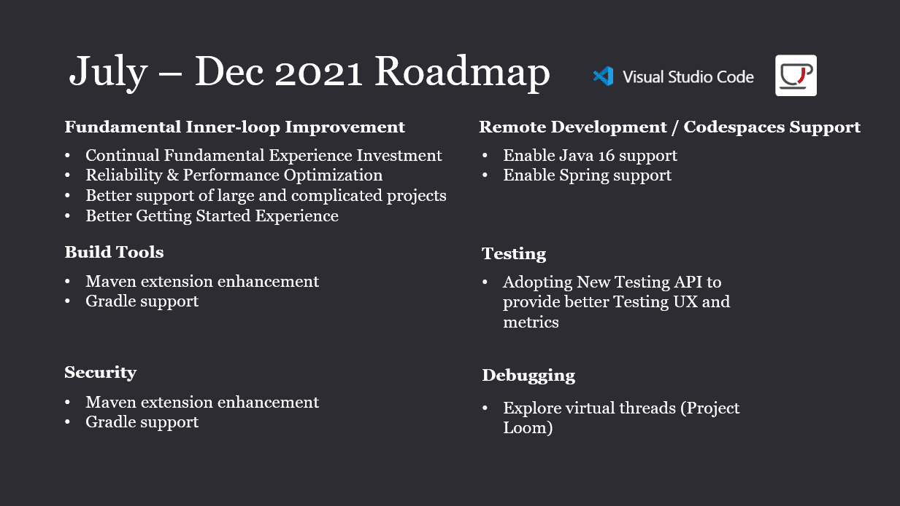
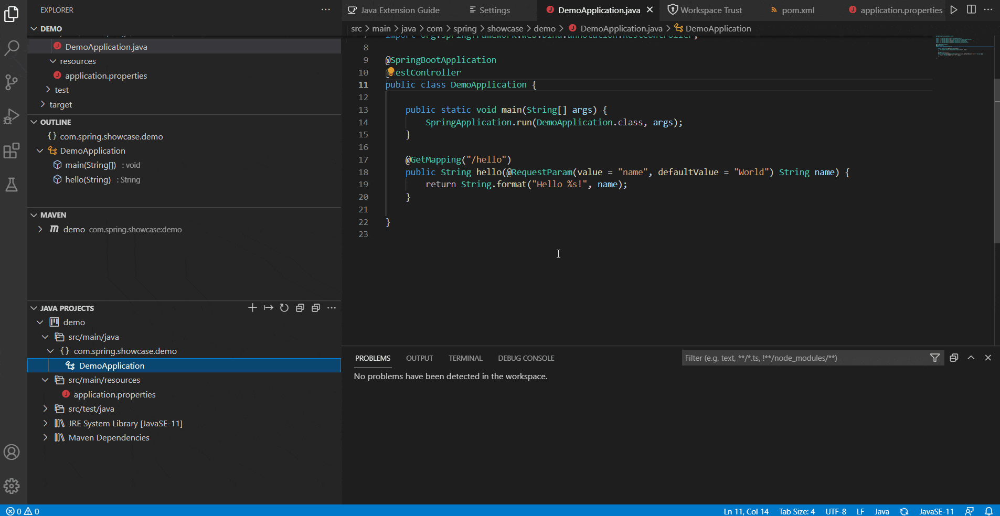
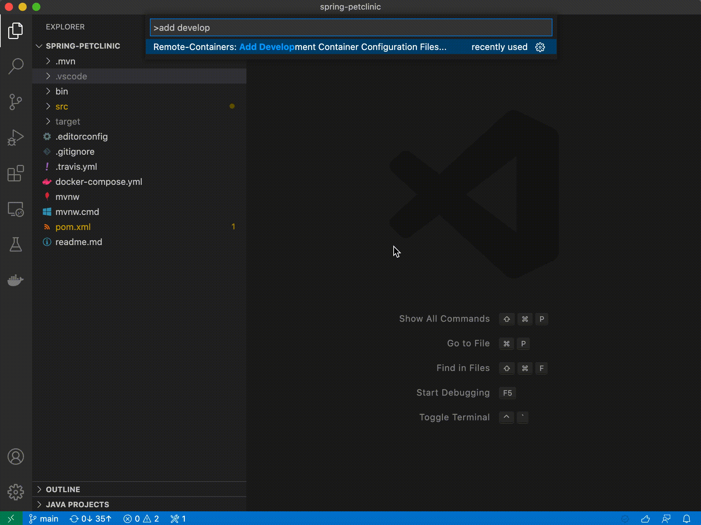

Welcome to the special mid-year edition for Visual Studio Code Java updates.

As the highlight of this post, we are going to take a look at our product roadmap for the next few months.

We will also showcase some important new features \& improvements as we did [in previous blog posts](https://foojay.io/today/category/tools/vscode/).

So let's get right into it!

Visual Studio Code Java has come a long way since the initial launch, and we couldn't have done it without your support, so thank you for all the suggestions and feedback, and please keep them coming! 🙂

As for the next few months (July - December 2021) for Visual Studio Code, we are going to focus on the following areas...

## Fundamental Experience Improvement

We are going to keep improving the fundamental inner-loop development experience as it is essentially impacts our developers' daily routine. This includes continual investment on better code completion/navigation, package import, compiling, debugging, testing and so on.

In addition, we have been constantly hearing that we need to better handle projects of large scale and complicated structures, so we are looking to further polish the experience in this area. This will also help developers who are working with enterprise-level codebase which often has complex layouts. Last but not least, we will further enhance performance and reliability.

## Build Tools Support

Build and dependency management is a critical part of the Java developer experience. We are looking to improve both breadth and depth in this area. For breadth, we plan to add support for Gradle, which we have been hearing from community for a long time.

The initial set of features for Gradle will revolve around task management, and Gradle file authoring. In terms of depth, we will keep improving the existing Maven tools experience, and adding new features to support additional scenarios such as switching profiles.

## Remote Development / Codespaces

Remote Development has always been a popular feature in Visual Studio Code and it allows developers to use a container for a full-feature development environment. For the upcoming quarters, we are working on supporting more Java versions as well as Spring framework in the containers so developers can access those technology in their remote development scenarios. We have just released support for Java 16 in the remote dev container which is shown in the later sections of this post.

In addition, Github Codespaces is a configurable online development environment that allows you to develop entirely in cloud. Visual Studio Code plays a critical role in Codespaces as it provides the essential code editing experience. In terms of Java, the team is working on providing the support for Java language extensions in Codespaces so Java developers can find all Java related tools they need. For details on how to request access for Codespaces, please follow the [official Codespaces documentation here](https://docs.github.com/en/codespaces/about-codespaces "official Codespaces documentation here").

## Testing

In terms of testing, Visual Studio Code Java is targeting to adopt the new Testing APIs introduced recently. This means when Java developers are dealing with tests in Visual Studio Code, they will not only be able to use a user interface with richer display of outputs, but also gain access to more testing metrics such as testing coverage.

## Debugging - Exploring Virtual Threads

In order to provide better debugging performance in Visual Studio Code Java, we will also explore the possibility of enabling virtual threads powered by the new Project Loom. Our goal is to increase the developer productivity and further optimize the debugging experience in Visual Studio Code Java.

## Security

Visual Studio Code takes security seriously and we do our best to ensure that you can safely browse and edit code no matter the source or original authors. [The new Workspace Trust feature](https://code.visualstudio.com/docs/editor/workspace-trust#_safe-code-browsing "The new Workspace Trust feature") lets you decide whether your project should allow or restrict code execution.

For Java projects, we already started to work on supporting those new security features. As a start, when you open Java projects in untrusted workspaces, the Java language server will run in a restricted mode and provide limited support. We will show this in the later section of this post.

The picture above summarizes our focus for July to December. Please let us know if you have any further comments or suggestions.

In addition to our roadmap, we also have several new features to showcase for this month.

## Limited Java Language Support in Untrusted Workspace

In our roadmap sharing above, we have emphasized how important security is for our developers. With the latest Visual Studio Code update, developers can choose whether or not to trust the workspace. For Java developers, this means when you work in an untrusted workspace, all our Java tools will be in restricted mode and certain capabilities will be disabled. To manage workspace trust, simply open command palette (Ctrl+Shift+P) and run "Workspaces: Manage Workspace Trust" command

## Java 16 Enabled in Dev Container for Remote Development

We have now enabled Java 16 in our dev container for remote development. To use this feature, simply bring up Command Palette (Ctrl+Shift+P) and run "\>remote-containers: Add Development Container Configuration Files", then select "Java" and "16" in order.

<https://docs.github.com/en/codespaces/about-codespaces>

Please don't hesitate to try our product!

Your feedback and suggestions are very important to us and will help shape our product in future.

There are several ways to leave us feedback: leave your comment on this blog post or [open an issue](https://github.com/microsoft/vscode-java-pack/issues/new/choose "Open an issue") on our GitHub Issues page.

Here are helpful links to learn Java on Visual Studio Code:

* [Learn more about](https://code.visualstudio.com/docs/languages/java "Learn more about") Java on Visual Studio Code.
* Explore our [step by step Java Tutorials](https://code.visualstudio.com/docs/java/java-tutorial "step by step Java Tutorials") on Visual Studio Code.
