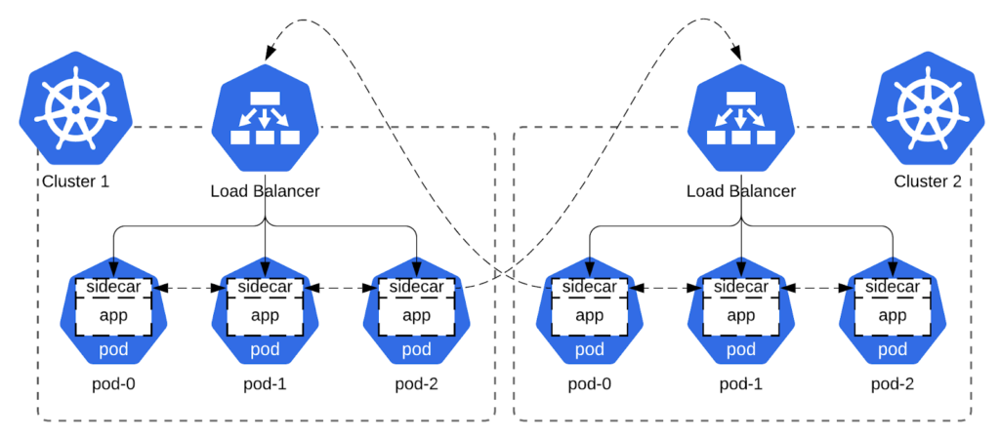

One of the biggest selling points of Apache Cassandra™ is its shared-nothing architecture, making it an ideal choice for deployments that span multiple physical datacenters. So when our [Cassandra as-a-service](https://astra.datastax.com/) single-region offering reached maturity, we naturally started looking into offering it cross-region and cross-cloud.

One of the biggest challenges in providing a solution that spans multiple regions and clouds is correctly configuring the network so that Cassandra nodes in different data centers can communicate with each other successfully, even as individual nodes are added, replaced, or removed. From the start of the cloud journey at DataStax, we selected Kubernetes as our orchestration platform, so our search for a networking solution started there. While we've benefited immensely from the ecosystem and have our share of war stories, this time we chose to forge our own path, landing on ad-hoc overlay virtual application networks (how's that for a buzzword soup?).

In this post, we'll go over how we arrived at our solution, its technical overview, and a hands-on example with the Cassandra operator.

## Storytime

About a year ago, several blog posts were published that inspired us on this journey. The first was the [Nebula announcement](https://slack.engineering/introducing-nebula-the-open-source-global-overlay-network-from-slack/) from Slack. Reading it and then learning about Nebula's architecture was a good introduction to the capabilities and feasibility of home-built overlay networks. The introduction to [how Tailscale works](https://tailscale.com/blog/how-tailscale-works/) was another good primer on the subject.

Later, Linkerd published a post about [service mirroring](https://linkerd.io/2020/02/25/multicluster-kubernetes-with-service-mirroring/). While we use Istio in some capacity, Linkerd has always looked attractive due to its architecture of simple and pluggable components. And their blog post about service mirroring did not disappoint. As a lot of great ideas do, the idea of exposing a pod in a different cluster with a service IP looked obvious in hindsight. But using Service IPs in our use case was not super scalable, as kube-proxy provisions all of them on each node.

So the idea of making our own virtual IPs and exposing them just to the relevant pods via sidecars was born.

## Lightweight overlay network to the rescue

Overlay networks differ in their capabilities and implementations, but one thing that unites them is that they run on top of other networks. Each link connecting two nodes of an overlay network corresponds to a path of one or more links on the underlying network. While overlay networks usually serve traffic for multiple different apps, the overlay network described here will be single tenant and dedicated to one app. It will consist of two logical components: routing and transport. For routing, we need a way to route connections to a given stateful pod (virtual IP) that survives pod IP changes during pod restart. For transport, we'll need to communicate the source and destination virtual IP addresses across the connection and to secure the data stream.

The basic premise behind routing is simple. First, we select a subnet for our overlay network, let's say [10.0.0.0/8](https://tailscale.com/kb/1015/100.x-addresses/). Then, we assign our app in each Kubernetes cluster an ordinal. So for example, app in cluster 1 is assigned ordinal 1, and app in cluster 2 is assigned ordinal 2. This ordinal becomes the second octet of the virtual IP, giving the app in cluster 1 a virtual subnet of 10.1.0.0/16, and the app in cluster 2 a virtual subnet of 10.2.0.0/16.

Now we need a deterministic way of routing these virtual subnets in each cluster. Luckily, Kubernetes supports [stable dns names for pods](https://kubernetes.io/docs/concepts/services-networking/dns-pod-service/#pods), and this setup is even [automated](https://kubernetes.io/docs/concepts/workloads/controllers/statefulset/#stable-network-id) by StatefulSets via the serviceName field. With that arsenal, all we need now for routing is a formula to convert between the name of the pod and its virtual IP address. For Cassandra, there is an obvious choice here: to use the rack number for the third octet, and the StatefulSet pod number for the fourth. For example, the third pod in rack 2 of the first datacenter, having a pod name like "cassandra-dc-1-rack-2-pod-3" would have the IP 10.1.2.3. And similarly we can now convert the IP 10.4.3.1 to the pod name "cassandra-dc-4-rack-3-pod-1."

With routing figured out, we now need to address packet transport. Using a proxy is one option, but it normally changes the source IP of a connection to that of the proxy. While this doesn't affect most apps, some apps, like DataStax Enterprise, require the source IP of the connection to be correct. This means that if a proxy is put in the middle, it must be configured for [transparent proxying](https://www.nginx.com/blog/ip-transparency-direct-server-return-nginx-plus-transparent-proxy/). Luckily, Cloudflare's blog post about [building Spectrum](https://blog.cloudflare.com/how-we-built-spectrum/) gives some pointers on how to achieve this for our use case. Adding proxy protocol for connection address info and mTLS for security to the mix completes our bag of tricks necessary to pull off our sidecar overlay network.

We'll attach an init container and a sidecar to each pod. The privileged init container will set up the packet routing and forwarding logic, while the sidecar will proxy the traffic to the right endpoint, either local or remote. This is similar to the approach used by popular service mesh implementations like Istio and Linkerd, which usually auto-inject these containers during pod creation via the [Mutating Admission Controller](https://kubernetes.io/docs/reference/access-authn-authz/admission-controllers/).

## Hands-on example with cass-operator

We can illustrate the above concept by creating a lightweight overlay network for Cassandra's internode traffic. We'll deploy a Cassandra cluster consisting of two datacenters using the open source [cass-operator](https://github.com/k8ssandra/cass-operator). After preparing two Kubernetes clusters of 3 nodes each (2 CPU \& 4 GB RAM), perform the following steps. Steps one through five are performed in both kubes, while steps six and seven are different for each:

### 1) Spin up the Cassandra operator

Run the following command in the cass-operator namespace in both kubes:

    kubectl apply -f https://raw.githubusercontent.com/k8ssandra/cass-operator/v1.7.0/docs/user/cass-operator-manifests.yaml

### 2) Create the storage class

The storage class will be used to create persistent volumes that back the Cassandra pods. Run the following command in both kubes, adjusting for the cloud provider. While the below is for GKE, there are similar storage classes available in the parent directory for other clouds.

    kubectl apply -f https://raw.githubusercontent.com/k8ssandra/cass-operator/v1.7.0/operator/k8s-flavors/gke/storage.yaml

### 3) Create a seed updater pod

In Cassandra, seeds are a list of IP addresses provided to new nodes on startup to help them locate an existing node and begin joining the cluster. The job of the seed updater is to populate the headless seed service created by cass-operator with virtual IPs, instead of the pod IPs it usually contains. Apply the following in both kubes:

    apiVersion: apps/v1
    kind: Deployment
    metadata:
      labels:
        app: seed-updater
      name: seed-updater
    spec:
      selector:
        matchLabels:
          app: seed-updater
      template:
        metadata:
          labels:
            app: seed-updater
    spec:
          serviceAccount: seed-updater
          containers:
          - image: bitnami/kubectl
            name: seed-updater
            command:
            - /bin/bash
            - -c
            - |
              set -xeuo pipefail;
              while sleep 10; do
                if kubectl get endpoints cassandra-seed-service; then
                  # remove automatic IP placement
                  kubectl patch svc cassandra-seed-service -p '{"spec":{"selector":null}}'
                  # set virtual IPs
                  kubectl patch endpoints cassandra-seed-service -p $(kubectl get po -lcassandra.datastax.com/seed-node=true --no-headers | sed -r 's/.*-([0-9]+)-rack([0-9]+)-sts-([0-9]+) .*/{"addresses":[{"ip":"10.\1.\2.\3"}]}/'|paste -sd "," -|sed -r 's/(.*)/{"subsets":\[\0\]}/')
                fi
              done
    ---
    apiVersion: rbac.authorization.k8s.io/v1
    kind: Role
    metadata:
      name: seed-updater
    rules:
    - apiGroups:
      - ""
      resources:
      - endpoints
      - services
      - pods
      verbs:
      - get
      - list
      - update
      - patch
    ---
    apiVersion: rbac.authorization.k8s.io/v1
    kind: RoleBinding
    metadata:
      name: seed-updater
    roleRef:
      apiGroup: rbac.authorization.k8s.io
      kind: Role
      name: seed-updater
    subjects:
    - kind: ServiceAccount
      name: seed-updater
    ---
    apiVersion: v1
    kind: ServiceAccount
    metadata:
      name: seed-updater

### 4) Create a load balancer

The load balancer will be used for traffic coming from other Kubernetes clusters. Apply the following in both kubes:

    apiVersion: v1
    kind: Service
    metadata:
      name: cross-dc
    spec:
      selector:
        cassandra.datastax.com/cluster: cassandra
      ports:
        - port: 17001
      type: LoadBalancer
      publishNotReadyAddresses: true

### 5) Create the nginx configuration

The Nginx sidecar will route traffic between pods and we will configure it by a ConfigMap, both for convenience, and to allow for live configuration reloading. Replace the _EXTERNAL_IP_ placeholders below with the correct values from the two load balancers we created in step four, and apply the result in both kubes:

    kind: ConfigMap
    metadata:
      name: nginx
    apiVersion: v1
    data:
      nginx.conf: |
        pid /tmp/nginx.pid;
        worker_processes auto;
        events{
            worker_connections 32000;
        }

        stream{
            map $hostname $datacenter {
                ~^cassandra-dc-(\d+) $1;
            }
            map $hostname $virtualIP {
                ~^cassandra-dc-(\d+)-rack(\d+)-sts-(\d+)$ 10.$1.$2.$3;
            }
            log_format mainLogs '$remote_addr:$remote_port -> $server_addr:$server_port ($proxy_protocol_addr:$proxy_protocol_port -> $proxy_protocol_server_addr:$proxy_protocol_server_port)[$upstream_addr] $status $session_time $bytes_sent($upstream_bytes_received) $bytes_received($upstream_bytes_sent)';

            access_log /dev/stdout mainLogs;
            error_log /dev/stderr debug;

            # egress local
            map $server_addr $egressLocalIPtoPod {
                ~^10\.\d+\.(\d+)\.(\d+)$ rack$1-sts-$2;
            }
            server {
                listen   17007;
                resolver kube-dns.kube-system.svc.cluster.local ipv6=off;

                proxy_pass            cassandra-dc-$datacenter-$egressLocalIPtoPod.cassandra-dc-$datacenter
    -all-pods-service.cass-operator.svc.cluster.local:17000;
                proxy_timeout         60m;
                proxy_connect_timeout 15s;
                proxy_protocol        on;
            }

            # egress remote
            map $server_addr $egressRemoteRoutes {
                ~^10\.1\.\d+\.\d+$    _EXTERNAL_IP_OF_FIRST_DC_;
                ~^10\.2\.\d+\.\d+$    _EXTERNAL_IP_OF_SECOND_DC_;
            }
            server {
                listen     17008;
                resolver   kube-dns.kube-system.svc.cluster.local ipv6=off;

                proxy_pass            $egressRemoteRoutes:17001;
                proxy_timeout         60m;
                proxy_connect_timeout 45s;
                proxy_protocol        on;
            }

            # ingress local
            server {
                listen                17000 proxy_protocol;
                proxy_pass            $virtualIP:7000;
                proxy_bind            $proxy_protocol_addr;
                proxy_timeout         60m;
                proxy_connect_timeout 15s;
            }

            # ingress remote
            map $proxy_protocol_server_addr $ingressRemoteIPtoPod {
                ~^10\.\d+\.(\d+)\.(\d+)$ rack$1-sts-$2;
            }
            server {
                listen                17001 proxy_protocol;
                resolver              kube-dns.kube-system.svc.cluster.local ipv6=off;
                proxy_timeout         60m;
                proxy_connect_timeout 15s;
                set_real_ip_from      0.0.0.0/0;
                proxy_pass            
    cassandra-dc-$datacenter-$ingressRemoteIPtoPod.cassandra-dc-$datacenter-all-pods-service.cass-operator.svc.cluster.local:17000;
                proxy_protocol        on;
            }
        }

### 6) Spin up the first datacenter

Now that the stage is set, it's time to spin up the first datacenter and wait for it to come up. Apply the below in the first kube only.

    apiVersion: cassandra.datastax.com/v1beta1
    kind: CassandraDatacenter
    metadata:
      name: dc-1
    spec:
      clusterName: cassandra
      serverType: dse
      serverVersion: "6.8.2"
      serverImage: datastax/dse-server:6.8.12
      managementApiAuth:
        insecure: {}
      size: 3
      racks:
      - name: rack0
      - name: rack1
      - name: rack2
      storageConfig:
        cassandraDataVolumeClaimSpec:
          storageClassName: server-storage
          accessModes:
            - ReadWriteOnce
          resources:
            requests:
              storage: 1Gi
      config:    
        jvm-server-options:
          initial_heap_size: "800m"
          max_heap_size: "800m"
      podTemplateSpec:
        spec:
          containers:
          - name: cassandra
          - image: nginx
            name: nginx
            resources: {}
            securityContext:
              capabilities:
                add:
                - NET_ADMIN
            volumeMounts:
            - mountPath: /etc/nginx
              name: config-vol
          initContainers:
          - name: server-config-init    
          - command:
            - /bin/sh
            - -c
            - |
              set -xeuo pipefail;
              # convert hostname to our virtual IP
              VIRTIP=$(hostname|sed -E "s/^.*dc-([0-9]+)-rack([0-9]+)-sts-([0-9]+)$/10.\\1.\\2.\\3/g")

              # override the IP for cassandra to listen on (just internode traffic)
              sed -ib -E "s/listen_address: .*/listen_address: $VIRTIP/" /config/cassandra.yaml

              # init container may rerun so be idempotent and optimistically delete rules from previous invocation
              ip route del local 10.0.0.0/8 dev eth0 || true;
              ip addr del $VIRTIP/32 dev eth0 || true;

              # next, we assign the 10 subnet locally
              # this has the same functionality as adding all the IPs in this cidr one by one to the eth0 network device/interface
              ip route add local 10.0.0.0/8 dev eth0;

              # these rules are inserted (-I) so are evaluated in opposite order of occurance (last will be checked first)
              # that means we don't need to worry about deleting them if the init container is rerun, making them also idempotent
              # the first rule is for cross-dc traffic and is changing the destination port from 7000 to 17008(where nginx listens) on any traffic with dest ip in 10 subnet
              # the second rule is for intra-dc traffic and is changing the destination port from 7000 to 17007(where nginx listens) on any traffic with dest ip in subnet of this DC
              # the third rule excludes the current virtual IP from this logic (-j RETURN)
              iptables -t nat -I OUTPUT -p tcp --dport 7000 -d 10.0.0.0/8 -j DNAT --to-destination :17008;
              iptables -t nat -I OUTPUT -p tcp --dport 7000 -d $VIRTIP/16 -j DNAT --to-destination :17007;
              iptables -t nat -I OUTPUT -p tcp --dport 7000 -d $VIRTIP/32 -j RETURN;
            image: praqma/network-multitool
            name: net-init
            resources: {}
            securityContext:
              runAsUser: 0
              runAsGroup: 0
              fsGroup: 0
              capabilities:
                add:
                - NET_ADMIN
            volumeMounts:
            - mountPath: /config
              name: server-config
          volumes:
          - name: config-vol
            configMap:
              name: nginx

Note above the addition of two containers to the pod spec. The first is the sidecar that will carry the internode traffic. The second is an init container to set up the virtual routing, redirecting local traffic on specific ports to the sidecar.

After the datacenter is up, the pods should looks something like this:

    $> kubectl get po
    NAME                             READY   STATUS    RESTARTS   AGE
    cass-operator-5d94fd669d-z7z5t   1/1     Running   0          26m
    cassandra-dc-1-rack0-sts-0       3/3     Running   0          3m
    cassandra-dc-1-rack1-sts-0       3/3     Running   0          3m
    cassandra-dc-1-rack2-sts-0       3/3     Running   0          3m
    seed-updater-65d5bd6ff6-fsxfw    1/1     Running   0          23m

### 7) Finally, create the second datacenter:

The only differences here are the change in the name of the datacenter and the presence of the additionalSeeds field. This tells the second datacenter to bootstrap from the first one. Apply the following in the second kube only:

    apiVersion: cassandra.datastax.com/v1beta1
    kind: CassandraDatacenter
    metadata:
      name: dc-2
    spec:
      additionalSeeds:
      - 10.1.0.0
      - 10.1.1.0
      - 10.1.2.0
      clusterName: cassandra
      serverType: dse
      serverVersion: "6.8.2"
      serverImage: datastax/dse-server:6.8.12
      managementApiAuth:
        insecure: {}
      size: 3
      racks:
      - name: rack0
      - name: rack1
      - name: rack2
      storageConfig:
        cassandraDataVolumeClaimSpec:
          storageClassName: server-storage
          accessModes:
            - ReadWriteOnce
          resources:
            requests:
              storage: 1Gi
      config:    
        jvm-server-options:
          initial_heap_size: "800m"
          max_heap_size: "800m"
      podTemplateSpec:
        spec:
          containers:
          - name: cassandra
          - image: nginx
            name: nginx
            resources: {}
            securityContext:
              capabilities:
                add:
                - NET_ADMIN
            volumeMounts:
            - mountPath: /etc/nginx
              name: config-vol
          initContainers:
          - name: server-config-init    
          - command:
            - /bin/sh
            - -c
            - |
              set -xeuo pipefail;
              # convert hostname to our virtual IP
              VIRTIP=$(hostname|sed -E "s/^.*dc-([0-9]+)-rack([0-9]+)-sts-([0-9]+)$/10.\\1.\\2.\\3/g")

              # override the IP for cassandra to listen on (just internode traffic)
              sed -ib -E "s/listen_address: .*/listen_address: $VIRTIP/" /config/cassandra.yaml

              # init container may rerun so be idempotent and optimistically delete rules from previous invocation
              ip route del local 10.0.0.0/8 dev eth0 || true;
              ip addr del $VIRTIP/32 dev eth0 || true;

              # next, we assign the 10 subnet locally
              # this has the same functionality as adding all the IPs in this cidr one by one to the eth0 network device/interface
              ip route add local 10.0.0.0/8 dev eth0;

              # these rules are inserted (-I) so are evaluated in opposite order of occurance (last will be checked first)
              # that means we don't need to worry about deleting them if the init container is rerun, making them also idempotent
              # the first rule is for cross-dc traffic and is changing the destination port from 7000 to 17008(where nginx listens) on any traffic with dest ip in 10 subnet
              # the second rule is for intra-dc traffic and is changing the destination port from 7000 to 17007(where nginx listens) on any traffic with dest ip in subnet of this DC
              # the third rule excludes the current virtual IP from this logic (-j RETURN)
              iptables -t nat -I OUTPUT -p tcp --dport 7000 -d 10.0.0.0/8 -j DNAT --to-destination :17008;
              iptables -t nat -I OUTPUT -p tcp --dport 7000 -d $VIRTIP/16 -j DNAT --to-destination :17007;
              iptables -t nat -I OUTPUT -p tcp --dport 7000 -d $VIRTIP/32 -j RETURN;
            image: praqma/network-multitool
            name: net-init
            resources: {}
            securityContext:
              runAsUser: 0
              runAsGroup: 0
              fsGroup: 0
              capabilities:
                add:
                - NET_ADMIN
            volumeMounts:
            - mountPath: /config
              name: server-config
          volumes:
          - name: config-vol
            configMap:
              name: nginx

After the pods come up, we can run a command to view the status of the cluster in one of the pods:

    $> kubectl exec -it cassandra-dc-1-rack1-sts-0 -ccassandra nodetool status
    Datacenter: dc-1
    ================
    Status=Up/Down
    |/ State=Normal/Leaving/Joining/Moving/Stopped
    --  Address   Load       Tokens       Owns (effective)  Host ID                               Rack
    UN  10.1.0.0  263.54 KiB  1            51.5%             699e852d-fb5c-4d8f-b99e-be5befd11807  rack0
    UN  10.1.2.0  226.82 KiB  1            23.8%             c1004124-7b5e-4c9d-b7cc-7e116f3b42db  rack2
    UN  10.1.1.0  320.09 KiB  1            23.3%             988c6b9b-750b-4b6c-af25-5e060524d928  rack1
    Datacenter: dc-2
    ================
    Status=Up/Down
    |/ State=Normal/Leaving/Joining/Moving/Stopped
    --  Address   Load       Tokens       Owns (effective)  Host ID                               Rack
    UN  10.2.2.0  138.66 KiB  1            69.2%             6bf4d9eb-f349-42c6-ae68-788c1f5c1dcb  rack2
    UN  10.2.0.0  184.51 KiB  1            7.5%              0baf0e17-b057-473f-903c-44a2dea2ee56  rack0
    UN  10.2.1.0  189.05 KiB  1            24.6%             b999cd26-6149-498b-aa6f-f851cad679d5  rack1

And there we have it, a multi datacenter deployment of Cassandra on it's own lightweight overlay network! To set up [CQL connectivity](https://github.com/k8ssandra/cass-operator/tree/master/docs/ingress), regular pod IPs can continue to be used, as the overlay network is only carrying internode traffic. One thing to note is the absence of mTLS, which would need to be added to the nginx configuration to properly secure the installation.

## To wrap it up

With a bit of creativity, we were able to utilize off-the-shelf functionality and components to set up lightweight cross-cluster communication for apps in a multitenant environment.

While this solution is applicable to a somewhat narrow use case, it does come with several important advantages, including shared-nothing architecture, low complexity, low operational burden, and high degree of isolation between tenants.

If you have any questions, don't hesitate to reach out on our forum: <https://forum.k8ssandra.io/>. And if working on the technological frontier sounds interesting, check out our [careers](https://www.datastax.com/company/careers) page. We'd love to have you on board!
