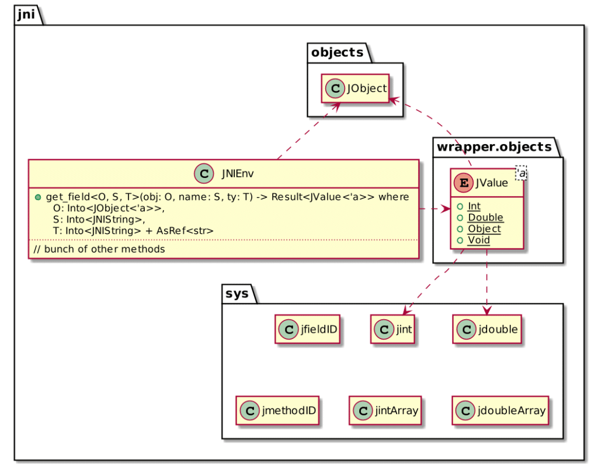

So far, we have learned the basics of Rust syntax, developed a custom Kubernetes controller, and integrated with the front-end with .

This is the 7^th^ post in the in the [Start Rust](https://blog.frankel.ch/focus/start-rust/) series.

* [My first cup of Rust](https://blog.frankel.ch/start-rust/1/)
* [My second cup of Rust](https://blog.frankel.ch/start-rust/2/)
* [The Rustlings exercises - part 1](https://blog.frankel.ch/start-rust/3/)
* [The Rustlings exercises - part 2](https://blog.frankel.ch/start-rust/4/)
* [Rust on the front-end](https://blog.frankel.ch/start-rust/5/)
* [A Rust controller for Kubernetes](https://blog.frankel.ch/start-rust/6/)
* *Rust and the JVM (this post)*

I've been using the for two decades now, mainly in Java. The JVM is a fantastic piece of technology. IMHO, its most significant benefit is its ability to adapt the native code to the current workload; if the workload changes and the native code is not optimal, it will recompile the *bytecode* accordingly.

On the other side, the JVM automatically releases objects from memory when they are not needed anymore. This process is known as *Garbage Collection* . In languages with no , developers have to take care of releasing objects. With legacy languages and within big codebases, releasing was not applied consistently, and bugs found their way in production.

As the ecosystem around the JVM is well developed, it makes sense to develop applications using the JVM and delegate the most memory-sensitive parts to Rust.

Existing alternatives for JVM-Rust integration {#h2-0-existing-alternatives-for-jvm-rust-integration}
-----------------------------------------------------------------------------------------------------

During the research for this article, I found quite a couple of approaches for JVM-Rust integration:

* Asmble:  
  > Asmble is a compiler that compiles WebAssembly code to JVM bytecode. It also contains an interpreter and utilities for working with WASM code from the command line and from JVM languages.
  >
  > -- <https://github.com/cretz/asmble>

  Asmble is released under the MIT License but is not actively maintained (the last commit is from 2 years ago).
* GraalVM:  
  > GraalVM is a high-performance JDK distribution designed to accelerate the execution of applications written in Java and other JVM languages along with support for JavaScript, Ruby, Python, and a number of other popular languages. GraalVM's polyglot capabilities make it possible to mix multiple programming languages in a single application while eliminating foreign language call costs.
  >
  > -- <https://www.graalvm.org/>

  GraalVM allows to run [LLVM bitcode](https://llvm.org/). Rust can compile to LLVM. Hence, [GraalVM can run your Rust-generated LLVM code](https://www.graalvm.org/reference-manual/llvm/Compiling/) along with your Java/Scala/Kotlin/Groovy-generated *bytecode*.
* jni crate:  
  > This crate provides a (mostly) safe way to implement methods in Java using the JNI. Because who wants to *actually* write Java?
  >
  > -- <https://docs.rs/jni/0.19.0/jni/>

  has been **the** way to integrate C/C++ with Java in the past. While it's not the most glamorous approach, it requires no specific platform and is stable. For this reason, I'll describe it in detail in the next section.

Integrating Java and Rust via JNI {#h2-1-integrating-java-and-rust-via-jni}
---------------------------------------------------------------------------

From a bird's eye view, integrating Java and Rust requires the following steps:

1. Create the "skeleton" methods in Java
2. Generate the C headers file from them
3. Implement them in Rust
4. Compile Rust to generate a system library
5. Load the library from the Java program
6. Call the methods defined in the first step. At this point, the library contains the implementation, and the integration is done.

Old-timers will have realized those are the same steps as when you need to integrate with C or C++. It's because they also can generate a system library. Let's have a look at each step in detail.

### Java skeleton methods {#java-skeleton-methods}

We first need to create the Java skeleton methods. In Java, we learn that methods need to have a body unless they are `abstract`. Alternatively, they can be `native`: a native method delegates its implementation to a library.

```java
public native int doubleRust(int input);
```


Next, we need to generate the corresponding C header file. To automate generation, we can leverage the Maven compiler plugin:

```xml
<plugin>
    <artifactId>maven-compiler-plugin</artifactId>
    <version>3.8.1</version>
    <configuration>
        <compilerArgs>
            <arg>-h</arg>                           <!--1-->
            <arg>target/headers</arg>               <!--2-->
        </compilerArgs>
    </configuration>
</plugin>
```


```

```

1. Generate header files...
2. ...in this location

The generated header of the above Java snippet should be the following:

```c
#include <jni.h>

#ifndef _Included_ch_frankel_blog_rust_Main
#define _Included_ch_frankel_blog_rust_Main
#ifdef __cplusplus
extern "C" {
#endif
/*
 * Class:     ch_frankel_blog_rust_Main
 * Method:    doubleRust
 * Signature: (I)I
 */
JNIEXPORT jint JNICALL Java_ch_frankel_blog_rust_Main_doubleRust
  (JNIEnv *, jobject, jint);

#ifdef __cplusplus
}
#endif
#endif
```


### Rust implementation {#h3-3-rust-implementation}

Now, we can start the Rust implementation. Let's create a new project:

```bash
cargo new lib-rust
```


```
[package]
name = "dummymath"
version = "0.1.0"
authors = ["Nicolas Frankel <<a href="/cdn-cgi/l/email-protection" class="__cf_email__" data-cfemail="b0ded9d3dfdcd1c3f0d6c2d1dedbd5dc9ed3d8">[email protected]</a>>"]
edition = "2018"

[dependencies]
jni = "0.19.0"                                     // 1

[lib]
crate_type = ["cdylib"]                            // 2
```


1. Use the `jni` crate
2. Generate a *system* library. Several crate types are available: `cdylib` is for dynamic system libraries that you can load from other languages. You can check all other available types [in the documentation](https://doc.rust-lang.org/reference/linkage.html).

Here's an abridged of the API offered by the crate:



The API maps one-to-one to the generated C code. We can use it accordingly:

```rust
#[no_mangle]
pub extern "system" fn Java_ch_frankel_blog_rust_Main_doubleRust(_env: JNIEnv, _obj: JObject, x: jint) -> jint {
    x * 2
}
```


A lot happens in the above code. Let's detail it.

* The `no_mangle` macro tells the compiler to keep the same function signature in the compiled code. It's crucial as the JVM will use this signature.
* Most of the times, we use `extern` in Rust functions to delegate the implementations to other languages: this is known as . It's the same as we did in Java with `native`. However, Rust also uses `extern` for the opposite, *i.e.*, to make functions callable from other languages.
* The signature itself should precisely mimic the code in the C header, hence the funny-looking name
* Finally, `x` is a `jint`, an alias for `i32`. For the record, here's how Java primitives map to Rust types:

|   Java    |   Native   |  Rust  |
|-----------|------------|--------|
| `boolean` | `jboolean` | `u8`   |
| `char`    | `jchar`    | `u16`  |
| `byte`    | `jbyte`    | `i8`   |
| `short`   | `jshort`   | `i16`  |
| `int`     | `jint`     | `i32`  |
| `long`    | `jlong`    | `i64`  |
| `float`   | `jfloat`   | `f32`  |
| `double`  | `jdouble`  | `f64`  |
|           | `jsize`    | `jint` |

We can now build the project:

```bash
cargo build
```


The build produces a system-dependent library. For example, on OSX, the artifact has a `dylib` extension; on Linux, it will have a `so` one, etc.

### Use the library on the Java side {#h3-4-use-the-library-on-the-java-side}

The final part is to use the generated library on the Java side. It requires first to load it. Two methods are available for this purpose, `System.load(filename)` and `System.loadLibrary(libname)`.

`load()` requires the absolute path to the library, including its extension, *e.g.* , `/path/to/lib.so`. For applications that need to work across systems, that's unpractical. `loadLibrary()` allows you to only pass the library's name - without extension. Beware that libraries are loaded in the location indicated by the `java.library.path` System property.

```java
public class Main {

    static {
        System.loadLibrary("dummymath");
    }
}
```


Note that on Mac OS, the `lib` prefix is **not** part of the library's name.

### Working with objects {#h3-5-working-with-objects}

The above code is pretty simple: it involves a **pure** function, which depends only on its input parameter(s) by definition. Suppose we want to have something a bit more involved. We come up with a new method that multiplies the argument with another one from the object's state:

```java
public class Main {

    private int state;

    public Main(int state) {
        this.state = state;
    }

    public static void main(String[] args) {
        try {
            var arg1 = Integer.parseInt(args[1]);
            var arg2 = Integer.parseInt(args[2]);
            var result = new Main(arg1).timesRust(arg2);                // 1
            System.out.println(arg1 + "x" + arg2 + " = " + result);
        } catch (NumberFormatException e) {
            throw new IllegalArgumentException("Arguments must be ints");
        }
    }

    public native int timesRust(int input);
}
```


1. Should compute `arg1 * arg2`

The `native` method looks precisely the same as above, but its name. Hence, the generated C header also looks the same. The magic needs to happen on the Rust side.

In the pure function, we didn't use the `JNIEnv` and `JObject` parameters: `JObject` represents the Java object, *i.e.* , `Main` and `JNIEnv` allows accessing its data (or behavior).

```rust
#[no_mangle]
pub extern "system" fn Java_ch_frankel_blog_rust_Main_timesRust(env: JNIEnv, obj: JObject, x: jint) -> jint { // 1
    let state = env.get_field(obj, "state", "I");           // 2
    state.unwrap().i().unwrap() * x                         // 3
}
```


1. Same as above
2. Pass the object's reference, the field's name in Java and its type. The type refers to the correct [JVM type signature](https://docs.oracle.com/en/java/javase/11/docs/specs/jni/types.html#type-signatures), *e.g.* `"I"` for `int`.
3. `state` is a `Result<JValue>`. We need to unwrap it to a `JValue`, and then "cast" it to a `Result<jint>` via `i()`

Conclusion {#h2-6-conclusion}
-----------------------------

In this post, we have seen how to call Rust from Java. It involves flagging methods to be delegated as `native`, generating the C header file, and using the `jni` crate. We have only scraped the surface with simple examples: yet, we've laid the road to more complex usages.

The complete source code for this post can be found on [Github](https://github.com/ajavageek/rust-jvm).

**To go further:**

* [Linkage](https://doc.rust-lang.org/reference/linkage.html)
* [keyword extern](https://doc.rust-lang.org/std/keyword.extern.html)
* [Calling Rust Functions from Other Languages](https://doc.rust-lang.org/book/ch19-01-unsafe-rust.html#calling-rust-functions-from-other-languages)
* [JNI Specification](https://docs.oracle.com/en/java/javase/11/docs/specs/jni/)

*Originally published at [A Java Geek](https://blog.frankel.ch/start-rust/7/) on July 18^th^, 2021*

*[JVM]: Java Virtual Machine
*[JNI]: Java Native Interface
*[FFI]: Foreign Function Inteface
*[GC]: Garbage Collection
*[Wasm]: Web Assembly
