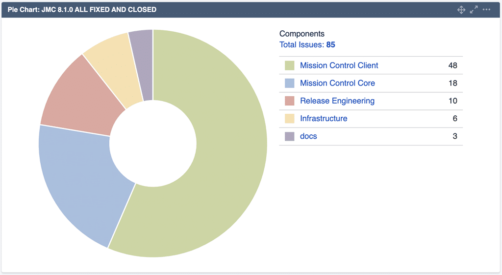
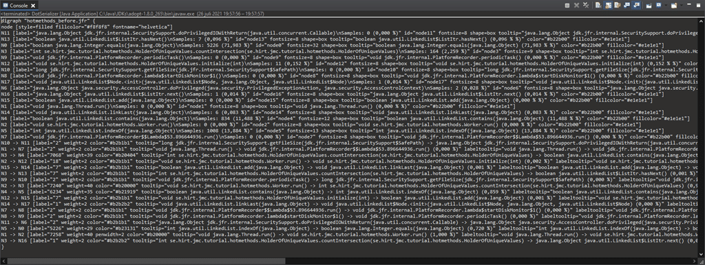
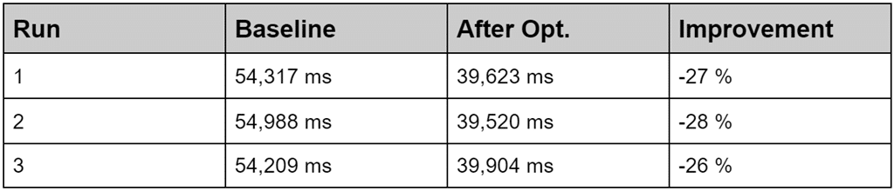
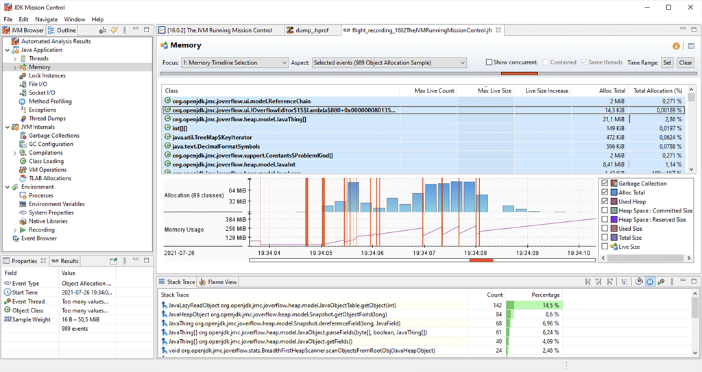
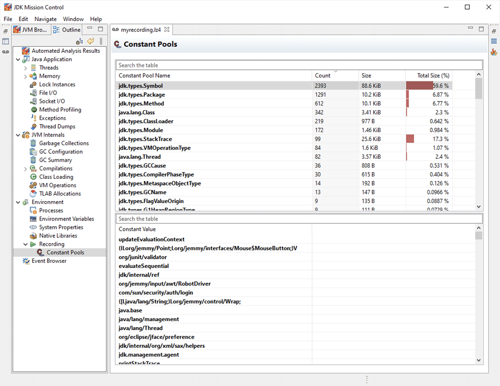
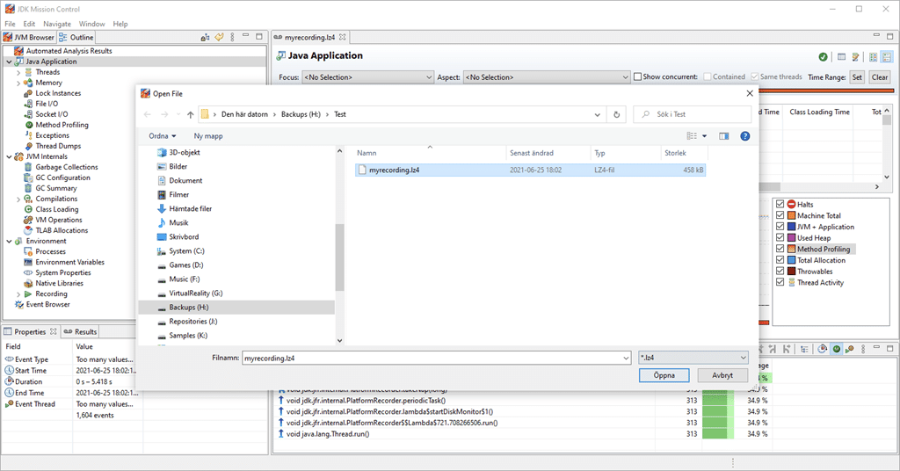
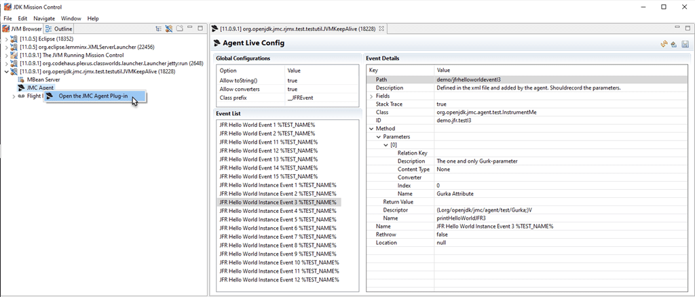

Yay, the latest release of JDK Mission Control was just released!

Since this is the source release, it may still take a bit of time until the downstream vendors release binary builds of JDK Mission Control 8.1.0.

I will try to remember to [tweet](https://twitter.com/hirt) or say something on the [JMC Facebook page](https://www.facebook.com/javamissionctrl) once the binaries start showing up.

Mission Control 8.1 -- New and Noteworthy {#h2-0-mission-control-8-1-new-and-noteworthy}
----------------------------------------------------------------------------------------

### General {#h3-1-general}

**JMC 8.1 -- New Release!**   

This is a new minor release of Java Mission Control. The JMC application will now require JDK 11+ to run, but can still be used with OpenJDK 8u272+ and Oracle JDK 7u40+. It can also still open and visualize flight recordings from JDK 7 and 8.

**Eclipse 4.19 support**   

The Mission Control client is now built to run optimally on Eclipse 2021-03 and later. To install Java Mission Control into Eclipse, go to the update site (Help \| Install New Software...). The URL to the update site will be vendor specific, and some vendors will instead provide an archive with the update site.

**Minor bugfixes and improvements**   

There are more than 80 fixes and improvements in this release. Check out the JMC 8.1 Result Dashboard (https://bugs.openjdk.java.net/secure/Dashboard.jspa?selectPageId=20404) for more information.

### Core {#h3-2-core}

**New Serializers Core Bundle**   

There is now a new core bundle making it easy to serialize flight recording data to DOT (Graphviz) and JSon. This bundle will be expanded upon in future versions.

**Improved JFR parser performance**   

The performance of the JFR parser has been improved. More improvements are coming in 8.2.

#### Java Flight Recorder (JFR)

**Support for the new JDK 16 Allocation Events**   

A new form of light weight allocation profiling was introduced with JDK 16 (see https://bugs.java.com/bugdatabase/view_bug.do?bug_id=JDK-8257602). This version of JMC supports this new type of allocation profiling.

**New Page for Peeking into the Constant Pools**   

There is a new page available for taking a look at what constants are available in the recording. This can, for example, be useful when creating custom events to see where all that storage and memory is being used.

**Open Recordings with .lz4 extension**   

For convenience, files with the .lz4 extension will now be attempted to be opened as flight recordings. This is since lz4 is a common compression to use with flight recordings.

### JMC Agent Plug-in {#h3-3-jmc-agent-plug-in}

**New JMC Agent Plug-in**   

There is now a new agent plug-in available for JMC, which allows configuring where to emit flight recording events in an already running process.

Bug Fixes {#h2-4-bug-fixes}
---------------------------

**Area:** JFR  
**Issue:** [6939](https://bugs.openjdk.java.net/browse/JMC-6939)  
**Synopsis:**Time range indicator update problem fixed

Sometimes the time range indicator wasn't updated when setting the time range. This is now fixed.

**Area:** JFR  
**Issue:** [7007](https://bugs.openjdk.java.net/browse/JMC-7007)  
**Synopsis:**Unable to edit run configurations for eclipse project after installing JMC plugin fixed

Previously it would not be possible to edit run configuration after installing the experimental JMC launcher plug-in. This has now been resolve.

Known Issues {#h2-5-known-issues}
---------------------------------

**Area:** General  
**Issue:** [4270](https://bugs.openjdk.java.net/browse/JMC-4270)  
**Synopsis:**Hibernation and time

After the bugfix of https://bugs.openjdk.java.net/browse/JDK-6523160 in JDK 8, the RuntimeMXBean#getUptime() attribute was re-implemented to mean "Elapsed time of JVM process", whilst it previously was implemented as time since start of the JVM process. The uptime attribute is used by JMC, together with RuntimeMXBean#getStartTime(), to estimate the actual server time. This means that time stamps, as well as remaining time for a flight recording, can be wrong for processes on machines that have been hibernated.

**Area:** JFR  
**Issue:** [7071](https://bugs.openjdk.java.net/browse/JMC-7071)  
**Synopsis:**JMC can't attach to jlinked JVMs

This one is still under investigation, but it seems JMC can't attach to certain jlinked images.

**Area:** JFR  
**Issue:** [7068](https://bugs.openjdk.java.net/browse/JMC-7068)  
**Synopsis:**JfrRecordingTest (uitest) hangs on the automated analysis page

Trying to run uitests on Fedora hangs on JfrRecordingTest.

**Area:** JFR  
**Issue:** [7003](https://bugs.openjdk.java.net/browse/JMC-7003)  
**Synopsis:**The graph and flame graph view does not work on Windows

This is due to a bug with the Edge based browser component in SWT. We'll look into it for 8.2.0.

**Area:** JFR  
**Issue:** [6265](https://bugs.openjdk.java.net/browse/JMC-6265)  
**Synopsis:**JMC crashes with Webkit2+GTK 4

See the issue for more information.

**Area:** JFR  
**Issue:** [5412](https://bugs.openjdk.java.net/browse/JMC-5412)  
**Synopsis:**Dragging and dropping a JFR file into an open analysis page does not work

The expected behaviour would be to open the recording whenever a file is dropped in the editor area, but the behaviour will be defined by the embedded browser component, and not very useful.
