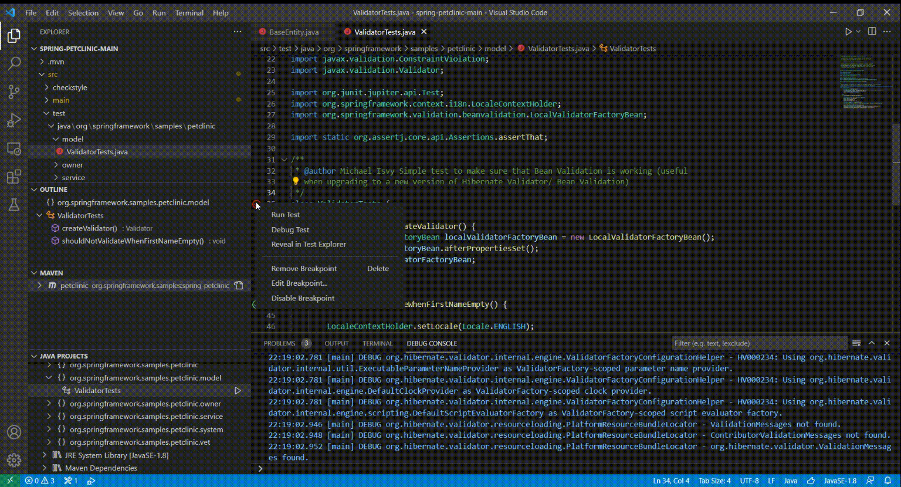
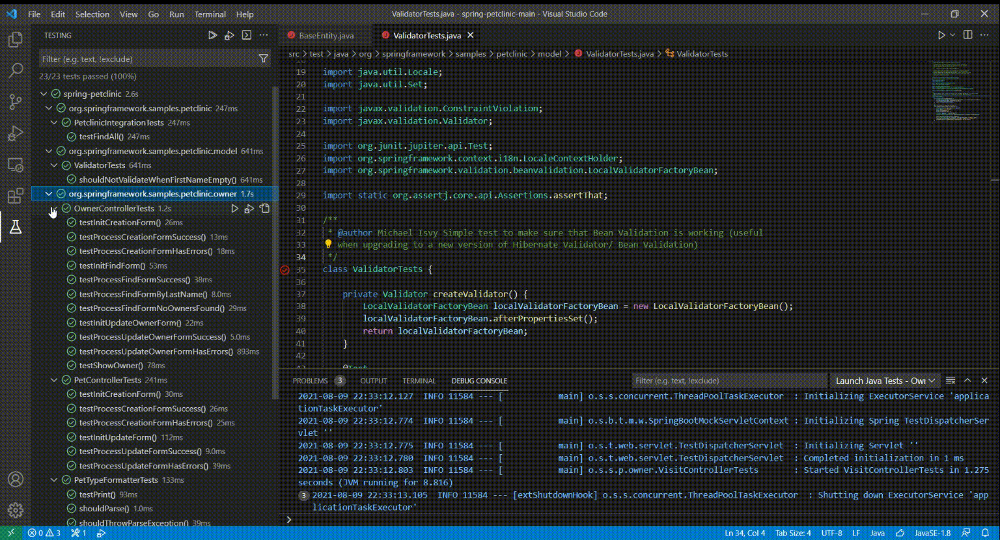
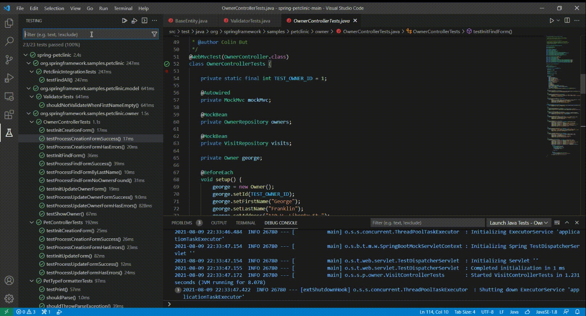
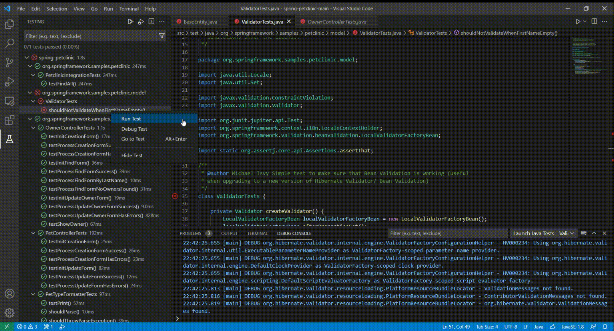

Hi everyone and welcome to the July 2021 edition of the Visual Studio Code Java update!

In this article, we are going to share the progress of our overall product roadmap, and highlight improved user experience of our features for testing, Maven dependency management, and project management.

Our Java extensions are among the first to adopt the [new Testing API](https://code.visualstudio.com/updates/v1_59#_testing-apis "new Testing API") from Visual Studio Code to provide for a better testing experience.

With the recent release of [Visual Studio Code 1.59](https://code.visualstudio.com/updates/v1_59 "Visual Studio Code 1.59"), as well as our [Java Test Runner](https://marketplace.visualstudio.com/items?itemName=vscjava.vscode-java-test "Java Test Runner") extension (included in the [Java Extension pack](https://marketplace.visualstudio.com/items?itemName=vscjava.vscode-java-pack "Java Extension pack")), we have made significant improvements to the Java testing experience in terms of features, capabilities, and ease of use.

Let's look at some key highlights of the new testing extension:

New Testing Decoration
----------------------

Developers now can access a new layout of buttons (Testing Decoration) in the left area of the editor. Those buttons provide easy access to run, debug test cases, or perform other actions.

More options can also be seen by right clicking in the area. Different from Code Lens in the past, the new UI has less interference and noise to developers in the editor area.

More Powerful Test Explorer
---------------------------

The Test Explorer has been completely revamped. Developers can now customize the display mode and sorting order of the testing explorer for different scenarios and habits. Tests can also be directly kicked off from the test explorer.

In addition, the new Testing Explorer has built-in search bar support to help users quickly find target test cases and accelerate development efficiency.

Richer Test Message and Output
------------------------------

By adopting the new Testing API, the developer can now directly see the test execution result directly in the editor area, making it easer to see the errors and stack trace information.

For more detailed information on what Java Test Runner has to offer, please refer to the [official documentation here](https://code.visualstudio.com/docs/java/java-testing "official documentation here")

Maven Dependency Management
---------------------------

In addition to testing, we also have made several improvements on Maven dependency management. In specific, we have improved the interface of the Maven dependency tree to be more user-friendly. Also, we realized that Maven dependency conflict can be tricky to handle. Sometimes Maven might not resolve the conflicts the way we want it to, which could lead to errors when we run the application.

Therefore, we have made some changes in our Maven extension to better visualize how conflicts are being resolved by Maven. For example, we will highlight the conflicts in the Maven POM as errors in the "Problems" tab of the terminal. By clicking on the error, Visual Studio Code will prompt the developer to fix the conflict and select which dependency to be used. The image below demonstrates a case how this helps the developer to quickly resolve a conflict.

Project Management
------------------

Besides testing and dependency management, we have also made improvements to project management related features. In specific, we have fixed a few issues where the project explorer isn't working properly. Here's a list of the enhancement/bug fixes we have done:

* Set the output path explicitly by default when creating project without build tools (Issue [#523](https://github.com/microsoft/vscode-java-dependency/issues/523 "#523"))
* Java Project explorer get expanded unexpectedly when editing (Issue [#502](https://github.com/microsoft/vscode-java-dependency/issues/502 "#502"))
* Can't auto refresh when delete package from Java Project Explorer (Issue [#458](https://github.com/microsoft/vscode-java-dependency/issues/458 "#458"))
* When I save the file, "EXPLORER" will automatically expand and display (Issue [#430](https://github.com/microsoft/vscode-java-dependency/issues/430 "#430"))
* Observe exceptions when opening a file which is not on the classpath (Issue [#494](https://github.com/microsoft/vscode-java-dependency/issues/494 "#494"))

Last month, we s[hared our roadmap for the next few months](https://devblogs.microsoft.com/java/java-on-visual-studio-code-update-june-2021/ "hared our roadmap for the next few months"). In specific, we mentioned several areas as our focus.

* Fundamental Experience Improvement
* Build Tools (**Maven** / Gradle)
* Remote Development / Codespaces Support
* **Testing**
* **Security**
* Debugging (Explore Virtual Thread Support)

As part of the July update, we wanted to give an update on our progress. The items in bold text are things we have made important progress on. In specific, we have made a big step towards improving overall testing API experience as mentioned in earlier section.

We will continue our journey by adding more features such as test coverage in the next few months. In terms of build tools, we have been making improvements on our Maven experience as shown above, and we will continue working on better Gradle support. Last but not least, we have now officially supported the new trusted/untrusted workspace in our Java development environment in Visual Studio Code.

For other items mentioned in the roadmap, we are actively working on those areas and will provide an update when important progress is made

Please don't hesitate to try our product! Your feedback and suggestions are very important to us and will help shape our product in future. There are several ways to leave us feedback

* Leave your comment on this blog post
* [Open an issue](https://github.com/microsoft/vscode-java-pack/issues/new/choose "Open an issue ")on our GitHub Issues page

Here is a list of links that are helpful to learn Java on Visual Studio Code.

* Learn more about Java on [Visual Studio Code.](https://code.visualstudio.com/docs/languages/java "Visual Studio Code.")
