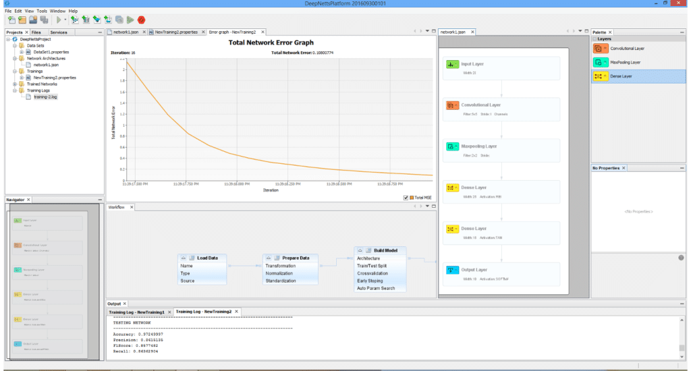
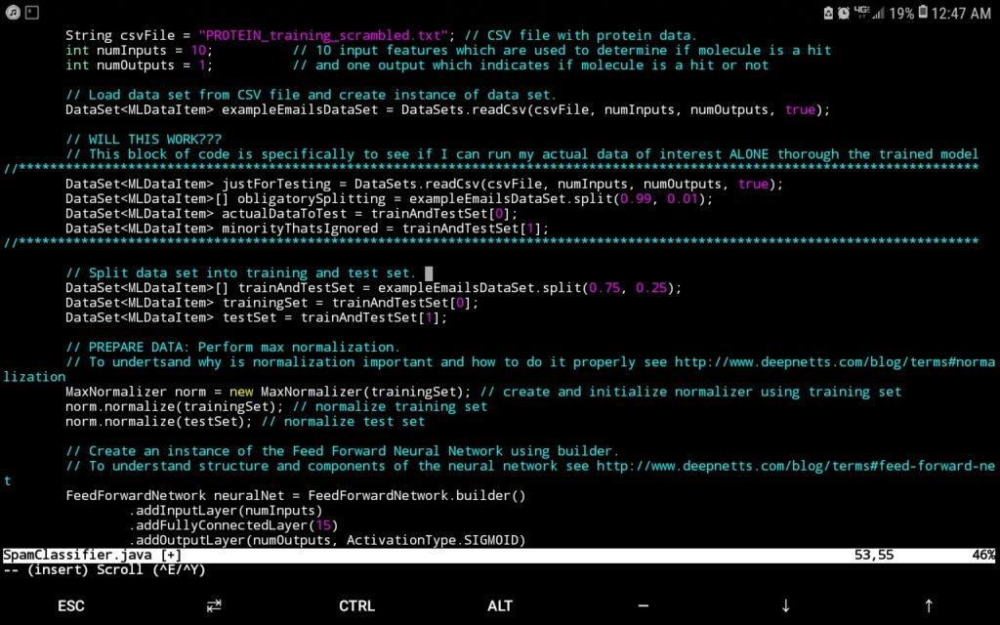

In the age of big-data, rising pharmaceutical costs, and an ever-increasing market demand, it is becoming apparent that drug design strategies need to adapt in order to meet patients' therapeutic needs for a host of medical conditions.

Costly and time-intensive experimental work is one of the main bottlenecks in the drug discovery pipeline, which can take up to a decade, while experiencing a failure profile of up to 95% before a molecular candidate can be approved for patient use.

Yet at the same time, such experimental throughput has opened the door to leverage the power of emerging technologies such as artificial intelligence to potentially expedite the drug discovery process and even increase the success rate of identifying breakthrough compounds. This accumulation of such massive experimental data has resulted in a big-data scenario that is ripe for harvest in the artificial intelligence arena.

Labs, especially those with a purely experimental focus, might understandably feel overwhelmed with not knowing what to do with all this accumulated data, but this highlights the need for having big-data analytics professionals on hand along with flexible tools that can analyze such data. This in turn can help point researchers in the direction they need to go that will most likely be productive.

High-Throughput Screening
-------------------------

One such scenario can be found in experimental high-throughput screening (HTS) campaigns where tens of thousands of data points can be generated in one experimental session. Such data is mostly already properly curated insofar as having the appropriate controls and experimental conditions guaranteed and being in a consistent format, which can be an issue when attempting to compare many data points across different experiments.

This consequently makes HTS data extremely attractive for a computational data-analytics campaign to identify features in the data that drive a favourable signal.

Presently, I am doing ongoing work analyzing such data for an HTS screen that seeks to identify particular molecular species from a compound library that effect a favourable signal, such signals that lie within a certain range indicate a molecular candidate from the compound library that effects a desired protein conformational change, i.e., a hit.

Java and Deep Netts as Data-Analytics Engine
--------------------------------------------

The data-analytics engine that has proven extremely useful for this endeavour is [Deep Netts](https://www.deepnetts.com/)®, a deep learning suite written in Java, with the help of Apache NetBeans for its infrastructure and JFreeChart for graphing, which has the benefit of running purely off of the Java Virtual Machine (JVM) without the hassle of relying on native libraries, which can make obtaining deep learning software for unique hardware architectures and operating systems next to impossible, a consideration rendered moot by Deep Nett's® complete harmony with the JVM:

 

In addition to architecture independence, Deep Netts® has also afforded my research the flexibility of finetuning the hyperparameters that best suit the nature of the data in order to maximize model prediction accuracy.

This is especially useful since documenting hyperparameter values can provide valuable insight into the computational conditions most appropriate for a given experimental method, in this case, HTS. A tantalizing research question would be to investigate if hyperparameter values depend on the experimental phenomena probed for a given protein if the specific experimental physics that yields the data changes, while the protein and molecular candidates don't.

Freedom from Quantitative Structure Activity Relationship Input
---------------------------------------------------------------

Though perhaps one of the most appealing abilities that DeepNetts® has to contribute is its freedom from quantitative structure activity relationship (QSAR) input as an obligatory predictor variable.

Although extremely useful in considering molecular characteristics as part of a data analytics campaign, there are situations where obtaining structural information such as in the form of the simplified molecular-input line-entry system (SMILES) is extremely challenging.

This is of particular concern especially for thousands of molecule data points that might not be registered in databases such as ChEMBL (or the lab might have them listed by more esoteric names not used in such databases). In such cases, being able to carry out a deep learning analysis of the data using physical and chemical properties already provided as part of the compound library can prove an invaluable supplement or even alternative to QSAR.

This has already shown itself to be a relevant consideration in my current work. These technical factors are further augmented by the prompt and knowledgeable support by Deep Netts® personnel in tailoring the code to best analyze the data as well as in answering specific questions about deep learning theory, the enterprise edition particularly highlights these perks, though there is a free community edition.

It is for these reasons that I see tremendous potential for this suite in the drug discovery pipeline and why I feel it is necessary to share Deep Netts'® existence with the scientific community. As a Java developer, I have especially come to appreciate having a tool in my language that I could immediately use out of the box and not have to add on weeks, or even months, of training in order to become proficient in another language in order to use other deep learning suites, that, and worrying about architecture compatibility for native dependencies.

COVID-19 and Deep Netts
-----------------------

Now is the time to leverage all the power of deep learning and data-analytics to address health concerns at the molecular level. With an international public health crisis, such as the ongoing COVID-19 pandemic ravaging the planet - which has already claimed 4.27 million lives as of the time of this writing - it is absolutely crucial that a powerful tool such as Deep Netts® be used to its fullest in order to speed up the search for cures and treatments for the ever-increasing list of pathologies that afflict humanity.

If interested in seeing how Deep Netts® can benefit your research, please visit: <https://www.deepnetts.com/>

Original article by Oscar Bastidas Ph.D. on LinkedIn: <https://www.linkedin.com/pulse/deep-learning-drug-discovery-new-frontier-oscar-bastidas/>
