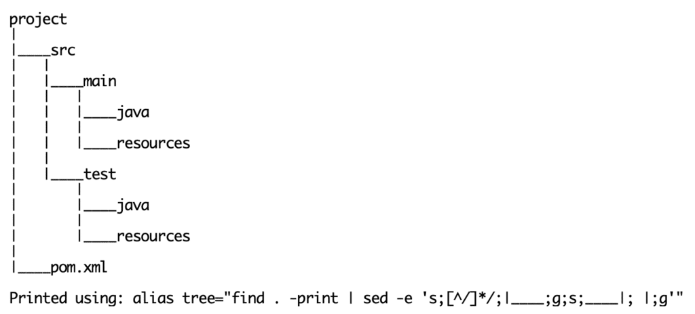

Apache Maven (commonly referred to as "Maven") is a **Build Management** tool. Maven is primarily used to build Java projects. Other language projects can also be built using Maven. Apache Maven is written in Java, for the most part. It is [an open source project](https://maven.apache.org/).

Maven follows a **convention-over-configuration** philosophy. More on this follows.

### Why is Maven a Build Management tool?

Maven aims at achieving the following for a project:

* build tooling
* version management
* re-usability
* maintainability
* comprehensibility
* inheritance

In addition, maven provides capabilities for a project to :

* produce different build targets and results builds via profiles
* test code
* generate documentation
* furnish metrics and reports
* deploy built artifacts

### What is Convention-Over-Configuration?

[Convention-over-configuration](https://en.wikipedia.org/wiki/Convention_over_configuration) is a software paradigm. The main intent of such a paradigm is to reduce the number of superfluous decisions required by a developer to build her/his project. The paradigm aims to meet and satisfy the "*[principle of least astonishment](https://en.wikipedia.org/wiki/Principle_of_least_astonishment)*".

#### Apache Maven -- convention over configuration

Apache Maven provides sensible defaults for a project's build management. A developer can then choose to override any preset defaults.

An **example of such** is clear in the conventional directory structure of a Maven project:

In this directory structure, the source code is, by convention located under the project root directory in a `src` directory.

Under the `src` directory there exists a `main` directory that is, by convention expected to contain *production* code, that is, code that is expected to be a part of the final executable.

Parallel to the `main` directory, there is a `test` directory, where *test* code is expected, by convention. Java code, once again, by convention (I think by now the point is made, will stop referring to it) exists in a `java` directory either in the *production* or in the *test* location.

Similarly *resources* needed for *production* or *test* outputs, reside respectively in the `resources` directory.

This is just one example. Maven uses the convention-over-configuration philosophy in many other areas.

### What are some Maven capabilities?

A few features that maven offers (this is not a comprehensive list):

* Validate the project structure
* Auto generate any code/resources needed by the project
* Generate any documentation
* Compile source code, display errors / warnings
* Test the project based on existing tests
* Package compiled code into artifacts (examples include `.jar`, `.war`, `.ear`, `.zip` archives and many more)
* Package source code into downloadable archives / artifacts
* Install packaged artifacts on to a server for deployment or into a repository for distribution
* Generate site reports and test evidence
* Report a build as success or failure
* . . .

### How does Maven work?

Maven uses a **Project Object Model (POM)** to manage a project.

Maven commands execute parts of its Project Object Model.

A Project Object Model is *usually* described as an XML document. A POM description is NOT limited to XML. Other formats can be used to describe the Project Object Model, however, XML was the first format used.

A picture to illustrate a typical maven execution:
 Maven -- A pictorial overview

The next article in this series will dig into details of a Project Object Model (POM). [Have fun with Apache Maven!](https://maven.apache.org/)
