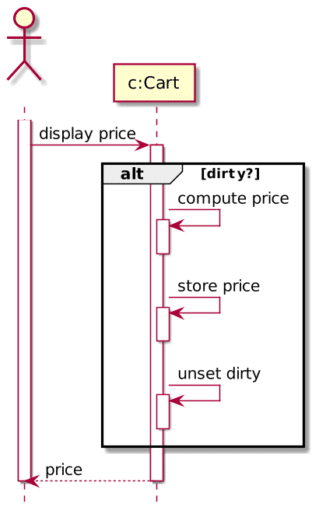

In [a recent article here on Foojay](https://foojay.io/today/real-world-stream-collector/), on a real world stream collector, I described the use-case of an e-commerce shop.

In general, interactions in such a shop are the following:

* You can browse a catalog of items
* Each item has a price tag
* You can put x items in your cart

This is where the exciting part starts.

On most pages, you want to give users a condensed view of their cart's state.

Here are a couple of options for the state's view:

1. Empty/non-empty
2. Number of cart lines
3. Number of items
4. Total cost. In demos, it's as simple as the sum of each cart line which amounts to the item's price times the quantity; in real life, there will be discounts, get X for Y, etc.

All the above views consist of derived values. The question is now, when would you compute it? There are two general approaches:

* **eagerly** ,*i.e.*, every time you change the cart (by adding, updating, or removing a cart line)
* or **on-demand** ,*i.e.*, only when you display the condensed view

The benefit of eager computations is that the derived value is always synchronized with the source of truth. It's a good fit when the computation is cheap, such as the empty or number of cart lines views above. On the implementation side, the cart has one additional read-only field that stores the derived value.

On the opposite side, on-demand is adapted to expensive computations, such as the total cost view above. Because the computation is executed on access, the implementation doesn't need a property to store the value.

For our use-case above, computation is expensive. On-demand means that every page access/refresh will trigger the computation, even when the cart hasn't changed. It looks like eager computation would be the way to go.

Now, let's throw the proverbial monkey wrench in the works. Imagine two clients: the mobile client only displays the empty/non-empty state for space reasons, and the regular web app displays the cart total. In this case, choosing eager price computation is overkill, as it's useless for mobile clients.

You could solve this issue in the view layer. Yet, there's another option. The idea is to add the computed value as in the eager approach but only trigger the computation when you need to access its result. The implementation relies on two properties: a `result` read-only property (the cost in our e-commerce shop) and a `dirty` internal flag.

The flow is the following. When the cart is updated, set `dirty` to `true`.

When you need to display the cost:

 

The only con is more complex logic.

It's precisely how JDK developers handled the legacy mutable `java.util.Calendar` class. Check the `complete()` method [source code](https://github.com/openjdk-mirror/jdk7u-jdk/blob/master/src/share/classes/java/util/Calendar.java#L1555-L1563) for more details.

*Originally published at [A Java Geek](https://blog.frankel.ch/timely-computation-derived-values/) on May 16^th^, 2021*
