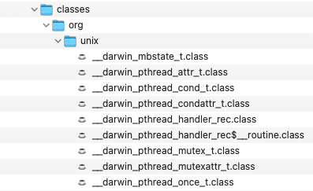
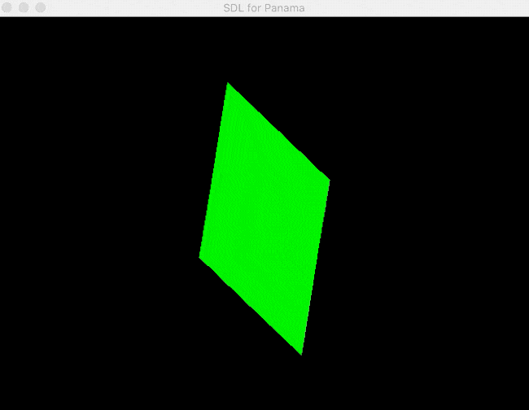

**Updated December 31, 2025:** This article now features Java 25 and the Foreign Function \& Memory (FFM) API, which has been a standard feature since JDK 22 ([JEP-454](https://openjdk.java.net/jeps/454)).

<figure class="wp-block-image size-full is-resized is-style-default">
 
 <figcaption class="wp-element-caption">
  Panama for newbies Part 3
 </figcaption>
</figure>

Introduction {#h2-0-introduction}
---------------------------------

Welcome to the third part of the series on Java's Project Panama for newbies. Before jumping into this article, I want to congratulate you for getting this far, you deserve a virtual pat on the back!

If you are new please check out [Part 1](https://foojay.io/today/project-panama-for-newbies-part-1/) and [Part 2](https://foojay.io/today/project-panama-for-newbies-part-2/). In Part 3, we are going to dig a little deeper in our exploration of Project Panama and how to talk to third party libraries such as SDL \& OpenGL. With the skills you've learned from Part 1 and Part 2, you should be able to call most of the common function signatures in many libraries out in the wild.

Listed below is a recap of C concept fundamentals from Part 1 and Part 2:

* Primitive data types
* C Strings
* C Arrays
* C Structs
* C Pointers to primitives and structs
* Array of C structs

To see the source code for all the examples in **Part 1 - 4** go to GitHub at: [](https://github.com/carldea/panama4newbies)<https://github.com/carldea/panama4newbies>

**Note:** To see the prior code examples of this article using JEP 412 go to the branch [here](https://github.com/carldea/panama4newbies/tree/jdk17-jep412/part01).

**Do we know enough to call a C function?**

Remember in the field of computer science, **it depends** . You could say **it's never enough** and on the other hand, you could say **it's good enough**(at the moment). Patience is key, you can't learn everything right now and what you need to learn will often take time (patience) to explore with any given C library.

Rest assured I believe you know enough to call many 3rd party libraries (maybe?). Assuming the C libraries are mature, the APIs are likely straightforward and decently documented.

**Oh, wait there's more to know**!

Before diving deeper into calling 3rd party libraries, I want to talk about `MethodHandle`s. In [Part 2](https://foojay.io/today/project-panama-for-newbies-part-2/) we talked about `VarHandle`s to access data stored as ValueLayouts and MemoryLayouts in a low-level way, in the next section we will explore `MethodHandle`s to also access C functions in a low-level way. This is yet another tool to add to your arsenal that will upgrade your abilities to talk to native libraries.

**Note:** Throughout this article when referencing the word *function* I'm referring to C functions and when referencing the word *method* it's a Java class or object's function (member).

What is a `MethodHandle`? {#h2-1-what-is-a-methodhandle}
--------------------------------------------------------

By now you should be familiar with `jextract` but have you ever thought about the generated source code it creates? When examining the generated source code you will notice low-level Java (Panama) code using the object `MethodHandle` to make native invocations.

According to the Javadoc documentation it states the following:
> **A method handle is a typed, directly executable reference to an underlying method, constructor, field, or similar low-level operation, with optional transformations of arguments or return values. These transformations are quite general, and include such patterns as conversion, insertion, deletion, and substitution.**
> Javadoc documentation [Since JDK 7](https://docs.oracle.com/javase/8/docs/api/java/lang/invoke/MethodHandle.html)

A method handle is essentially a Java object that references a native C function, variable, etc. in memory and the ability to invoke or access **symbols** from Java code. In the C/C++ world symbols are a unique lookup of C functions and variables from the C linker (library in memory).

In C the compiler has an object linker step where symbols are organized in a modular (object files) way before finally creating an executable (or linked library). This concept is very similar to Java's jar files where classes are available on the classpath. In Panama you can access C symbols in two places:

* Default symbols area - Symbols loaded from the platform OS and Ansi-C functions.
  * `Linker.nativeLinker().defaultLookup().findOrThrow(``"some symbol name"``)`  
* Symbol Lookup area - 3rd party libraries added to the `java.library.path` or dynamically loaded into the `SymbolLookup`.
  * `SymbolLookup.loaderLookup().findOrThrow("some symbol name")`

Below is how to obtain the symbol (C function) `getpid()`. The call to `findOrThrow()` returns a `MemorySegment`.

```java
// 1. Obtain linker
var linker = Linker.nativeLinker();

// 2. Obtaining symbol lookup from two places.
SymbolLookup stdlibLookup = SymbolLookup.loaderLookup()
        .or(linker.defaultLookup());

// 3. Obtain symbol
MemorySegment getpidSymbol = stdlibLookup.findOrThrow("getpid");
```


Now that we can obtain the symbol let's create a `MethodHandle` to access the system C function `getpid()` that typically is used to obtain a running application's process ID.

Get Pid from a C perspective {#h2-2-get-pid-from-a-c-perspective}
-----------------------------------------------------------------

Getting the Pid via `getpid()` is a system level C function to obtain a **process id** number on Unix/Linux based operating systems.

### C Function getpid() {#h3-3-c-function-getpid}

Let's examine the `getpid()` function's definition as shown below.

```c
#include <sys/types.h>
#include <unistd.h>

pid_t getpid(void);
```


Notice the header `sys/types.h` and `unistd.h` which contains the system's data type `pid_t` and a function `getpid(void)` respectively. Let's look at what exactly is a `pid_t` data type and a `void` parameter.

### C's typedef and void parameter {#h3-4-c-s-typedef-and-void-parameter}

When looking at the function signiture above you're probably wondering what is a `pid_t` return type? In C (the language) there is a keyword called `typedef` (Type definition) that lets you create custom data types. For example, you could create a type called `human_age_t` of primitive data type byte (0-255). In this scenario the user of the API would use the custom type never needing to know the underlying type (byte).

In regards to the type `pid_t` you can examine closer by looking inside of the C header file `sys/types.h`. Inside you'll see the `typedef` `pid_t` defined as an unsigned C `int` type. While it's safe to say it is a C `int` it can vary depending on the platform such as a 16 or 32 bit integer. On Mac/Windows/Linux it is a type C `int`(32 bit).

Next lets look at what is a void parameter. In the definition you'll notice the `getpid(void)` function parameter signiture is a type **void**. This means there are no parameters to pass into the function.

### Let's create a MethodHandle {#h3-5-let-s-create-a-methodhandle}

To invoke the function `getpid(void)` we first need to create a `MethodHandle` instance via `Linker`'s [downcallHandle()](https://download.java.net/java/early_access/panama/docs/api/jdk.incubator.foreign/jdk/incubator/foreign/CLinker.html#downcallHandle(jdk.incubator.foreign.Addressable,jdk.incubator.foreign.SegmentAllocator,java.lang.invoke.MethodType,jdk.incubator.foreign.FunctionDescriptor)) method as shown below:

```java
import java.lang.foreign.Linker;

MethodHandle downcallHandle(MemorySegment symbolMemSeg,
                            FunctionDescriptor functionDescr,
                            Option... options);
```


<br />

```
MethodHandle getpidMethodHandle = linker.downcallHandle(getpidSymbol, funcDef);
```


**Note:** Because the `getpid(void)` function signature has no parameters to be passed in and there for there is no need to pass in `Linker.Option` objects to the downcallHandle() 's third argument.

The following are descriptions of each parameter for the `downcallHandle()` method.

* **[MemorySegment](https://docs.oracle.com/en/java/javase/25/docs/api/java.base/java/lang/foreign/MemorySegment.html)** symbolMemSeg - `Linker.nativeLinker().defaultLookup()``.findOrThrow("some symbol");` contains all symbols of system library such as functions, variables, structs, etc. Dynamically loaded libraries or 3rd party libraries can be looked up by using the following: `SymbolLookup.loaderLookup().``findOrThrow``("some symbol name")`

**Note:** When initializing a C pointer to `NULL` you can use the `MemoryAddress.NULL` value.

* **[FunctionDescriptor](https://download.java.net/java/early_access/panama/docs/api/jdk.incubator.foreign/jdk/incubator/foreign/FunctionDescriptor.html)** `functionDescr` - A function descriptor is made up of zero or more argument layouts and zero or one return layout. A function descriptor is used to model the signature of foreign functions. Unless otherwise specified, passing a `null` argument, or an array argument containing one or more `null` elements to a method in this class causes a [`NullPointerException`](https://download.java.net/java/early_access/panama/docs/api/java.base/java/lang/NullPointerException.html) to be thrown. More on predefined and jextract generated memory layouts.   
* [Linker.Option](https://docs.oracle.com/en/java/javase/25/docs/api/java.base/java/lang/foreign/Linker.Option.html) `options` - Variable arguments of `Linker.Option` objects -*the linker options associated with this linkage request*.

### MemoryLayouts/ValueLayouts {#h3-6-memorylayouts-valuelayouts}

Like we've seen in Part 1 all C datatypes can be of type [ValueLayout](https://download.java.net/java/early_access/jdk19/docs/api/java.base/java/lang/foreign/ValueLayout.html)`.OfXxx` or other types of [`MemoryLayout`](https://download.java.net/java/early_access/jdk19/docs/api/java.base/java/lang/foreign/MemoryLayout.html) objects (`ValueLayout` inherits from `MemoryLayout`). Static instances of C primitive type are already defined as `ValueLayout`s in the `Linker` class such as [JAVA_INT](https://download.java.net/java/early_access/jdk19/docs/api/java.base/java/lang/foreign/ValueLayout.html#JAVA_INT), [JAVA_LONG](https://download.java.net/java/early_access/jdk19/docs/api/java.base/java/lang/foreign/ValueLayout.html#JAVA_LONG), [ADDRESS](https://download.java.net/java/early_access/jdk19/docs/api/java.base/java/lang/foreign/ValueLayout.html#JAVA_ADDRESS) etc.   

And when using jextract it will create the following: `C_INT`, `C_LONG`, `C_POINTER` etc. to represent layouts that map specific to the native C primitives. If you aren't using jextract you can use the value layouts mention above. To create a `FunctionDescriptor` you will call the static `of()` method as shown below:

```java
import java.lang.foreign.FunctionDescriptor;

public static FunctionDescriptor of(MemoryLayout returnLayout, MemoryLayout... argLayouts) 
public static FunctionDescriptor ofVoid(MemoryLayout... argLayouts) // void return function signature
```


Now that you know how to lookup symbols and describe method signitures let's invoke the `getpid()` function using a `MethodHandle`.

### Java calling the C function getpid() {#h3-7-java-calling-the-c-function-getpid}

The following code will invoke the native C function `getpid()` via a MethodHandle and a jextract generated

```java
var cLinker = Linker.nativeLinker();

SymbolLookup stdlibLookup = SymbolLookup.loaderLookup()
        .or(cLinker.defaultLookup());

// 3. Obtain symbol
MemorySegment getpidSymbol = stdlibLookup.findOrThrow("getpid");

// Using a MethodHandle
MethodHandle getpidMH = cLinker.downcallHandle(getpidSymbol, FunctionDescriptor.of(JAVA_INT));

int pid	= (int) getpidMH.invokeExact();
System.out.printf("MethodHandle calling getpid() (%d)\n", pid);

// Using Jextract's getpid method.
int jextractPid = foo_h.getpid();
System.out.printf("Jextract's calling getpid()   (%d)\n", jextractPid);
```


In the above code listing it does the following:

1. Creates a Arena (SegmentAllocator)
2. Creates a MethodHandle
   * Find the symbol `getpid` (function)
   * Allocates memory reference
   * Describe the function's return type for Java interaction
   * Describe the function's return type (`MemoryLayout`) for C interaction
3. Invoke method handle getpidMH, cast to an int.
4. Output Pid

Outputs the following:

```
MethodHandle calling getpid() (16514)
```


Of course if you use the `jextract` tool the `getpid() `method would only be a one liner like the following code snippet:

```java
// Using Jextract's getpid method.
int jextractPid = foolib.getpid();
System.out.printf("Calling getpid()   (%d)\n", jextractPid);
```


Now that you know how to call functions in a low-level way using MethodHandles we will be switching gears a bit, by going back to using the `jextract` tool to generate C functions. This will be neccesary as we approach more complex C functions ahead.

Let's kick it up a notch with little more advanced C function `localtime_r()` defined in the header file `Time.h`.

Time.h {#h2-8-time-h}
---------------------

Similar to Java's `java.util.Date` or `System.currentTimeMillis()`, the local time or some refer to epoch time in milliseconds since 1970. The C function `localtime_r()`, will be expecting seconds instead of milliseconds.

Shown below is the C function signiture `localtime_r()` from `Time.h`.

```c
struct tm *localtime_r( const time_t * epochSeconds, struct tm * tmStruct );
```


As you can see, the function signature takes a pointer to a `time_t` and a pointer to a struct `tm`. It looks very complex to mimic by using a `MethodHandle`, so let's use jextract!

### Using jextract on multiple header files {#h3-9-using-jextract-on-multiple-header-files}

Before using `jextract` on the `Time.h` header file, you might be wondering how to use multiple header files. Since `jextract` can only work with **one header file** at a time we encountered compilation issues when generating one header file at a time having the same package namespace.

The architects and engineers on the Panama mailing list suggested a nice **workaround** . They suggested we create a header file with the multiple header includes. That way jextract can point to a single file as shown below in a file named `foo.h`:

An header file `foo.h` that contains multiple header includes as shown below:

```c
#include <stdio.h>
#include <time.h>
```


Next, you'll run `jextract` against `foo.h` to generate source code and/or classes.

### Jextract foo.h {#h3-10-jextract-foo-h}

The following `jextract` command line statement will generate source code in the directory **generated/src** with a package namespace of `org.unix` with system includes on your preferred platform.

```
$ jextract --output src \
   -t org.unix \
   -I /Applications/Xcode.app/Contents/Developer/Platforms/MacOSX.platform/Developer/SDKs/MacOSX.sdk/usr/include \
   foo.h
```


The next step is the same as before but instead of generating source code `jextract` will generate class files. You can compile the generated/src directory but the statement below generates files automatically. Notice the absence of the source (`--source`) option and output destination option set to classes (`-d classes`).

```
$ jextract \
   --output classes \
   -t org.unix \
   -I /Applications/Xcode.app/Contents/Developer/Platforms/MacOSX.platform/Developer/SDKs/MacOSX.sdk/usr/include \
   foo.h
```


<figure class="wp-block-image size-full is-resized is-style-default">
 
 <figcaption class="wp-element-caption">
  Generated class files from jextract
 </figcaption>
</figure>

Now that you have generated the classes you can use the available convenience methods.

### Calling the generated methods {#h3-11-calling-the-generated-methods}

After `jextract` the classes `foo_h`, `tm` and others contain all of the generated objects and methods that represent its C counter parts we can begin allocating objects and invoking native functions. Below is an excerpt of main a few objects and methods we are going to be using to invoke the C `localtime_r()` function:

```java
/* foo_h.class */

// time_t data type
public static OfLong time_t = Constants$root.C_LONG_LONG$LAYOUT;

// Access to C's localtime_r() function
public static MemoryAddress localtime_r ( Addressable x0,  
                                          Addressable x1 )

/* tm.class */

// tm is a C struct with an allocate method to create space
// by instantiating a MemorySegment (pointer to tm struct)
// struct tm 
public static MemorySegment allocate(SegmentAllocator allocator)

// tm struct (MemoryLayout)
public class tm {
    static final  GroupLayout $struct$LAYOUT = MemoryLayout.structLayout(
        Constants$root.C_INT$LAYOUT.withName("tm_sec"),
        Constants$root.C_INT$LAYOUT.withName("tm_min"),
        Constants$root.C_INT$LAYOUT.withName("tm_hour"),
    // ... the rest

// struct getters
public static int tm_sec$get(MemorySegment seg)
public static int tm_min$get(MemorySegment seg)
public static int tm_hour$get(MemorySegment seg)

// asctime function
public static MemoryAddress asctime ( Addressable x0)
```


### Invoking localtime_r() function {#h3-12-invoking-localtime-r-function}

The code listing (`PanamaTime.java`) below will demonstrate how to call the `localtime_r()` function by allocating variables (`MemorySegment`), invoking functions and populate objects(structs). To see the full source code listing visit [here](https://github.com/carldea/panama4newbies/blob/main/part03/src/PanamaTime.java).

```java
/* PanamaTime.java */

// The variable now of type MemorySegment holds a C long type. The allocate method will create space.
// time_t * (clong seconds since epoch) probable type is from a typedef long time_t; (64 bit)

// Populate now variable with a Java epoch seconds. C long
var now = arena.allocate(C_LONG, System.currentTimeMillis() / 1000);

// Equivalent because time_t is a C_LONG
var now2 = arena.allocate(time_t);

// Get contents of now (java epoch seconds)
long secondsSinceEpoch1 = now.get(C_LONG, 0);

// Populate now2 with (C's epoch seconds) and returns as a Java long.
long secondsSinceEpoch2 = time(now2);

// Get contents of now2 (C's epoch seconds) return as a Java long.
long secondsSinceEpoch3 = now2.get(C_LONG, 0);

assert secondsSinceEpoch1 == secondsSinceEpoch2 && secondsSinceEpoch2 == secondsSinceEpoch3;

// Grab epoch time in seconds, then convert to milliseconds.
System.out.printf("1. Java DateTime from C time function: %s\n", new Date(secondsSinceEpoch2 * 1000));

// tm is a C struct with an allocate method to create space
// by instantiating a MemorySegment (pointer to tm struct)
// struct tm *
MemorySegment pTmStruct = tm.allocate(arena);

// Calling the C function localtime_r(now, time); now contains seconds, and time is a blank struct.
// [ptr to struct]        [ptr to time_t           ]   [ptr to tm struct     ]
// struct tm *localtime_r( const time_t * epochSeconds, struct tm * tmStruct );
localtime_r(now2, pTmStruct);

// obtaining values based the offset into the tm struct.
var seconds = pTmStruct.get(C_INT, 0);
var minutes = pTmStruct.get(C_INT, 4);
var hours = pTmStruct.get(C_INT, 8);

var cString = memorySession.allocateUtf8String("2. C's printf & tm Struct of local time. %02d:%02d:%02d\n");
printf(cString, hours, minutes, seconds);
fflush(NULL());

// Obtaining values based on the tm struct from jextract
System.out.printf("3. C's tm struct getters tm_hour, tm_min, tm_sec. %02d:%02d:%02d\n",
        tm.tm_hour(pTmStruct), tm.tm_min(pTmStruct), tm.tm_sec(pTmStruct));

// Call time.h asctime() function to display date time.
printf(memorySession.allocateUtf8String("4. C's asctime() function to display date time: %s\n"), asctime(pTmStruct));
```


### How does it work? {#h3-13-how-does-it-work}

The code listing above performs the following steps:

1.) Allocate space for a `C_LONG_LONG` 64 Bits (`time_t`),

    static final  OfLong C_LONG_LONG$LAYOUT= JAVA_LONG.withBitAlignment(64); // OfLong extends ValueLayout

<br />

2.) Invoke `time()` to populate the `MemorySegment` object **now** that will contain the epoch time in **seconds**   

3.) Allocate space and a pointer for a struct `tm`.  

4.) Invoke `localtime_r(now, pTmStruct)` to populate struct  

5.) Use pointer offsets from struct to obtain seconds, minutes, and hours values as MemorySegments.  

6.) Output values as references from values  

7.) Output using Java's `printf()` and obtaining seconds, minutes, and hours via method handles  

8.) Invoke `asctime()` function to return a Cstring to be outputted via C's `printf()`

### Running PanamaTime.java {#h3-14-running-panamatime-java}

On the command line enter the following to run the `PanamaTime.java` program.

```
$ java -cp .:classes \
    --enable-native-access=ALL-UNNAMED \
    --enable-preview --source 19 \
    src/PanamaTime.java
```


Running `PanamaTime.java` outputs the following:

```
1. C's printf & tm Struct of local time. 03:35:36
2. C's tm struct getters tm_hour, tm_min, tm_sec. 03:35:36
3. C's asctime() function to display date time: Mon Aug 30 03:35:36 2021
```


Now that you have some experience calling system level C functions it's time to look at a third party library. Popular among game developers are SDL and OpenGL API.

A complete program using the SDL (Simple DirectMedia Layer) API {#h2-15-a-complete-program-using-the-sdl-simple-directmedia-layer-api}
--------------------------------------------------------------------------------------------------------------------------------------

Until now, most of the example in this series have been about single utility function, but we have now all building block to to make use of a complete C API. This section will feature a program written with the [SDL2](https://www.libsdl.org/) library. SDL is a cross-platform development library designed to provide low level access to audio, keyboard, mouse, joystick, and graphics hardware via OpenGL.

In this section I'll be relying on the C++ code of this [SDL and OpenGL tutorial](https://lazyfoo.net/tutorials/SDL/50_SDL_and_opengl_2/index.php), this tutorial covers the basics of these APIs, and links to other materials for people thatwould like to explore SDL and OpenGL further.

The first thing needed is to install the libraries, on Linux `freeglut3-dev` and `libdl2-dev`, on macOs XCode and SDL2 library. On macOs let's assume SDL is installed with *[homebrew](https://brew.sh/)*.

```bash
brew install sdl2
```


This will install the latest version of the library and create the necessary symbolic links in strategic locations. Brew install these in `brew --prefix`, which on macOs usually resolves to `/usr/local` (unless it's Apple Silicon, LinuxBrew uses a different folder).

* `/usr/local/lib`, symlinks to the actual compiled library objects (`/usr/local/lib/libSDL2*`)
* `/usr/local/include`, symplinks to library header files (`/usr/local/include/SDL2`)

Once this is done, one should be able to compile a program that uses this library. The CPP example of this tutorial has been placed on the [panama4newbies](https://github.com/carldea/panama4newbies/blob/main/part03/sdlfoo.cpp) GitHub repository.

Since this program will use a multiple API of the SDL library lets use `jextract` to generate the Panama mappings. This example will need two headers. At this time, `jextract` can only accept a single header file, so we'll use a trick by passing our own file containing these two includes.

```cpp
/* sdlfoo.h */

#include <SDL.h>
#include <SDL_opengl.h>
```


Then let's run the `jextract` to generate bindings

```bash
jextract --source -source src \
    -t sdl2 \
    -I /Applications/Xcode.app/Contents/Developer/Platforms/MacOSX.platform/Developer/SDKs/MacOSX.sdk/usr/include \
    -I /usr/local/include/SDL2 \
    -l SDL2 \
    --header-class-name LibSDL2 \
    sdlfoo.h
```


Notice the include locations (materialized by the `-I` option) with the *homebrew* path mentioned above. Also since this code will load a library, it is necessary to tell what is the name of the compiled library, on Linux (`libSDL2.so`), on macOs (`libSDL2.dylib`), In Jaa this library can be looked up by it's name **SDL2** (via `System.load` call), this is the value passed to the `-l` option. Finally `--header-class-name` simply tells the name of the generated Java class, otherwise the class will be named after the passed header file.

Note that you'll see some warnings emitted for declarations with types not supported on the JVM, in this case the following methods won't be available because the `long double` type (12 bytes instead of double's 8 bytes) does not exists on the JVM. This can happen for other special types without equivalents on the JVM. Fortunately this example don't require those special types.

```
...
WARNING: skipping acosl because of unsupported type usage: long double
WARNING: skipping asinl because of unsupported type usage: long double
WARNING: skipping atanl because of unsupported type usage: long double
WARNING: skipping atan2l because of unsupported type usage: long double
...
```


Now we can start with a familiar stub the `ResourceScope`. Then iterate to implement the relevant parts.

```java
import jdk.incubator.foreign.*;

import static sdl2.LibSDL2.*;

public class SDLFoo {
  public static void main(String[] args) {
    try (var arena = Arena.ofConfined()) {
      var sdlFoo = new SDLFoo();

      //// Initialize SDL
      //// Register cleanup actions
      //// Render some OpenGL
    }
  }
}
```


Let's initialize SDL in an `init` method.

```java
  private boolean init(MemorySession memorySession) {
    if (SDL_Init(SDL_INIT_VIDEO()) < 0) {
      String errMsg = SDL_GetError().getUtf8String(0);
      System.out.printf("SDL could not initialize! SDL Error: %s\n", errMsg);
      return false;
    }
    else {
      // Starts the intialization sequence of the window
```


Notice the first 2 lines

* `SDL_Init` is a method that accepts a constant, in particular `SDL_INIT_VIDEO`, `jextract` expose this constant as a method.
* If an error happen, the code can check the error via `SDL_GetError`, which returns a pointer to a regular char array (terminated by a null char), `jextract` model this pointer as a `MemoryAddress` (explained in the [Part 2](https://foojay.io/today/project-panama-for-newbies-part-2/) of this series). The pointer can be read as a Java string to be used in the Java world. New in JEP 419 has a `getUtf8String()` method on a `MemoryAddress` object to convert a null terminated char array as a Java String.

Now following the original tutorial, this code needs to check if it can open a window then it will try to enable OpenGL on this window and ask for specific parameters. The original tutorial makes the program use OpenGL 2.1, but later version can be used if they are available on the platform.

```java
      SDL_GL_SetAttribute(SDL_GL_CONTEXT_MAJOR_VERSION(), 2);
      SDL_GL_SetAttribute(SDL_GL_CONTEXT_MINOR_VERSION(), 1);

      MemorySegment gWindowMemSeg = SDL_CreateWindow(arena.allocateFrom("SDL for Panama"),
                           SDL_WINDOWPOS_UNDEFINED(),
                           SDL_WINDOWPOS_UNDEFINED(),
                           SCREEN_WIDTH,
                           SCREEN_HEIGHT,
                           SDL_WINDOW_OPENGL() | SDL_WINDOW_SHOWN());

      gWindow = gWindowMemSeg.address(); 

      if (Objects.equals(NULL(), gWindowMemSeg)) {
        System.out.printf("Window could not be created! SDL Error: %s\n", SDL_GetError().getString(0));
        return false;
      } else {
        // Initialize opengl
        MemorySegment gContextMemSeg = SDL_GL_CreateContext(gWindowMemSeg);
        gContext = gContextMemSeg.address();
        if (Objects.equals(NULL(), gContextMemSeg)) {
          System.out.printf("OpenGL context could not be created! SDL Error: %s\n", SDL_GetError(). getString(0));
          return false;
        } else {
          //Use Vsync
          if (SDL_GL_SetSwapInterval(1) < 0) {
            System.out.printf("Warning: Unable to set VSync! SDL Error: %s\n", SDL_GetError().getString(0));
          }

          //Initialize OpenGL
          if (!initGL()) {
            System.out.println("Unable to initialize OpenGL!\n");
            return false;
          }
        }
      }

      return true;
    }
  }
```


The above snippet reuses what we learned until now:

* access to constants `SDL_GL_CONTEXT_MAJOR_VERSION()`, `SDL_WINDOW_OPENGL()`, etc.
* read a native String in Java `arena.allocateFrom(String)`
* allocate a Java String in a native memory area`.`
* receive and pass pointers represented as an address as a long value.

Now that the window is ready let's initialize OpenGL itself.

```java
  private boolean initGL() {
    boolean success = true;
    int error = GL_NO_ERROR();

    // Initialize Projection Matrix
    glMatrixMode(GL_PROJECTION());
    glLoadIdentity();

    // Check for error
    error = glGetError();
    if (error != GL_NO_ERROR()) {
      success = false;
    }

    // Initialize Modelview Matrix
    glMatrixMode(GL_MODELVIEW());
    glLoadIdentity();

    // Check for error
    error = glGetError();
    if (error != GL_NO_ERROR()) {
      success = false;
    }

    // Initialize clear color
    glClearColor(0.f, 0.f, 0.f, 1.f);

    // Check for error
    error = glGetError();
    if (error != GL_NO_ERROR()) {
      success = false;
    }

    return success;
  }
```


Again no surprises, however we no notice in this snippet that the library drives the coding pattern to handle errors. Each native API may use different approach, I advise to follow the regular way to use such API as much as possible.

Then invoke the `init` method.

```java
    try (var arena = Arena.ofConfined()) {
      var sdlFoo = new SDLFoo();

      //// Initialize SDL
      // Start up SDL and create window
      if (!sdlFoo.init(arena)) {
        System.out.println("Failed to initialize!");
        System.exit(1);
      }

      //// Register cleanup actions
      //// Render some OpenGL
    }
```


Then we need to make sure the code correctly cleans up upon exit. Since `ResourceScope` is destined to be used in a try-with-resources, it's close method will be invoked to clean allocated resources. Also `ResourceScope` has a nifty `ResourceScope::addCloseAction` that can be used to register actions to be performed when this scope closed.

```java
  private void close() {
    SDL_DestroyWindow(MemorySession.ofAddress(gWindow));
    SDL_Quit();
  }
```


```java
    try (var arena = Arena.ofConfined()) {
      var sdlFoo = new SDLFoo();

      //// Initialize SDL
      // Start up SDL and create window
      if (!sdlFoo.init(arena)) {
        System.out.println("Failed to initialize!");
        System.exit(1);
      }

      //// Register cleanup actions
      // scope.addCloseAction(sdlFoo::close); // no longer an addCloseAction() in final release of FFM API

      //// Render some OpenGL
    }
```


Then we can try to render something on the window like what's on the original tutorial : a quadrilateral surface.

The program can run already but it will close almost immediately, even if the code renders some OpenGL. It's usual to have a loop that wait for some events to happen. With SDL the idea is to wait for events via `SDL_PollEvent`, also it is needed to tell SDL that keyboard event are allowed.

The [SDL_PollEvent](https://wiki.libsdl.org/SDL_PollEvent) accepts a pointer to an [SDL_Event](https://wiki.libsdl.org/SDL_Event), which is an interesting data structure a **union**. In C a union is a special data type that allows to encode several types in the same memory location. While different members are defined in a union only one member can contain a value at any time.

The following code adds two nested loops, the outer one that will continue as long as the `quit` boolean is `false`, the inner one that will handle actual events. In order to receive events and read events the code needs to allocate the necessary space. The maximum size of this union datatype is available via the generated `SDL_Event.sizeof()`, then we allocate this memory via `MemorySegment.allocateNative(SDL_Event.sizeof(), scope)`. In [part 2](https://foojay.io/today/project-panama-for-newbies-part-2/) you might remember that a `MemorySegment` implements `MemoryAddress`, consequently this variable can be used as a parameter of `SDL_PollEvent`. This is roughly equivalent to

```c
SDL_Event event;
SDL_PollEvent(&event)
```


Here's the modified code, this code awaits for the user to click the close button (on macOs the red button in the top bar).

```java
    try (var arena = Arena.ofConfined()) {
      var sdlFoo = new SDLFoo();
      if (!sdlFoo.init(arena)) {
        System.out.println("Failed to initialize!");
        System.exit(1);
      }
      // scope.addCloseAction(sdlFoo::close); // no longer an addCloseAction() in final release of FFM API

      //// Render some OpenGL
      // Event handling
      // Allocate SDL_Event sdlEvent; which is a union type
      var sdlEvent = arena.allocate(SDL_Event.sizeof());

      // Enable text input
      SDL_StartTextInput();

      // While application is running
      boolean quit = false;
      while (!quit) {

        // Handle events on queue
        while (SDL_PollEvent(sdlEvent) != 0) {
          // User clicked the quit button
          if (SDL_Event.type(sdlEvent) == SDL_QUIT()) {
            quit = true;
          }
        }

        //// Invoke rendering code
      }

    }
```


The above code defines a memory zone, the sdlEvent, that is reused for each loop iteration. In C++, one just have to declare `SDL_Event e`, but with panama it is necessary to reserve the memory for the whole data type. Which is done by this statement `allocateNative(SDL_Event.sizeof(), scope)`, it can be even simplified to `SDL_Event.allocate(scope)` or a an overload of this method using a `SegmentAllocator`.

The `SDL_Event` is a union data type, it is defined in a way such as the field member `type` is always present and can be used to identify the kind of event (and the actual data structure of this even). The code checks the type via the generated method `SDL_Event.type$get(MemorySegment event)`. However there's some differences in how union types are accessed in C and Panama. In this tutorial, the code needs to read the [SDL_TextInputEvent](https://wiki.libsdl.org/SDL_TextInputEvent), in C this would be written like this

```c
if(event.type == SDL_TEXTINPUT) {
  char c = event.text.text[0];
}
```


The code generated by `jextract` has the name `slice`: Typically this method SDL_Event.text$slice(sdlEvent) is somewhat equivalent to event.text, and simply restrict the range of the segment to the size of a SDL_TextInputEvent. Then from this reduced slice, it's possible to access SDL_TextInputEvent's members, in particular the text member (which happens to be a C string).

```java
if (SDL_Event.type$get(sdlEvent) == SDL_TEXTINPUT()) {
  var textSeg = SDL_TextInputEvent.asSlice(sdlEvent, 0);
  char c = textSeg.getString(0).charAt(0);
  if (c == 'q') {
    quit = true;
  }
}
```


This is not quite as readable as the C code, but since it is a union datatype it's possible to directly use `SDL_TextInputEvent.asSlice()` to access the C string from the `SDL_Event` segment.

```java
if (SDL_Event.type$get(sdlEvent) == SDL_TEXTINPUT()) {
  var textSeg = SDL_TextInputEvent.asSlice(sdlEvent, 0);
  char c = textSeg.getString(0).charAt(0);
  if (c == 'q') {
    quit = true;
  }
}
```


Then the main method can finally perform the OpenGL rendering:

```java
    try (var arena = Arena.ofConfined()) {
      var sdlFoo = new SDLFoo();

      // Start up SDL and create window
      if (!sdlFoo.init(arena)) {
        System.out.println("Failed to initialize!");
        System.exit(1);
      }
      // scope.addCloseAction(sdlFoo::close); // no longer an addCloseAction() in final release of FFM API

      // Event handling
      // Allocate SDL_Event sdlEvent; which is a union type
      var sdlEvent = arena.allocate(SDL_Event.sizeof());

      // Enable text input
      SDL_StartTextInput();

      // While application is running
      boolean quit = false;
      while (!quit) {
        // Handle events on queue
        while (SDL_PollEvent(sdlEvent) != 0) {
          // User clicked the quit button
          if (SDL_Event.type(sdlEvent) == SDL_QUIT()) {
            quit = true;
          }
          // Handle keypress with current mouse position
          else if (SDL_Event.type(sdlEvent) == SDL_TEXTINPUT()) {
            var textSeg = SDL_TextInputEvent.asSlice(sdlEvent, 0);
            char c = textSeg.getString(0).charAt(0);
            if (c == 'q') {
              quit = true;
            }
          }
        }

        //// Invoke OpenGL rendering code
        sdlFoo.render(arena);
        sdlFoo.update(arena);
      }

      //Disable text input
      SDL_StopTextInput();
    }
```


The code of the render method is really simple for the purpose of this example, basically it clears the screen with some color, then the quadrilateral shape, with some rotations.

```java
  private void render(Arena arena) {
    //Clear color buffer
    glClear(GL_COLOR_BUFFER_BIT());

    // Rotate The cube around the Y axis
    glRotatef(0.4f,0.0f,1.0f,0.0f);
    glRotatef(0.2f,1.0f,1.0f,1.0f);
    glColor3f(0.0f,1.0f,0.0f);

    glBegin( GL_QUADS() );
      glVertex2f( -0.5f, -0.5f );
      glVertex2f( 0.5f, -0.5f );
      glVertex2f( 0.5f, 0.5f );
      glVertex2f( -0.5f, 0.5f );
    glEnd();
  }
```


This code is not quite fancy, in order to go in to more OpenGL details go to other tutorials like this [one](https://lazyfoo.net/tutorials/OpenGL/index.php). The last thing to do is to call the `SDL_GL_SwapWindow` in order to tell SDL that the OpenGL rendering is done.

```java
  private void update(Arena arena) {
    // Update a window with OpenGL rendering
    SDL_GL_SwapWindow(MemorySegment.ofAddress(gWindow));
  }
```


And we're done, now to run this code and see it in action we need the usual options add incubating module, but we also need to tell the JDK where to look for the SDL2 library. Indeed the default library lookup location does not include additional path like `/usr/local/lib`. It's possible to see the lookup location with the `java.library.path` system property.

```
/Users/brice/Library/Java/Extensions:/Library/Java/Extensions:/Network/Library/Java/Extensions:/System/Library/Java/Extensions:/usr/lib/java:.
```


It's possible to make the JDK look for additional location via the `JAVA_LIBRARY_PATH` environment variable. As we need to add the location described above : `JAVA_LIBRARY_PATH=:/u`sr/local/lib

Also on macOs, and only for a graphical applications, it is also required to have this option `-XstartOnFirstThread`. The command line should look like :

```bash
env JAVA_LIBRARY_PATH=:/usr/local/lib java \
  -cp .:classes \
  -XstartOnFirstThread \
  --enable-native-access=ALL-UNNAMED \
  --enable-preview \
  --source 19 \
  src/SDLFoo.java
```


This should display a window like this:

<figure class="wp-block-image size-full is-resized">
 
</figure>

This example shows that porting a complete C or C++ program to Java using Panama is possible. However, this requires a sizeable effort to understand the API of a native library, in particular what comes to mind in this regard is pointer or reference passing.

Moreover, thinking about an allocation strategy will come to mind, since the above program uses a naive approach by using `MemorySegment.allocateNative`, while for performance reasons it might be worth it to consider `SegmentAllocator` and its different strategies.

Conclusion {#h2-16-conclusion}
------------------------------

In part 3, we looked down at what `jextract` actually does to generate bindings, in particular how `CLinker` uses `MethodHandle`s to perform calls to native functions. The *time* example makes use of a struct datatype whose reference, ie the memory address is passed to the native function. This last example mark a stepping stone in that a Java program has all building blocks to use a complete native API set. That's what has been done with the SDL / OpenGL example, it uses all items learned in this series.

The new API offered as part of the JEP 419 effort is yet another refinement toward JNI succession.

The last installment ([Part 4](https://foojay.io/today/project-panama-for-newbies-part-4/)), is about callbacks where native C functions can call Java methods.
