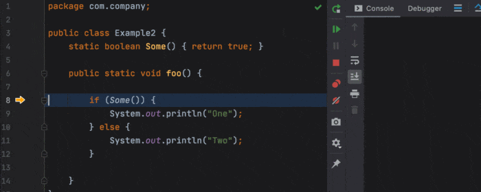

**Win at debugging by following an organized process and leveraging the tools you already have!**

I'm a disorganized person by nature. When I follow a process it's by habit and intuition. But when a debugging problem keeps me up at night and gets me to that state of mind where a career of raising sheep in New Zealand seems like an attractive option... That's when I need to back off and walk through this process in an orderly fashion. This process never fails. When you walk through it, you can track any problem.

Now I'm going to skip a lot of common advice. Most debugging tutorials start with things that relate to a process: File an issue, reproduce as a test case etc. I think there's plenty written on that online. People use it as filler since they assume debugging is a simple process. It is sometimes. But as we will learn in this article, there's a lot of depth and breadth to this misleadingly simple process.

We're going to skip ahead to a point where you have a bug you can reproduce (consistently or otherwise) but you don't understand or can't prove the cause.

This isn't a tutorial for beginners, that's a different article in which I will cover a lot of additional things and go into more details.

## 1. Works on My Machine

If this doesn't reproduce locally you might want to leverage remote debugging. This is pretty easy for most modern development tools, e.g. [this article](https://lightrun.com/debugging/how-to-debug-remotely-in-intellij/) covers the process of debugging a Java process remotely in IntelliJ/IDEA. You can apply the same technique to most IDEs and languages/platforms.

The main problem here is if this only happens in a production environment. In that case standard remote debugging is very dangerous. Both in terms of security (which is non-existent) but also in terms of your server reliability. Notice that there are ways to debug remote servers securely, safely and easily such as [Lightrun](https://www.lightrun.com/) .

Without that you can try the following tricks:

* Run locally but tunnel to the remote DB -- I usually just use SSH tunneling but I hear good things about [Teleport](https://goteleport.com/)
* Log the exact entry point credentials the user sent and try to reproduce the request locally

In my experience this is one of the hardest things to do when debugging a remote issue. Especially in a clustered/polyglot environment.

## 2. If The Bug is Inconsistent

These are the hard to track bugs for which we need the most help. These are also the bugs in which people lose faith in debugging. I'll classify this problem into two distinct cases:

* Happens rarely
* Never happens if we stop at a breakpoint

In both cases the best solution is logging and yes, logging is a form of debugging... We can add a log, "Apply Code Changes" (or edit and continue) and instantly see the output in our logs.

If the problem doesn't happen when we have a breakpoint it's possible that it might not reproduce even with a log. That's because the problem is a threading problem.

Debugging a race condition or a deadlock is actually not as painful as it's sometimes made out to be. I discuss this a bit later in this article. Note that debugging this is the "easy part", fixing it... That's the hard part...

If it happens rarely then we still need to verify that this isn't directly related to threading issues. I often make sure to log the current thread in this case to see if there's a correlation with the invoking thread. I also try to log the stacks to see if the problem varies based on the stack that makes sense. A cool trick is to hash or checksum the stack to reduce the noise.

```java
public class DebugUtil {
  public static String stackHash() {
    try {
      // code from https://www.baeldung.com/java-stacktrace-to-string
      StringWriter sw = new StringWriter();
      PrintWriter pw = new PrintWriter(sw);
      new RuntimeException().printStackTrace(pw);

      // checksum for speed
      int sum = 0;
      for(char c : pw.toString().toCharArray()) {
        sum += (int)c;
      }
      return Integer.toHexString(sum);
    } catch(IOException err) {
      return "Invalid Stack";
    }
  }  
}
```

We can use this code in our logs which we can then instantly scan through to find whether a bug correlates to invocation through a specific stack.

## 3. Conditional Breakpoints

You probably know about conditional breakpoints, but when was the last time you used them?

If that's recent then kudos to you! You're one of the chosen few.

This feature just isn't used nearly as much as it should. E.g. we can use the previous checksum current stack code to verify that all calls arrive from the same stack. We can use the output of that method as a condition.

Say the bug we're tracking happens only when the data for a specific user is being processed. Creating a breakpoint where the condition is `userId == problematicUser` lets us focus on the important parts. We can use the thread name as a condition to debug race conditions effectively.

There are some problems with conditional breakpoints. E.g. They can impact performance in such a way that the execution slows down to such a degree that we can't reproduce problems properly.

## 4. Rinse Repeat

You know that feeling when you step over the code after spending ages getting everything right... Then you step too far and you "missed it"!

That's the most frustrating feeling... It makes you want to throw a temper tantrum.

Well, there's a solution. We all should know about "run to cursor" which is nice. But most IDEs also support Go to Cursor which lets you manipulate the instruction pointer and return execution backward (or move it forward) to an arbitrary (legal) location.

Oddly enough, up until recently this wasn't supported in IntelliJ. It still isn't... But there's a plugin!

The [jump to line plugin](https://plugins.jetbrains.com/plugin/14877-jump-to-line), is one of those few must have plugins for IntelliJ that's useful for just about everyone. It's a life saver and a happiness enhancer. With this plugin you can literally drag the execution arrow on the left to a new location... Amazing.

Couple that with the ability to edit variable values in the watch window and you can test your theories in the method while stepping over a block of code. You can easily simulate many scenarios that would take hours (if not days) to reproduce as test cases.



## To be Continued...

Next time I'll go over the process of debugging an application. It's a very simple process but as usual "the devil is in the details".

Do you have your own process?

I'd love to hear your thoughts and debugging tips/tricks.
