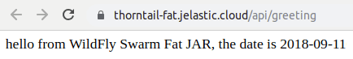
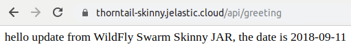
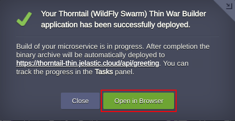
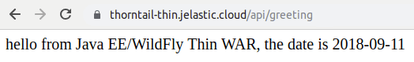
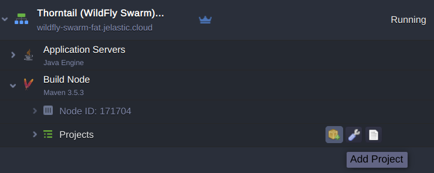

[Thorntail](https://thorntail.io/), originally [WildFly Swarm](https://wildfly-swarm.io/), is most suitable for packaging applications as *JAR* , *WAR,* or *EAR* files. The most important value is in the functional agility the Thorntail provides. You can start with the stripped down version of Thorntail, adding the required parts and application code on top.  



Below we will describe how to build and deploy Thorntail based applications using Fat, Thin and Skinny approaches. The application will be packaged in the Jar/War format automatically with the help of [Builder add-ons](https://github.com/jelastic-jps/thorntail) prepared by Jelastic. The topology will consist of Maven build node and JVM containers for running microservices.

## Thorntail Fat Jar Builder Installation



To get started, log in to Jelastic dashboard, find the *Thorntail Fat* *Jar Builder* in the **Marketplace** and click **Install**.

Or you can import *Thorntail Fat* [JPS](https://docs.jelastic.com/jps/) manifest using GitHub link:

<https://github.com/jelastic-jps/thorntail/blob/master/microservice-fat-jar/manifest.jps>  



To do that, open the **Import** window, paste the link and confirm installation by clicking **Import** button in the opened window.  



If required, change installation settings such as environment name or GitHub repository link to a custom *Thorntail Fat* project. Then press **Install** *.*  



When the installation and building of the project are completed, a corresponding message appears. You still need to wait a few minutes for deploy to be finished (feel free to track the process in *Tasks* panel). In the default implementation, it is done under **api/greeting**context.  

Afterward, you can make sure, that application is up and running by pressing **Open in browser** button.

## Thorntail Skinny Jar Builder Installation



Find the *Thorntail (WildFly Swarm) Skinny* *Jar Builder* in the **Marketplace** and click **Install**.  



Or import *Thorntail (WildFly Swarm) Skinny* JPS manifest using GitHub link: <https://github.com/jelastic-jps/thorntail/blob/master/microservice-skinny-jar/manifest.jps>  



If required, change installation settings such as environment name or GitHub repository link to a custom *Thorntail Skinny* project*.* Then press **Install** *.*  



When the installation and building of the project are completed, a corresponding message appears. You still need to wait a few minutes for deploy to be finished (feel free to track the process in *Tasks* panel). In the default implementation, it is done under **api/greeting**context.  

Afterward, you can make sure, that application is up and running by pressing **Open in browser** button.

## Thorntail Thin War Builder Installation



Find the *Thorntail (WildFly Swarm) Thin* *War Builder* in the **Marketplace** and click **Install**.  



Or you can import *Thorntail(WildFly Swarm) Thin* JPS manifest using GitHub link: <https://github.com/jelastic-jps/thorntail/blob/master/microservice-thin-war/manifest.jps>  



If required, change installation settings such as environment name or GitHub repository link to a custom *Thorntail Thin* project*.* Then press **Install** *.*  

When the installation and building of the project are completed, a corresponding message appears. You still need to wait a few minutes for deploy to be finished (feel free to track the process in *Tasks* panel). In the default implementation, it is done under **api/greeting**context.  

Afterward, you can make sure, that application is up and running by pressing **Open in browser** button.

## Multiple Thorntail Projects with Microservices



You can use just created *Maven* node for building extra projects and deploying them to different environments to get a set of distributed microservices.  



First of all, create a separate environment with *Java Engine*.  

Then click **Add Project** next to the *Maven* node in the initial environment.

Specify the name and link to the project, as well as choose the environment where it should be deployed. Additionally, you can activate automatic updates. Then confirm pressing **Add + Deploy**.

More details on how to build and deploy Java applications can be found at the [Maven node documentation](https://docs.jelastic.com/java-vcs-deployment/).

In this way, you can easily build and deploy your Thorntail (WildFly Swarm) based applications packaged as JAR and War files using Fat, Skinny or Thin approach. [Register and try out](https://jelastic.com/?utm_source=thorntail-foojay) this implementation for your custom project to feel the benefits of microservices running in the cloud.
