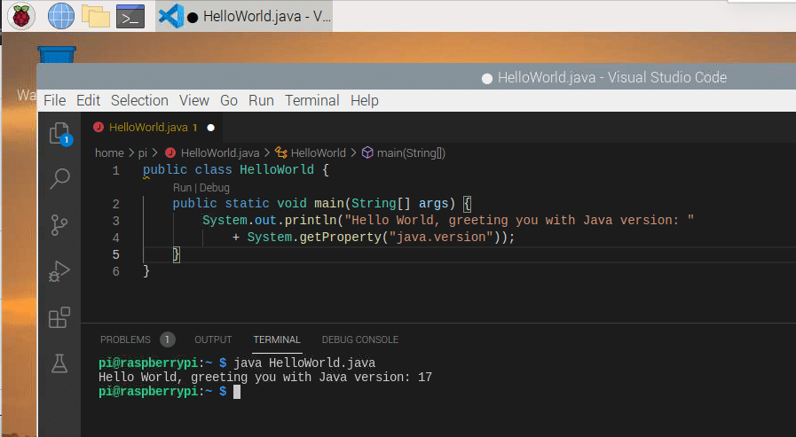
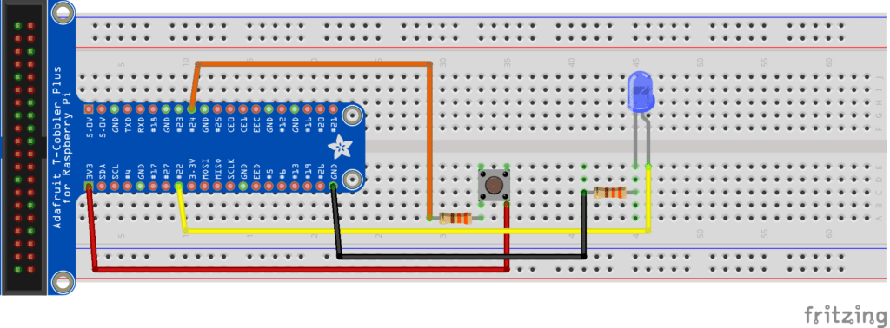

As part of the [Foojay Virtual OpenJDK 17+ JUG Tour](https://foojay.io/today/schedule-for-foojay-virtual-openjdk-17-jug-tour/), I was asked to present the state of Java and JavaFX 17 on the Raspberry Pi.

So, a perfect opportunity to freshen up my [#JavaOnRaspberryPi](https://twitter.com/hashtag/JavaOnRaspberryPi) presentation with some hot-off-the-press versions.

***UPDATE 2021-08-30: the recording of the presentation has been published on YouTube.***



In the past, I have been experimenting with Java 16 on the Raspberry Pi (see "[Building OpenJDK from GitHub Sources on 64-bit Raspberry Pi](https://foojay.io/today/building-openjdk-from-github-sources-on-64-bit-raspberry-pi/)") but now that version 17 is waiting around the corner, it's time to prepare our Raspberry Pi for the upcoming new "long-term-supported" (LTS) version.

To be able to easily test and install different Java versions, I love using [SDKMAN](https://sdkman.io/install) but unfortunately this isn't available for 32bit systems. So, no problem, we start with a fresh Raspberry Pi and the 64bit OS version!

### Setup a New Raspberry Pi with 64bit OS

Although the 64bit version is still not officially released at the time of writing (as described earlier in "[Faster \& More Reliable 64-bit OS on Raspberry Pi 4 with USB Boot](https://foojay.io/today/64-bit-raspbian-os-on-raspberry-pi-4-with-usb-boot/)"), there is a more regular updated version available on the [download server of the Raspberry Pi Foundation](http://downloads.raspberrypi.org).

For this post, I used the `/raspios_arm64/images/` version of 2021-05-28 and "burned" it on a USB Flash Drive with the [Raspberry Pi Imager tool](https://www.raspberrypi.org/software/). This is a Desktop version of Debian 10 customized for the Raspberry Pi, with minimal extra tools pre-installed. The full version with Java 11 and extra programs, is only available as a 32bit version in `/raspios_full_armhf/`.

After booting we can check the version in the terminal:

```
$ lsb_release -d
Description:	Debian GNU/Linux 10 (buster)
$ uname -a
Linux raspberrypi 5.10.17-v8+ #1414 SMP PREEMPT Fri Apr 30 13:23:25 BST 2021 aarch64 GNU/Linux
```

### SDKMAN

[SDKMAN](https://sdkman.io/) is very useful tool to quickly install a new Java version, or switch between already installed versions. With a few terminal commands, we can install it on our Raspberry Pi.

```
$ sudo apt install zip
$ curl -s "https://get.sdkman.io" | bash
$ source "$HOME/.sdkman/bin/sdkman-init.sh"
$ sdk version
==== BROADCAST =================================================================
* 2021-08-20: gradle 6.9.1 available on SDKMAN!
* 2021-08-19: springboot 2.5.4 available on SDKMAN!
* 2021-08-19: springboot 2.4.10 available on SDKMAN!
================================================================================

SDKMAN 5.12.2
```

OK nice, we have SDKMAN running on the Raspberry Pi now! There is an impressive list of Java editions you can install! This is the list on 23th of September 2021 you get with the command `sdk list java`:

```
================================================================================
Available Java Versions
================================================================================
 Vendor        | Use | Version      | Dist    | Status     | Identifier
--------------------------------------------------------------------------------
 AdoptOpenJDK  |     | 16.0.1.hs    | adpt    |            | 16.0.1.hs-adpt      
               |     | 11.0.11.j9   | adpt    |            | 11.0.11.j9-adpt     
               |     | 11.0.11.hs   | adpt    |            | 11.0.11.hs-adpt     
               |     | 8.0.292.j9   | adpt    |            | 8.0.292.j9-adpt     
               |     | 8.0.292.hs   | adpt    |            | 8.0.292.hs-adpt     
               |     | 8.0.275+1.hs | adpt    |            | 8.0.275+1.hs-adpt   
               |     | 8.0.252.hs   | adpt    |            | 8.0.252.hs-adpt     
 Corretto      |     | 17.0.0.35.1  | amzn    |            | 17.0.0.35.1-amzn    
               |     | 16.0.2.7.1   | amzn    |            | 16.0.2.7.1-amzn     
               |     | 11.0.12.7.1  | amzn    |            | 11.0.12.7.1-amzn    
               |     | 8.302.08.1   | amzn    |            | 8.302.08.1-amzn     
               |     | 8.0.262      | amzn    |            | 8.0.262-amzn        
 Dragonwell    |     | 11.0.9.4     | albba   |            | 11.0.9.4-albba      
 GraalVM       |     | 21.2.0.r16   | grl     |            | 21.2.0.r16-grl      
               |     | 21.2.0.r11   | grl     |            | 21.2.0.r11-grl      
 Java.net      |     | 18.ea.15     | open    |            | 18.ea.15-open       
               |     | 18.ea.2.lm   | open    |            | 18.ea.2.lm-open     
               |     | 17           | open    |            | 17-open             
               |     | 16.0.2       | open    |            | 16.0.2-open         
               |     | 11.0.12      | open    |            | 11.0.12-open        
               |     | 11.0.11      | open    |            | 11.0.11-open        
               |     | 11.0.10      | open    |            | 11.0.10-open        
               |     | 8.0.302      | open    |            | 8.0.302-open        
               |     | 8.0.292      | open    |            | 8.0.292-open        
 Liberica      |     | 17.0.0.fx    | librca  |            | 17.0.0.fx-librca    
               |     | 17.0.0       | librca  |            | 17.0.0-librca       
               |     | 16.0.2.fx    | librca  |            | 16.0.2.fx-librca    
               |     | 16.0.2       | librca  |            | 16.0.2-librca       
               |     | 11.0.12.fx   | librca  |            | 11.0.12.fx-librca   
               |     | 11.0.12      | librca  |            | 11.0.12-librca      
               |     | 8.0.302      | librca  |            | 8.0.302-librca      
 Liberica NIK  |     | 21.2         | nik     |            | 21.2-nik            
               |     | 21.1         | nik     |            | 21.1-nik            
               |     | 21.0.0.2     | nik     |            | 21.0.0.2-nik        
 Microsoft     |     | 16.0.2.7.1   | ms      |            | 16.0.2.7.1-ms       
               |     | 11.0.12.7.1  | ms      |            | 11.0.12.7.1-ms      
 Oracle        |     | 17           | oracle  |            | 17-oracle           
 SapMachine    |     | 17           | sapmchn |            | 17-sapmchn          
               |     | 16.0.2       | sapmchn |            | 16.0.2-sapmchn      
               |     | 11.0.12      | sapmchn |            | 11.0.12-sapmchn     
 Semeru        |     | 16.0.2       | sem     |            | 16.0.2-sem          
               |     | 11.0.12      | sem     |            | 11.0.12-sem         
               |     | 8.0.302      | sem     |            | 8.0.302-sem         
 Temurin       |     | 17.0.0       | tem     |            | 17.0.0-tem          
               |     | 16.0.2       | tem     |            | 16.0.2-tem          
               |     | 11.0.12      | tem     |            | 11.0.12-tem         
               |     | 8.0.302      | tem     |            | 8.0.302-tem         
 Zulu          |     | 17.0.0       | zulu    |            | 17.0.0-zulu         
               |     | 16.0.2       | zulu    |            | 16.0.2-zulu         
               |     | 11.0.12      | zulu    |            | 11.0.12-zulu        
               |     | 8.0.302      | zulu    |            | 8.0.302-zulu        
================================================================================
Use the Identifier for installation:

    $ sdk install java 11.0.3.hs-adpt
================================================================================
```

Let's install the Temurin version 17 provided by [adoptium.net](https://adoptium.net) (formerly known as adoptopenjdk.net).

```
pi@raspberrypi:~ $ java -version
openjdk version "11.0.12" 2021-07-20
OpenJDK Runtime Environment (build 11.0.12+7-post-Debian-2deb10u1)
OpenJDK 64-Bit Server VM (build 11.0.12+7-post-Debian-2deb10u1, mixed mode)

pi@raspberrypi:~ $ sdk install java 17.0.0-tem

Downloading: java 17.0.0-tem
...
Installing: java 17.0.0-tem
Done installing!
Setting java 17.0.0-tem as default.

pi@raspberrypi:~ $ java -version
openjdk version "17" 2021-09-14
OpenJDK Runtime Environment Temurin-17+35 (build 17+35)
OpenJDK 64-Bit Server VM Temurin-17+35 (build 17+35, mixed mode, sharing)
```

Indeed `sdk install java 17.0.0-tem` is all that's needed to switch to Java 17!

### Early Access Java 17

As no official Java 17 is available at the time this article was written, an other approach is to install an early access version provided by jdk.java.net. At 23th of August an EA-version was available and could be installed based on [this step-by-step description on opensource.com](https://opensource.com/article/19/11/install-java-linux):

```
$ wget https://download.java.net/java/GA/jdk17/0d483333a00540d886896bac774ff48b/35/GPL/openjdk-17_linux-aarch64_bin.tar.gz
$ mkdir ~/bin
$ echo PATH=$PATH:$HOME/bin >> ~/.bashrc
$ source ~/.bashrc
$ tar --extract --file openjdk-17_linux-aarch64_bin.tar.gz --directory=$HOME/bin
$ bin/jdk-17/bin/java -version
openjdk version "17" 2021-09-14
OpenJDK Runtime Environment (build 17+35-2724)
OpenJDK 64-Bit Server VM (build 17+35-2724, mixed mode, sharing)
```

Now let's make it easier to start Java:

```
$ sudo update-alternatives --install "/usr/bin/java" "java" "/home/pi/bin/jdk-17/bin/java" 1
$ java -version
openjdk version "17" 2021-09-14
OpenJDK Runtime Environment (build 17+35-2724)
OpenJDK 64-Bit Server VM (build 17+35-2724, mixed mode, sharing)
```

Look at that, Java 17 on the Raspberry Pi! 😉

### Visual Studio Code

Check "[Java Development with VS Code on the Raspberry Pi](https://foojay.io/today/java-development-with-vs-code-on-the-raspberry-pi/)" for more info about using VSC on the Raspberry Pi, but in short install like this:

```
$ sudo apt update
$ sudo apt install code
```

Now let's try the smallest Java program you can write to check and print the Java version...

```java
public class HelloWorld {
    public static void main(String[] args) {
        System.out.println("Hello World, greeting you with Java version: " 
            + System.getProperty("java.version"));
    }
}
```

And, finally, as we can run Java files without compiling them, since Java 11, we can just run it like this:

```
$ java HelloWorld.java
Hello World, greeting you with Java version: 17
```

 Hello World Java code running on Raspberry Pi with JDK 17

## Run a Pi4J project

Now let's see if we can run the minimal example project of the Pi4J project to control a LED and read a button state with some basic electronic components.
 Minimal electronic setup for a Pi4J demo project

This is fully described on "[Minimal example application](https://pi4j.com/getting-started/minimal-example-application/)", but this is the *TL;DR;* version, open a terminal and run the following commands to install Maven, get the demo code, build and run:

```
$ sudo apt install maven
$ git clone https://github.com/Pi4J/pi4j-example-minimal.git
$ cd pi4j-example-minimal/
$ mvn clean package
$ cd target/distribution
$ ls -l
$ sudo ./run.sh
LED high
LED low
LED high
Button was pressed for the 1th time
LED low
LED high
Button was pressed for the 2th time
LED low
...
LED low
LED high
Button was pressed for the 5th time
```

## Conclusion

As always, Java runs everywhere so no surprises here with version 17 on the Raspberry Pi! The Pi4J example application also runs without problems!
