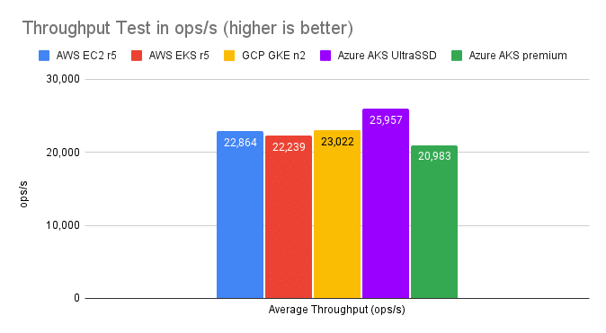
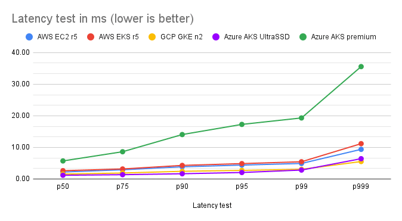

Is there a cost to running Apache Cassandra in containers? How about on Kubernetes? We decided to answer those questions and benchmark K8ssandra on Amazon Web Services (AWS), Google Cloud Platform (GCP) and Azure managed Kubernetes services, comparing it to a Cassandra cluster running on AWS EC2 instances. The latter, being a very common setup for enterprises operating Cassandra clusters, serves as our baseline comparing apples to "apples in containers".

While there were many challenges in designing a fair benchmark in a world (the cloud) where apples could very well be oranges, we managed to come up with a solid comparison and results that matched our expectations: running Cassandra in Kubernetes brings flexibility and ease of use without performance penalty.

Benchmarking methodology
------------------------

### Infrastructure

Our recommendation for running Cassandra in production is to use instances that have the following specifications:

* 8 to 16 vCPUs
* 32 GB to 128 GB RAM
* 2 to 4 TB of disk space
* 5k to 10k IOPS

In accordance, we selected r5.2xlarge instances as baseline in AWS EC2:

* 8 vCPUs
* 64 GB RAM
* 1\*3.4 TB EBS gp2 volume (\~10k IOPS)

The same instances were used for our AWS Elastic Kubernetes Service (EKS) benchmarks.

***Note:*** *our initial choice for the baseline was to use i3.2xlarge instances. We discarded them after observing a 30% drop in throughput due to an outdated CPU generation (Intel E5-2686 v4* *)* *compared to the r5 instances (Intel Xeon Platinum 8000 series). Cassandra workloads are mostly CPU bound and the core speed made a difference in the throughput benchmarks.*

We selected similar instances in GCP and Azure and ran [sysbench](https://github.com/akopytov/sysbench) and [fio](https://fio.readthedocs.io/en/latest/fio_doc.html) benchmarks to precisely evaluate their performance. While instances have the same number of cores, their individual speed could vary by a lot due to different CPU models and generations being used on the underlying host.

We ran the following test using `sysbench` to evaluate CPU performance:

```
sysbench cpu --threads=8 --time=120 run
```


For disk performance benchmarking, we used [Cassandra inspired fio profiles](https://github.com/ibspoof/cassandra-fio) that attempt to emulate Leveled Compaction Strategy and Size Tiered Compaction Strategy behaviors (the numbers below are only representative in the context of these profiles, they're not absolute performance numbers):

|----------------------------------------------------------|---------|----------|---------------------|---------------------------|
|                                                          | **CPU** | **IOPS** | **Disk Throughput** | **Disk p99 read latency** |
| **AWS i3.2xlarge**                                       | 5422    | 15775    | 672 MiB/s           | 4.9ms                     |
| **AWS r5.2xlarge + EBS gp2 3TB**                         | 6901    | 2998     | 125 MiB/s           | 5.1ms                     |
| **AWS EKS (r5.2xlarge + EBS gp2 3TB)**                   | 6588    | 2754     | 115 MiB/s           | 10.9ms                    |
| **GCP GKE n2-highmem-8 pd-ssd disk (premium-rwo)**       | 7467    | 5334     | 236 MiB/s           | 2.5ms                     |
| **GCP GKE n2-highmem-8 pd-balanced disk (standard-rwo)** | 7467    | 5329     | 236 MiB/s           | 3.02ms                    |
| **GCP GKE e2-highmem-8** **pd-ssd disk (premium-rwo)**   | 5564    | 4384     | 236 MiB/s           | 2.8ms                     |
| **Azure AKS Standard_E8s_v4** **Standard SSD**           | 7513    | 5381     | 224 MiB/s           | 46ms                      |
| **Azure AKS Standard_E8s_v4** **Premium SSD**            | 7513    | 5110     | 213 MiB/s           | 44ms                      |
| **Azure AKS Standard_E8s_v4** **UltraSSD**               | 7513    | 3339     | 138 MiB/s           | 9.2ms                     |

Disk performance

The **e2** instance class in GCP is the default in Google Kubernetes Engine (GKE), but proved to be underpowered compared to the AWS **r5** instance class with approximately 20% lower sysbench score. The **n2** instance class offered much better performance with a score that was approximately 10% higher than the AWS **r5** instances. The **pd-balanced** (standard-rwo) disks provided enough performance for our specific benchmarks so that we didn't need to upgrade to the slightly more expensive **pd-ssd** (premium-rwo) disks.

In Azure, the **E8s** _**v4** instances offered a performance that was similar to GCP's **n2** instances.

The latency of Azure Standard and Premium SSD volumes doesn't reach the performance of AWS EBS gp2 and GCP PD volumes. We had to use Azure Ultra Disks to make our instances fast enough to match the competition. With Ultra Disks, performance was inline with other cloud providers, but at almost twice the cost:

|----------------------------------------------------------------------|--------------------|----------------------|
| **Instance**                                                         | **Cost per month** | **k8s cluster cost** |
| **AWS EKS r5.2xlarge + EBS gp2 3TB**                                 | $777               | $73                  |
| **GCP GKE e2-highmem-8** **4TB pd-balanced (standard-rwo)**          | $673               | $73                  |
| **GCP GKE n2-highmem-8** **4TB pd-balanced (standard-rwo)**          | $715               | $73                  |
| **Azure AKS Standard_E8s_v4** **Standard SSD 4TB**                   | $675               | $85                  |
| **Azure AKS Standard_E8s_v4** **Premium SSD 4TB**                    | $818               | $85                  |
| **Azure AKS Standard_E8s_v4** **ULTRA SSD 4TB + 10k IOPS + 200MB/s** | $1,458             | $85                  |

Costs for on-demand instances

*The instructions to enable Ultra Disks in Azure Kubernetes Service (AKS) will be given in a follow up post where we will detail how to set up the infrastructure and deploy K8ssandra on Azure.*

All three cloud vendors have indexed the number of IOPS and/or disk throughput for their dynamically provisioned persistent volumes to the volume size. We used 3.4TB volumes in order to get enough power to match high performance production requirements.

Azure Ultra Disks are special in that aspect, as the number of IOPS and the desired throughput are set while defining the custom Storage Class in Kubernetes (pricing changes accordingly).

### Cassandra Version and Settings

At the time of conducting the benchmarks, the latest stable version of K8ssandra was 1.1.0 which supported Cassandra 3.11.10 and 4.0\~beta4. We chose the latter for this experiment.

Cassandra's default settings were applied with the exception of garbage collection (GC) settings. This used G1GC with 31GB of heap size, along with a few GC related JVM flags:

```
-XX:+UseG1GC
-XX:G1RSetUpdatingPauseTimePercent=5
-XX:MaxGCPauseMillis=300
-XX:InitiatingHeapOccupancyPercent=70 -Xms31G -Xmx31G
```


### Baseline infrastructure setup

[tlp-cluster](https://github.com/thelastpickle/tlp-cluster/tree/alex/stargate-updates) was used to provision our baseline VM infrastructure in AWS. The following command was used to spin up the instances and the Cassandra cluster:

```
build_cluster.sh -n K8SSANDRA_BENCH_BASELINE_r5 -g 0 -s 1 -v 4.0~beta4 -c 3 -i r5.2xlarge --gc=G1 --heap=31 -y
```


The stress instance deployed by [this branch](https://github.com/thelastpickle/tlp-cluster/tree/alex/stargate-updates) of tlp-cluster contains both [tlp-stress](https://github.com/thelastpickle/tlp-stress) and [nosqlbench](https://github.com/nosqlbench/nosqlbench).

### K8ssandra Helm Charts

The values for our K8ssandra Helm charts varied slightly from one provider to another, especially around affinities since zones are named differently, and storage classes which differ as they are cloud vendor specific. We relied on dynamic provisioning for persistent volumes and used standard storage classes for each vendor, with the exception of Azure, which required us to enable Ultra Disks:

* AWS: **gp2**
* GCP: **standard-rwo**
* Azure: **ultra-disk-sc**

Values file (AWS):

```
cassandra:
  version: "4.0.0"
  allowMultipleNodesPerWorker: false
  heap:
   size: 31g
  gc:
    g1:
      enabled: true
      setUpdatingPauseTimePercent: 5
      maxGcPauseMillis: 300
  resources:
    requests:
      memory: "59Gi"
      cpu: "7500m"
    limits:
      memory: "60Gi"
  datacenters:
  - name: dc1
    size: 3
    racks:
    - name: r1
      affinityLabels:
        topology.kubernetes.io/zone: us-west-2a
    - name: r2
      affinityLabels:
        topology.kubernetes.io/zone: us-west-2b
    - name: r3
      affinityLabels:
        topology.kubernetes.io/zone: us-west-2c
  ingress:
    enabled: false

  cassandraLibDirVolume:
    storageClass: gp2
    size: 3400Gi

stargate:
  enabled: false

medusa:
  enabled: false

reaper-operator:
  enabled: false

reaper:
  enabled: false

kube-prometheus-stack:
  enabled: false
```


### Stress Workloads

We ran two types of tests using [nosqlbench](https://github.com/nosqlbench/nosqlbench), DataStax's sponsored open source benchmarking suite. The first one was an unthrottled throughput test, which evaluated the maximum ops rate the infrastructure could handle. We then ran a rate limited test at 35% of the maximum throughput of our baseline infrastructure to evaluate the latency of Cassandra under low/moderate pressure.

We used the `cql-tabular2` profile which allowed us to stress the disks significantly, quickly reaching 4 SSTables per read at p50 thanks to partitions of up to 5000 rows. We used a replication factor of 3 with a 50/50 write/read workload, and this profile performs all statements at consistency level `LOCAL_QUORUM`. The throughput test ran 100M operations after a rampup of 1M operations, allowing 300 in-flight async queries to put enough pressure on the Cassandra nodes. The latency test ran 50M operations after a similar rampup of 1M operations.

[nosqlbench](https://github.com/nosqlbench/nosqlbench) publishes a Docker image which was used to run the stress tests as Kubernetes jobs. A hostPath volume was mounted in the job container to store the [nosqlbench](https://github.com/nosqlbench/nosqlbench) reports.

#### nosqlbench jobs definition

##### **Throughput test**

```
apiVersion: batch/v1
kind: Job
metadata:
  name: nosqlbench
  namespace: k8ssandra
spec:
  template:
    spec:
      containers:
      - command:
        - java
        - -jar
        - nb.jar
        - cql-tabular2
        - username=k8ssandra-superuser
        - password=ViKVXUnws5ZRg0yHxt3W
        - rampup-cycles=1M
        - main-cycles=100M
        - write_ratio=5
        - read_ratio=5
        - async=300
        - hosts=k8ssandra-dc1-service
        - --progress
        - console:1s
        - --report-csv-to
        - /var/lib/stress/throughput_test_io
        - rf=3
        - partsize=5000
        - -v
        image: nosqlbench/nosqlbench
        name: nosqlbench
        resources:
          requests:
            cpu: "7500m"
            memory: "8Gi"
        volumeMounts:
        - name: stress-results
          mountPath: /var/lib/stress
      volumes:
      - name: stress-results
        hostPath:
          path: /tmp
          type: DirectoryOrCreate
      restartPolicy: Never
```


##### **Latency test**

```
apiVersion: batch/v1
kind: Job
metadata:
  name: nosqlbench
  namespace: k8ssandra
spec:
  template:
    spec:
      containers:
      - command:
        - java
        - -jar
        - nb.jar
        - cql-tabular2
        - username=k8ssandra-superuser
        - password=M2vH465VsyQQIL4M20vg
        - rampup-cycles=1M
        - main-cycles=50M
        - write_ratio=5
        - read_ratio=5
        - threads=150
        - striderate=10
        - stride=800
        - hosts=k8ssandra-dc1-service
        - --progress
        - console:1s
        - --report-csv-to
        - /var/lib/stress/latency_test_io
        - rf=3
        - partsize=5000
        - -v
        image: nosqlbench/nosqlbench
        name: nosqlbench
        resources:
          requests:
            cpu: "7500m"
            memory: "8Gi"
        volumeMounts:
        - name: stress-results
          mountPath: /var/lib/stress
      volumes:
      - name: stress-results
        hostPath:
          path: /tmp
          type: DirectoryOrCreate
      restartPolicy: Never
```


Note that the latency test uses a **striderate** instead of a **cyclerate** . A **striderate** of 10 with a **stride** value of 800 would generate 8000 cycles (operations) per second. Initially we used a **cyclerate** of 8000 but the rate limiter was failing to reach the desired throughput, while strides (an over ensemble of cycles in nosqlbench) succeeded.

Benchmark results
-----------------

### Throughput test

|--------------------------------|----------------|----------------|----------------|----------------------------|---------------------------|
|                                | **AWS EC2 r5** | **AWS EKS r5** | **GCP GKE n2** | **Azure AKS** **UltraSSD** | **Azure AKS** **premium** |
| **Average Throughput (ops/s)** | 22,864         | 22,239         | 23,022         | **25,957**                 | 20,983                    |

Throughput test results


If there were still any doubts about the performance of running Cassandra in Kubernetes, we can see in the above results that the drop between AWS EC2 and EKS is negligible. We get slightly more performance in GKE with the n2 instances and Azure shows a nice bump (+12%) using Ultra Disks when compared to our baseline (note that using standard or premium disks in Azure would not match the performance of AWS and GCP) .

Such results are expected given the r5 instances have slower CPU cores as established during the sysbench test.

***Note:*** *We performed several runs for each cloud vendor and retained the best results. AWS showed the highest variance for the same instance type and stress test, with results that could drop down to 19k ops/s.*

### Latency test

|----------|----------------|----------------|----------------|------------------------|-----------------------|
|          | **AWS EC2 r5** | **AWS EKS r5** | **GCP GKE n2** | **Azure AKS UltraSSD** | **Azure AKS premium** |
| **p50**  | 2.20           | 2.63           | 1.54           | **1.18**               | 5.71                  |
| **p75**  | 2.92           | 3.17           | 1.89           | **1.36**               | 8.62                  |
| **p90**  | 3.87           | 4.29           | 2.43           | **1.66**               | 14.06                 |
| **p95**  | 4.39           | 4.86           | 2.73           | **2.05**               | 17.27                 |
| **p99**  | 4.91           | 5.45           | 3.06           | **2.82**               | 19.32                 |
| **p999** | 9.37           | 11.17          | **5.52**       | 6.42                   | 35.57                 |

Latency test results (values in ms)


While AWS keeps latencies at a very solid level, GCP and Azure managed to cut the latencies in half, most probably thanks to their faster CPU speeds.

Thanks to the numerous improvements Cassandra 4.0 brings, p99 and p999 latencies reached very low values overall, which weren't notably affected by running in Kubernetes compared to VM results.

Wrapping up
-----------

Running Cassandra in Kubernetes using K8ssandra does not introduce any notable performance impacts in throughput nor in latency. We were thrilled to see that K8ssandra dramatically simplified the deployment of Cassandra clusters, making it mostly transparent to run on premises or on cloud managed Kubernetes services, while offering the same level of performance.

All three cloud vendors offered similar throughput and latencies overall with their managed Kubernetes services during our benchmarks, although in Azure we had to use the more expensive Ultra Disks to match the competition. GCP stood out with the best cost/performance ratio, with more throughput and less latencies at a slightly lower price tag than AWS.
