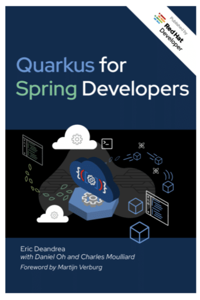

 {#h2-0-}
-------------------------------------------------------------------------------------------------------------------------------------------------------------------------

Key Take-Aways {#h2-1-key-take-aways}
-------------------------------------

* Quarkus and Spring are both powerful frameworks.
* Developers with years of Spring experience can consult side-by-side examples to quickly shift code and tests to Quarkus.
* Quarkus has moved quickly by leveraging proven technologies from existing Java frameworks and standards.
* Cloud-Native and Java-Native-Image (GraalVM / Mandrel) combine to run Quarkus apps very quickly.

[Quarkus for Spring Developers](https://developers.redhat.com/e-books/quarkus-spring-developers) is a straight-forward guide to enable senior developers to quickly shift their Spring skills to leverage the "supersonic subatomic" Quarkus framework, and junior/mid-level developers to learn two frameworks at once.

The book gets straight to the point of Quarkus' speed before the first chapter, with the foreword providing a real world testimonial of Quarkus software that many Java developers already use. Calling Quarkus "runtime plus framework," Microsoft Principal Group Manager Martijn Verburg explains:
> \[Eclipse Adoptium/AdoptOpenJDK\] moved our API to use Quarkus, and it's been brilliant both in developer productivity and performance, serving up to 300 million requests in the past two years from a single small instance."

The recent [Snyk/Azul Java community survey](https://www.infoq.com/news/2021/07/snyk-jvm-2021/) showed AdoptOpenJDK as the most popular distribution, with 45% usage among respondents.

The book provides many annotated and numbered examples of how common development tasks are performed in both frameworks, using numbers to indicate how a developer can connect the code samples between projects. Rather than writing straw-man arguments or contrived hype-squad material that always shows why one framework is always better, the examples represent a proper level of knowledge transfer and comparison between how things are done. While the book is published by Red Hat Developer (the company behind Quarkus), opinionated statements about which technology is "better" is left out in favor of strong technical writing.

Knowing Where to Look {#h2-2-knowing-where-to-look}
---------------------------------------------------

Where applicable, the authors make side-by-side tables that can steer developers towards where to look for certain capabilities:

The book additionally explains how developers can use [an optional automated migration tool](https://developers.redhat.com/products/mta/overview) that analyzes existing Spring applications, using analysis techniques that narrow down specifically which Quarkus features can help in which components.

Quarkus also provides base implementations, Quarkus Extensions for Spring Boot, that help Spring applications migrate slowly rather than requiring an all-at-once replacement.

Clear Annotated Code in Both Frameworks {#h2-3-clear-annotated-code-in-both-frameworks}
---------------------------------------------------------------------------------------

Quarkus for Spring Developers is broken into several chapters, each of which lays out the similarities and differences of each framework. Chapters select a particular development topic and highlight how the work is handled in Spring and how it is handled in Quarkus.

Chapter 3 on RESTful services provides fully annotated examples of how REST endpoints are annotated between Spring WebFlux, Spring MVC, and Quarkus.

Chapter 4 on Persistence explains a comparison between Java EE / Jakarta EE's Java Persistence API (JPA) and Hibernate, Spring Data, and Quarkus Panache. Developers familiar with any data access patterns can quickly skim the chapter to either start using Quarkus or quickly move an application's database-oriented classes from Spring to Quarkus.

The chapter articulates the way that Quarkus' support for reactive programming speeds up microservices. By supporting reactive programming directly in Panache, there are fewer reactive-specific changes needed to support reactive programming when compared to Spring's R2DBC. The net result is that HotSpot and native-compiled Quarkus applications can run faster and with even less memory than a comparable Spring application.

Chapter 5 on Event Driven Services discusses the role of libraries like Spring Event Handling (with **@ServiceActivator)** compared against Quarkus Event Handler (with **@ConsumeEvent**).

Focus on Details and Testing {#h2-4-focus-on-details-and-testing}
-----------------------------------------------------------------

The authors focus on good development practices overall rather than stopping when the sample code runs. Many chapters provide additional context of how to run Quarkus code via automated tests and what to look for in Quarkus log messages.

Several chapters have a portion dedicated to testing. Teams looking to migrate from Spring Boot to Quarkus can use this to verify smaller portions of the application rather than waiting until the entire application has been migrated.

Chapter 2 on Getting Started with Quarkus summarizes the ability to perform three types of tests: Continuous Testing, Unit Testing, and Native Image Testing.

* Continuous Testing helps developers while they write and change code of a running application. While Quarkus and Spring both feature class reloading to change functions without reload, Quarkus performs an impact analysis to re-run relevant unit tests that are affected by the change.
* Unit Testing is similar in both frameworks, however the section explains the role of what's needed in an **@QuarkusTest** with regards to dependency injection, mocking, and the connection to Spring's **@SpyBean**.
* Native Image Testing represents any additional tests to verify the Continuous Tests and Unit Tests of the application after it has been compiled to a full native machine binary.

Cloud Native Applications {#h2-5-cloud-native-applications}
-----------------------------------------------------------

Quarkus for Spring Developers dedicates a chapter to creating cloud-native applications that run on Kubernetes, Google Cloud, Azure, AWS, and many other cloud environments. The focus of the cloud native chapter is deploying and running applications in the cloud. While Quarkus guides users toward native compilation for faster startup with lower memory, this is not a requirement for deployment and code can still be run with a standard JRE.

The book does not discuss Spring-specific capabilities such as the [Azure Spring Cloud](https://azure.microsoft.com/en-us/services/spring-cloud/), "a fully managed Spring Cloud service, jointly built and operated by VMware." The book similarly leaves out preview features, where Quarkus developers can build a single RESTful Quarkus application that automatically integrates into [AWS Lambda](https://quarkus.io/guides/amazon-lambda-http) and [Azure Functions](https://quarkus.io/guides/azure-functions-http). The result of this is a local web application that can be used during development but then runs in serverless behind an application gateway. Similar preview features for [Quarkus Funqy in serverless HTTP](https://quarkus.io/guides/funqy-amazon-lambda-http) are left out.

Instead the chapter focuses more on fully supported similarities between Spring and Quarkus, showing off capabilities like health checks, debugging, configuration management, monitoring, and distributed tracing.

Developers working on cloud native applications may find more helpful information by looking at relevant guides on the Quarkus and Spring documentation, where preview features may play a role.

Get Building with Quarkus {#h2-6-get-building-with-quarkus}
-----------------------------------------------------------

Developers can get to work immediately, prototyping new systems or testing how Quarkus can fit in with existing Spring applications:

* [Download the free EBook, Quarkus for Spring Developers.](https://red.ht/quarkus-spring-devs)
* Review [Quarkus QuickStart Guides](https://quarkus.io/guides/), including early-access Cloud Native tooling.
* [Analyze an existing Spring Application](https://developers.redhat.com/products/mta/overview) to help any porting work.
