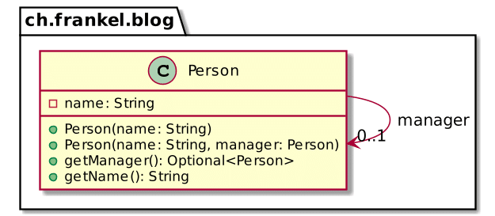

Two weeks ago, I wrote how you could write a Spring application with no annotations.

Many alternatives are available to configure your Spring app.

I'd like to list them in this post, leaving Spring Boot out of the picture on purpose.

## Core concepts

A couple of concepts are central in Spring. The related documentation doesn't describe most of them. Here is my understanding of them:

* **Bean** : A bean is an object managed by the Spring container
* **Bean Factory** : A bean factory is a component that manages the lifecycle of *beans*, especially regarding the instantiation of new objects
* **Bean Definition** : A bean definition is the set of properties given to the Spring container and that the requested bean will have, *e.g.*, class, name, scope, dependencies, etc.
* **Context**: A context is a bean factory with additional capabilities (mainly internationalization and event publishing)



To configure a Spring application, one creates one or more contexts and registers the necessary bean definitions in the desired ones. In the following sections, we will configure the following simple model:



## Property file

Yes, you read that well: you can actually configure beans via a property file. It was the first way to do it, and though **it's deprecated**, it still works.

We first need to create the relevant property file:

```
john.(class)=ch.frankel.blog.Person       # 1
john.$0=John Doe                          # 2
jane.(class)=ch.frankel.blog.Person       # 3
jane.$0=Jane Doe                          # 4
jane.$1(ref)=john                         # 5
```

1. Define a new bean with name `john` and of class `Person`
2. Set the single constructor argument to pass
3. Define a new bean with name `jane` and of class `Person`
4. Set the first constructor argument to pass
5. Set the second constructor argument to give, the reference to `john`

Here's the related code snippet:

```java
var context = new GenericApplicationContext();                // 1
var factory = context.getDefaultListableBeanFactory();        // 2
var reader = new PropertiesBeanDefinitionReader(factory);     // 3
var properties = new ClassPathResource("beans.properties");   // 4
reader.loadBeanDefinitions(properties);                       // 5
context.refresh();                                            // 6
```

1. Create a new empty context
2. Get its underlying bean factory
3. Create a reader over the bean factory
4. Get a handle on the above property file
5. Parse the file to create bean definitions in the context
6. Instantiate the beans from the beans definitions

## XML

XML is the way most developers think about when they configure a Spring application. It has been available for ages and still is today. To use it, we only have to transform the previous property file to XML format:

```xml
<beans xmlns="http://www.springframework.org/schema/beans"
       xmlns:xsi="http://www.w3.org/2001/XMLSchema-instance"
       xsi:schemaLocation="http://www.springframework.org/schema/beans
           http://www.springframework.org/schema/beans/spring-beans.xsd">
    <bean id="john" class="ch.frankel.blog.Person">
        <constructor-arg value="John Doe" />
    </bean>
    <bean id="jane" class="ch.frankel.blog.Person">
        <constructor-arg value="Jane Doe" />
        <constructor-arg ref="john" />
    </bean>
</beans>
```

Because of its widespread usage, configuring a context and populating it with beans can be implemented in a one-liner:

```java
var context = new ClassPathXmlApplicationContext("beans.xml");   // 1
```

1. Create the application context, parse the XML file, create the bean definitions, and refresh the context!

## Groovy DSL

One can alternatively also use Groovy. For that, Spring provides a dedicated .

```groovy
import ch.frankel.blog.Person

beans {
    john Person, 'John Doe'
    jane Person, 'Jane Doe', john
}
```

To use it for configuration is also a one-liner:

```java
var context = new GenericGroovyApplicationContext("beans.groovy");
```

Just remember that Groovy is not a first-class citizen in the Spring ecosystem anymore.

## Self-annotated classes

When Spring introduced self-annotated classes not long after Java 5, people considered them a significant improvement over XML. With this approach, you add annotations to your code that Spring recognizes at startup time. For me, it's a bit odd to use Spring to make one's code more decoupled and to end up coupling it to a third-party framework.

Anyway, here's how we can configure Spring for the above model:

```java
@Component                                              // 1
class John extends Person {
    public John() {
        super("John Doe");
    }
}

@Component                                              // 1
class Jane extends Person {
    public Jane(John john) {                            // 2
        super("Jane Doe", john);
    }
}
```

1. Mark the class for registration. Spring will instantiate a bean named after the class name, unqualified and uncapitalized
2. Inject the bean of class `John`. Alternatively, we could inject *by name* by having the parameter `@Qualifier("john") person`. Note that since it's auto-wiring, we need to reduce the number of candidates to *one* , and there are two `Person` beans.

It is the most complex code of all, as we want to create two instances of the same class. Hence, with annotated classes, we need to create two different subclasses to annotate them.

To create the context with self-annotated classes is straightforward:

```java
var context = new AnnotationConfigApplicationContext(John.class, Jane.class);
```

Note that you need to explicitly list all the necessary classes you want to be part of the context. Spring Boot makes it easier for you by implementing *classpath scanning*, so you don't need explicit listing.

## Configuration classes

As mentioned above, self-annotated classes have a couple of downsides:

* Coupling with the framework
* Confusing then bean with the class, and thus requiring subclassing when we need different instances of the same class

To fix those issues, we can keep using annotations but move them to a dedicated class. This class plays the same role as the former `beans.xml`.

```java
@Configuration                                                 // 1
public class AppConfiguration {

    @Bean                                                      // 2
    public Person john() {
        return new Person("John Doe");
    }

    @Bean                                                      // 2
    public Person jane(@Qualifier("john") Person person) {     // 3
        return new Person("Jane Doe", person);
    }
}
```

1. Mark the class as a configuration class
2. The container will register the return value of this method as a bean
3. As the context contains two `Person` beans, we need to inject *by name*

As usual, it's straightforward to create a context from the above configuration class:

```java
var context = new AnnotationConfigApplicationContext(ClassConfigurator.class);
```

## Kotlin DSL

The Kotlin DSL is the latest newcomer to the available alternatives. It avoids the usage of annotations.

```kotlin
GenericApplicationContext().apply {             // 1
    beans {                                     // 2
        bean("john") {                          // 3
            Person("John Doe")
        }
        bean("jane") {                          // 3
            Person("Jane Doe", ref("john"))     // 4
        }
    }.initialize(this)                          // 5
    refresh()                                   // 6
}
```

1. Instantiate a new context
2. Create the bean definition DSL
3. Define a named bean
4. Inject the dependency *by name*
5. Add the bean definitions to the context
6. Instantiate the beans from the beans definitions

## Bean definitions

All the previous configuration alternatives provide an abstraction layer over bean definitions. Then, the container creates beans out of bean definitions. We can bypass these abstraction layers and directly use the bean definition API.



Let's first define a specialized bean definition:

```java
public class PersonBeanD extends GenericBeanDefinition {

    public PersonBeanDefinition(String name) {
        this(name, null);
    }

    public PersonBeanDefinition(String name, String manager) {
        setBeanClass(Person.class);                                               // 1
        var arguments = new ConstructorArgumentValues();
        arguments.addGenericArgumentValue(name, "java.lang.String");              // 2
        if (manager != null) {
            arguments.addGenericArgumentValue(manager, "ch.frankel.blog.Person"); // 2
        }
        setConstructorArgumentValues(arguments);                                  // 3
    }
}
```

1. Set the bean class
2. Set the argument and its type
3. Set the arguments

We can now create the context:

```java
var context = new GenericApplicationContext();                               // 1
context.registerBeanDefinition("john", new PersonBeanD("John Doe"));         // 2
context.registerBeanDefinition("jane", new PersonBeanD("Jane Doe", "john")); // 2
context.refresh();                                                           // 3
```

1. Create the context
2. Register the bean definition
3. Instantiate the beans from the beans definitions

## Beans

Spring provides a simple API for simple bean definitions, so we don't need to create dedicated bean definition classes. This mechanism creates such a definition when necessary.



Here's the code to create the sample configuration:

```java
var context = new GenericApplicationContext();
context.registerBean("john", Person.class, "John Doe");
context.registerBean("jane", Person.class, "Jane Doe", "john");
context.refresh();
```

## Conclusion

Spring is based on several core concepts: bean factories, contexts, bean definitions, and beans.

It offers different ways to create contexts and beans and to register the former in the latter. It ranges from deprecated Java properties to Kotlin DSL. Now, you can choose the one the best adapted to your context.

The complete source code for this post can be found on [Github](https://github.com/ajavageek/configure-spring) in Maven format.

**To go further:**

* [Introduction to the Spring IoC Container and Beans](https://docs.spring.io/spring-framework/docs/current/reference/html/core.html#beans-introduction)
* [Bean Definition Inheritance](https://docs.spring.io/spring-framework/docs/current/reference/html/core.html#beans-child-bean-definitions)
* [Annotation-based Container Configuration](https://docs.spring.io/spring-framework/docs/current/reference/html/core.html#beans-annotation-config)
* [The BeanFactory](https://docs.spring.io/spring-framework/docs/current/reference/html/core.html#beans-beanfactory)

*Originally published at [A Java Geek](https://blog.frankel.ch/multiple-ways-configure-spring/) on September 26^th^, 2021*

*[IoC]: Inversion of Control
*[DSL]: Domain-Specific Language
