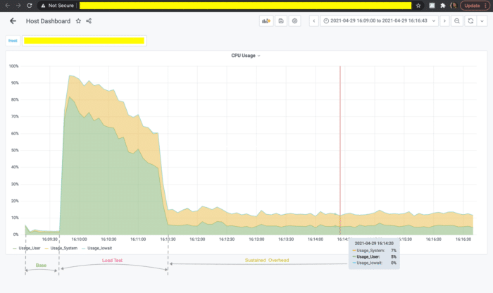

A while ago I received a customer escalation ticket regarding performance degradation when using [Datadog Continuous Profiler for Java](https://docs.datadoghq.com/tracing/profiler/). The degradation was observable as an increased CPU usage as well as unexpected latency.

The Beginning: Unusual Customer Escalation
------------------------------------------

To bootstrap the troubleshooting, I usually try to isolate the area which might be causing the regression.

The profiler is packaged as a Java agent and for ease of use it is bundled together with the Datadog Java tracer agent. The profiler itself uses JDK Flight Recorder (JFR) under the hood.

This lead me to two main suspects:

* either the code injected by the tracer was affecting the application in unexpected ways
* or the profiler simply generated too many JFR events: leading to extra strain on I/O as well as CPU resources (in case the events need to collect stack traces)

Both of these cases are easily verifiable: the tracer can be disabled such that the profiler runs in isolation and the profiler can be tuned to reduce the number of events it generates following the [troubleshooting guide](https://docs.datadoghq.com/tracing/profiler/profiler_troubleshooting/).

Unfortunately, at this point the regression was persisting no matter what profiler configuration was used.

To make things more interesting, the customer additionally reported that the system seemed to behave 'normally' even with both tracer and profiler enabled and with the default profiler settings, that is, until they ran a load test there. During the load test the latency would spike and after the load test had finished the CPU usage would stabilize at over 10% more than what had been observed before the load test run.

The CPU usage graph would look something like this.  

Well, that makes the things clear, doesn't it?

And Down the Rabbit Hole...
---------------------------

So, here I am. With a confirmed performance degradation, obviously caused by the profiler but with no explanation and, what was worse, no local reproducer. I had to rely on whatever data I was able to get from the collected profiles, preferably not disturbing the customer with too many restarts and redeployments. But the number of initial hints was surprisingly small, just that the regression was triggered by a common load test run and that the application was running on JDK 8u.

With nothing to start with, I resorted to checking the JFR recordings and the profiling metrics with the hopes of detecting some pattern. After some time spent randomly selecting profiles and trying to detect anything unexpected it finally hit me. The profiler metrics were really strange.

Why is the "JFR Periodic Task" thread even shown here? Usually, JFR is trying to stay as "quiet" as possible in terms of heap allocation not to disturb the observed application. So, why suddenly here JFR is **THE** memory hog?

Elimination Round
-----------------

The "JFR Periodic Task" takes care of emitting periodical events. That was the good news: there are only a few built-in periodical events and the customer was not adding any of theirs. That meant that I would be able to identify the offender pretty fast, even considering that each change had to be discussed with the customer and then deployed by them.

And as luck had it my first candidate was `jdk.NativeExecutionSample` which is used to collect a sample of stacktraces for threads executing native code on behalf of JVM (e.g., JNI code). Lo and behold: after disabling that event the overhead was gone.

So, that would be it. Problem fixed!

Root Causing
------------

Although disabling that particular event did resolve the escalation ticket, I was really curious what was the real root cause. I double checked the event implementation and I was 100% confident that it was not doing any on-heap allocation, especially since it is a "native" JFR event, written completely in C++.

So, in order to gain more insight into what was happening in the system, I added `-Xlog:jfr` JVM argument to enable JFR internal logging. The resulting logs didn't show anything extraordinary, except the fact that each time a periodical event was emitted a bunch of log lines were added. But the log output should only be generated when requested, shouldn't it? Well... apparently, it should not: <https://hg.openjdk.java.net/jdk8u/jdk8u-dev/jdk/file/4eae74c62a51/src/share/classes/jdk/jfr/internal/Logger.java>

As it turns out, during the JDK 8 backport of JFR a shortcut was made when adjusting the code to the missing JVM logging support. And as such the logger would **always** invoke the log message supplier, regardless of the current logging settings and forward the message to the internal logger. The internal logger, in turn, would promptly discard the message unless running with the required logging level.

This definitely has the potential to allocate a lot. And with a lot of garbage there comes quite high GC pressure, eating away the CPU and increasing the application latency.

Solution
--------

Once it became clear that it was the partially implemented logging facility in the JDK 8 backport of JFR (for which I was also partially responsible) I opened a new JDK bug to track the work:

<https://bugs.openjdk.java.net/browse/JDK-8266723> and went ahead to fix it.

The fix turned out to be not that complex, I just had to surface the log level check from native to Java and use it in the JFR Logger implementation to prevent the log message construction if it is not going to be used.

For JDK 8u JFR backport there are no real log levels, though, just 'enabled' and 'disabled' logging, making the fix even simpler. You can see the actual code changes [here](https://hg.openjdk.java.net/jdk8u/jdk8u-dev/jdk/rev/cb560b38d15a) and [here](https://hg.openjdk.java.net/jdk8u/jdk8u-dev/hotspot/rev/88e29f735f12) ) and it was included in JDK 8u302, and that's the version since which you can enjoy minimal heap allocation from the JFR events again.

Final words
-----------

I wish I had some great words of wisdom to share here. So, I'll leave you with only this: never underestimate the danger of a partial implementation (even if it is just a logging implementation) and the 'invisible' bugs are pretty darned hard to find and fix!
