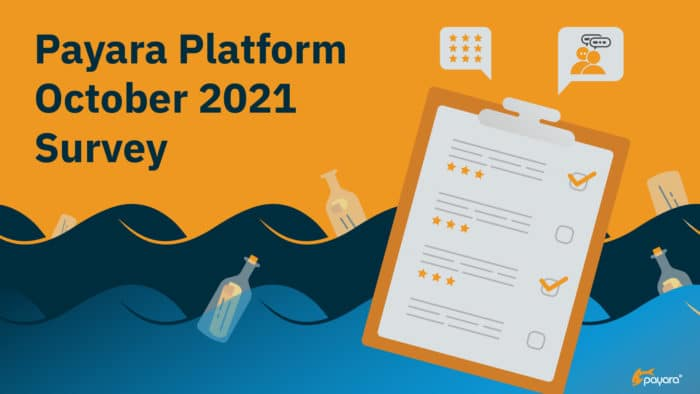

 

We are inviting all Payara Platform community users to [answer a few questions](https://www.payara.fish/Survey) about your use of the Payara Platform and ecosystem components.

We want to know what you like, what you want to see improved, and we're giving you the opportunity to vote on new features you'd like to see added to the Payara Platform.

Your survey answers help drive future development efforts for the Payara Platform.

Want to help guide development of the Payara Platform and enter to win a $25 Amazon voucher? We'd love it if you could take approximately 6 minutes to answer the following multiple choice questions by October 27th, 2021. Your feedback helps drive product development and improvements.

We'll randomly choose 2 people from all completed survey entries to receive a $25 Amazon voucher after October 28th, 2021. Thank you!

<https://www.payara.fish/Survey>
