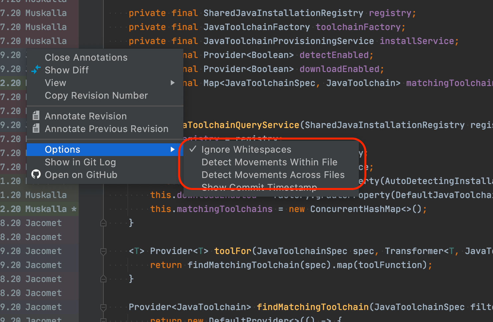
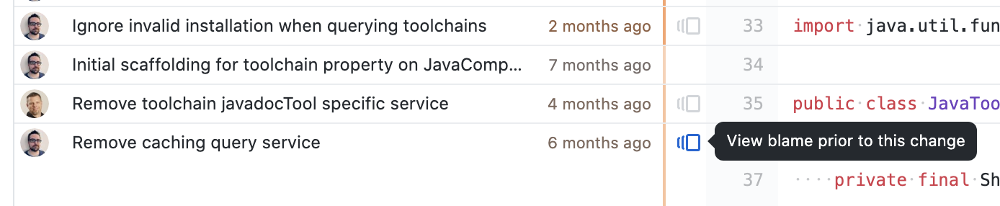
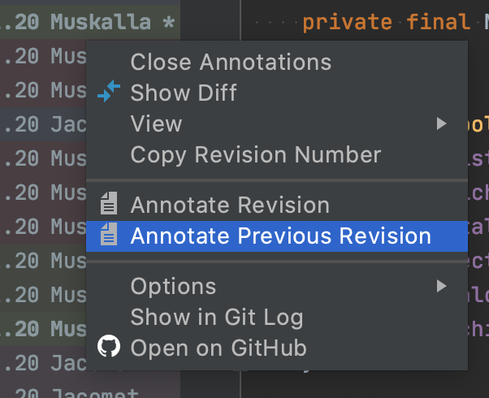
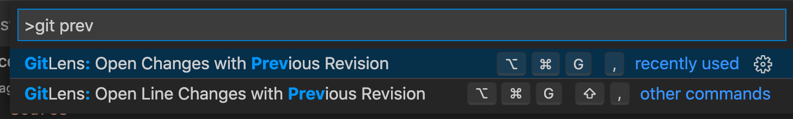
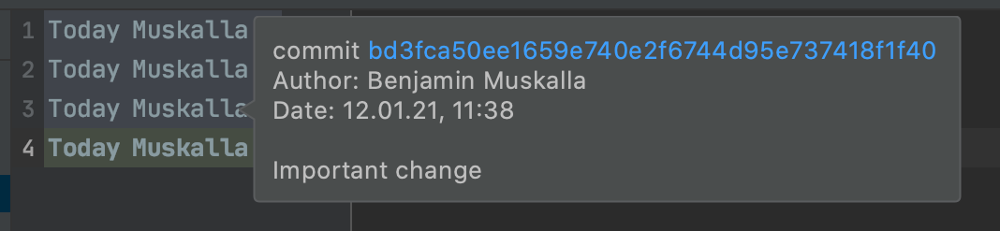

Working on a large codebase, it's pretty normal to not remember every small or large subsystem or implementation choice. Be it whether you're new to a codebase, or you've been focused on a specific area of the codebase.

When working on refactorings or bug fixes, I often end up in areas I might not be too familiar with. Generally not dramatic, it happens quite often that I'm stopping what I'm doing because I need to decide on how to move forward. As software engineers, we have to make so many micro-decisions every minute that we're pretty used to it.

Depending on the code and domain knowledge, we often find ourselves in situations where we need more context to make an informed decision. Tests usually provide a pretty good context but depending on their granularity and naming, they might only tell is "what" is in the implementation but miss the "why".

And if we try to decide whether we can remove a certain check or rework a behavior, we need to understand why it was introduced in the first place. Usually, we resort to looking at the commit that introduced the change or the tickets associated with the commit.

[](https://www.instagram.com/marcos.lange77/)

Most people will start with using "git blame" (or the respective functionality within their IDE/editor). But on most non-trivial projects, you usually end up with a refactoring commit, a rename, or a trivial cross-project fix like switching to another assertion library. At first glance, we only see the most recent changes, not the most important ones.

We need to carefully remove layer by layer of sand and dirt that has been swept over the real changes to unearth them.

Moving Backwards In Time
------------------------

A simple `git blame` shows us only the most recent changes. Assuming it's a simple move within the file or a whitespace fix, we can ignore those using the flags that `git blame` offer us:

* -w  
  ignore whitespace changes
* -M  
  ignore changes if the line was just moved/copied within the same file
* -C  
  ignore changes if the line was just moved/copied from other files

The above flags are already useful. Most of them are not only available on the command line though, they're usually available in the various editors as well (feel free to show how it's done in your editor and share [on Twitter](https://twitter.com/bmuskalla)).



Usually, this allows to hide some of the more trivial commits but requires `git` to detect them as such. More often, we (as engineers) can easily gauge whether a commit is relevant for our search based on commit message, author, and coding practices.

Luckily, this can also easily be achieved by the various editors by moving backward commit-wise. Looking at the history on GitHub, you can use the "View blame prior to this change" feature:



Similarly, IntelliJ-based IDEs allow you to do the same using "Annotate Previous Revision":



In case you're using Visual Studio Code, the excellent "GitLense" extension offers similar commands:



Moving Forward
--------------

Depending on what we're looking for, we may not want to uncover commit by commit until we find the initial commit that introduced something. Let's say that we're working with a customer who sees a specific error message on an older version of our product.

On `main`, this error message is not present anymore as somebody refactored the code already. To dig into this, we'll have to find out when this error message got introduced. One way to pick through the whole history in the search for the holy grail..err..the error message is to use git pickaxe. Pickaxe is part of git log can be used as follows:

```
git log -S'errorMessage'
```


By default, it will spit out all commits that introduced or removed the string `errorMessage` in any way. Especially with error messages, you may be looking for an error message template that has variables in there. Luckily, git has us covered: you can use `--pickaxe-regex` and use `-S` to find matching commits.

Be aware that using -S will only find commits that change the number of times a string is found (addition/deletion). If you're also looking for a commit that changed the position of a string (e.g. a refactoring that moved the keyword around), you are better of using the `-G`:

```
git log -G"error.*"
```


Skipping History
----------------

Whether you move forward or backward through history, there will always be the "big bang" refactorings that get in your way. Be it that your team decided to agree on certain line endings, a large split of the codebase or a rename to align the codebase with the [ubiquitous language](https://www.jamesshore.com/v2/books/aoad1/ubiquitous_language).

So these changes are usually never interesting in the context of wading through the history for a specific line and Git has some neat features that allow us to skip those when looking at `git blame` for a file. The simple approach is to pass all commit ids that we want to ignore using `--ignore-rev` as the following example shows.

Given this history for a file, consisting of the important change as well as a commit that just refactored the file:

```
❯ git log
commit 301b7eca0eb57737e160f5d2d16208f65c4156d6 (HEAD -> master)
Author: Benjamin Muskalla <<a href="/cdn-cgi/l/email-protection" class="__cf_email__" data-cfemail="7c1e11090f171d10101d3c1b0e1d181019521f1311">[email protected]</a>>
Date:   Tue Jan 12 11:38:40 2021 +0100

    Reformat all source files

commit bd3fca50ee1659e740e2f6744d95e737418f1f40
Author: Benjamin Muskalla <<a href="/cdn-cgi/l/email-protection" class="__cf_email__" data-cfemail="cdafa0b8bea6aca1a1ac8daabfaca9a1a8e3aea2a0">[email protected]</a>>
Date:   Tue Jan 12 11:38:12 2021 +0100

    Important change
```


As expected, regular git blame shows the most recent changes on the file. This is the commit reformatting the file which is irrelevant for us. We want to see an important change.

```
❯ git blame sourcefile.py
301b7eca 1) import random
301b7eca 2)
301b7eca 3) print(random.randint(0,9))
301b7eca 4)
```


So, using the "ignore revisions" feature allows us to explicitly ignore specific commits, thus showing us the commit we're interested in:

```
git blame --ignore-rev 301b7ec sourcefile.py
^bd3fca5 1) import random
301b7eca 2)
^bd3fca5 3) print(random.randint(0,9))
301b7eca 4)
```


Throughout the lifetime of a project, this approach certainly doesn't scale. There will always be commits that should be ignored in those  

cases. Based on the same approach, `git blame` allows you to specify a file that contains a list of commits to be ignored.

This is not only handy as you can check it in with all your other files, but it's also easy to share this within your team so everybody can leverage this as well.

In our example, let's call it `.git-blame-ignored-revs` and specify which commits should be ignored using their commit hash. You can use `#` to add comments to the file as well.

```
# ignore pure formatting commits
301b7eca0eb57737e160f5d2d16208f65c4156d6
```


You can now manually use this file as your source of filters using `--ignore-revs-file`.

```
❯ git blame -s --ignore-revs-file=.git-blame-ignored-revs sourcefile.py
```


If you want this to be the default behavior, you can either create a git alias for this or even configure git to always use this file. With this configuration, git blame will always ignore the commits in `.git-blame-ignored-revs`:

```
❯ git config blame.ignoreRevsFile .git-blame-ignored-revs
```


A nice side-effect of using `git config` is that other tools and editors that rely on the command line tools behaviour just fall in line with these settings.

For example, IntelliJ IDEA shows the "Important Change" when enabling annotations:



Conclusion
----------

Different problems require different approaches. Whether you're looking for an error message that is long gone from the `main` branch or try to peel back the layers for some new code, git offers a tremendous amount of tools for your needs.

Sometimes it is enough to remember that certain tools or approaches exist so you can look them up if you decide which way you want to approach your search:

* `git blame` with its various filters like `-M`
* `git log -S/-G` to look for additions/deletions for specific keywords or patterns
* `git blame --ignore-rev` to hide known, noisy commits

I hope I was able to show the one or other interesting bit that can you add to your own toolbox and would be happy [to hear about](https://twitter.com/bmuskalla) your approach to software archeology.
