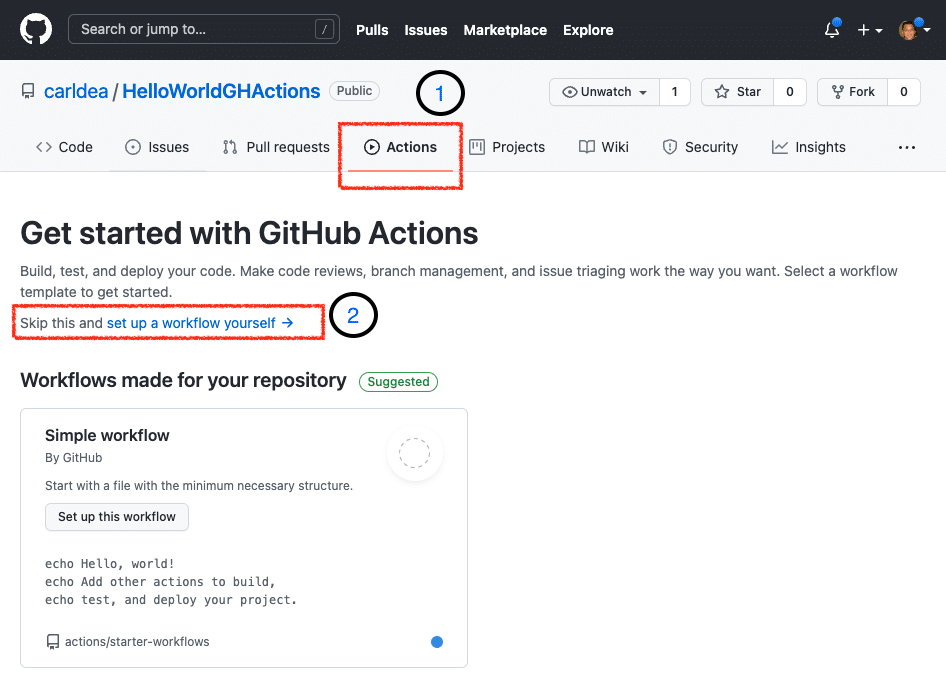
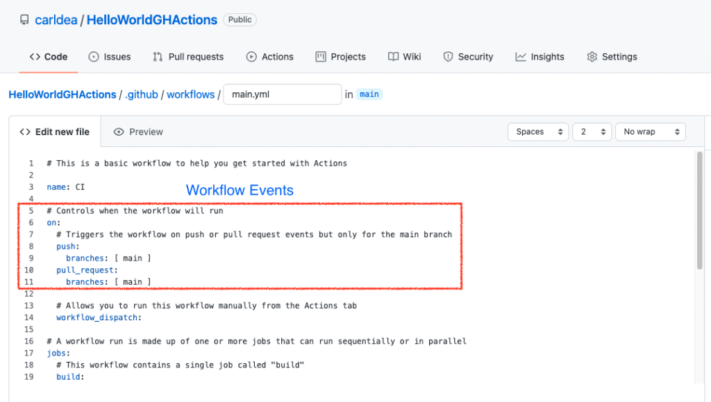
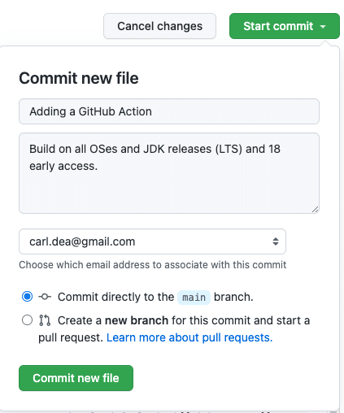

#### Have you ever heard of [Jenkins](https://www.jenkins.io/), [Travis](https://www.travis-ci.com/), [TeamCity](https://www.jetbrains.com/teamcity/) or [Bamboo](https://www.atlassian.com/software/bamboo)?



For those who do not know, these are build infrastructure software services that manage and schedule (notify) the building of software artifacts (yours).

Often, you might hear the term "CI/CD pipelines", which refers to the concept of Continuous Integration and/or Continuous Delivery. In layman's terms, it's all about building, testing and deploying software in an automated fashion.

So where am I going with this and what does it have to do with GitHub? Well, [GitHub.com](https://github.com/) provides CI/CD build infrastructure services for **FREE** called "**GitHub Actions**".

In this short article, I will show you how to create a GitHub Action job that will build and test a Java-based project using Maven or Gradle.

## Getting Started

This article assumes you already have an account over at [GitHub.com](https://github.com) and familiar with Git commands. Also, assumes you have an existing Java project using Ant, Maven or Gradle.

To begin choose an existing repository you own or fork an open source Java project (repository). What's nice about forking a repository is that you could offer pull requests as contributions to the Developer \& Java community.

If you want to just follow along the code and setup for the example is on GitHub here: <https://github.com/carldea/HelloWorldGHActions>

## Activate GitHub Actions

Once you've chosen your repository click on the Action tab (**Step 1** ) then click on the link  
`set up a workflow yourself ->` (**Step 2**) as shown below:


In this article I will show you how to create a GitHub Actions workflow from scratch and In Part 2 we will discuss the GitHub Actions Marketplace and how to use a newer template containing additional options that are available when setting up Java before building begins.

If you have forked  an existing project that may or may not contain a workflow (having GitHub Actions) you will still need to activate GitHub Actions on your fork as shown below:


Activate_GH_Action_of_Fork.png


## Yaml Loves You

> Love Yaml and Yaml will love you back
> Unknown Yaml zealot

After activating GitHub Actions (**Step 2** ) you'll get a default Yaml file generated as `.github/workflows/main.yml` shown below:
 A Workflow (yml file) to build a Java project

Before we discuss GitHub Action **jobs** (the meat and potatoes of the article), Let's just go over the simple top-level attributes `name` and `on`.

In short, the name attribute will be the name of the workflow (in this case CI). Next, you'll notice in lines 6 the `on` attribute as it relates to **Workflow Events** . This is responsible for running job(s) whenever a Git/GitHub event occurs on a particular branch such as `push` or `pull_request`. To see more events go to [**Events that trigger workflows**](https://docs.github.com/en/actions/learn-github-actions/events-that-trigger-workflows).

## Jobs

Let's talk about Jobs! To create a comprehensive coverage scenario let's describe the the use-case in pseudocode.

    for each operating system
       for each jdk version
          setup jdk version
          build and test application

To perform the above scenario let's cut and paste the following: (replace jobs line and below)

```yaml
jobs:
  test:
    runs-on: ${{ matrix.os }}
    strategy:
      matrix:
        os: [ubuntu-latest, macOS-latest, windows-latest]
        java: [ 8.0.192, 8, 11.0.3, 17, 18-ea ]
      fail-fast: false
      max-parallel: 4
    name: Test HelloWorld on JDK ${{ matrix.java }}, ${{ matrix.os }}
    steps:
      - uses: actions/checkout@v2
      - name: Set up JDK ${{ matrix.java }} ${{ matrix.os }}
        uses: actions/setup-java@v1
        with:
          java-version: ${{ matrix.java }}
          java-package: jdk # optional (jdk, jre, jdk+fx or jre+fx) - defaults to jdk

      - name: Verify with Maven
        env:
          SOME_PASSWORD: ${{ secrets.MY_PASSWORD }}
          USERNAME: ${{ github.actor }}
          PASSWORD: ${{ secrets.GITHUB_TOKEN }}
        run: mvn verify
```

The Jobs attribute contains children entries. Each child job entry can be named whatever you like (in the scenario below it's called `test:`). As you can see above the `test` job will have keyword attributes such as: `runs-on`, `strategy`, `name`, and `steps` (Lines 3, 4, 10 and 11 above).

## Matrix

A matrix is a way to create a lookup or dictionary of variables and values. Often values can be arrays such as the JDK versions and operating systems.

Let's unpack the Yaml from above. The job `test` will build and test the Java application using the following JDK versions:

* `8.0.192`
* `8 `
* `11.0.3`
* `17`
* `18-ea`

And, on the following operating systems (`runs-on` attribute):

* Ubuntu (latest)
* MacOS (latest)
* Windows (latest)

**Note:** It's important to note that I've included fixed (major) JDK versions such as `8.0.192` and `11.0.3` for good reason. In cases where vendors(ISVs) or customers using a library say Apache Hadoop (in production), they are typically on stable fixed (major) releases (not on the latest JDK version). When specifying a JDK with just a whole number such as `8` or `11` the GitHub action will get the latest version of a release which on occasion lead to failed builds or tests.

This is often good practice when you test both a fixed (major) release and the latest version of the JDK. For example, if the fixed version **passes** (Green) and the latest **fails** (Red) you can immediately know it isn't something you did (introduced) in your code, but something changed in the latest release build.

## Job definition

The following describes each entry when defining a job:

|              |                                                                                                                                                                                                                                                                                                |
|--------------|------------------------------------------------------------------------------------------------------------------------------------------------------------------------------------------------------------------------------------------------------------------------------------------------|
| runs-on      | builds software on a particular operating system. Values such as ubuntu-latest, macOS-latest, windows-latest.                                                                                                                                                                                  |
| strategy     | is a locally defined lookup table (dictionary) to provide enumerated values to be substituted using \`${{ matrix.some_variable }}\`                                                                                                                                                            |
| fail-fast    | when true, will exit build process if one os, jdk, build combination fails                                                                                                                                                                                                                     |
| max-parallel | The number of runners (process or VM) to run jobs in parallel. GitHub gives up to four free.                                                                                                                                                                                                   |
| name         | is the display name of the job                                                                                                                                                                                                                                                                 |
| steps        | has child elements such as `uses`, `name`, `env` and `run`. Steps as the name suggests are steps to build and test your app.                                                                                                                                                                   |
|              | **uses** - ready made GitHub actions **with** - are config options for the uses GitHub action **name** - A step to be display when viewing the job's run progress **env** - A way to set environment variable if your app needs them. **run** - A way to run bash commands or execute programs |

## Uses: actions/setup-java@v1

To setup Java or JDK 17 we'll be using the GitHub Action Marketplace's action called `setup-java` that is responsible for downloading a JDK, JRE, or JDK with JavaFX to run maven and/or gradle.

## Build and Test

The steps after setup-java are preparing environment variables before `mvn verify`.

The `env` contains environment variables that would be set before the run. Here, you'll notice substitution of variables prefixed with `secrets` or `github`. To see how to use known **github variables** (contexts), **passwords** and **tokens** securely go to the following GitHub pages:

* GitHub contexts - https://docs.github.com/en/actions/learn-github-actions/contexts
* GitHub encrypted Secrets - https://docs.github.com/en/actions/security-guides/encrypted-secrets
* GitHub tokens - https://docs.github.com/en/actions/security-guides/automatic-token-authentication

The full Yaml code listing is shown below if you want to cut and paste:

```yaml
# This is a basic workflow to help you get started with Actions

name: CI

# Controls when the workflow will run
on:
  # Triggers the workflow on push or pull request events but only for the main branch
  push:
    branches: [ main ]
  pull_request:
    branches: [ main ]

  # Allows you to run this workflow manually from the Actions tab
  workflow_dispatch:

# A workflow run is made up of one or more jobs that can run sequentially or in parallel
jobs:
  test:
    runs-on: ${{ matrix.os }}
    strategy:
      matrix:
        os: [ubuntu-latest, macOS-latest, windows-latest]
        java: [ 8.0.192, 8, 11.0.3, 17, 18-ea ]
      fail-fast: false
      max-parallel: 4
    name: Test HelloWorld on JDK ${{ matrix.java }}, ${{ matrix.os }}
    steps:
      - uses: actions/checkout@v2
      - name: Set up JDK ${{ matrix.java }} ${{ matrix.os }}
        uses: actions/setup-java@v1
        with:
          java-version: ${{ matrix.java }}
          java-package: jdk # optional (jdk, jre, jdk+fx or jre+fx) - defaults to jdk

      - name: Verify with Maven
        env:
          SOME_PASSWORD: ${{ secrets.MY_PASSWORD }}
          USERNAME: ${{ github.actor }}
          PASSWORD: ${{ secrets.GITHUB_TOKEN }}
        run: mvn verify
```

After, entering in the above, let's commit the new GitHub workflow. Click on the Start commit button as shown below:
 Commit Workflow

After, committed the workflow will be triggered to run. You'll want to click on the Actions tab and the workflow item as shown below:

Well, there you have it! Your first GitHub action to build and test a Java application. **One thing you might not have noticed thus far is what is the OpenJDK distribution (GitHub action `setup-java@v2`). We'll go into that in Part 2 of this blog series.**

## Conclusion

In this article, you've had a chance to create a workflow containing one job that uses the `setup-java` GitHub action that performs a setup of the OpenJDK build versions on 3 major operating systems. Next, the environment variables where set before building and testing the Java app.

To create a GitHub workflow for CI/CD on a Java project at GitHub is relatively easy. Some issues I've encountered was debugging Yaml files, but usually spacing or indentation was the culprit. This is when I'm staring at attributes and determining the difference between child elements vs sibling elements ;-).

In closing, it's a great feeling when you can automate build processes especially with larger teams (or contributors). As large teams will often do check-ins or pull requests it's nice to know the CI/CD can do all sorts of things in an automated fashion.

Happy continuous integration!

### References

* GitHub Actions - <https://github.com/features/actions>
* Yaml discussions - ([@brunoborges](https://twitter.com/brunoborges)) <https://twitter.com/brunoborges/status/1098472238469111808?lang=en>
* CI/CD - <https://en.wikipedia.org/wiki/CI/CD>
* GitHub Encrypted secrets - <https://docs.github.com/en/actions/security-guides/encrypted-secrets>
* Gil Tene's HDRHistogram - <https://github.com/HdrHistogram/HdrHistogram/blob/master/.github/workflows/maven.yml>
* HelloWorldGHActions example - <https://github.com/carldea/HelloWorldGHActions>
