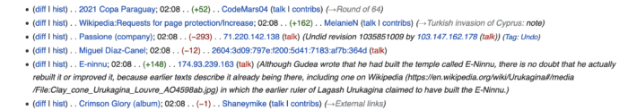
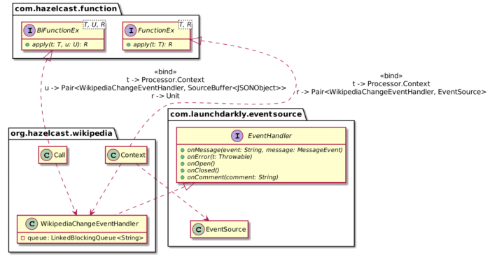
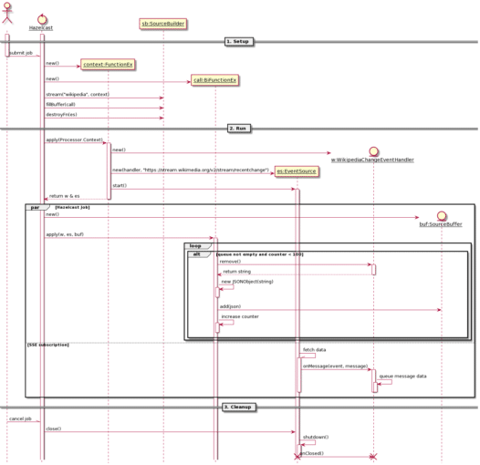
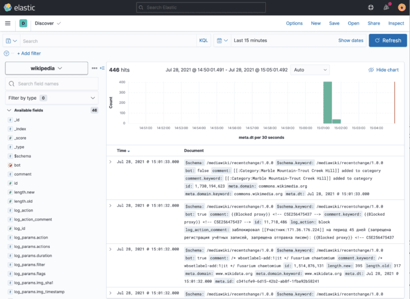
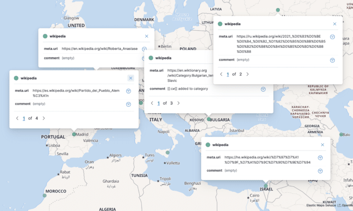
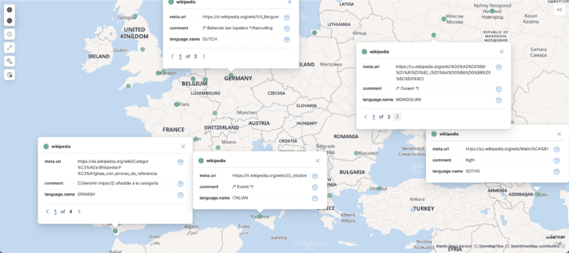
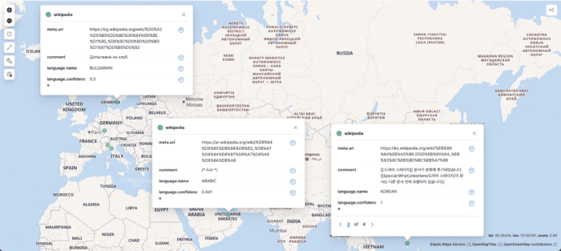

A lot, if not all, data science projects require some data visualization front-end to display the results for humans to analyze. Python seems to boast the most potent libraries, but do not lose hope if you're a Java developer (or if you're proficient in another language as well).

In this article I will describe how you can benefit from such a data visualization front-end without writing a single line of code.

I infer that you are already familiar with [Wikipedia](https://wikipedia.org/). If you do not, Wikipedia is an online encyclopedia curated by the community. In their own words:
> Wikipedia is a free content, multilingual online encyclopedia written and maintained by a community of volunteer contributors through a model of open collaboration, using a wiki-based editing system.

The above is actually an excerpt of the [Wikipedia entry](https://en.wikipedia.org/wiki/Wikipedia) on Wikipedia itself. Very meta.

The idea is to let anybody write anything on any subject and let the community decide whether the piece improves the body of knowledge - or not. You can think about this system as a worldwide Git review.

Even with this in place, it would be easy to overflow the reviewing capacity of the community by sending lots and lots of changes. To prevent such abuse, would-be contributors need to create an account first. However, it adds a layer of friction. If I want to contribute by fixing a typo, adding an image, or any other tiny task, creating my account would be more time-consuming than contributing. To allow for one-time contributions, Wikipedia allows anonymous changes. However, we get back to square one regarding abuses. To cover that, Wikipedia logs your in that case. The IP will appear in the change history instead of the account's name.

Now, my use-case is about visualizing worldwide, anonymous contributions. I'll first read the data from Wikipedia, filter out changes by authenticated accounts, infer the location of the change, infer the language of the change, and then display them on a worldwide map. From this point, I'd explore the changes visually and say that language and location match somehow.

We are going to achieve that by following a step-by-step process.

The first step on our hands is actually to get data in, *i.e.* , to get the changes from Wikipedia into our data store. It's pretty straightforward, as Wikipedia itself provides its changes on a [dedicated Recent Changes page](https://en.wikipedia.org/wiki/Special:RecentChanges). If you press the "Live Update" button, you can see the list is updated in real-time (or very close to). Here's a screenshot of the changes at the time of the writing of this post:



Now is the time to create a data pipeline to get this data in [Hazelcast](https://hazelcast.com/). Note that if you want to follow along, [the project is readily available on GitHub](https://github.com/hazelcast-demos/wikipedia-changes).

Wikipedia provides changes through [Server-Sent Events](https://fr.wikipedia.org/wiki/Server-sent_events). In short, with , you register a client to the endpoint, and every time new data comes in, you are notified and can act accordingly. On the , a couple of SSE-compatible clients are available, including Spring WebClient. Instead, I chose to use [OkHttp EventSource](https://github.com/launchdarkly/okhttp-eventsource) because it's lightweight - it only depends on OkHttp, and its usage is relatively straightforward.

Here's an excerpt from the POM:

```xml
<dependency>
    <groupId>com.hazelcast</groupId>
    <artifactId>hazelcast</artifactId>
    <version>${hazelcast.version}</version>
</dependency>
<dependency>
    <groupId>com.launchdarkly</groupId>
    <artifactId>okhttp-eventsource</artifactId>
    <version>2.3.2</version>
</dependency>
```

Hazelcast data pipelines work by regularly polling the source. With an HTTP endpoint, that's straightforward, but with SSE, not so much as SSE relies on subscription. Hence, we need to implement a custom `Source` and design it around an internal queue to store the changes as they arrive, while polling will dequeue and send them further down the pipeline.

We design the code around the following components:



* `Context` manages the subscription. It creates a new `WikipediaChangeEventHandler` instance and registers it as an observer of the SSE stream.
* `WikipediaChangeEventHandler` is the subscribing part. Every time a change happens, it gets notified and queues the change payload in its internal queue.
* The Hazelcast engine calls `Call` at regular intervals. When it happens, it dequeues items from `WikipediaChangeEventHandler`, transforms the plain string into a `JSONObject`, and puts the latter in the data pipeline buffer.

From a dynamic point of view, the system can be modeled as:



Running the code outputs something like this:

```json
{"server_script_path":"/w","server_name":"en.wikipedia.org","$schema":"/mediawiki/recentchange/1.0.0","bot":false,"wiki":"enwiki","type":"categorize","title":"Category:Biography articles without listas parameter","meta":{"dt":"2021-07-28T04:07:40Z","partition":0,"offset":363427323,"stream":"mediawiki.recentchange","domain":"en.wikipedia.org","topic":"codfw.mediawiki.recentchange","id":"01592c7a-03f1-46cd-9472-3bbe63aff0ec","uri":"https://en.wikipedia.org/wiki/Category:Biography_articles_without_listas_parameter","request_id":"b49c3b98-2064-44da-aab4-ab7b3bf65bdd"},"namespace":14,"comment":"[[:Talk:Jeff S. Klotz]] removed from category","id":1406951122,"server_url":"https://en.wikipedia.org","user":"Lepricavark","parsedcomment":"<a href=\"/wiki/Talk:Jeff_S._Klotz\" title=\"Talk:Jeff S. Klotz\">Talk:Jeff S. Klotz<\/a> removed from category","timestamp":1627445260}
{"server_script_path":"/w","server_name":"commons.wikimedia.org","$schema":"/mediawiki/recentchange/1.0.0","bot":true,"wiki":"commonswiki","type":"categorize","title":"Category:Flickr images reviewed by FlickreviewR 2","meta":{"dt":"2021-07-28T04:07:42Z","partition":0,"offset":363427324,"stream":"mediawiki.recentchange","domain":"commons.wikimedia.org","topic":"codfw.mediawiki.recentchange","id":"68f3a372-112d-4dae-af8f-25d88984f1d8","uri":"https://commons.wikimedia.org/wiki/Category:Flickr_images_reviewed_by_FlickreviewR_2","request_id":"1a132610-85e0-4954-9329-9e44691970aa"},"namespace":14,"comment":"[[:File:Red squirrel (51205279267).jpg]] added to category","id":1729953358,"server_url":"https://commons.wikimedia.org","user":"FlickreviewR 2","parsedcomment":"<a href=\"/wiki/File:Red_squirrel_(51205279267).jpg\" title=\"File:Red squirrel (51205279267).jpg\">File:Red squirrel (51205279267).jpg<\/a> added to category","timestamp":1627445262}
{"server_script_path":"/w","server_name":"commons.wikimedia.org","$schema":"/mediawiki/recentchange/1.0.0","bot":true,"wiki":"commonswiki","type":"categorize","title":"Category:Flickr review needed","meta":{"dt":"2021-07-28T04:07:42Z","partition":0,"offset":363427325,"stream":"mediawiki.recentchange","domain":"commons.wikimedia.org","topic":"codfw.mediawiki.recentchange","id":"b4563ed9-a6f2-40de-9e71-c053f5352846","uri":"https://commons.wikimedia.org/wiki/Category:Flickr_review_needed","request_id":"1a132610-85e0-4954-9329-9e44691970aa"},"namespace":14,"comment":"[[:File:Red squirrel (51205279267).jpg]] removed from category","id":1729953359,"server_url":"https://commons.wikimedia.org","user":"FlickreviewR 2","parsedcomment":"<a href=\"/wiki/File:Red_squirrel_(51205279267).jpg\" title=\"File:Red squirrel (51205279267).jpg\">File:Red squirrel (51205279267).jpg<\/a> removed from category","timestamp":1627445262}
{"server_script_path":"/w","server_name":"www.wikidata.org","$schema":"/mediawiki/recentchange/1.0.0","minor":false,"bot":true,"wiki":"wikidatawiki","length":{"new":31968,"old":31909},"type":"edit","title":"Q40652","revision":{"new":1468164253,"old":1446892882},"patrolled":true,"meta":{"dt":"2021-07-28T04:07:43Z","partition":0,"offset":363427326,"stream":"mediawiki.recentchange","domain":"www.wikidata.org","topic":"codfw.mediawiki.recentchange","id":"70784dde-0360-4292-9f62-81323ced9aa7","uri":"https://www.wikidata.org/wiki/Q40652","request_id":"f9686303-ffed-4c62-8532-bf870288ff55"},"namespace":0,"comment":"/* wbsetaliases-add:1|zh */ 蒂托, [[User:Cewbot#Import labels/aliases|import label/alias]] from [[zh:巴西國家足球隊]], [[zh:何塞·保罗·贝塞拉·马希尔·儒尼奥尔]], [[zh:2018年國際足協世界盃參賽球員名單]], [[zh:埃德爾·米利唐]], [[zh:加布里埃爾·馬丁內利]], [[zh:2019年南美超级德比杯]], [[zh:2019年美洲杯决赛]], [[zh:2019年美洲杯参赛名单]], [[zh:2021年美洲杯B组]], [[zh:2021年美洲國家盃決賽]]","id":1514670479,"server_url":"https://www.wikidata.org","user":"Cewbot","parsedcomment":"\u200e<span dir=\"auto\"><span class=\"autocomment\">Added Chinese alias: <\/span><\/span> 蒂托, <a href=\"/wiki/User:Cewbot#Import_labels/aliases\" title=\"User:Cewbot\">import label/alias<\/a> from <a href=\"https://zh.wikipedia.org/wiki/%E5%B7%B4%E8%A5%BF%E5%9C%8B%E5%AE%B6%E8%B6%B3%E7%90%83%E9%9A%8A\" class=\"extiw\" title=\"zh:巴西國家足球隊\">zh:巴西國家足球隊<\/a>, <a href=\"https://zh.wikipedia.org/wiki/%E4%BD%95%E5%A1%9E%C2%B7%E4%BF%9D%E7%BD%97%C2%B7%E8%B4%9D%E5%A1%9E%E6%8B%89%C2%B7%E9%A9%AC%E5%B8%8C%E5%B0%94%C2%B7%E5%84%92%E5%B0%BC%E5%A5%A5%E5%B0%94\" class=\"extiw\" title=\"zh:何塞·保罗·贝塞拉·马希尔·儒尼奥尔\">zh:何塞·保罗·贝塞拉·马希尔·儒尼奥尔<\/a>, <a href=\"https://zh.wikipedia.org/wiki/2018%E5%B9%B4%E5%9C%8B%E9%9A%9B%E8%B6%B3%E5%8D%94%E4%B8%96%E7%95%8C%E7%9B%83%E5%8F%83%E8%B3%BD%E7%90%83%E5%93%A1%E5%90%8D%E5%96%AE\" class=\"extiw\" title=\"zh:2018年國際足協世界盃參賽球員名單\">zh:2018年國際足協世界盃參賽球員名單<\/a>, <a href=\"https://zh.wikipedia.org/wiki/%E5%9F%83%E5%BE%B7%E7%88%BE%C2%B7%E7%B1%B3%E5%88%A9%E5%94%90\" class=\"extiw\" title=\"zh:埃德爾·米利唐\">zh:埃德爾·米利唐<\/a>, <a href=\"https://zh.wikipedia.org/wiki/%E5%8A%A0%E5%B8%83%E9%87%8C%E5%9F%83%E7%88%BE%C2%B7%E9%A6%AC%E4%B8%81%E5%85%A7%E5%88%A9\" class=\"extiw\" title=\"zh:加布里埃爾·馬丁內利\">zh:加布里埃爾·馬丁內利<\/a>, <a href=\"https://zh.wikipedia.org/wiki/2019%E5%B9%B4%E5%8D%97%E7%BE%8E%E8%B6%85%E7%BA%A7%E5%BE%B7%E6%AF%94%E6%9D%AF\" class=\"extiw\" title=\"zh:2019年南美超级德比杯\">zh:2019年南美超级德比杯<\/a>, <a href=\"https://zh.wikipedia.org/wiki/2019%E5%B9%B4%E7%BE%8E%E6%B4%B2%E6%9D%AF%E5%86%B3%E8%B5%9B\" class=\"extiw\" title=\"zh:2019年美洲杯决赛\">zh:2019年美洲杯决赛<\/a>, <a href=\"https://zh.wikipedia.org/wiki/2019%E5%B9%B4%E7%BE%8E%E6%B4%B2%E6%9D%AF%E5%8F%82%E8%B5%9B%E5%90%8D%E5%8D%95\" class=\"extiw\" title=\"zh:2019年美洲杯参赛名单\">zh:2019年美洲杯参赛名单<\/a>, <a href=\"https://zh.wikipedia.org/wiki/2021%E5%B9%B4%E7%BE%8E%E6%B4%B2%E6%9D%AFB%E7%BB%84\" class=\"extiw\" title=\"zh:2021年美洲杯B组\">zh:2021年美洲杯B组<\/a>, <a href=\"https://zh.wikipedia.org/wiki/2021%E5%B9%B4%E7%BE%8E%E6%B4%B2%E5%9C%8B%E5%AE%B6%E7%9B%83%E6%B1%BA%E8%B3%BD\" class=\"extiw\" title=\"zh:2021年美洲國家盃決賽\">zh:2021年美洲國家盃決賽<\/a>","timestamp":1627445263}
{"server_script_path":"/w","server_name":"www.wikidata.org","$schema":"/mediawiki/recentchange/1.0.0","minor":false,"bot":true,"wiki":"wikidatawiki","length":{"new":239,"old":161},"type":"edit","title":"Q107674623","revision":{"new":1468164250,"old":1468164243},"patrolled":true,"meta":{"dt":"2021-07-28T04:07:43Z","partition":0,"offset":363427327,"stream":"mediawiki.recentchange","domain":"www.wikidata.org","topic":"codfw.mediawiki.recentchange","id":"40260137-ee52-4a67-b024-22d3cf86907a","uri":"https://www.wikidata.org/wiki/Q107674623","request_id":"db6e073a-19f6-4658-9425-7992b34b4208"},"namespace":0,"comment":"/* wbsetlabel-add:1|de */ Favolaschia filopes","id":1514670480,"server_url":"https://www.wikidata.org","user":"SuccuBot","parsedcomment":"\u200e<span dir=\"auto\"><span class=\"autocomment\">Bezeichnung für [de] hinzugefügt: <\/span><\/span> Favolaschia filopes","timestamp":1627445263}
{"server_script_path":"/w","server_name":"ko.wikipedia.org","$schema":"/mediawiki/recentchange/1.0.0","minor":true,"bot":true,"wiki":"kowiki","length":{"new":1158,"old":1161},"type":"edit","title":"이시다테 야스키","revision":{"new":29895993,"old":26098259},"meta":{"dt":"2021-07-28T04:07:43Z","partition":0,"offset":363427328,"stream":"mediawiki.recentchange","domain":"ko.wikipedia.org","topic":"codfw.mediawiki.recentchange","id":"c23bdb77-e88c-48d3-9d24-3c4dd8ef1dbf","uri":"https://ko.wikipedia.org/wiki/%EC%9D%B4%EC%8B%9C%EB%8B%A4%ED%85%8C_%EC%95%BC%EC%8A%A4%ED%82%A4","request_id":"0010e77b-fbcd-4de8-a5ad-4616adbbd6d4"},"namespace":0,"comment":"봇: 분류 이름 변경 (분류:1984년 태어남 → [[분류:1984년 출생]])","id":56333828,"server_url":"https://ko.wikipedia.org","user":"TedBot","parsedcomment":"봇: 분류 이름 변경 (분류:1984년 태어남 → <a href=\"/wiki/%EB%B6%84%EB%A5%98:1984%EB%85%84_%EC%B6%9C%EC%83%9D\" title=\"분류:1984년 출생\">분류:1984년 출생<\/a>)","timestamp":1627445263}
{"server_script_path":"/w","server_name":"commons.wikimedia.org","$schema":"/mediawiki/recentchange/1.0.0","minor":false,"bot":true,"wiki":"commonswiki","length":{"new":3864,"old":527},"type":"edit","title":"File:Albizia kalkora 06.jpg","revision":{"new":577195372,"old":577193453},"patrolled":true,"meta":{"dt":"2021-07-28T04:07:44Z","partition":0,"offset":363427329,"stream":"mediawiki.recentchange","domain":"commons.wikimedia.org","topic":"codfw.mediawiki.recentchange","id":"1a7fcb55-dec7-4303-b757-19f6a6a4dcdd","uri":"https://commons.wikimedia.org/wiki/File:Albizia_kalkora_06.jpg","request_id":"7f841b4a-ac70-4c2b-a148-bc07696ccf7a"},"namespace":6,"comment":"/* wbeditentity-update:0| */ Adding structured data: date, camera, author, copyright & source","id":1729953360,"server_url":"https://commons.wikimedia.org","user":"BotMultichillT","parsedcomment":"\u200e<span dir=\"auto\"><span class=\"autocomment\">Changed an entity: <\/span><\/span> Adding structured data: date, camera, author, copyright & source","timestamp":1627445264}
{"server_script_path":"/w","server_name":"id.wikipedia.org","$schema":"/mediawiki/recentchange/1.0.0","minor":true,"bot":true,"wiki":"idwiki","length":{"new":977,"old":962},"type":"edit","title":"Euporus linearis","revision":{"new":18801346,"old":16068468},"patrolled":true,"meta":{"dt":"2021-07-28T04:07:43Z","partition":0,"offset":363427330,"stream":"mediawiki.recentchange","domain":"id.wikipedia.org","topic":"codfw.mediawiki.recentchange","id":"6c3882f9-9fd0-4f43-ab69-e538762c7981","uri":"https://id.wikipedia.org/wiki/Euporus_linearis","request_id":"dea59b42-7c97-4cbc-9384-5d8836a981ec"},"namespace":0,"comment":"[[Wikipedia:Bot|Bot]]: fixed → [[Kategori:Taxonbar tanpa parameter from|taxonbar tanpa parameter from]]","id":42309169,"server_url":"https://id.wikipedia.org","user":"HsfBot","parsedcomment":"<a href=\"/wiki/Wikipedia:Bot\" title=\"Wikipedia:Bot\">Bot<\/a>: fixed → <a href=\"/wiki/Kategori:Taxonbar_tanpa_parameter_from\" title=\"Kategori:Taxonbar tanpa parameter from\">taxonbar tanpa parameter from<\/a>","timestamp":1627445263}
{"server_script_path":"/w","server_name":"www.wikidata.org","$schema":"/mediawiki/recentchange/1.0.0","minor":false,"bot":false,"wiki":"wikidatawiki","length":{"new":25025,"old":24908},"type":"edit","title":"Q80075231","revision":{"new":1468164255,"old":1467697536},"patrolled":true,"meta":{"dt":"2021-07-28T04:07:44Z","partition":0,"offset":363427331,"stream":"mediawiki.recentchange","domain":"www.wikidata.org","topic":"codfw.mediawiki.recentchange","id":"720f6507-1ea1-4665-b1b9-1665c97450a9","uri":"https://www.wikidata.org/wiki/Q80075231","request_id":"43b7d511-007f-4005-a562-5002c7e0aff4"},"namespace":0,"comment":"/* wbsetdescription-add:1|dv */ އަކުއިލާ ނަކަތުގައިވާ ތަރިއެއް, [[:toollabs:quickstatements/#/batch/60416|batch #60416]]","id":1514670481,"server_url":"https://www.wikidata.org","user":"EN-Jungwon","parsedcomment":"\u200e<span dir=\"auto\"><span class=\"autocomment\">Added [dv] description: <\/span><\/span> އަކުއިލާ ނަކަތުގައިވާ ތަރިއެއް, <a href=\"https://iw.toolforge.org/quickstatements/#.2Fbatch.2F60416\" class=\"extiw\" title=\"toollabs:quickstatements/\">batch #60416<\/a>","timestamp":1627445264}
{"server_script_path":"/w","server_name":"www.wikidata.org","$schema":"/mediawiki/recentchange/1.0.0","minor":false,"bot":false,"wiki":"wikidatawiki","length":{"new":5312,"old":4884},"type":"edit","title":"Q85766437","revision":{"new":1468164246,"old":1342535335},"patrolled":true,"meta":{"dt":"2021-07-28T04:07:42Z","partition":0,"offset":363427332,"stream":"mediawiki.recentchange","domain":"www.wikidata.org","topic":"codfw.mediawiki.recentchange","id":"ad173600-09b7-4ccd-9490-4a60f6a432ea","uri":"https://www.wikidata.org/wiki/Q85766437","request_id":"1228a17e-2baa-46cc-a3bc-2049a62982c9"},"namespace":0,"comment":"/* wbcreateclaim-create:1| */ [[Property:P7937]]: [[Q7366]], [[:toollabs:quickstatements/#/batch/60404|batch #60404]]","id":1514670483,"server_url":"https://www.wikidata.org","user":"Moebeus","parsedcomment":"\u200e<span dir=\"auto\"><span class=\"autocomment\">Created claim: <\/span><\/span> <a href=\"/wiki/Property:P7937\" title=\"Property:P7937\">Property:P7937<\/a>: <a href=\"/wiki/Q7366\" title=\"Q7366\">Q7366<\/a>, <a href=\"https://iw.toolforge.org/quickstatements/#.2Fbatch.2F60404\" class=\"extiw\" title=\"toollabs:quickstatements/\">batch #60404<\/a>","timestamp":1627445262}
{"server_script_path":"/w","server_name":"www.wikidata.org","$schema":"/mediawiki/recentchange/1.0.0","minor":false,"bot":false,"wiki":"wikidatawiki","length":{"new":5134,"old":5126},"type":"edit","title":"Q12444793","revision":{"new":1468164254,"old":1413396080},"patrolled":false,"meta":{"dt":"2021-07-28T04:07:43Z","partition":0,"offset":363427333,"stream":"mediawiki.recentchange","domain":"www.wikidata.org","topic":"codfw.mediawiki.recentchange","id":"c01d52c5-c476-4554-814d-513342e04686","uri":"https://www.wikidata.org/wiki/Q12444793","request_id":"6d0a32b9-1234-4c8e-a02a-d92608f06d33"},"namespace":0,"comment":"/* wbsetdescription-set:1|hi */ भारत के उत्तराखण्ड राज्य का एक गाँव bikash","id":1514670482,"server_url":"https://www.wikidata.org","user":"2409:4061:219C:613E:DFD9:6BD4:F234:E7E0","parsedcomment":"\u200e<span dir=\"auto\"><span class=\"autocomment\">बदला [hi] विवरण: <\/span><\/span> भारत के उत्तराखण्ड राज्य का एक गाँव bikash","timestamp":1627445263}
{"server_script_path":"/w","server_name":"www.wikidata.org","$schema":"/mediawiki/recentchange/1.0.0","minor":false,"bot":false,"wiki":"wikidatawiki","length":{"new":22936,"old":22819},"type":"edit","title":"Q80075234","revision":{"new":1468164258,"old":1467697544},"patrolled":true,"meta":{"dt":"2021-07-28T04:07:44Z","partition":0,"offset":363427334,"stream":"mediawiki.recentchange","domain":"www.wikidata.org","topic":"codfw.mediawiki.recentchange","id":"7016afae-6691-4dca-bfaf-a5a3363edf31","uri":"https://www.wikidata.org/wiki/Q80075234","request_id":"aa4f6828-149d-4feb-a3cf-cd39902773fe"},"namespace":0,"comment":"/* wbsetdescription-add:1|dv */ އަކުއިލާ ނަކަތުގައިވާ ތަރިއެއް, [[:toollabs:quickstatements/#/batch/60416|batch #60416]]","id":1514670484,"server_url":"https://www.wikidata.org","user":"EN-Jungwon","parsedcomment":"\u200e<span dir=\"auto\"><span class=\"autocomment\">Added [dv] description: <\/span><\/span> އަކުއިލާ ނަކަތުގައިވާ ތަރިއެއް, <a href=\"https://iw.toolforge.org/quickstatements/#.2Fbatch.2F60416\" class=\"extiw\" title=\"toollabs:quickstatements/\">batch #60416<\/a>","timestamp":1627445264}
{"server_script_path":"/w","server_name":"de.wikipedia.org","$schema":"/mediawiki/recentchange/1.0.0","minor":false,"bot":true,"wiki":"dewiki","length":{"new":17069,"old":17075},"type":"edit","title":"Liste der Biografien/Caro","revision":{"new":214271460,"old":213857611},"meta":{"dt":"2021-07-28T04:07:43Z","partition":0,"offset":363427335,"stream":"mediawiki.recentchange","domain":"de.wikipedia.org","topic":"codfw.mediawiki.recentchange","id":"6618b0ab-eadf-405a-a474-ec2ad9fef8bb","uri":"https://de.wikipedia.org/wiki/Liste_der_Biografien/Caro","request_id":"23181b86-03de-4153-ad99-e7e20e611ed6"},"namespace":0,"comment":"Bot: Automatische Aktualisierung, siehe [[Benutzer:APPERbot/LdB]]","id":309672385,"server_url":"https://de.wikipedia.org","user":"APPERbot","parsedcomment":"Bot: Automatische Aktualisierung, siehe <a href=\"/wiki/Benutzer:APPERbot/LdB\" title=\"Benutzer:APPERbot/LdB\">Benutzer:APPERbot/LdB<\/a>","timestamp":1627445263}
```

Here's the last entry, but formatted for better understanding:

```json
{
  "$schema": "/mediawiki/recentchange/1.0.0",
  "bot": true,
  "comment": "Bot: Automatische Aktualisierung, siehe [[Benutzer:APPERbot/LdB]]",
  "id": 309672385,
  "length": {
    "new": 17069,
    "old": 17075
  },
  "meta": {
    "domain": "de.wikipedia.org",
    "dt": "2021-07-28T04:07:43Z",
    "id": "6618b0ab-eadf-405a-a474-ec2ad9fef8bb",
    "offset": 363427335,
    "partition": 0,
    "request_id": "23181b86-03de-4153-ad99-e7e20e611ed6",
    "stream": "mediawiki.recentchange",
    "topic": "codfw.mediawiki.recentchange",
    "uri": "https://de.wikipedia.org/wiki/Liste_der_Biografien/Caro"
  },
  "minor": false,
  "namespace": 0,
  "parsedcomment": "Bot: Automatische Aktualisierung, siehe Benutzer:APPERbot/LdB",
  "revision": {
    "new": 214271460,
    "old": 213857611
  },
  "server_name": "de.wikipedia.org",
  "server_script_path": "/w",
  "server_url": "https://de.wikipedia.org",
  "timestamp": 1627445263,
  "title": "Liste der Biografien/Caro",
  "type": "edit",
  "user": "APPERbot",
  "wiki": "dewiki"
}
```

As I mentioned in the introduction, we have a fantastic tool at our disposal for data visualization that doesn't require writing code, and that tool is Kibana. Kibana is part of the so-called ELK stack:

* Elasticsearch provides the storage and indexing part
* Finally, Kibana offers dashboards and widgets to explore and visualize data stored in Elasticsearch


Instead of writing to the standard output, we are going to write to an Elasticsearch instance. For that, we need to create the `Sink`. While you can use the Elasticsearch API directly, Hazelcast provides an extension to ease your job. Just add the `com.hazelcast.jet:hazelcast-jet-elasticsearch-7` JAR to the classpath, and you can write the following:

```java
private val clientBuilder = {
  val env = System.getenv()
  val user = env.getOrDefault("ELASTICSEARCH_USERNAME", "elastic")      // 1
  val password = env.getOrDefault("ELASTICSEARCH_PASSWORD", "changeme") // 1
  val host = env.getOrDefault("ELASTICSEARCH_HOST", "localhost")        // 1
  val port = env.getOrDefault("ELASTICSEARCH_PORT", "9200").toInt()     // 1
  ElasticClients.client(user, password, host, port)                     // 2
}

val elasticsearch = ElasticSinks.elastic(clientBuilder) {
  IndexRequest("wikipedia").source(it.toString(), XContentType.JSON)    // 3
}
```

1. Provide some parameterization to allow to run in different environments
2. Connect to the configured Elasticsearch instance
3. Effectively send the data to . Under the cover, Hazelcast will batch the requests.

Now, the pipeline can be improved:

```java
val pipeline = Pipeline.create().apply {
  readFrom(wikipedia)
    .withTimestamps({ it.getLong("timestamp") }, 100)
    .writeTo(elasticsearch)
}
Hazelcast.bootstrappedInstance().jet.newJob(pipeline)
```

The icing on the cake, with good naming, the Hazelcast API allows people who are not developers to follow the logic along.

Running the above pipeline, we can already see the results in Kibana. In case you don't have an instance available, the GitHub repository provides a `docker-compose.yml` file. You only need to start the infrastructure with `docker compose up`.

1. Navigate to <http://localhost:5601> with your favorite browser
2. Authenticate with login `elastic` and password `changeme`
3. Click on the "Create index pattern" button
4. Enter `wikipedia` for the index name
5. Click on the "Next step" button
6. Choose field for `meta.dt` for the Time field
7. Finalize by clicking on the "Create index pattern" button
8. On the left menu, select Analytics → Discover

You should see something like this:



Within this view, you can see all ingested documents. To explore further, you can choose the fields you want to see (on the right) and filter out documents based on their structure (in the Search bar above).

If you tried executing the job with the code at this step, you might have noticed that after some time, Elasticsearch stops ingesting data. Looking at the Hazelcast logs, you may notice a similar stack trace:

```
15:02:34.898 [ WARN] [c.h.j.i.e.TaskletExecutionService] [192.168.1.62]:5701 [dev] [5.0-BETA-1] Exception in ProcessorTasklet{068f-8bfa-4080-0001/elasticSink#0}
com.hazelcast.jet.JetException: failure in bulk execution:
[0]: index [wikipedia], type [_doc], id [PD017XoBfeUJ26i8qT-H], message [ElasticsearchException[Elasticsearch exception [type=mapper_parsing_exception, reason=object mapping for [log_params] tried to parse field [null] as object, but found a concrete value]]]
  at com.hazelcast.jet.elastic.ElasticSinkBuilder$BulkContext.lambda$flush$0(ElasticSinkBuilder.java:248)
  at com.hazelcast.jet.elastic.impl.RetryUtils.withRetry(RetryUtils.java:57)
  at com.hazelcast.jet.elastic.ElasticSinkBuilder$BulkContext.flush(ElasticSinkBuilder.java:244)
  at com.hazelcast.function.ConsumerEx.accept(ConsumerEx.java:47)
  at com.hazelcast.jet.impl.connector.WriteBufferedP.process(WriteBufferedP.java:73)
  at com.hazelcast.jet.impl.processor.ProcessorWrapper.process(ProcessorWrapper.java:97)
  at com.hazelcast.jet.impl.pipeline.FunctionAdapter$AdaptingProcessor.process(FunctionAdapter.java:226)
  at com.hazelcast.jet.impl.execution.ProcessorTasklet.lambda$processInbox$2f647568$2(ProcessorTasklet.java:439)
  at com.hazelcast.jet.function.RunnableEx.run(RunnableEx.java:31)
  at com.hazelcast.jet.impl.util.Util.doWithClassLoader(Util.java:498)
  at com.hazelcast.jet.impl.execution.ProcessorTasklet.processInbox(ProcessorTasklet.java:439)
  at com.hazelcast.jet.impl.execution.ProcessorTasklet.stateMachineStep(ProcessorTasklet.java:305)
  at com.hazelcast.jet.impl.execution.ProcessorTasklet.stateMachineStep(ProcessorTasklet.java:300)
  at com.hazelcast.jet.impl.execution.ProcessorTasklet.stateMachineStep(ProcessorTasklet.java:281)
  at com.hazelcast.jet.impl.execution.ProcessorTasklet.call(ProcessorTasklet.java:255)
  at com.hazelcast.jet.impl.execution.TaskletExecutionService$BlockingWorker.run(TaskletExecutionService.java:298)
  at java.base/java.util.concurrent.Executors$RunnableAdapter.call(Executors.java:515)
  at java.base/java.util.concurrent.FutureTask.run(FutureTask.java:264)
  at java.base/java.util.concurrent.ThreadPoolExecutor.runWorker(ThreadPoolExecutor.java:1128)
  at java.base/java.util.concurrent.ThreadPoolExecutor$Worker.run(ThreadPoolExecutor.java:628)
  at java.base/java.lang.Thread.run(Thread.java:829)
```

It happens because of the way Elasticsearch works. As we didn't provide any explicit index schema, Elasticsearch inferred one for us from the first data payload it received. In this case, the `log_params` attribute has mostly the following structure:

```
"log_params": {
  "userid": 108038
}
```

Hence, Elasticsearch recognizes it as a JSON object with the `userid` property. Yet, sometimes, the stream contains `"log_params":[]`, which is JSON array. Elasticsearch cannot reconcile between the two and throws the above exception.

To fix this, we can either filter out such data or transform the empty array property in an empty object property. As we would like to keep as much data as possible, let's choose the second option. As of now, we don't know if we will need to do it for another field, so it might be a good idea to make it generic:

```java
class MakeFieldObjectIfArray(private val fieldName: String) : FunctionEx<JSONObject, JSONObject> { // 1
  override fun applyEx(json: JSONObject) = json.apply {           // 2
    if (json.has(fieldName) && json.get(fieldName) is JSONArray)  // 3
      put(fieldName, JSONObject())                                // 4
  }
}

val pipeline = Pipeline.create().apply {
  readFrom(wikipedia)
    .withTimestamps({ it.getLong("timestamp") }, 100)
    .map(MakeFieldObjectIfArray("log_params"))                    // 5
    .writeTo(elasticsearch)
}
```

1. Define a `FunctionEx` that takes a `JSONObject` as a parameter and returns a `JSONObject`
2. Return the same `JSONObject` with the following changes applied
3. If the object has a specific field and if this field is a `JSONArray`
4. Then replace the array with an empty `JSONObject`
5. Map each item in the pipeline using the previously-defined `FunctionEx`

Rerunning the pipeline now works without any glitch!

Because the pipeline is stable, it's time to refactor to build upon solid foundations. The refactoring goes along two axes:

* Code readability, developer-oriented
* "Operationability", ops-oriented

On the developer side, we can improve the experience by leveraging Hazelcast's API. `GeneralStage` offers the usual pipeline primitives: `map()`, `flatMap()`, `filter()` and a couple of more specialized ones. However, at this granularity level, we'd rather focus on the *what* instead of the *how* . For this reason, `StreamStage` also provides an `apply()` function that transforms a `StreamStage` into another `StreamStage`. Let's use it:

```java
class MakeFieldObjectIfArray(private val fieldName: String) : FunctionEx<StreamStage, StreamStage> {
  override fun applyEx(stage: StreamStage) = stage.map { json ->
    json.apply {
      if (json.has(fieldName) && json.get(fieldName) is JSONArray)
        put(fieldName, JSONObject())
    }
  }
}
```

To use it:

```java
val pipeline = Pipeline.create().apply {
  readFrom(wikipedia)
    .withTimestamps({ it.getLong("timestamp") }, 100)
    .apply(MakeFieldObjectIfArray("log_params"))       // 1
    .writeTo(elasticsearch)
}
```

1. Focus on the what

The next step is to improve the "operability". The only way to check what happens is to check Elasticsearch. If something happens in between (like above), it's hard to pinpoint exactly what the problem is. For that reason, we should add logging:

```java
val pipeline = Pipeline.create().apply {
  readFrom(wikipedia)
    .withTimestamps({ it.getLong("timestamp") }, 100)
    .apply(MakeFieldObjectIfArray("log_params"))
    .peek()                                           // 1
    .writeTo(elasticsearch)
}
```

1. We log every item to the standard output

With a lot of data, this can be too much noise. A sample is enough:

```java
fun sampleEvery(frequency: Int) = PredicateEx {
  Random.nextInt(frequency) == 0                      // 1
}

val toStringFn = FunctionEx<Any?, String> {
  it?.toString()                                      // 2
}
```

1. Return `true` if the random value between `0` and `frequency` is `0`
2. Null-safe `toString()`

We can now put this code to good use:

```java
val pipeline = Pipeline.create().apply {
  readFrom(wikipedia)
    .withTimestamps({ it.getLong("timestamp") }, 100)
    .apply(MakeFieldObjectIfArray("log_params"))
    .peek(sampleEvery(50), toStringFn)                // 1
    .writeTo(elasticsearch)
}
```

1. Sample one item per 50 **on average**

Also, Hazelcast provides an API to name each pipeline step.

```java
class MakeFieldObjectIfArray(private val fieldName: String) : FunctionEx {
  override fun applyEx(stage: StreamStage) = stage
    .setName("remove-log-params-if-array")            // 1
    .map { json ->
      json.apply {
        if (json.has(fieldName) && json.get(fieldName) is JSONArray)
          put(fieldName, JSONObject())
      }
    }
}
```

With this, launching the pipeline outputs the following log:

```
digraph DAG {
  "replace-log-params-if-array" [localParallelism=1];
  "replace-log-params-if-array-add-timestamps" [localParallelism=1];
  "map" [localParallelism=16];
  "elasticSink" [localParallelism=2];
  "replace-log-params-if-array" -> "replace-log-params-if-array-add-timestamps" [label="isolated", queueSize=1024];
  "replace-log-params-if-array-add-timestamps" -> "map" [queueSize=1024];
  "map" -> "elasticSink" [queueSize=1024];
}
```

Looking at the existing data, we can notice two types of contributions:

1. Contributions by authenticated users, *e.g.* , `GeographBot`
2. Anonymous contributions, *e.g.* :
   * `84.243.214.62`, for IP v4
   * `240D:2:A605:7600:A1DF:B7CA:5AF8:D971`, for IP v6

There's no easy way to geo-locate using the former, but libraries and online APIs are available that leverage the latter. For this post, I've chosen to use [MaxMind GeoIP database](https://www.maxmind.com/en/solutions/geoip2-enterprise-product-suite/anonymous-ip-database). It provides both a local file and a library to leverage it.

Let's add the necessary dependencies:

```xml
<dependency>
    <groupId>commons-validator</groupId>
    <artifactId>commons-validator</artifactId>
    <version>1.7</version>
</dependency>
<dependency>
    <groupId>com.maxmind.geoip2</groupId>
    <artifactId>geoip2</artifactId>
    <version>2.15.0</version>
</dependency>
```

Then, we can add an additional step in the processing pipeline to check whether the user is an IP and add the info if it is:

```kotlin
val enrichWithLocation = { stage: StreamStage ->
  stage.setName("enrich-with-location")                             // 1
    .mapUsingService(ServiceFactories.sharedService(databaseReaderSupplier)) { reader: DatabaseReader, json: JSONObject ->
       json.apply {
         if (!json.optBoolean("bot") && json.has("user")) {         // 2
           val user = json.getString("user")
           if (InetAddressValidator.getInstance().isValid(user)) {  // 3
             reader.tryCity(InetAddress.getByName(user))            // 4
                   .ifPresent { json.withLocationFrom(it) }         // 5
           }
         }
      }
    }
}

val pipeline = Pipeline.create().apply {
  readFrom(wikipedia)
    .withTimestamps({ it.getLong("timestamp") }, 100)
    .apply(MakeFieldObjectIfArray("log_params"))
    .apply(enrichWithLocation)                                      // 6
    .peek(sampleEvery(50), toStringFn)
    .writeTo(elasticsearch)
}
```

1. Set a descriptive name
2. If the bot property is false and if the user property exists
3. Validate that the user is an IP, v4 or v6
4. Geo-locate the IP
5. Add the data to the JSON
6. Add the step to the pipeline

With geo-located data, we would like to display changes on a world map. The good news, Kibana offers such a widget out-of-the-box.

1. Go to Analytics \| Maps
2. Click on the Add Layer button
3. Select Documents
4. For the index, select `wikipedia`

Unfortunately, Kibana complains that the index doesn't contain any geospatial fields!

Indeed, while we formatted the data to create a data field that has latitude and longitude, Elasticsearch doesn't recognize it as a Geo-Point type. We need to map it explicitly. Worse, we cannot change the type of an existing field. Hence, we need to stop the pipeline, remove the current index, and lose all data.

1. Go to Management \| Stack Management
2. Select Data \| Index Management
3. Check `wikipedia`
4. Click on the Manage Index button
5. Select Delete index
6. Confirm deletion

We are now ready to map the field.

1. Go to Management \| Stack Management
2. Select Data \| Index Management
3. Click on the Index Template tab (the 3^rd^ one)
4. Click on the Create template button
5. Give it a relevant name, *e.g.* , `geo-locate`
6. Set an index pattern that matches `wikipedia`, *e.g.* , `wikipedia`
7. Click on Next to keep the defaults until you reach the 4^th^ step - Mappings
8. Add a new field named `location.coordinates` and with type Geo-point
9. Click again on Next until the last step. The preview tab should display the following JSON: 

```json
{
  "template": {
    "settings": {},
    "mappings": {
      "properties": {
        "location": {
          "properties": {
            "coordinates": {
              "type": "geo_point"
            }
          }
        }
      }
    },
    "aliases": {}
  }
}
```

10. Click on the Create template button

In the `wikipedia` index, Elasticsearch will map every field named `coordinates` inside a field named `location` to a Geo-Point. For that reason, we need to change the mapping code slightly.

Let's create such a dedicated mapping function:

```json
private fun JSONObject.withLocationFrom(response: CityResponse) {
    val country = JSONObject()
        .put("iso", response.country.isoCode)
        .put("name", response.country.name)
    val coordinates = JSONArray()
        .put(response.location.longitude)
        .put(response.location.latitude)
    val location = JSONObject()
        .put("country", country)
        .put("coordinates", coordinates)
        .put("city", response.city.name)
        .put("timezone", response.location.timeZone)
        .put("accuracy-radius", response.location.accuracyRadius)
    put("location", location)
}
```

We can now use it in the pipeline:

```json
reader.tryCity(InetAddress.getByName(user))
    .ifPresent { json.withLocationFrom(it) }
```

Let's start the pipeline again. Now, we can try to repeat the steps to create a Map. This time, it recognizes the field we mapped as a Geo-point and lets us go further.

Click on the Add layer button on the bottom right corner. You can already enjoy some data points displayed on the map.

Data points are excellent, but not enough. Suppose that we want to understand the entries by their location. For that, we need to add fields, *i.e.* , `meta.uri` and `comment`. Don't forget to name the layer and save it. It's now possible to click on a data point to display the related data:



Wikipedia is a source of information for millions of users around the world. Because contributions can be anonymous (and remember those are geo-located), a malicious user can update an article not to benefit the community but to further a geopolitical agenda. We could ask the data whether the triplet article-language-location seems ok and does it raise some red flags. We already have the article via the `meta.uri` and the location, we need to add the language.

Two main options are available to get the language:

1. From the server's URL, e.g., it.wikipedia.org implies Italian while fr.wikipedia.org mean French
2. From the comment (if it's not empty)

For educational purposes, I decided to go with the second one. Each event already contains a `comment` field. Here's a sample:

* "Anagrames \[\[esgota\]\], \[\[esgotà\]\], més canvis cosmètics"
* "Added location template"
* "\[\[:傑克·威爾許\]\]已添加至分类，\[\[Special:WhatLinksHere/傑克·威爾許\|此页面包含在其他页面之内\]\]"
* "/\* wbsetdescription-add:1\|ru \*/ провинция Алжира"
* "/\* Treindiensten \*/"
* "יצירת דף עם התוכן \\"אסף \\"בובי\\" מרוז, יליד חיפה, הינו מוזיקאי, מתופף, חבר בלהקות אבטיפוס, קילר ואיפה הילד == הרכבים == === קילר הלוהטת === בשנת 1980 - שימש מתופף של הלהקה קילר הלוהטת. === אבטיפוס === הלהקה הוקמה ב\[\[קריות\]\] באמצע \[\[שנות השמונים\]\] ועברה גלגולי הרכב שונים. בגלגולה הראשון בשנת...\\"
* "{{tham khảo\|2}} → {{tham khảo\|30em}}"
* "Mooier wordt het er niet van."
* "\[\[:Конуклар (Джиде)\]\] категори чу тоьхна"
* Etc.

A linguist can infer the language of the field. It's also possible to use an automated process in the pipeline. A couple of libraries are available in the JVM ecosystem, but I set my eyes on [Lingua](https://github.com/pemistahl/lingua), one focused on language recognition.

We need to create an additional stage transforming function:

```json
val languageDetectorSupplier = { _: ProcessorSupplier.Context ->
    LanguageDetectorBuilder
        .fromAllSpokenLanguages()
        .build()
}                                                                        // 1

val enrichWithLanguage = { stage: StreamStage<JSONObject> ->
    stage.setName("enrich-with-language")
        .mapUsingService(ServiceFactories.sharedService(languageDetectorSupplier)) { detector: LanguageDetector, json: JSONObject ->
            json.apply {
                val comment = json.optString("comment")
                if (comment.isNotEmpty()) {
                    val language = detector.detectLanguageOf(comment)   // 2
                    if (language != Language.UNKNOWN) {
                        json.put(
                            "language", JSONObject()                    // 3
                                .put("code2", language.isoCode639_1)
                                .put("code3", language.isoCode639_3)
                                .put("name", language.name)
                        )
                    }
                }
            }
        }
}
```

1. Create the function that provides the language detector
2. The magic happens here
3. Add language-related data to the JSON

We can now use the newly-defined function in the pipeline:

```kotlin
val pipeline = Pipeline.create().apply {
        readFrom(wikipedia)
            .withTimestamps({ it.getLong("timestamp") }, 100)
            .apply(MakeFieldObjectIfArray("log_params"))
            .apply(enrichWithLocation)
            .apply(enrichWithLanguage)
            .peek(sampleEvery(50), toStringFn)
            .writeTo(elasticsearch)
    }
```

On the Kibana map, you can now add any language related fields, *e.g.* , `language.name` to display it along the rest of the data points. Yet, some of them have an empty `comment` field so that the language is not shown. One option would be to update the data pipeline accordingly, but it's also possible to filter out unwanted data points on the Kibana interface. In general, that's the way to go: push data anyway and leave what data they want to display to the final user.

On the map, go to the Filtering section and add a KQL filter that filters out data points with no value: `language.name : *`. The result is something like the following:



It's already better, though we can notice some discrepancies:

* "Ngfn" is not Sotho but more like somebody didn't find a good comment
* "сюжет" can be [Bulgarian, Kazakh, or Russian](https://en.wiktionary.org/wiki/%D1%81%D1%8E%D0%B6%D0%B5%D1%82), definitely not Mongolian

Though Lingua has good results, it's fallible. Fortunately, Lingua can return a single language from a text snippet and a map of languages with a confidence rating. The first language has a confidence rating of 1.0; the other ones have a confidence rating between 0.0 and 1.0.

For example, comment "Nufüs" returns the following map:

* 1.0: Turkish
* 0.762256422055537: German
* 0.6951232183399704: Azerbaïjani
* 0.6670947340824422: Estonian
* 0.5291088632328994: Hungarian
* 0.36574326772623783: Catalan

Hence, the closest the confidence rating of the second language is to 1, the lower the confidence in the first language. To reflect that, we can add to the data point the difference between the 1.0 and the second language's confidence rating. The above code is updated as:

```kotlin
val languagesWithConfidence = detector.computeLanguageConfidenceValues(comment)             // 1
if (languagesWithConfidence.isNotEmpty()) {
    val mostLikelyLanguage = languagesWithConfidence.firstKey()
    val secondMostLikelyConfidence = languagesWithConfidence.filterNot { it.key == mostLikelyLanguage }.maxBy { it.value }?.value ?: 0.0 // 2
    json.put(
        "language", JSONObject()
            .put("code2", mostLikelyLanguage.isoCode639_1)
            .put("code3", mostLikelyLanguage.isoCode639_3)
            .put("name", mostLikelyLanguage.name)
            .put("confidence", 1.0 - secondMostLikelyConfidence)                                 // 3
    )
}
```

1. Get the sorted map of languages
2. Get the confidence rating of the second language, or 0 if the map has a single element
3. Add the confidence rating to the data point

Note that depending on the first data point of the pipeline, you might end up with a `language.confidence` field of type int, *i.e.* , 0 or 1. If that happens, you need to delete the index and create an index template with a `Double` type as we already did above with the Geo-point.

At this point, you can display the language confidence and update the filter to filter out data points with low confidence, *e.g.* , `language.name : * and language.confidence > 0.2`. Here's the result:



In this post, we have described how you could visualize and explore a data set with the help of the Hazelcast Platform for the pipelining part and Kibana for the visualization part. The latter doesn't need any front-end coding skills - or any coding skills whatsoever. You don't need to be a Pythonista nor a graphical library expert to start exploring your data sets now: being a developer on the JVM is enough.

Start exploring now!

The code source for this article is on [GitHub](https://github.com/hazelcast-demos/wikipedia-changes).

*[JVM]: Java Virtual Machine
*[NLP]: Natural Language Processing
*[SSE]: Server-Sent Events
*[IP]: Internet Address
*[DAG]: Directed Acyclic Graph
*[ES]: Elasticsearch
