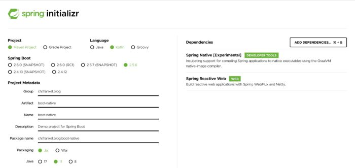
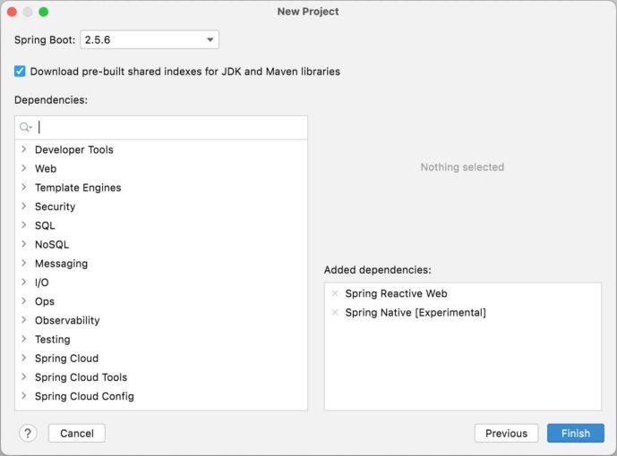

The Cloud has enabled a lot of new usages that were not possible before. Among them stands Serverless:
> Serverless computing is a cloud computing execution model in which the cloud provider allocates machine resources on demand, taking care of the servers on behalf of their customers. Serverless computing does not hold resources in volatile memory; computing is rather done in short bursts with the results persisted to storage. When an app is not in use, there are no computing resources allocated to the app.
>
> -- [Wikipedia](https://en.wikipedia.org/wiki/Serverless_computing)

Likewise, to manage the risk of lock-in with the walled garden of a single Cloud vendor, one can eschew their specific services and choose Kubernetes.

In both cases, and especially in the former, the lifetime of the pod/container is short. Therefore, startup time has a significant impact on the performance of the system as a whole. It's clearly a domain where the .

To cope with this, Oracle provides GraalVM, which contains a bytecode-to-binary compiler. I've been following GraalVM's improvements over several versions, standalone and integrated with Spring Boot.

The Spring framework was designed more than a decade ago when this concern was absent. On the other hand, a couple of years ago saw the birth of Spring competitors who embraced the Cloud and AOT: Micronaut and Quarkus.

In this three-part series, I want to have a look at each of them in turn, dissecting a couple of themes:

* Creating a new project
* Bean configuration
* Controller configuration
* Non-blocking HTTP client
* Parameterization
* Testing
* Docker integration
* Generating the GraalVM image
* etc.

For that, I'll create a Kotlin-based application that can query the Marvel API using non-blocking code.

This post is dedicated to explaining the application and Spring Boot.

## The Marvel API

Marvel offers a [REST API](https://developer.marvel.com/docs) to query their data. It requires the generation of an API key **and** a private key.

To authenticate, one needs to pass the following as query parameters:

1. The API key as it is
2. The timestamp
3. The MD5 hash of the concatenation of the timestamp, the private key, and the API key

```bash
curl http://gateway.marvel.com/v1/public/comics?ts=1&apikey=1234&hash=ffd275c5130566a2916217b101f26150
```

For more detailed information, please refer to the [documentation](https://developer.marvel.com/documentation/authorization).

## Creating a new project

The Spring team was the first to offer a Web UI to configure one's project, the [Spring Initializr](https://start.spring.io/).



With it, you can configure the following parameters:

* The build tool, Maven or Gradle
* The language, Java, Kotlin, or Groovy
* Spring Boot's version
* A couple of metadata
* Dependencies

Additionally, the application also offers a REST API to use the CLI and automate repetitive tasks. IntelliJ IDEA integrates the REST API, so you can create a new project while not leaving your IDE.



Finally, while it's hosted, the underlying code is [available on GitHub](https://github.com/spring-io/initializr) under the Apache v2 license so that you can clone and configure it. It's designed with extensibility in mind to allow for upgrades.

## Bean configuration

I've already written a [dedicated post](https://blog.frankel.ch/multiple-ways-configure-spring/) on the different ways one can create beans in Spring.

Though Spring a dedicated for beans, we will use the "traditional" way - annotations.

We need an MD5 message-digest to authenticate. With the Bean DSL, we can configure one like this:

```kotlin
@Configuration
class MarvelConfig {

    @Bean
    fun md5(): MessageDigest = MessageDigest.getInstance("MD5")
}
```

Spring will automatically discover this class at startup time thanks to the `@SpringBootApplication` annotation, and instantiate the beans:

```kotlin
@SpringBootApplication
class BootNativeApplication
```

## Controller configuration

Spring was the first to introduce the annotation-based controller configuration on top of the Servlet API. Since then, there has been some pushback against annotations. For that reason, Spring introduced declarative routes. Kotlin makes it even more pleasant with the Route DSL:

```kotlin
fun routes() = router {
    GET("/") { request ->
        ServerResponse.ok().build()
    }
}
```

We also need to register the router as a bean:

```kotlin
@Configuration
class MarvelConfig {

    @Bean
    fun routes() = router {
    GET("/") { request ->
        ServerResponse.ok().build()
    }

    // Other beans
}
```

## Non-blocking HTTP client

For ages, Spring has offered a *blocking* HTTP client in the form of `RestTemplate` as part of Web MVC. With its version 5, Spring introduced WebFlux, the reactive counterpart to Web MVC. WebFlux builds on top of Project Reactor, which itself builds upon Reactive Streams. You're probably familiar with Project Reactor's foundation primitives:

* `Mono`: emits at most one item
* `Flux`: emits 0..N items

With WebFlux, Spring deprecated `RestTemplate` in favor of the provided reactive `WebClient`. Here's how to make a call inside the existing route:

```kotlin
fun routes() = router {
    GET("/") { _ ->
        val client = WebClient.create();
        val mono = client
            .get()
            .uri("https://gateway.marvel.com:443/v1/public/characters")
            .retrieve()
            .bodyToMono<String>()
        ServerResponse.ok().body(mono)
    }
}
```

We also want to get some parameters and propagate them further. Among all offered by the Marvel API, I chose to expose three: `limit`, `offset` and `orderBy`.

The `GET` function accepts a `(ServerRequest) -> ServerResponse` as its second parameter. `ServerRequest` offers the `queryParam(String)` to check the existence of a query parameter. It returns a Java `Optional`. On the other side, `UriBuilder` allows setting query parameters with the `queryParam(String, String)` function.

We can create an extension bridge between the two:

```kotlin
fun UriBuilder.queryParamsWith(request: ServerRequest) = apply {
    arrayOf("limit", "offset", "orderBy").forEach { param ->       <1>
        request.queryParam(param).ifPresent {                      <2>
            queryParam(param, it)                                  <3>
        }
    }
}
```

1. For each of the parameters
2. If it's present in the request
3. Set its name and value on the URI builder

Now, we can call it accordingly:

```kotlin
fun routes(client: WebClient, props: MarvelProperties, digest: MessageDigest) = router {
    GET("/") { request ->
        val mono = client
            .get()
            .uri {
                it.path("/characters")
                  .queryParamsWith(request)
                  .build()
            }.retrieve()
            .bodyToMono<String>()
        ServerResponse.ok().body(mono)
    }
}
```

## Parameterization

The next step is to parameterize the application: the Marvel API requires us to authenticate, and we don't want to hardcode our credentials. Also, for testing purposes, we want to change the URL of the server we send request to quickly.

Parameterization entails two parts: how to pass parameters to the application and how to use those in it.

For passing parameters, Spring Boot offers [many different ways](https://docs.spring.io/spring-boot/docs/2.6.x/reference/htmlsingle/#features.external-config). Parameters can be grouped in profiles and activated as a whole. In this case, I chose to set the server URL in a YAML file inside the application, as it's the default, and pass secrets via the command line.

```yaml
app:
  marvel:
    server-url: https://gateway.marvel.com:443
```

To use parameters in the application, we also have several choices. One is to annotate fields with `@Value` and let Spring inject the values at runtime. Alternatively, we can group them in a dedicated class (or several) and let Spring do the binding again. I believe unless you've only a single value, a property class is an excellent way to go.

```kotlin
@ConfigurationProperties("app.marvel")      <1>
@ConstructorBinding                        <2>
data class MarvelProperties(
    val serverUrl: String,                 <3>
    val apiKey: String,
    val privateKey: String
)
```

1. Manage the prefix to read from
2. Integrate with Kotlin data class
3. Spring is lenient and allows several cases: kebab-, snake- or camel-case

## Testing

The size of the codebase doesn't lend itself to a lot of testing, especially unit testing. However, we can add an integration test that makes sure that the response from the API is unmarshalled to a class and marshalled back again from the application. In tests, we want to avoid relying on third-party infrastructure: a test shouldn't fail because a dependency out of our control fails.

For integration tests, we can use the `@SpringBootTest` annotation on the class:

```kotlin
@SpringBootTest(
    webEnvironment = WebEnvironment.RANDOM_PORT,      <1>
    properties = [
        "app.marvel.api-key=dummy",                   <2>
        "app.marvel.private-key=dummy"                <3>
    ]
)
class BootNativeApplicationTests
```

1. Start the application on a random port to avoid failure because of a port conflict
2. `MarvelProperties` requires the parameter, but it's unused for testing. We pass anything as long as the parameter exists.

[TestContainer](https://www.testcontainers.org/) is a Java library that allows to start/stop Docker containers. To use it, we only need to annotate the class with the relevant annotation. We also need to configure which containers we want to use:

```kotlin
@Testcontainers                                             <1>
class BootNativeApplicationTests {

    companion object {                                      <2>

        @Container                                          <3>
        val mockServer = MockServerContainer(
            DockerImageName.parse("mockserver/mockserver")  <4>
        )
}
```

1. Integrate with Testcontainers
2. In Java, we need to have a `static` member.  
   In Kotlin, it translates to a property on the companion object
3. Configure Testcontainers
4. Use the referenced container image

[MockServer](https://www.testcontainers.org/modules/mockserver) is a container that can be stubbed to return a payload that depends on the input.

Now comes the genuine fun part:

* To start the test, we need both IP and port to pass as parameters to initialize `MavelProperties`
* To get IP and port, we need to start the container, whose lifecycle is bound to the test, *i.e.*, we need to start the test first

We can solve this chicken and egg problem with the help of [dynamic property sources](https://www.baeldung.com/spring-dynamicpropertysource).

```kotlin
companion object {

    @JvmStatic                                                                    <1>
    @DynamicPropertySource                                                        <2>
    fun registerServerUrl(registry: DynamicPropertyRegistry) {                    <3>
        registry.add("app.marvel.server-url") {                                   <4>
            "http://${mockServer.containerIpAddress}:${mockServer.serverPort}"    <5>
        }
    }
}
```

1. Required for Java compatibility
2. Magic!
3. Spring Test injects it at runtime
4. Add the this property...
5. ...with this value taken from the `mockServer` property

Now, onto the test method:

```kotlin
@Test
fun `should deserialize JSON payload from server and serialize it back again`() { <1>
    val mockServerClient =
        MockServerClient(mockServer.containerIpAddress, mockServer.serverPort)    <2>
    val sample = ClassPathResource("/sample.json").file.readText()                 <3>
    mockServerClient.`when`(                                                      <4>
        HttpRequest.request()
            .withMethod("GET")
            .withPath("/v1/public/characters")
    ).respond(                                                                    <5>
        HttpResponse()
            .withStatusCode(200)
            .withHeader("Content-Type", "application/json")
            .withBody(sample)
    )
    // Test code
}
```

1. Kotlin allows having descriptive text for test method names
2. Create the stub
3. Spring abstraction to reference classpath resources. `sample.json` is the test sample.
4. *When* part of the stub
5. *Then* part

Let's move on to the test itself. Spring Test offers `WebTestClient`, a non-blocking test client. It allows to parameterize HTTP requests, send them and execute several fluent assertions on the response.

```kotlin
class BootNativeApplicationTests {

    @Autowired
    private lateinit var webTestClient: WebTestClient                      <1>

    @Test
    fun `should deserialize JSON payload from server and serialize it back again`() {
        // Stubbing code
        webTestClient.get()
            .uri("/")
            .exchange()
            .expectStatus().isOk
            .expectBody()
            .jsonPath("\$.data.count").isEqualTo(1)                        <2>
            .jsonPath("\$.data.results").isArray                           <2>
            .jsonPath("\$.data.results[0].name").isEqualTo("Anita Blake")  <2>
    }
}
```

1. Spring Test injects `WebTestClient` for you
2. Assertions on the response

At this point, the test fails to execute, though. We configured the application using the Beans DSL; we had to call `beans` during application startup explicitly. We need to configure the test as well, expressly.

```kotlin
class TestConfigInitializer : ApplicationContextInitializer<GenericApplicationContext> {
    override fun initialize(context: GenericApplicationContext) {
        beans.initialize(context)
    }
}

@SpringBootTest(
    properties = [
        "context.initializer.classes=ch.frankel.blog.TestConfigInitializer" <1>
    ]
)
class BootNativeApplicationTests {
```

1. Reference the initialization class

## Docker and GraalVM integration

NOTE: This section assumes you're already familiar with GraalVM native.

Spring Boot offers two alternatives to create native binaries:

1. A system-dependent binary: this approach requires a local GraalVM installation with the `native-image` extension. It will create a non-cross-platform system-dependent binary.For this, Spring Boot has a dedicated profile:

   ```bash
   ./mvnw -Pnative package
   ```

2. A Docker image: this approach builds a containerized version of the application. It requires a local image build, *e.g.* , Docker. Internally, it leverages [CNCF Buildpacks](https://buildpacks.io/) (but doesn't require `pack`).Spring Boot provides a Maven target for this:

   ```bash
   ./mvnw spring-boot:native-image
   ```

Spring Boot takes care of GraalVM's native configuration for its code and **most** of its dependencies. In case you need further configuration, you can use the standard configuration files, *e.g.* , `/META-INF/native-image///reflect-config.json`.

As an alternative, Spring offers annotation-based configuration. Let's do it:

```kotlin
@SpringBootApplication
@NativeHint(options = ["--enable-https"])                              <1>
@TypeHint(
    types = [
        Model::class, Data::class, Result::class, Thumbnail::class,
        Collection::class, Resource::class, Url::class, URI::class
    ],
    access = AccessBits.FULL_REFLECTION                                <2>
)
class BootNativeApplication
```

1. Keep TLS-related code
2. Keep classed and allow for reflection at runtime

With the second approach, the result is the following:

```
REPOSITORY      TAG       IMAGE ID         CREATED         SIZE
native-boot     1.0       c9284b7f99a6     41 years ago    104MB
```

If we dive into the image, we can see the following layers:

```
┃ ● Layers ┣━━━━━━━━━━━━━━━━━━━━━━━━━━━━
Cmp   Size  Command
     17 MB  FROM c09932ee5c22aa1                <1>
     268 B                                      <2>
    3.4 MB                                      <3>
     81 MB                                      <4>
    2.5 MB                                      <5>
     12 kB
       0 B                                      <6>
```

1. Parent image
2. System permissions
3. Paketo buildpacks CA certificates
4. Our native binary
5. Cloud-native launcher executable
6. Launcher aliases

The generated image accepts parameters, just as if you'd run the Java application on the command line.

```bash
docker run -it -p8080:8080 native-boot:1.0 --app.marvel.apiKey=xyz --app.marvel.privateKey=abc --logging.level.root=DEBUG
```

We can now send requests to play with the application:

```bash
curl localhost:8080
curl 'localhost:8080?limit=1'
curl 'localhost:8080?limit=1&offset=50'
```

## Conclusion

Spring has a long history of taking care of boilerplate code and letting developers focus on business code. In latter years, it has successfully integrated the Kotlin language to provide a fantastic developer experience.

Yet, as the Cloud has become more widespread, the Spring ecosystem has been forced to cope with GraalVM native. While it still has room for improvement, it does the job.

In the following articles, I'll describe the same application with the so-called Cloud Native frameworks, Quarkus and Micronaut.

Thanks to [Sébastien Deleuze](https://twitter.com/sdeleuze) for his help reviewing this article.

The complete source code for this post can be found on [Github](https://github.com/ajavageek/springboot-native) in Maven format.

**To go further:**

* [Spring Initializr](https://start.spring.io/)
* [Dynamic Property Source](https://www.baeldung.com/spring-dynamicpropertysource)
* [Spring Native documentation](https://docs.spring.io/spring-native/docs/current/reference/htmlsingle/)
* [Native hints](https://docs.spring.io/spring-native/docs/current/reference/htmlsingle/#native-hints)

*Originally published at [A Java Geek](https://blog.frankel.ch/native/spring-boot/) on November 14^th^, 2021*

*[JVM]: Java Virtual Machine
*[AOT]: Ahead-Of-Time
*[DSL]: Domain-Specific Language
