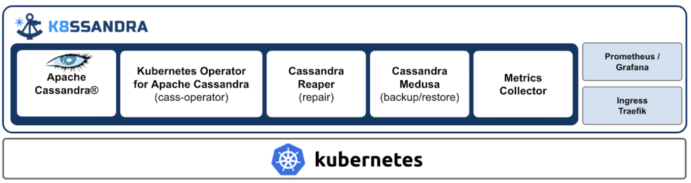

[K8ssandra](https://k8ssandra.io/), an open-source distribution of Apache Cassandra for Kubernetes, aims to provide a "production-ready platform", and this includes automation for operational tasks such as repairs, backups, and monitoring. Cassandra is a distributed NoSQL database designed for global scale and fault tolerance for the most demanding applications on the planet, written in Java.

K8ssandra is deployed using Helm and supports stateful workloads out of the box, which enables database administrators (DBAs) and site reliability engineers (SREs) to set up and operate Cassandra clusters using best practices in a Kubernetes environment.

[Sam Ramji](https://www.linkedin.com/in/sramji/), chief strategy officer at DataStax, said:
> "K8ssandra will help make data cloud-native. Kubernetes has made running and scaling stateless apps straightforward, but those apps need data. Bringing Cassandra to Kubernetes means having an automated open source distributed datastore that SREs appreciate. K8ssandra lets you scale data elastically and observe it with Prometheus and Grafana. It's a distribution of known-good components that work well together on Kubernetes, and it's a place for SREs to share operational wisdom."

Along with elastic scale and auto-healing features, K8ssandra also includes several essential tools for automating Cassandra.

[Cass-operator](https://github.com/datastax/cass-operator) serves as a translation layer between the control plane of Kubernetes and Cassandra cluster operations. [Cassandra Reaper](http://cassandra-reaper.io/) provides a solution for managing maintenance tasks and repairs. A backup and restore tool, [Cassandra Medusa](https://github.com/thelastpickle/cassandra-medusa), is also included. Cassandra Reaper and Medusa were part of The Last Pickle, [acquired by DataStax earlier this year](https://techcrunch.com/2020/03/03/datastax-acquires-the-last-pickle/).

From an observability point of view, K8ssandra comes with pre-configured metrics for [Prometheus](https://prometheus.io/) and pre-designed dashboards in [Grafana](https://grafana.com/).

*Source: <https://www.datastax.com/blog/2020/11/developer-newsletter-convergence-cassandra-and-kubernetes>*

As per the "[Cloud Development Survey](https://evansdata.com/reports/viewRelease.php?reportID=27)" from Evans Data Corporation, 62% of developers preferred Kubernetes itself or cloud service providers to manage their data. [Patric McFadin](https://www.linkedin.com/in/patrick-mcfadin-53a8046/), vice president of developer relations at DataStax, expanded this further:
> "A Kubernetes Operator has the job of helping communications between Kubernetes and a running process. It is beyond the scope of what an Operator should do to handle multiple processes at the same time. K8ssandra makes use of both Operator and Helm as part of the distribution."

Speaking about K8ssandra, [Tom Offermann](https://www.linkedin.com/in/tom-offermann/), senior software engineer at New Relic, said, "New Relic is highly supportive of standardizing community-supported tools for operating and managing Cassandra clusters. We are excited about the K8ssandra launch and look forward to actively contributing and collaborating with the broader open source community. This is a great starting point for new and existing users to run Cassandra in Kubernetes and benefit from direct access to the best available Cassandra expertise and practices."

To get started with K8ssandra, readers can follow the [Getting Started](https://k8ssandra.io/docs/getting-started/) guide. DataStax provided the hands-on experience with K8ssandra at the KubeCon, and replay is available on [YouTube](https://www.youtube.com/watch?v=pvzr75ZYwLE). Also, there is a Certification Program for running Cassandra on Kubernetes, being developed by DataStax. Readers can find the details and sign up for the updates [here](https://www.datastax.com/dev/certifications).

This post was [originally written](https://www.infoq.com/news/2021/01/k8ssandra-cassandra-kubernetes/) by Aditya Kumari on InfoQ.
