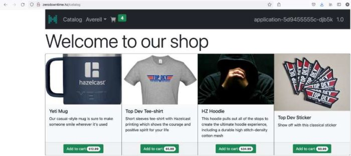

Most of my talks contain a demo. A fair share of these demos require multiple "infrastructure" dependencies: a database (or more), Elasticsearch, you name it. To ease my setup and avoid messing up my machine, I use either Docker Compose or Kubernetes locally on my Mac. Both rely on Docker Desktop.

To expose a cluster `Service` on my host, I use `nodePort`. Hence, I set a dedicated node port for each service. I need to remember each of them for each demo. Worse, services might be (are) declared across different manifest files.

For a long time, I wanted to simplify my life. I've searched for Kubernetes-based solutions. I found that `kube-forward` was not stable enough.

My latest attempt was [MetalLB](https://metallb.universe.tf/). Even though I didn't manage to make it work, it bound port 8080 on my machine: none of my other regular Spring demos could work.

Last week, I decided to take another approach: a regular proxy in front of my local cluster. OSX comes with an existing Apache Web Server installation. You can check it with `ls /etc/apache2`:

```
extra                 httpd.conf.pre-update mime.types            other
httpd.conf            magic                 original              users
```

The following modules are necessary:

```apache
#httpd.conf
LoadModule proxy_module libexec/apache2/mod_proxy.so
LoadModule proxy_http_module libexec/apache2/mod_proxy_http.so
LoadModule proxy_balancer_module libexec/apache2/mod_proxy_balancer.so
```

The requirement is straightforward: proxy calls from to . For this, we need to configure a virtual host:

```apache
#httpd-vhosts.conf
<VirtualHost *:80>
    ServerName zerodowntime.hz
    ProxyRequests off
    ProxyPass / http://localhost:30002/
    ProxyPassReverse / http://zerodowntime.hz
</VirtualHost>
```

To make sure everything works fine, we can use `apachectl -S`:

```
VirtualHost configuration:
*:80           zerodowntime.hz (/private/etc/apache2/extra/httpd-vhosts.conf:40)
```

Last but not least, let's configure the host file:

```
#./etc/hosts
127.0.0.1        zerodowntime.hz
```

At this point, we can access the application using the `zerodowntime.hz` URL:



Depending on the deployed application, this step might be the last one. It's unfortunately not my case, as my demo uses a redirect. By default, the redirect location sent to the client is the URL known to the application, , defeating the whole purpose. We need to configure the application to use the standard `X-Forwarded-*` HTTP headers.

I'm using Spring Boot, so that is just a matter of configuration:

```yaml
#application.yml
server:
  forward-headers-strategy: native
```

At this point, everything works as expected!

**To go further:**

* [MetalLB](https://metallb.universe.tf/)
* [Apache HTTP Server](https://httpd.apache.org/)
* [VirtualHost examples](https://httpd.apache.org/docs/2.4/vhosts/examples.html)
* [Running Spring Boot behind a front-end proxy server](https://docs.spring.io/spring-boot/docs/2.6.x/reference/html/howto.html#howto.webserver.use-behind-a-proxy-server)

*Originally published at [A Java Geek](https://blog.frankel.ch/port-management-local-kubernetes/) on November 28^th^, 2021*
