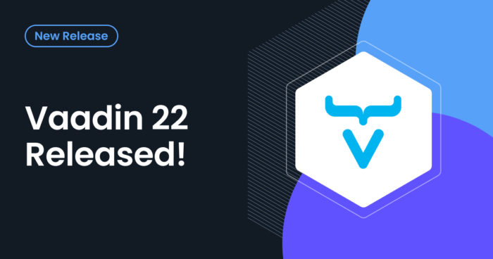

Vaadin is an open source development platform for building modern web applications on Java backends. It includes:

* A large set of [UI components](https://vaadin.com/docs/latest/ds/components).
* [Vaadin Flow](https://vaadin.com/flow) - a framework for building web apps 100% in Java.
* [Vaadin Fusion](https://vaadin.com/fusion) - a framework for building reactive frontend apps in TypeScript with type-safe communication to a Spring Boot backend.

Visit [vaadin.com](https://vaadin.com/) to get started.

New and Noteworthy Since Vaadin 21 {#h2-0-new-and-noteworthy-since-vaadin-21}
-----------------------------------------------------------------------------

Here are the highlighted new and improved features in vaadin 22. To see the full list of bug fixes and improvements, check Included Projects and Change Log.

### Vaadin Fusion {#h3-1-vaadin-fusion}

* Stateless Fusion
  * By default Fusion will not create server sessions, and use the token-based authentication mechanism. The server then is stateless, allowing easier horizontal scaling of instances and high availability of services.

### Vaadin Components {#h3-2-vaadin-components}

#### LitRenderer API for Java counterparts

Added `LitRenderer` API to replace the now deprecated `TemplateRenderer` for Grid, Combo Box and Virtual List. Check out [Grid documentation](https://vaadin.com/docs/latest/ds/components/grid/#lit-renderer) and [Using Lit Renderers](https://vaadin.com/docs/latest/flow/components/grid#using-lit-renderers) guide. Note that web components are not based on Lit yet.

#### Accessibility fixes to components

Fixes to accessibility issues in Vaadin components, so that they can be used with assistive technologies (AT) like screen readers. Check out [Upgrading to Vaadin 22](https://vaadin.com/docs/latest/ds/upgrading) for the full list of related changes in components DOM and styling.

#### Other components changes

* Vaadin Charts:
  * Upgrade to latest Highcharts version
  * provide API for configuring inactive series styling
  * By default, when a chart series is hovered, it is considered "active", and all other ("inactive") series are grayed out. It should be possible to configure how the inactive series are styled or to disable the inactive state entirely, to prevent this effect.
  * Lumo and Material styling for Charts
  * provide position and modifier-key metadata in click events
  * Add information about absolute X and Y positions and modifiers (alt, ctrl, meta, shift) to the Point and Series Legend Item Click events in Java API so that developers can handle the events differently depending on these properties. This information is already available in the client-side events.
* Vaadin Date Picker
  * Flow DatePicker custom format support
* Vaadin Notification
  * Convenience show method for NotificationElement
* Vaadin CRUD
  * Improved configurability of CRUD

### Vaadin Collaboration Engine {#h3-3-vaadin-collaboration-engine}

* SystemConnectionContext API
  * Support Collaboration Engine features together with external systems that are not directly associated with a specific user when they are using a Vaadin UI.
* MessageManager API
  * Introduce a data access API to handle messages in topics. Provide a data layer access that lets you submit messages to a Topic and react when a new message is submitted to the same Topic. The developer doesn't need to use the low-level Topic API that has none of the higher level concepts.

### Vaadin Quarkus {#h3-4-vaadin-quarkus}

* Official Quarkus support for Vaadin Flow

Special thanks {#h2-5-special-thanks}
-------------------------------------

Special thanks to @knoobie, for the invaluable help with testing, feedback, and guidance with the accessibility work!

Support {#h2-6-support}
-----------------------

Vaadin 22 is supported for one month after Vaadin 23 has been released. The latest LTS (long term support) version is Vaadin 14. More details of our release model are available on our [roadmap page](https://vaadin.com/roadmap).

Vaadin also provides [commercial support and warranty](https://vaadin.com/support).

App starters {#h2-7-app-starters}
---------------------------------

The best way to get started with Vaadin is to go to <https://start.vaadin.com> and configure your new application by setting up your views, entities, styles, and the technology stack you're interested in.

Maven Archetypes {#h2-8-maven-archetypes}
-----------------------------------------

Maven is the de-facto build tool for Java web applications. Major IDEs also support Maven out of the box and most often you'll be using Maven via your favorite IDE.  

There are currently two Maven archetypes available, the `vaadin-archetype-application` which corresponds to the project base for Flow and the corresponding `vaadin-archetype-spring-application` if you prefer use Flow with [Spring](https://spring.io/).

The version of the archetype should match the platform version. After you have Maven installed, you can quickly create and run a Vaadin app with the following command:

<pre class="EnlighterJSRAW" data-enlighter-language="xml">mvn -B archetype:generate \
                -DarchetypeGroupId=com.vaadin \
                -DarchetypeArtifactId=vaadin-archetype-application \
                -DarchetypeVersion=22.0.0\
                -DgroupId=org.test \
                -DartifactId=vaadin-app \
                -Dversion=1.0-SNAPSHOT \
                &amp;&amp; cd vaadin-app \
                &amp;&amp; mvn package jetty:run
mvn -B archetype:generate \
                -DarchetypeGroupId=com.vaadin \
                -DarchetypeArtifactId=vaadin-archetype-spring-application \
                -DarchetypeVersion=22.0.0\
                -DgroupId=org.test \
                -DartifactId=vaadin-app \
                -Dversion=1.0-SNAPSHOT \
                &amp;&amp; cd vaadin-app \
                &amp;&amp; mvn</pre>

Manually changing Vaadin version for Java projects {#h2-9-manually-changing-vaadin-version-for-java-projects}
-------------------------------------------------------------------------------------------------------------

Add the following dependency to dependencyManagement in pom.xml.

<pre class="EnlighterJSRAW" data-enlighter-language="xml">&lt;dependency&gt;
    &lt;groupId&gt;com.vaadin&lt;/groupId&gt;
    &lt;artifactId&gt;vaadin-bom&lt;/artifactId&gt;
    &lt;version&gt;22.0.0&lt;/version&gt;
    &lt;type&gt;pom&lt;/type&gt;
    &lt;scope&gt;import&lt;/scope&gt;
&lt;/dependency&gt;</pre>

Read more about upgrading to Vaadin 22 from [vaadin.com](https://vaadin.com/docs/latest/guide/upgrading).

See [the migration guide](https://vaadin.com/docs/v14/guide/upgrading/v8/)

See [the migration guide](https://vaadin.com/docs/v14/guide/upgrading/v10-13/)

See [the migration guide](https://vaadin.com/docs/latest/flow/guide/upgrading)

We appreciate if you try to find the most relevant repository to report the issue in. If it is not obvious which project to add issues to, you are always welcome to report any issue at <https://github.com/vaadin/platform/issues>.

A few rules of thumb will help you and us in finding the correct repository for the issue or enhancement request:  

1) If you encounter an issue with the TypeScript and HTML API of Vaadin components, the repository is <https://github.com/vaadin/web-components>  

2) If you encounter an issue with the Java API of Vaadin components, the repository is <https://github.com/vaadin/flow-components>  

3) If you encounter an issue with Flow which does not seem to be related to a specific component, the problem is likely in Flow itself. The Flow repository is <https://github.com/vaadin/flow>  

4) If you encounter an issue with Designer, the repository is <https://github.com/vaadin/designer>  

5) If you encounter an issue with TestBench, the repository is <https://github.com/vaadin/testbench>
