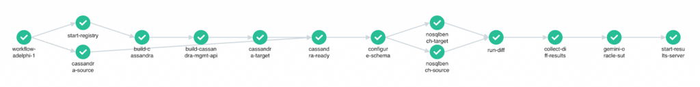
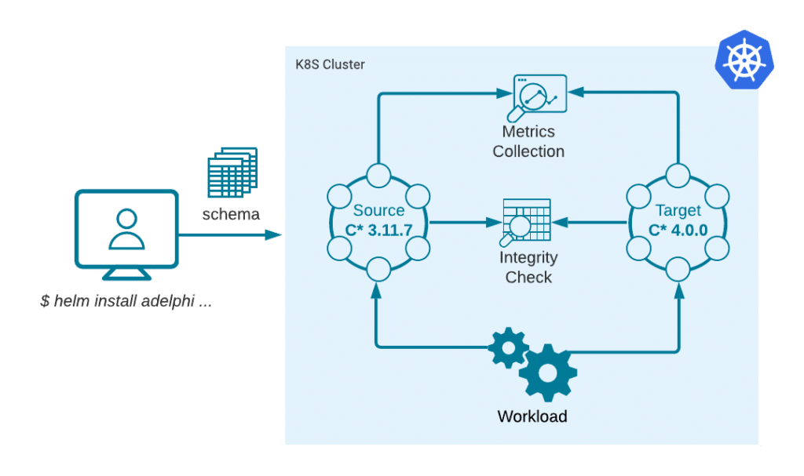
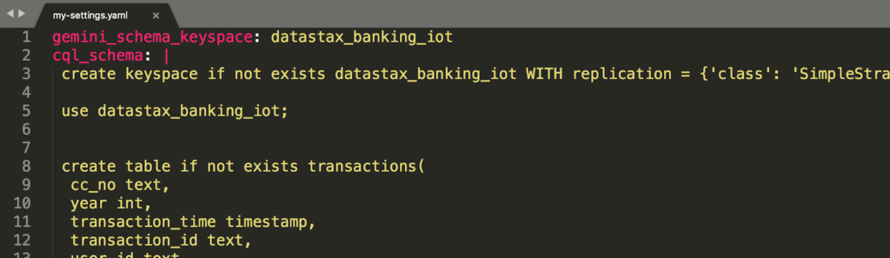
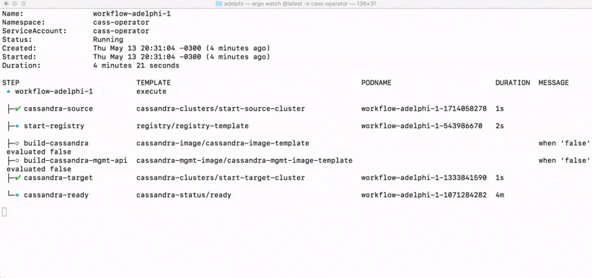
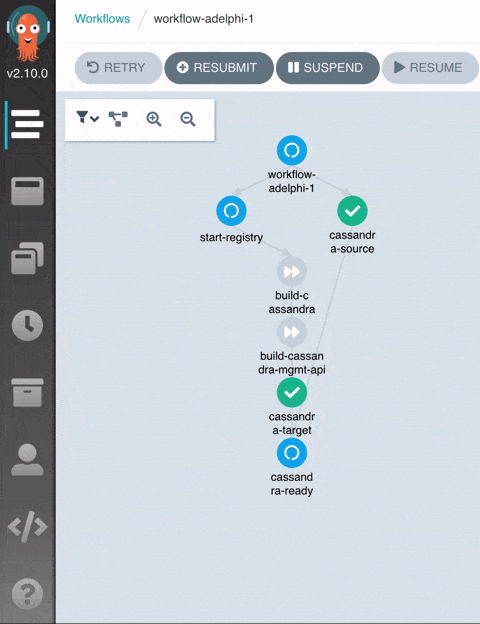
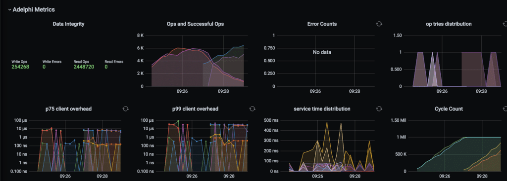
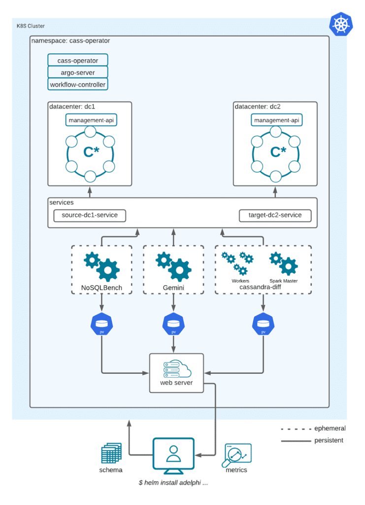

|-----------------------------------------------------------------------------------------------------------------------|
| **adelphi** (ancient greek ἀδελφός) - Subs.: brother or sister, son of the same mother. Adj.: double, twin, in pairs. |



**What is Adelphi?**

[Adelphi](https://github.com/datastax/adelphi) is an open-source QA tool for Apache Cassandra™, it's packaged as a [Helm](https://helm.sh/) chart and it simplifies the tasks of running data integrity and performance tests on Kubernetes.

Built for simplicity, Adelphi is an opinionated tool; it runs an [Argo](https://argoproj.github.io/argo-workflows/) workflow of well-defined steps and prefers convention over configuration, but it exposes some knobs that you can override.

If you are planning to upgrade your C\* cluster we encourage you to try Adelphi out and validate your existing schema in the new version with auto-generated workloads.

Or maybe you are interested in contributing a patch to the Cassandra project? Great! Adelphi also helps you during development to verify your patches and check how they perform in comparison to a stable release.

You also have the option to [submit](https://pypi.org/project/adelphi/) an anonymized version of your schema to us and in the future, we will test it for you in our CI pipeline.

In this post, we will show you how to test your schema on a new version of Cassandra by comparing two clusters side-by-side with a simple and reproducible workflow.

**What does it do?**

Adelphi bundles a set of battle-tested workload generators in a manner that requires little effort to get started. We want to take the boilerplate code out of the way so you can focus on what really matters: testing your schema. It leverages [NoSQLBench](https://github.com/nosqlbench/nosqlbench) for performance analysis, [Gemini](https://github.com/scylladb/gemini) and [cassandra-diff](https://github.com/apache/cassandra-diff) for data integrity testing.

The pre-packaged workflow spins up two side-by-side (though isolated) Cassandra clusters in Kubernetes and generates a pseudo-random workload on both of them based on the schema you provided. The persisted data of both clusters is then compared in a distributed Spark job as an integrity guarantee. All the steps happen without user interaction.

We refer to these two clusters as **source** and **target** . The source cluster should be a stable version, the ground-truth for the tests. The target cluster is the *system under test*, in other words the new version you want to evaluate. For instance, if you have a production cluster on 3.11.7, you can set that version for the source cluster, and then use 4.0.0 for the target.

Alternatively, you can also choose a commit hash (or branch/tag name) for the target cluster, in which case Adelphi will build Cassandra from the source code and generate a Docker image on the fly to be deployed in Kubernetes (this assumes the selected checkpoint has no breaking changes in relation to the K8ssandra API). The latter scenario is particularly useful if you are contributing a patch to Cassandra.


As depicted in the diagram above, the main input for Adelphi is the CQL schema. When you issue the install command, the provided schema is sent over to the workflow controller and from that point on Adelphi will take control and do the rest for you. It will apply the schema in the clusters and run pseudo-random, reproducible, workloads tailored for your schema.

Let's run through a real example in the next section.

**How can I test my schema?**

This section shows how to validate a schema using Adelphi. It assumes you have a Kubernetes cluster ready to use and a checkout of the Adelphi repository. We recommend that you create a Kubernetes cluster instance exclusively for Adelphi because it installs cluster-wide objects.

If you want to follow along in your local environment, check the setup instructions and requirements in the project's [Getting Started](https://github.com/datastax/adelphi/blob/master/GETTING_STARTED.md) guide to create a Kubernetes cluster with k3d (before you proceed locally, make sure the KUBECONFIG environment variable is pointing to the correct k8s cluster).

The schema used in this article comes from the [Banking IOT project](https://github.com/DataStax-Examples/banking-iot-demo). In order to use that schema definition, we have to create a YAML file to hold our custom settings. For now it only needs two attributes: `cql_schema` containing the CQL statements, and gemina_schema_keyspace specifying the name of the keyspace you want to test (at the moment, we only support testing a single keyspace at a time), so it should look like this:


And that's it! We are ready to install Adelphi in the Kubernetes cluster using our own schema, so go to the Adelphi root folder and execute:

```
$ helm install adelphi \ # chart name
helm/adelphi \ # path to the chart folder
-n cass-operator \ # namespace (currently must be cass-operator)
-f my-settings.yaml # your custom settings with the CQL schema
```

That will immediately start the workflow and you can watch the progress either in the command-line:

```
$ argo watch -n cass-operator @latest
```



or in the Argo UI:

```
$ kubectl -n cass-operator \ # the workflow namespace
port-forward \ # opens a tunnel to a pod in the k8s cluster
deployment/argo-server \ # the service we want to access
2746:2746 # port mapping from local to remote
```

open the browser at [http://localhost:2746](http://localhost:2746/)


When the workflow reaches the end, you can open up the Grafana dashboard to inspect the collected metrics:

```
$ kubectl -n cass-operator \ # the workflow namespace
port-forward \ # opens a tunnel to a pod in the k8s cluster
grafana \ # the service we want to access
3000:3000 # port mapping from local to remote
```

open the browser at [http://localhost:3000](http://localhost:3000/) (first-time credentials: admin/admin)


If you are already familiar with the dashboard that comes with NoSQLBench, you will notice Adelphi's is very similar, except that the metrics for both clusters are overlaid.

The additional panel in the top left-hand corner shows a summary of the data integrity validation: it displays the number of read/write operations and how many failures occurred, if any. Note that the dashboard and its associated data will be purged when Adelphi is uninstalled, so if you want to store a copy of the results, download the raw files while the cluster is still up and running:

```
$ kubectl -n cass-operator \ # the workflow namespace
port-forward \ # opens a tunnel to a pod in the k8s cluster
results-server \ # web server containing the result files in text format
8080:8080 # port mapping from local to remote
```

In a separate terminal window you can recursively download all the files at once with a little help of [wget](https://www.gnu.org/software/wget/):

```
$ wget -r http://localhost:8080/
```

By default Adelphi is configured with a short execution duration such that you can try the whole process quickly, but for a thorough validation of your schema, we recommend that you let it run for a few hours to allow the data generators to explore a larger distribution space. You can tweak the execution duration with `gemini_test_duration` and `nosqlbench_cycles`. Other parameters you may want to change are clusterSize, to set the number of C\* nodes per cluster, and the `storageClassName` according to the storage class offered by the cloud service of your choice.

For a complete list of the configuration parameters currently available, run:

```
$ helm show values helm/adelphi
```

When you are done, you can safely delete the running instances with:

```
$ helm uninstall adelphi -n cass-operator
```

That will clear all the Pods, Services and Volumes created by Adelphi with the exception of the CRDs (Custom Resource Definitions) which are not managed by Helm after the initial installation, but if you created an exclusive k8s cluster for Adelphi, you can safely delete it now.

**The workflow distilled**

The workflow handles tasks that range from building custom Docker images (if needed) through collecting metrics and reporting results. These are all the steps involved:

* **Start Registry** Starts an internal Docker registry inside the Kubernetes cluster. This registry stores ephemeral Docker images that are built on the fly during the execution of the workflow. These images are removed when the workflow is uninstalled and that allows for Adelphi to remain self-contained.
* **Cassandra Source** Spins up the source Cassandra cluster. This is the stable release you want to compare against. For now, the source cluster must be a GA version whose image is [available in DockerHub](https://hub.docker.com/_/cassandra) and officially supported by K8ssandra.
* **Build Cassandra** : This is only executed when you set the `git_identifier` parameter, in which case Adelphi will check out the Cassandra source code from the Apache repository, build it, package it in a Docker image and finally push it to the internal registry. This image will be consumed by the Management API in the next step. At time of writing, custom builds can only be used by the target cluster.
* **Build Management API** The Management API is the layer that enables Cassandra to be orchestrated by the K8ssandra Operator. The standard API comes with a prebuilt C\* image, but because we want to use our custom image from the previous step, we want to rebuild the API in this step. If `git_identifier` is not set, this step is skipped.
* **Cassandra Target** : Spins up the target Cassandra cluster. If we set `git_identifier`, it will use the custom image from the internal registry, otherwise, it will download an image readily available from Dockerhub.
* **Cassandra Ready**: Synchronization step that waits for all the Cassandra nodes to be up and running. Under the hood, it waits for the pods to successfully respond to the health checks and turn into the 'Ready' state, which indicates the database is ready to take requests.
* **Configure Schema**: Creates the CQL schema in the source and target clusters.
* **NoSQLBench Source / NoSQLBench Target**: A workload YAML is automatically generated based on the schema we just created in the previous step and now we start writing data to the clusters in parallel.
* **Run Diff** : This step uses Apache cassandra-diff to compare the data stored in the two Cassandra clusters. Its role is validating the integrity of the data. It runs a distributed Spark job and if any mismatches are encountered, they are recorded in the target cluster in the `cassandradiff` keyspace.
* **Collect Diff Results**: Moves the results from the previous step to text files such that they can be easily inspected and downloaded when the workflow completes.
* **Gemini**: This step runs Scylla's Gemini for an additional layer of integrity validation. Gemini is capable of connecting to both clusters at the same time so it executes the writes and comparison all by itself.
* **Start Results Server**: This is the last step of the workflow and it starts a web server that exposes the raw result files generated by the various tools at a single endpoint for your convenience.

**How does it work?**

Adelphi is built on top of two main `CustomResourceDefinitions`: K8ssandra Cass-Operator and Argo Workflow (composed of argo-server and workflow-controller).

Cass-Operator is responsible for managing the Cassandra nodes: starting them up, checking their health and applying upgrades. All cluster-level changes in Adelphi are performed by the Cass-Operator by applying manifests of the `CassandraDatacenter` kind.

Argo Workflow enables the creation of reusable templates of workflow steps such that k8s manifests can be applied in a lazy fashion and only executed at the appropriate time. When you install the Adelphi chart with Helm, it will submit all templates to the Argo Server and then the Workflow Controller will instantiate them later on.

The pods initiated by Argo are ephemeral and they are immediately terminated when each step completes. Other pods in the system are persistent, in the sense that they remain available for inspection even after the workflow is done, such as the Cassandra nodes and the web server (they will still be removed when you uninstall Adelphi).


In the diagram below you see a logical representation of the communication between the main components. The arrows indicate the direction the data is written (either workload data or metrics) and as you can see, there is no direct communication between the Cassandra clusters, they're isolated from one another. The dotted boxes represent workflow-managed pods while the solid boxes represent long-lived pods.

Each worker pod gets its own `PersistentVolume` such that they can write the results in parallel (some cloud services don't support `ReadWriteMany` volumes for parallel writes). When these pods are terminated, the associated volumes are freed up and in turn can be mounted again by the web server that will expose the files to the user.

For more details check the workflow [definition](https://github.com/datastax/adelphi/blob/master/helm/adelphi/templates/workflow-adelphi.yaml) and an example of a step [template](https://github.com/datastax/adelphi/blob/master/helm/adelphi/templates/nosqlbench-jobs.yaml).

**Current limitations**

Adelphi is still being developed, it currently has some known limitations around UDT/UDF support with respect to the workload generators and it doesn't automatically migrate schemas across major versions (in case they are incompatible).

We are planning a new UI for Adelphi with a concise snapshot view of the results and a better user experience around data archival and schema contribution, so stay tuned for the next posts!

If you are interested in contributing or learning more, we invite you to visit the Adelphi [GitHub repository](https://github.com/datastax/adelphi). If you'd like to play with Cassandra quickly off K8s, try the managed DataStax [Astra DB](http://astra.datastax.com/), which is built on Apache Cassandra.
