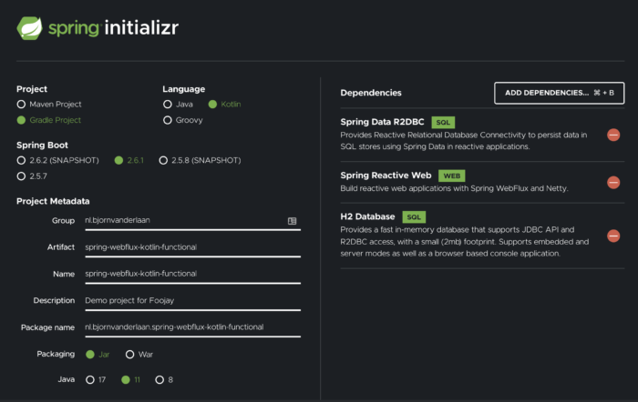

When a HTTP request comes in, a 'normal' web application would map the request to a specific thread from the thread pool. This assigned thread stays with the request until a response can be returned to the request socket. Along the way, we might need to fetch data from some web service or database, read or write to a file or do other I/O calls, during which the thread is blocked and has to wait until it gets a response. For applications with high request rates, the thread pool can at some point become exhausted and then no new requests can be handled anymore.

This is where reactive programming can help us out. Instead of having a large thread-pool and a "thread-per-request" model, a reactive application only has one thread per CPU core that keeps running and if it hits an IO operation then it offloads this operation and works on something else until the IO has completed. We say that such application is non-blocking. The approach came into existence when a group of companies cooperated in the Reactive Streams initiative to define the key principles and four JVM interfaces. After that, they pretty much each went their own way to create a reactive library based on these agreements. One of these libraries, Project Reactor, is the fundament on which Spring built their reactive web framework Spring WebFlux. This reactive stack enables us to build non-blocking web applications in a structure that looks familiar in terms of classes, methods and annotations if you worked with Spring MVC, but the actual method implementations can be quite a learning curve. Have a look at the controller below.

```java
@RestController
@RequestMapping("/cats")
class CatController(
    @Autowired val catRepository: CatRepository
) {
    @PutMapping("{id}")
    fun updateProduct(@PathVariable(value = "id") id: Long, @RequestBody newCat: Cat): Mono<ResponseEntity<Cat?>> {
        return catRepository
            .findById(id)
            .flatMap { existingCat ->
                catRepository.save(
                    existingCat.copy(
                        name = newCat.name,
                        type = newCat.type,
                        age = newCat.age
                    )
                )
            }
            .map { updatedCat -> ResponseEntity.ok(updatedCat) }
            .defaultIfEmpty(ResponseEntity.notFound().build())
    }
}
```

As you see, the imperative style we came to love is replaced by a declaritive paradigm with many combinators. Our code suddenly consists of functional call chains that propogate inputs from publishers to subscribers. Also, we now suddenly need to deal with abstractions like Mono and Flux in all the layers of our application and, as such, our codebase becomes coupled to the reactive library we use. In the end, it feels like we have to leave behind everything we know just to get the non-blocking goodies. That seems like a high price, so can we do different?

Yes, we can! Kotlin gives us a language feature called coroutines, which conceptually are lightweight threads that allows asynchronous code execution even though the code still looks like we are used to in sequential execution. We can go reactive without subjecting our codebase to a full declarative make-over because our friends at Spring did a very nice job integrating Kotlin, and especially coroutines, into their framework. The integration allows us to use coroutines at the public API level while we still leverage Reactor under the hood.

Caught your interest? In this article, we will develop a simple web API using Spring WebFlux and aim to leverage the special Kotlin extensions in Spring WebFlux as much as possible. These extensions include the `coRouter` (hint, 'co' is for coroutines ;)) DSL, using `Flow` as a return value in our router, and the adapted WebClient methods with 'await'.  

Instead of the annotation-based model with `@RestController`, `@RequestMapping`, and `@Service`, we use the functional web framework that introduces a new programming model where we use functions to route and handle requests.

We follow the journey of an incoming request and, therefore, start on the outside. A request starts at the router functions, which are the functional alternative of the controller's `@RequestMapping`. The request is then passed to the functional variant of a service, which we call a handler. Finally, we arrive at the already familiar repository. This last layer has the same name as in Spring MVC, but the technology behind it is quite different to make it all non-blocking. If you want to stick with your controllers and services then that is also fully supported by WebFlux and most articles actually show that approach. However, I would like to explore an approach that is more idiomatic Kotlin. All code examples can be found in [this GitHub repository](https://github.com/BjornvdLaan/spring-boot-webflux-kotlin-h2-example "GitHub repository").

## Our Example

As our example, we build an API for our very own CMS (Cat Management System) which is able to perform Create, Read, Update, and Delete (CRUD) operations. Below you find an overview of the routes we will define and the possible responses the application can come back with.

| HTTP Method |     Route      | HTTP Response Status |                 Description                  |
|-------------|----------------|----------------------|----------------------------------------------|
| GET         | /api/cats      | 200 Ok               | All cats are retrieved                       |
| GET         | /api/cats/{id} | 200 Ok               | Cat with an existing id is requested         |
| GET         | /api/cats/{id} | 404 Not Found        | Cat with a non-existing id is requested      |
| POST        | /api/cats      | 201 Created          | New cat is created successfully              |
| POST        | /api/cats      | 400 Bad Request      | New cat cannot be created                    |
| PUT         | /api/cats/{id} | 200 Ok               | Existing cat is updated                      |
| PUT         | /api/cats/{id} | 400 Bad Request      | Cat cannot be updated                        |
| PUT         | /api/cats/{id} | 404 Not Found        | Non-existing cat was requested to be updated |
| DELETE      | /api/cats/{id} | 204 No Content       | Existing cat is now deleted                  |
| DELETE      | /api/cats/{id} | 404 Not Found        | Deletion of non-existing cat was requested   |

## Setting Up the Project

We start by creating a fresh Spring Boot project using the [Spring Initializr](https://start.spring.io/). We tell it to be a Gradle project using Kotlin and packaged as a jar. We also add the dependencies we need: Spring Reactive Web which includes WebFlux and Netty, Spring Data R2DBC for our repositories, and H2 to create a simple in-memory database to test our application.



We then need to add two more test dependencies for Mockk and SpringMockk:

```java
dependencies {
    ...
    testImplementation("io.mockk:mockk:1.10.2")
    testImplementation("com.ninja-squad:springmockk:3.0.1")
    ...
}
```

These are not strictly required to run our application but are used in the tests. I recommend you to check Maven Central for the latest versions.

## Router

Router functions take an argument of type `ServerRequest` and return a `ServerResponse`. These are the WebFlux variants of Spring MVC's `RequestEntity` and `ResponseEntity`, respectively. We use the Kotlin router DSL to define our routes:

```java
@Configuration
class CatRouterConfiguration(
    private val catHandler: CatHandler
) {
    @Bean
    fun apiRouter() = coRouter {
        "/api/cats".nest {
            accept(APPLICATION_JSON).nest {
                GET("", catHandler::getAll)

                contentType(APPLICATION_JSON).nest {
                    POST("", catHandler::add)
                }

                "/{id}".nest {
                    GET("", catHandler::getById)
                    DELETE("", catHandler::delete)

                    contentType(APPLICATION_JSON).nest {
                        PUT("", catHandler::update)
                    }
                }
            }
        }
    }
}
```

The `coRouter` function creates a RouterFunction based on the further nested statements. You can use the `String.nest` extension function to group routes that share a common path prefix. Similar groupings can be made based on accept and contentType headers, as well as other predicates. The actual routes are added through functions that correspond to the HTTP methods: `GET`, `POST`, `PUT`, `DELETE` and the others. The actual processing is handled by the Handler.

## Handler

Implementations of `HandlerFunction` represent functions that takes in requests and generates responses based on these. Similar to the methods in a service, related handler functions are grouped in a handler class using a Kotlin-specific DSL. These functions read and parse the path variables and request bodies, reach out to the repositories, and build a `ServerResponse` to return to the router.

```java
@Component
class CatHandler(
    private val catRepository: CatRepository
) {
    suspend fun getAll(req: ServerRequest): ServerResponse {
        return ServerResponse
            .ok()
            .contentType(MediaType.APPLICATION_JSON)
            .bodyAndAwait(
                catRepository.findAll().map { it.toDto() }
            )
    }

    suspend fun getById(req: ServerRequest): ServerResponse {
        val id = Integer.parseInt(req.pathVariable("id"))
        val existingCat = catRepository.findById(id.toLong())

        return existingCat?.let {
            ServerResponse
                .ok()
                .contentType(MediaType.APPLICATION_JSON)
                .bodyValueAndAwait(it)
        } ?: ServerResponse.notFound().buildAndAwait()
    }

    suspend fun add(req: ServerRequest): ServerResponse {
        val receivedCat = req.awaitBodyOrNull(CatDto::class)

        return receivedCat?.let {
            ServerResponse
                .ok()
                .contentType(MediaType.APPLICATION_JSON)
                .bodyValueAndAwait(
                    catRepository
                        .save(it.toEntity())
                        .toDto()
                )
        } ?: ServerResponse.badRequest().buildAndAwait()
    }

    suspend fun update(req: ServerRequest): ServerResponse {
        val id = req.pathVariable("id")

        val receivedCat = req.awaitBodyOrNull(CatDto::class) 
            ?: return ServerResponse.badRequest().buildAndAwait()

        val existingCat = catRepository.findById(id.toLong()) 
            ?: return ServerResponse.notFound().buildAndAwait()

        return ServerResponse
            .ok()
            .contentType(MediaType.APPLICATION_JSON)
            .bodyValueAndAwait(
                catRepository.save(
                    receivedCat.toEntity().copy(id = existingCat.id)
                ).toDto()
            )
    }

    suspend fun delete(req: ServerRequest): ServerResponse {
        val id = req.pathVariable("id")

        return if (catRepository.existsById(id.toLong())) {
            catRepository.deleteById(id.toLong())
            ServerResponse.noContent().buildAndAwait()
        } else {
            ServerResponse.notFound().buildAndAwait()
        }
    }
}
```

Here we also observe the Kotlin extensions that Spring baked into WebFlux. The convention is that the `ServerResponse` builder's Reactor-based methods are prefixed by 'await' or suffixed by 'AndAwait' to form the suspending methods used in the coroutines approach. To see that it internally is still the same mechanism, let's zoom in on the `bodyValueAndAwait` method:

```java
suspend fun ServerResponse.BodyBuilder.bodyValueAndAwait(body: Any): ServerResponse =
        bodyValue(body).awaitSingle()
```

As we can see, the Reactor method `bodyValue` is called and chained by `awaitSingle` from the `kotlinx.coroutines` package, which awaits the single value from the Publisher and returns the resulting value, to create the coroutines variant called `bodyValueAndAwait`.

## Repository

The last stop before the database are the repositories at the persistence infrastructure layer. Similar to the other layers, we need to be non-blocking here. We, therefore, cannot use the blocking JDBC and need to use the reactive alternative called [R2DBC](https://r2dbc.io/). Spring Data Reactive luckily offers interfaces for non-blocking repositories that look a lot like their blocking counterparts `JpaRepository` or `CrudRepository`. If we choose to implement the R2DBC variant called `ReactiveCrudRepository` then these methods would return the Reactor data types `Mono` and `Flux`. Fortunately for us, as with the other layers, WebFlux provides extensions for Kotlin and coroutines in the form of `CoroutineCrudRepository` that return just the entities:

```java
interface CatRepository : CoroutineCrudRepository<Cat, Long> {
    override fun findAll(): Flow<Cat>
    override suspend fun findById(id: Long): Cat?
    override suspend fun existsById(id: Long): Boolean
    override suspend fun <S : Cat> save(entity: S): Cat
    override suspend fun deleteById(id: Long)
}
```

## Tests

Well behaved software engineering practitioners as we are, we want to test our applications thoroughly. Below are two test suites, one mocks the repository to not be dependent on an actual database and the other uses an in-memory H2 database. They both provide a simple test for each HTTP status that each route can respond with.

Both tests have two helper functions `aCat()` and `anotherCat()` that create a new `Cat` with some default values and offer the possibility to supply custom values. This approach to creating objects for our tests hides away all details of the cats except those that are relevant to the test, in which case you would define a custom value for those relevant fields.

### 1. Tests with mocking

This first approach is the one I see most often in other articles: we mock the `CatRepository` to test the router and handler without being dependent on a database. We use a combination of Spring WebFlux's `@WebFluxTest` together with `@Import` that adds the router and handler class. We could use `@SpringBootTest` and `@AutoConfigureWebTestClient` to achieve the same thing without needing to manually import the classes with `@Import`. However, in this way our tests are faster and I also like how the specific router and hander under test are explicitly mentioned at the top.

We mock the repository using [Mockk](https://mockk.io/), a mocking framework built specifically for Kotlin. It is a good match for the application we created as Mockk has built-in support for coroutines. A deepdive into Mockk is beyond the scope of this article. What you should know is that we can use the combination of `coEvery` and `coAnswers` to set return values for the methods of `CatRepository` we want to mock. Also, Spring does not (yet) offer support to mock beans with Mockk like it gives us the `@MockBean` annotation for Mockito. Therefore, we use [SpringMockk](https://github.com/Ninja-Squad/springmockk) and its `@MockkBean` annotation to achieve the same thing.

```java
@WebFluxTest
@Import(CatRouterConfiguration::class, CatHandler::class)
class MockedRepositoryIntegrationTest(
    @Autowired private val client: WebTestClient
) {
    @MockkBean
    private lateinit var repository: CatRepository

    private fun aCat(
        name: String = "Obi",
        type: String = "Dutch Ringtail",
        age: Int = 3
    ) =
        Cat(
            name = name,
            type = type,
            age = age
        )

    private fun anotherCat(
        name: String = "Wan",
        type: String = "Japanese Bobtail",
        age: Int = 5
    ) =
        aCat(
            name = name,
            type = type,
            age = age
        )

    @Test
    fun `Retrieve all cats`() {
        every {
            repository.findAll()
        } returns flow {
            emit(aCat())
            emit(anotherCat())
        }

        client
            .get()
            .uri("/api/cats")
            .exchange()
            .expectStatus()
            .isOk
            .expectBodyList<CatDto>()
            .hasSize(2)
            .contains(aCat().toDto(), anotherCat().toDto())
    }

    @Test
    fun `Retrieve cat by existing id`() {
        coEvery {
            repository.findById(any())
        } coAnswers {
            aCat()
        }

        client
            .get()
            .uri("/api/cats/2")
            .exchange()
            .expectStatus()
            .isOk
            .expectBody<CatDto>()
            .isEqualTo(aCat().toDto())
    }

    @Test
    fun `Retrieve cat by non-existing id`() {
        coEvery {
            repository.findById(any())
        } returns null

        client
            .get()
            .uri("/api/cats/2")
            .exchange()
            .expectStatus()
            .isNotFound
    }

    @Test
    fun `Add a new cat`() {
        val savedCat = slot<Cat>()
        coEvery {
            repository.save(capture(savedCat))
        } coAnswers {
            savedCat.captured
        }

        client
            .post()
            .uri("/api/cats/")
            .accept(MediaType.APPLICATION_JSON)
            .contentType(MediaType.APPLICATION_JSON)
            .bodyValue(aCat().toDto())
            .exchange()
            .expectStatus()
            .isOk
            .expectBody<CatDto>()
            .isEqualTo(savedCat.captured.toDto())
    }

    @Test
    fun `Add a new cat with empty request body`() {
        val savedCat = slot<Cat>()
        coEvery {
            repository.save(capture(savedCat))
        } coAnswers {
            savedCat.captured
        }

        client
            .post()
            .uri("/api/cats/")
            .accept(MediaType.APPLICATION_JSON)
            .contentType(MediaType.APPLICATION_JSON)
            .body(fromValue("{}"))
            .exchange()
            .expectStatus()
            .isBadRequest
    }

    @Test
    fun `Update a cat`() {
        coEvery {
            repository.findById(any())
        } coAnswers {
            aCat()
        }

        val savedCat = slot<Cat>()
        coEvery {
            repository.save(capture(savedCat))
        } coAnswers {
            savedCat.captured
        }

        val updatedCat = aCat(name = "New fancy name").toDto()

        client
            .put()
            .uri("/api/cats/2")
            .accept(MediaType.APPLICATION_JSON)
            .contentType(MediaType.APPLICATION_JSON)
            .bodyValue(updatedCat)
            .exchange()
            .expectStatus()
            .isOk
            .expectBody<CatDto>()
            .isEqualTo(updatedCat)
    }

    @Test
    fun `Update cat with non-existing id`() {
        val requestedId = slot<Long>()
        coEvery {
            repository.findById(capture(requestedId))
        } coAnswers {
            nothing
        }

        val updatedCat = aCat(name = "New fancy name").toDto()

        client
            .put()
            .uri("/api/cats/2")
            .accept(MediaType.APPLICATION_JSON)
            .contentType(MediaType.APPLICATION_JSON)
            .bodyValue(updatedCat)
            .exchange()
            .expectStatus()
            .isNotFound
    }

    @Test
    fun `Update cat with empty request body id`() {
        coEvery {
            repository.findById(any())
        } coAnswers {
            aCat()
        }

        client
            .put()
            .uri("/api/cats/2")
            .accept(MediaType.APPLICATION_JSON)
            .contentType(MediaType.APPLICATION_JSON)
            .body(fromValue("{}"))
            .exchange()
            .expectStatus()
            .isBadRequest
    }

    @Test
    fun `Delete cat with existing id`() {
        coEvery {
            repository.existsById(any())
        } coAnswers {
            true
        }

        coEvery {
            repository.deleteById(any())
        } coAnswers {
            nothing
        }

        client
            .delete()
            .uri("/api/cats/2")
            .exchange()
            .expectStatus()
            .isNoContent

        coVerify { repository.deleteById(any()) }
    }

    @Test
    fun `Delete cat by non-existing id`() {
        coEvery {
            repository.existsById(any())
        } coAnswers {
            false
        }

        client
            .delete()
            .uri("/api/cats/2")
            .exchange()
            .expectStatus()
            .isNotFound

        coVerify(exactly = 0) { repository.deleteById(any()) }
    }
}
```

### 2. Tests without mocking

We can also perform an integration test with an actual database. Nothing better than the real thing, right? Different options exist such as testcontainers, actual databases, and in-memory databases. We will pick the third option here and use `@DirtiesContext` to recreate the application context, including the database, after each test.

One difference with the other test suite is that we use `@AutoConfigureWebTestClient` instead of `@WebFluxTest`. The latter disables full auto-configuration and only configures a subset that it deems relevant, but we now also need our repositories configured.

Also, as we cannot mock the repository's answers anymore, we need another way to set its state at the start of the test. I defined an extension method `CatRepository.seed` to save cats to the database and an `@AfterEach` method to clean up after the test. Both use `runBlocking` to create a coroutine that blocks the current thread interruptible until its completion. If we do not block the thread then JUnit proceeds with the actual test before the cats are actually inserted into or deleted from the database.

```java
@SpringBootTest
@AutoConfigureWebTestClient
@DirtiesContext(classMode = DirtiesContext.ClassMode.AFTER_EACH_TEST_METHOD)
class InMemoryDatabaseIntegrationTest(
    @Autowired val client: WebTestClient,
    @Autowired val repository: CatRepository
) {
    private fun aCat(
        name: String = "Obi",
        type: String = "Dutch Ringtail",
        age: Int = 3
    ) =
        Cat(
            name = name,
            type = type,
            age = age
        )

    private fun anotherCat(
        name: String = "Wan",
        type: String = "Japanese Bobtail",
        age: Int = 5
    ) =
        aCat(
            name = name,
            type = type,
            age = age
        )

    private fun CatRepository.seed(vararg cats: Cat) =
        runBlocking {
            repository.saveAll(cats.toList()).toList()
        }

    @AfterEach
    fun afterEach() {
        runBlocking {
            repository.deleteAll()
        }
    }

    @Test
    fun `Retrieve all cats`() {
        repository.seed(aCat(), anotherCat())

        client
            .get()
            .uri("/api/cats")
            .exchange()
            .expectStatus()
            .isOk
            .expectBodyList<CatDto>()
            .hasSize(2)
            .contains(aCat().toDto(), anotherCat().toDto())
    }

    @Test
    fun `Retrieve cat by existing id`() {
        repository.seed(aCat(), anotherCat())

        client
            .get()
            .uri("/api/cats/2")
            .exchange()
            .expectStatus()
            .isOk
            .expectBody<CatDto>()
            .isEqualTo(anotherCat().toDto())
    }

    @Test
    fun `Retrieve cat by non-existing id`() {
        client
            .get()
            .uri("/api/cats/2")
            .exchange()
            .expectStatus()
            .isNotFound
    }

    @Test
    fun `Add a new cat`() {
        client
            .post()
            .uri("/api/cats")
            .accept(MediaType.APPLICATION_JSON)
            .contentType(MediaType.APPLICATION_JSON)
            .bodyValue(aCat().toDto())
            .exchange()
            .expectStatus()
            .isOk
            .expectBody<CatDto>()
            .isEqualTo(aCat().toDto())
    }

    @Test
    fun `Add a new cat with empty request body`() {
        client
            .post()
            .uri("/api/cats")
            .accept(MediaType.APPLICATION_JSON)
            .contentType(MediaType.APPLICATION_JSON)
            .body(fromValue("{}"))
            .exchange()
            .expectStatus()
            .isBadRequest
    }

    @Test
    fun `Update a cat`() {
        repository.seed(aCat(), anotherCat())

        val updatedCat = aCat(name = "New fancy name").toDto()
        client
            .put()
            .uri("/api/cats/2")
            .accept(MediaType.APPLICATION_JSON)
            .contentType(MediaType.APPLICATION_JSON)
            .bodyValue(updatedCat)
            .exchange()
            .expectStatus()
            .isOk
            .expectBody<CatDto>()
            .isEqualTo(updatedCat)
    }

    @Test
    fun `Update cat with non-existing id`() {
        val updatedCat = aCat(name = "New fancy name").toDto()

        client
            .put()
            .uri("/api/cats/2")
            .accept(MediaType.APPLICATION_JSON)
            .contentType(MediaType.APPLICATION_JSON)
            .bodyValue(updatedCat)
            .exchange()
            .expectStatus()
            .isNotFound
    }

    @Test
    fun `Update cat with empty request body id`() {
        client
            .put()
            .uri("/api/cats/2")
            .accept(MediaType.APPLICATION_JSON)
            .contentType(MediaType.APPLICATION_JSON)
            .body(fromValue("{}"))
            .exchange()
            .expectStatus()
            .isBadRequest
    }

    @Test
    fun `Delete cat with existing id`() {
        repository.seed(aCat(), anotherCat())

        client
            .delete()
            .uri("/api/cats/2")
            .exchange()
            .expectStatus()
            .isNoContent
    }

    @Test
    fun `Delete cat by non-existing id`() {
        client
            .delete()
            .uri("/api/cats/2")
            .exchange()
            .expectStatus()
            .isNotFound
    }
}
```

## Conclusion

In this article, we saw how to build a non-blocking web application with Spring WebFlux using the extensions for Kotlin.

The result is a codebase that is not littered with `Mono`-s and `Flux`-es (although we get some `suspend` and `Flow` in return).

The approach described above allows us to keep writing our imperative-style code like we are used to.

We also looked at two ways to test our application, one with and one without mocking.
