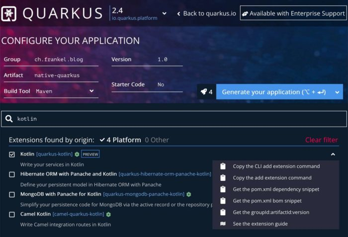
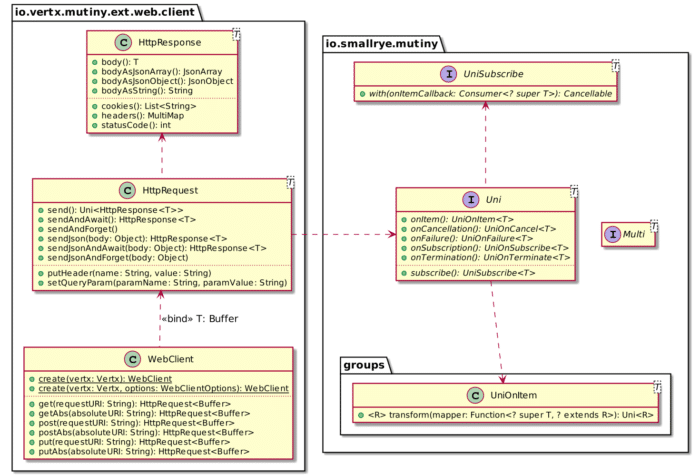
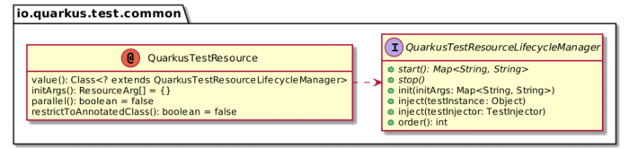

So far, we have looked at how well [Spring Boot](https://foojay.io/today/native-spring-boot/) and [Micronaut](https://foojay.io/today/native-image-micronaut/) integrate GraalVM native image extension. In this post, I'll focus on [Quarkus](https://quarkus.io/):
> A Kubernetes Native Java stack tailored for OpenJDK HotSpot and GraalVM, crafted from the best of breed Java libraries and standards.

## Creating a new project

Just as Spring Boot and Micronaut, Quarkus provides options to create new projects:

1. A dedicated `quarkus` [CLI](https://quarkus.io/guides/cli-tooling)
2. A [Web UI](https://code.quarkus.io/)



   Quarkus offers a definite improvement over its competitors. Every dependency has a detailed contextual menu that allows:
   * Copying the command to add the dependency via `quarkus`
   * Copying the command to add the dependency via Maven
   * Copying the Maven POM dependency snippet
   * Copying the Maven BOM dependency snippet
   * Copying the Maven BOM dependency snippet
   * Opening the related dependency's guide

   Note that the menu displays Gradle-related commands instead if you choose Gradle as the build tool.
3. A Maven plugin: I like that no external dependencies are necessary beyond one's build tool of choice.

## Bean configuration

Quarkus relies on [JSR 330](http://javax-inject.github.io/javax-inject/). However, it deviates from the specification: it lists both [limitations](https://quarkus.io/guides/cdi-reference#limitations) and [non-standard features](https://quarkus.io/guides/cdi-reference#nonstandard_features).

For example, with Quarkus, you can skip the `@Produces` annotation on a producer method if it's already annotated with one of the scope annotations, *e.g.* , `@Singleton`. Here's the code to create the message digest:

```kotlin
class MarvelFactory {

    @Singleton
    fun digest(): MessageDigest = MessageDigest.getInstance("MD5")
}
```

## Controller configuration

A lot of Quarkus relies on Jakarta EE specifications. As such, the most straightforward path to creating controllers is JAX-RS. We can create a "controller" with the following code:

```kotlin
@Path("/")
class MarvelController {

    @GET
    fun characters() = Response.accepted()
}
```

Because the developers of Quarkus also worked on [Vert.x](https://vertx.io/), the former also offers a plugin that integrates the latter. Vert.x is full *reactive* and provides the concept of *routes*. With Quarkus, you can annotate methods to mark them as routes. One can migrate the above code to routes:

```kotlin
@Singleton
class MarvelController {

     @Routes
     fun characters() = Response.accepted()
}
```

Alternatively, one can prefer programmatic route registration:

```kotlin
@Singleton
class MarvelRoutes {

    fun get(@Observes router: Router) {       // 1
        router.get("/").handler {
            it.response()
                .setStatusCode(200)
                .send()                       // 2
        }
    }
}
```

1. Observe the `Router` "event": it's fired once at startup time.
2. Send the empty response; return a `Future`

Note that the programmatic way requires as many annotations as the annotation way in this particular case. However, the former requires two annotations, while the latter requires one per route plus one.

## Non-blocking HTTP client

Micronaut integrates with many HTTP client flavors via plugins. In this project, I chose to use [Mutiny](https://smallrye.io/smallrye-mutiny/).
> There are other reactive programming libraries out there. In the Java world, we can mention Project Reactor and Rx Java.
>
> So, what makes Mutiny different from these two well-known libraries? The API!
>
> As said above, asynchronous is hard to grasp for most developers, and for good reasons. Thus, the API must not require advanced knowledge or add cognitive overload. It should help you design your logic and still be intelligible in 6 months.
>
> -- <https://smallrye.io/smallrye-mutiny/pages/philosophy#what-makes-mutiny-different>

Here's a glimpse into a subset of the Mutiny API:



At first, I was not fond of Mutiny. I mean, we already have enough reactive clients: Project Reactor, RxJava2, etc.

Then, I realized the uniqueness of its approach. Reactive programming is pretty tricky because of all available options. But Mutiny is designed around a fluent API that leverages the type system to narrow down compatible options at compile-time. It gently helps you write the result you want, even with a passing API knowledge.

I'm now convinced to leave it a chance. Let's use Mutiny to make a request:

```kotlin
val client = WebClient.create(vertx)                                  // 1
client.getAbs("https://gateway.marvel.com:443/v1/public/characters")  // 2
      .send()                                                         // 3
      .onItem()                                                       // 4
      .transform { it.bodyAsString() }                                // 5
      .await()                                                        // 6
      .indefinitely()                                                 // 7
```

1. Create the client by wrapping a `Vertx` instance. Quarkus provides one and can inject it for you
2. Create a new instance of a `GET` HTTP request
3. Send the request *asynchronously*. Nothing has happened at this point yet.
4. When it receives the response...
5. ... transform its body to a `String`
6. Wait...
7. ... forever, until it gets the response.

To get parameters from the coming request and forward them is straightforward with the routing context:

```kotlin
router.get("/").handler { rc ->
    client.getAbs("https://gateway.marvel.com:443/v1/public/characters")
        .queryParamsWith(rc.request())
        .send()
        .onItem()
        .transform { it.bodyAsString()) }
        .await()
        .indefinitely()

fun HttpRequest<Buffer>.queryParamsWith(request: HttpServerRequest) =
    apply {
        arrayOf("limit", "offset", "orderBy").forEach { param ->
            request.getParam(param)?.let {
                addQueryParam(param, it)
            }
        }
    }
```

## Parameterization

Like Spring Boot and Micronaut, Quarkus allows parameterizing one's application in multiple ways:

* System properties
* Environment variables
* `.env` file in the current working directory
* Configuration file in `$PWD/config/application.properties`
* Configuration file `application.properties` in classpath
* Configuration file `META-INF/microprofile-config.properties` in classpath

Note that it's not possible to use command-line parameters for parameterization.

Unlike its siblings, the web client requires you to split the URL into three components, host, port, and whether to use SSL.

```kotlin
app.marvel.server.ssl=true
app.marvel.server.host=gateway.marvel.com
app.marvel.server.port=443
```

Because of this, we need to be a bit creative regarding the configuration classes:

```kotlin
@Singleton                                                                    // 1
data class ServerProperties(
    @ConfigProperty(name = "app.marvel.server.ssl") val ssl: Boolean,         // 2
    @ConfigProperty(name = "app.marvel.server.host") val host: String,        // 2
    @ConfigProperty(name = "app.marvel.server.port") val port: Int            // 2
)

@Singleton                                                                    // 1
data class MarvelProperties(
    val server: ServerProperties,                                             // 3
    @ConfigProperty(name = "app.marvel.apiKey") val apiKey: String,           // 2
    @ConfigProperty(name = "app.marvel.privateKey") val privateKey: String    // 2
)
```

1. Configuration classes are regular beans.
2. Quarkus uses the Microprofile Configuration specification. `@ConfigProperty` sets the property key to read from. It's unwieldy to repeat the same prefix on all keys. Thus, Microprofile offers the `@ConfigProperties` to set the prefix on the class. However, such a class needs a zero-arg constructor, which doesn't work with Kotlin's data classes.
3. Inject the other config class and benefit from a nested structure

## Testing

Like its siblings, Quarkus offers its dedicated annotation for tests, `@QuarkusTest`. It also provides `@NativeImageTest`, which allows running the test in a native-image context. The idea is to define your JVM test in a class annotated with the former and create a subclass annotated with the latter. This way, the test will run both in a JVM context and a native one. Note that I'm not sure it worked in my setup.

But IMHO, the added value of Quarkus in a testing context lies in how it defines a reusable resource abstraction.



With only one interface and one annotation, one can define a resource, *e.g.*, a mock server, start it before tests and stop it after. Let's do that:

```kotlin
class MockServerResource : QuarkusTestResourceLifecycleManager {

    private val mockServer = MockServerContainer(
        DockerImageName.parse("mockserver/mockserver")
    )

    override fun start(): Map<String, String> {
        mockServer.start()
        val mockServerClient = MockServerClient(
            mockServer.containerIpAddress,
            mockServer.serverPort
        )
        val sample = this::class.java.classLoader.getResource("sample.json")
                                                ?.readText()
        mockServerClient.`when`(
            HttpRequest.request()
                .withMethod("GET")
                .withPath("/v1/public/characters")
        ).respond(
            HttpResponse()
                .withStatusCode(200)
                .withHeader("Content-Type", "application/json")
                .withBody(sample)
        )
        return mapOf(
            "app.marvel.server.ssl" to "false",
            "app.marvel.server.host" to mockServer.containerIpAddress,
            "app.marvel.server.port" to mockServer.serverPort.toString()
        )
    }

    override fun stop() = mockServer.stop()
}
```

Now, we can use this server inside our test:

```kotlin
@QuarkusTest
@QuarkusTestResource(MockServerResource::class)
class QuarkusApplicationTest {

    @Test
    fun `should deserialize JSON payload from server and serialize it back again`() {
        val model = given()                                             // 1
            .`when`()
            .get("/")
            .then()
            .statusCode(200)
            .contentType(ContentType.JSON)
            .and()
            .extract()
            .`as`(Model::class.java)
        assertNotNull(model)
        assertNotNull(model.data)
        assertEquals(1, model.data.count)
        assertEquals("Anita Blake", model.data.results.first().name)
    }
}
```

1. Quarkus integrates the RestAssured API. It uses some of Kotlin's keywords, so we need to escape them with back-ticks.

I like how it decouples the test from its dependencies.

## Docker and GraalVM integration

When one scaffolds a new project, Quarkus creates different ready-to-use `Dockerfile`:

* A legacy JAR
* A layered JAR approach: dependencies are added to the image first so that if any of them changes, the build reuses their layer
* A native image
* A native image with a *distroless* parent

The good thing is that one can configure any of these templates to suit one's needs. The downside is that it requires a local Docker install. Moreover, templates are just templates - you can change them entirely.

If you don't like this approach, Quarkus provides an [integration point](https://quarkus.io/guides/container-image#jib) with [Jib](https://github.com/GoogleContainerTools/jib). In the rest of this section, we will keep using Docker files.

To create a GraalVM native binary, one uses the following command:

```bash
./mvnw package -Pnative -Dquarkus.native.container-build=true
```

You can find the resulting native executable in the `target` folder.

To wrap it in a Docker container, use:

```bash
docker build -f src/main/docker/Dockerfile.native -t native-quarkus .
```

Note that the Docker container would fail to start if you ran the first command on a non-Linux platform. To fix this issue, one needs to add an option:

```bash
./mvnw package -Pnative -Dquarkus.native.container-build=true \
                        -Dquarkus.container-image.build=true
```

> `quarkus.container-image.build=true` instructs Quarkus to create a container-image using the final application artifact (which is the native executable in this case).
>
> -- <https://quarkus.io/guides/building-native-image#using-the-container-image-extensions>

For a smaller image, we can use the distroless distribution.

The result is the following:

```
REPOSITORY                 TAG       IMAGE ID         CREATED         SIZE
native-quarkus-distroless  latest    7a13aef3bcd2     2 hours ago     67.9MB
native-quarkus             latest    6aba7346d987     2 hours ago     148MB
```

Let's dive:

```
┃ ● Layers ┣━━━━━━━━━━━━━━━━━━━━━━━━━━━━━━━━━━━━━━━━━━━━━━━━━━━━━━━━━━━━━
Cmp   Size  Command
    2.4 MB  FROM 58f4b2390f4a511                                       // 1
     18 MB  bazel build ...                                            // 2
    2.3 MB  bazel build ...                                            // 2
    113 kB  #(nop) COPY file:b8552793e0627404932d516d478842f7f9d5d5926 // 3
     45 MB  COPY target/*-runner /application # buildkit               // 4
```

1. Parent distroless image
2. Add system libraries, obviously via the Bazel build system
3. One more system library
4. Our native executable

We can now run the container:

```bash
docker run -it -p8080:8080 native-quarkus-distroless
```

And the following URLs work as expected:

```bash
curl localhost:8080
curl 'localhost:8080?limit=1'
curl 'localhost:8080?limit=1&offset=50'
```

## Conclusion

Quarkus brings an exciting take to the table. Unlike Micronaut, it doesn't generate additional *bytecode* during each compilation. The extra code is only generated when one generates the native image via the Maven command. Moreover, relying on Dockerfiles allows you to configure them to your heart's content if you happen to have a Docker daemon available.

However, the Kotlin integration is lacking. You have to downgrade your model representation to allow Quarkus to hydrate your data classes, moving from `val` to `var` and setting default values. Additionally, one needs to set Jackson annotations on each field. Finally, configuration properties don't work well with data classes.

As with Micronaut, if Kotlin is a must-have for you, then you'd better choose Spring Boot over Quarkus. Otherwise, give Quarkus a try.

Thanks [Sébastien Blanc](https://twitter.com/sebi2706) and [Clément Escoffier](https://twitter.com/clementplop) for their review!

The complete source code for this post can be found [on Github](https://github.com/ajavageek/quarkus-native) in Maven format.

**To go further:**

* [Quarkus application configurer](https://code.quarkus.io/)
* [Quarkus Command-Line Interface](https://quarkus.io/guides/cli-tooling)
* [Building applications with Maven](https://quarkus.io/guides/maven-tooling)
* [Using Kotlin](https://quarkus.io/guides/kotlin)
* [Getting started with Reactive - Mutiny](https://quarkus.io/guides/getting-started-reactive#mutiny)
* [Container images](https://quarkus.io/guides/container-image)

*Originally published at [A Java Geek](https://blog.frankel.ch/native/quarkus/) on December 11^th^* *, 2021*

*[CDI]: Context and Dependency Injection
