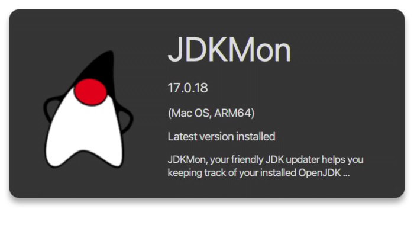
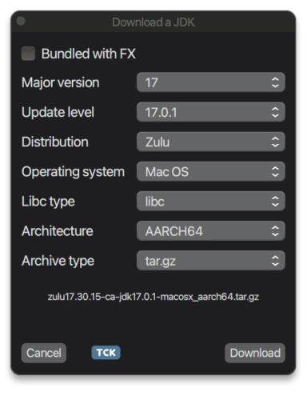

JDKMon is a little tool written in JavaFX that tries to detect all OpenJDK distributions installed on your machine and keep track of updates for those distributions.

It will scan for new updates every three hours and will inform you about available updates.

JDKMon won't install the distributions on your machine but will enable you to download them to a place of your choice.

At the moment the following distributions are supported:

* AdoptOpenJDK
* AdoptOpenJDK J9
* Bi Sheng
* Corretto
* Debian (pkgs not downloadable)
* Dragonwell
* Graalvm CE8
* Graalvm CE11
* Graalvm CE16
* Graalvm CE17
* JetBrains
* Kona
* Liberica
* Liberica Native
* Mandrel
* Microsoft
* OJDK Build
* Open Logic
* Oracle (not all pkgs downloadable)
* Oracle OpenJDK
* RedHat (pkgs not downloadable)
* SAP Machine
* Semeru
* Semeru Certified
* Temurin
* Trava
* Zulu
* Zulu Prime

JDKMon **17.0.18** has just been released!  

This versions brings two new features, described below.

### **Vulnerability Info**

JDKMon will check for all version numbers of the OpenJDK distributions it finds if there are known vulnerabilities. Meaning to say if you have a distribution with 16.0.1 installed on your machine. JDKMon will check if there are known vulnerabilities for OpenJDK 16.0.1.

There is NO guarantee that the distribution you use is affected but at least you will be aware that there might be a CVE (Common Vulnerability and Exposure).

The yellow circle in the screenshot below indicates that there are known vulnerabilities for OpenJDK 16.0.1.  
  

When you click on the yellow circle another window will pop up which shows you the related CVE's.  
  

The CVE entries in that window are links that when clicked will open the clicked CVE in your standard browser with a more detailed description.

### **TCK Test Info (Experimental)**

If an OpenJDK distribution is TCK tested and provides information about that (e.g. like a certificate etc.), JDKMon will indicate this when you want to downlad an OpenJDK distribution.

You will find a little blue TCK tag besides the download button. If you click on that tag it will lead you to the link that is provided by the vendor of the distribution.

At the moment this info is only available from Azul but others will follow.  

JDKMon is available for the following platforms:

* Windows x64
* Linux x64/arm64
* MacOS x64/aarch64

**Download** :  

You can download the latest version from [github relases](https://github.com/HanSolo/JDKMon/releases "github relases")or from [JFX Central](https://www.jfx-central.com/downloads "JFX Central").

**More info:**   
[JDKMon Home](https://harmoniccode.blogspot.com/p/jdkmon.html "JDKMon page")
