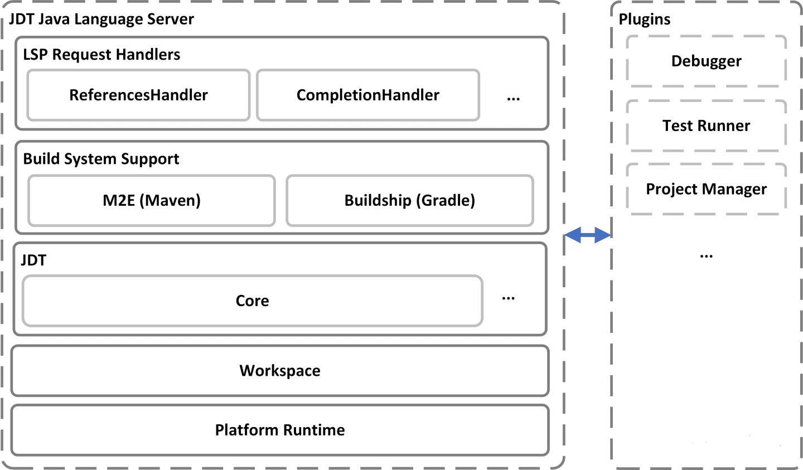
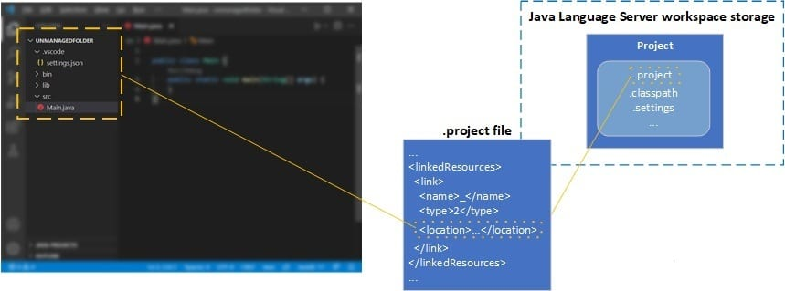

[Recent 1.1.0 release of Language Support for Java™](https://marketplace.visualstudio.com/items?itemName=redhat.java "Recent 1.1.0 release of Language Support for Java™") contains an important update: now when the extension imports a new Java project, the project metadata files ( .project , .classpath , settings, etc.) will no longer be generated in the project path by default.

[This issue](https://github.com/redhat-developer/vscode-java/issues/618 "This issue") was reported more than three years ago and it has been there since 2018 . This blog post shares our journey of solving this problem and the final solution.

## A Long-Awaited Change

With more features introduced into Java extension on Visual Studio Code, the number of our users is also steadily increasing. However, due to the problem that the Java extension generates metadata files in the project directory when importing the project, we have received a lot of frustration from the users. As the user base increases, this problem will also likely to cause negative impact for more users.

In fact, this is not because our product team does not want to completely fix this problem. The root cause starts with the architecture of Java Language Services:

JDT Java Language Server architecture diagram

The official project name of the Java language service used behind the VS Code Java project is Eclipse JDT Language Server™ , which was jointly developed by Microsoft and Red Hat. As you can see in the project architecture diagram above, we reused some Eclipse modules in our implementation , and these automatically generated metadata files are also generated by some of the upstream modules. A related [discussion thread](https://translate.google.com/translate?hl=en&prev=_t&sl=auto&tl=en&u=https://bugs.eclipse.org/bugs/show_bug.cgi%3Fid%3D78438 "discussion thread") can be found in the Eclipse discussion area . The creation of this post can even be traced back to 2004 . Since the path of these metadata files has been hard-coded in the code as constants during implementation, these constants have been referenced by various Eclipse modules and even plug-ins . Over the years, this problem has become in a "historical technical debt".

Considering that changing the behavior of upstream modules may introduce many uncertainties, in the past we tried to provide users with some workarounds, such as hiding these metadata files in the file browser of VS Code , and guiding users to add them to .gitignore . But based from user feedback, these methods did not satisfy users. In order to completely solve this issue that has been bothering users for more than three years, we decided to take another attempt in 2021 and see if we can find a "cure".

## Option 1: Use Symbolic Link (Unsuccessful)

The first method we thought of was to use Symbolic Link . When importing a project, you can link the imported project to a place invisible to the user through Symbolic Link , so that the metadata file is generated under the linked path. But soon this solution ran into problems - creating Symbolic Link under certain operating systems requires specific permissions, otherwise FileSystemException will be thrown, which is obviously not the effect we want, so this solution was immediately abandoned.

## Option 2: Use Eclipse Linked Resources (Unsuccessful)

And Symbolic Link ideas Similarly, we can also choose to use the Eclipse Linked Resources :

Linked Resources : Linked resources are files and folders that are stored in locations in the file system outside of the project's location.

This is the official definition of Linked Resources. It can be used as part of the project, but it is allowed to be stored in other locations outside the project path. In VS Code Java extensions, for the Unmanaged Folder (project without a build system), these metadata files are hidden through the Linked Resources mechanism. Its implementation principle is shown in the following figure:

## Principles of Unmanaged Folder Implementation

You can see that the actual path of the project is placed in the Language Server workspace storage, the user usually does not know this path and in the .project file we define the target path of Linked Resources , which is the folder opened by the user in VS Code Location, as a part of the project, it will participate in the construction process like other projects, and its development experience is similar.

The same principle can be applied to the import process of Maven project and Gradle project to solve this problem. Therefore, we conducted some experiments on the M2E module. The M2E module is responsible for the import of the Maven project in the Java Language Service. By modifying the relevant code in the module, and using the Linked Resources mechanism, the metadata file can be generated outside the project path.

The final experimental results are feasible, but the shortcomings of this approach are also very obvious:

* Large amount of changes: The code that needs to be changed is scattered in different files (about a dozen places) in the entire module. At the same time, because of the large code size, there is no way to determine whether these changes are complete in a short time.
* Not transparent to downstream modules : Because there is an extra layer of Linked Folder, this will generate an extra layer representing the directory structure of the Linked Folder in Java Project Explorer. In the implementation of the Java project view, some additional control logic needs to be added to make the display of the project structure the same as the normal project.
* Unknown feasibility: The support modules M2E and Buildship of the Maven and Gradle build systems are both upstream projects. It is unknown whether this concept can be adopted or not.
* Poor scalability: If you want to support a new build system, you need to implement similar logic again.

Taking those factors into account, the team decided to temporarily abandon the Eclipse Linked Resources approach after discussion and continued to find a better solution.

## Discovering the "Silver Bullet"

There is another reason for abandoning the second approach: Twenty years since Eclipse was released, while ensuring stable operation, it shows ability to continuously add new features and provide excellent extension capabilities, which indicates an excellent architecture in terms of design and scalability. Intuitively, we believe there must be a more elegant solution.

Therefore, this time we directly analyzed the underlying file system of Eclipse, and finally found a "silver bullet" to solve the problem: File System Provider and FileStore (Note: Although in the field of software engineering, the consensus is that there is no silver bullet. But for this particular problem, we did find an interesting solution).

Eclipse workspace structure and FileStore

Eclipse maintains a tree structure for the entire workspace during operation. The nodes of the tree represent files or directories in the file system, and some important information about the files, such as modification time, is also saved.

The bottom layer of Eclipse associates these nodes with files in the file system through the FileStore class. The FileStore class has another important feature: if the mapped object is a single file, then FileStore will also be responsible for providing the input and output streams of this file.

This feature brings a very important idea for the solution of the problem: as long as the input and output streams of the metadata file can be redirected to a location outside the project directory, the problem may be solved. With this assumption, we found another key clue: File System Provider.

## Solution: File System Provider

File System Provider is an extension point open to the Eclipse platform. It allows developers to implement an Eclipse file system interface (org.eclipse.core.filesystem.IFileSystem) and register it to the extension point to handle file request with specific URI scheme.

So we started from the extension point of File System Provider, inherited and overridden the default file processing system in Eclipse. By overriding some of these methods, the file system redirects the file path when processing metadata files, and reads / writes to a place outside the project path. Compared with the second option, the advantages of this approach are:

* **It is completely transparent to other modules and can work normally without modification**, which also means better scalability .
* **The amount of code change is very small**, and the final implementation, including JavaDoc and comments, is only about 300 lines in total .

Of course, this solution is not perfect, because it requires other modules to read and write metadata files through the API provided by Eclipse. We found an upstream change during implementation that Buildship directly uses I/O API in JDK to process metadata files, and we submitted a Pull Request to migrate those operations to Eclipse API.

## Summary

After weighing the pros and cons, we finally chose the third approach and solved this problem that has been bothering VS Code Java users for more than three years. Although the final implementation is not complicated, the process of searching for a solution is intriguing and rewarding.

We want to thank jdneo who was the main contributor to the solution of this problem, and special thanks to Mickael Istria and Alexander Fedorov, members of the Eclipse Platform project. During the process of problem discussion, they provided very useful suggestions, which played an important role in solving the problem.

We believe there is still a lot to improve for VS Code Java. Our goal is to provide the best possible Java development experience on VS Code, so we will continue to tackle challenges as they come.

## Feedback and Suggestions

Please don't hesitate to try our product! Your feedback and suggestions are very important to us and will help shape our product in future. There are several ways to leave us feedback

* Leave your comment on this blog post
* Open an issue[Open an issue](https://github.com/microsoft/vscode-java-pack/issues/new/choose "Open an issue") on our GitHub Issues page
