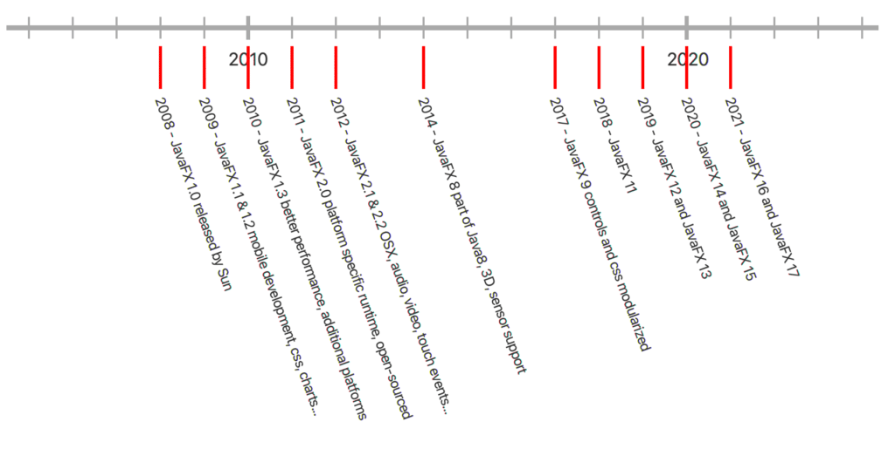
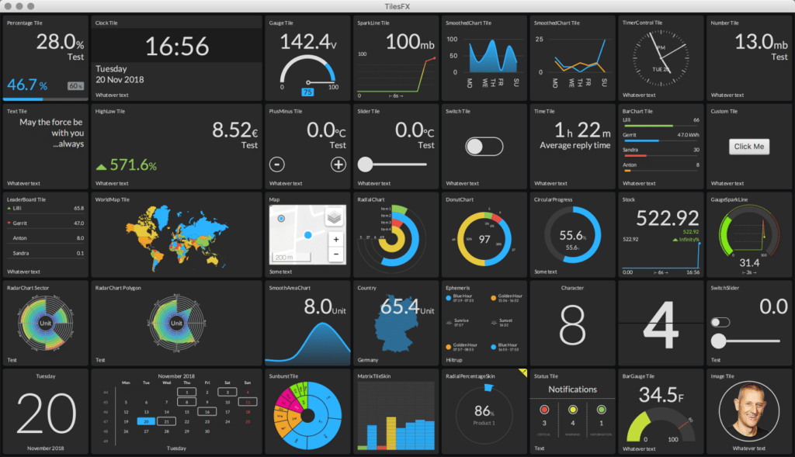
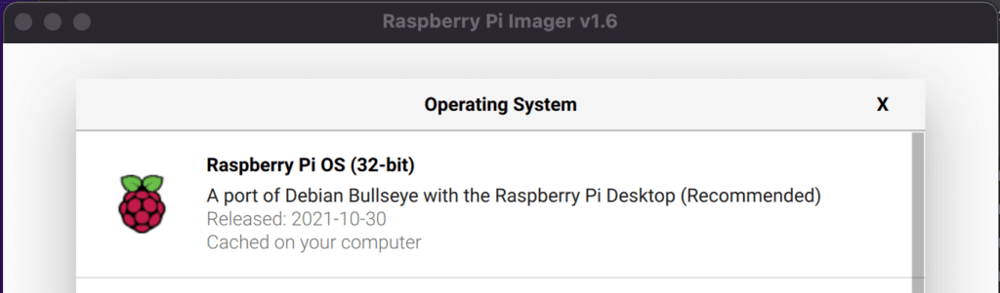

In [the previous post](https://webtechie.be/post/2021-12-10-mqtt-on-raspberry-pi-send-sensor-data-to-hivemq-cloud-with-java-and-pi4j/) we started our discovery of HiveMQ Cloud with Java on the Raspberry Pi. We created an application to send measurements of various sensors to the HiveMQ Cloud MQTT broker. Using an online websocket client we verified the transition of the messages, and could see the data being published to this online message queue.

Now we will take the next step and subscribe to these topics to receive the data in a dashboard, created with JavaFX.



## About JavaFX

JavaFX is a set of graphics and media packages that enables developers to design, create, test, debug, and deploy rich client applications that operate consistently across diverse platforms.

JavaFX was created by Sun Microsystems, later became part of Oracle Corporation and is now an open-source project on [openjfx.io](https://openjfx.io/). Commercial support is available via [GluonHQ](https://gluonhq.com/), which is also the main maintainer of the project, with the support of many contributors (including Oracle). The sources are [available on GitHub](https://github.com/openjdk/jfx). Since version 11, the JavaFX module moved out of the Oracle JDK. With a similar 6-month release cycle of Java, JavaFX development speed has increased, pushing new features forward.


JavaFX allows to quickly build a user interface while using the language and tools you already know as a Java developer. This can be styled with a CSS syntax and is very flexible and extendable and even allows you to draw your own layout elements as you can see in the history graph above, available on [GitHub as part of the sources](https://github.com/FDelporte/JavaOnRaspberryPi/tree/master/Chapter_04_Java/javafx-timeline) of my book ["Getting Started with Java on the Raspberry Pi"](https://webtechie.be/books/).

### JavaFX on the Raspberry Pi

JavaFX can be installed in two ways on the Raspberry Pi:

* By installing a JDK which has JavaFX bundled. Azul and BellSoft provide such versions.
* By installing it separately by using the latest version which can be downloaded from the GluonHQ website.

Personally, I prefer the second approach as you are sure to be using the latest JavaFX runtime, including all improvements for embedded devices. As this is a fast-evolving market, there are a lot of ongoing changes like improved rendering and Direct Rendering Mode (DRM, also known as Kiosk Mode). An article with more information regarding this topic can be found on ["JavaFX Running in Kiosk Mode on the Raspberry Pi"](https://foojay.io/today/javafx-running-in-kiosk-mode-on-the-raspberry-pi/).

### TilesFX library

This great library is developed by [Gerrit Grunwald](https://twitter.com/hansolo_) and provides tiles to build dashboards. Check [his blog](https://harmoniccode.blogspot.com/) for many more JavaFX examples!

You can find [the sources of TilesFX on GitHub](https://github.com/HanSolo/tilesfx) and it is available as a [Maven dependency](https://mvnrepository.com/artifact/eu.hansolo/tilesfx). As part of the sources of TilesFX, a Demo application is provided to show how to use all the available Tiles.


## Java Project

Let's create a JavaFX application to visualize all the sensor values we pushed to HiveMQ Cloud with the application we created in the previous part.

### Dependencies

This project requires a few different dependencies compared to the message sender. Of course, we use the HiveMQ MQTT client again. But for the graphical user interface parts, we need some JavaFX libraries (only controls are used in the application, but others are referenced by TilesFX) and the TilesFX library itself.

```
<dependency>
    <groupId>com.hivemq</groupId>
    <artifactId>hivemq-mqtt-client</artifactId>
    <version>${hivemq.version}</version>
</dependency>

<dependency>
    <groupId>org.openjfx</groupId>
    <artifactId>javafx-controls</artifactId>
    <version>${javafx.version}</version>
</dependency>
<dependency>
    <groupId>org.openjfx</groupId>
    <artifactId>javafx-media</artifactId>
    <version>${javafx.version}</version>
</dependency>
<dependency>
    <groupId>org.openjfx</groupId>
    <artifactId>javafx-web</artifactId>
    <version>${javafx.version}</version>
</dependency>

<dependency>
    <groupId>eu.hansolo</groupId>
    <artifactId>tilesfx</artifactId>
    <version>${tilesfx.version}</version>
</dependency>
```

### Full code on GitHub

The sources of this application are [available on GitHub in the same repository as the previous post](https://github.com/FDelporte/HiveMQ-examples).

#### Starting the JavaFX application

We need to extend from JavaFX Application and in this case, we configure the HiveMQ Client in the start-method. This could also be done in a separate class, but for this proof-of-concept, it's easy to use the client-reference to provide it to the child objects.

For easy maintenance of the topics, these are also defined here.

```
public class HiveMqClient extends Application {

    private static final Logger logger = LogManager.getLogger(HiveMqClient.class.getName());

    public static final String TOPIC_MOTION = "crowpi/motion";
    public static final String TOPIC_NOISE = "crowpi/noise";
    public static final String TOPIC_SENSORS = "crowpi/sensors";
    public static final String TOPIC_TILT = "crowpi/tilt";
    public static final String TOPIC_TOUCH = "crowpi/touch";

    private static final String HIVEMQ_SERVER = "ID_OF_YOUR_INSTANCE.s1.eu.hivemq.cloud";
    private static final String HIVEMQ_USER = "YOUR_USERNAME";
    private static final String HIVEMQ_PASSWORD = "YOUR_PASSWORD";
    private static final int HIVEMQ_PORT = 8883;

    @Override
    public void start(Stage stage) {
        logger.info("Starting up...");

        Mqtt5AsyncClient client = MqttClient.builder()
                .useMqttVersion5()
                .identifier("JavaFX_" + UUID.randomUUID())
                .serverHost(HIVEMQ_SERVER)
                .serverPort(HIVEMQ_PORT)
                .sslWithDefaultConfig()
                .buildAsync();

        client.connectWith()
                .simpleAuth()
                .username(HIVEMQ_USER)
                .password(HIVEMQ_PASSWORD.getBytes())
                .applySimpleAuth()
                .send()
                .whenComplete((connAck, throwable) -> {
                    if (throwable != null) {
                        logger.error("Could not connect to HiveMQ: {}", throwable.getMessage());
                    } else {
                        logger.info("Connected to HiveMQ: {}", connAck.getReasonCode());
                    }
                });

        var scene = new Scene(new DashboardView(client), 1024, 620);
        stage.setScene(scene);
        stage.show();
    }

    public static void main(String[] args) {
        launch();
    }
}
```

#### Visualizing the data in a dashboard

In the DashboardView all the tiles are defined we want to add to our screen. Please have a look at the full sources for all the tiles. Here you find the code of two of them:

```
public class DashboardView extends FlowGridPane {

    private static final Logger logger = LogManager.getLogger(DashboardView.class.getName());

    private final ObjectMapper mapper = new ObjectMapper();

    private final Tile gaucheTemperature;
    private final Tile gaucheDistance;
    private final Tile gaucheLight;
    private final Tile percentageHumidity;

    public DashboardView(Mqtt5AsyncClient client) {
        super(5, 2);

        logger.info("Creating dashboard view");

        setHgap(5);
        setVgap(5);
        setAlignment(Pos.CENTER);
        setCenterShape(true);
        setPadding(new Insets(5));
        setBackground(new Background(new BackgroundFill(Color.web("#101214"), CornerRadii.EMPTY, Insets.EMPTY)));

        ...

        gaucheTemperature = TileBuilder.create()
                .skinType(Tile.SkinType.GAUGE)
                .prefSize(TILE_WIDTH, TILE_HEIGHT)
                .title("Temperature")
                .unit("°C")
                .threshold(21)
                .maxValue(50)
                .build();

        ...

        getChildren().addAll(
                clockTile,
                gaucheTemperature,
                percentageHumidity,
                gaucheDistance,
                gaucheLight,
                new TiltStatusTile(client, TOPIC_TILT),
                new SensorSwitchTile(client, TOPIC_TOUCH, "Touch sensor", "Show if the sensor is touched"),
                new SensorSwitchTile(client, TOPIC_MOTION, "Motion sensor", "Show if motion is detected"),
                new NoiseTextTile(client, TOPIC_NOISE));

        ...
    }

    ...
}
```

##### GaucheTemperature

The temperature is one of the sensor values which is sent with an interval from the CrowPi. After subscribing to the sensor-topic, we will receive this data. By using the same Sensor-class as we used in the sender-application, we can easily map the received String to a Java-object.

The GaucheTemperature-tile and the other ones we initialized in the constructor, can now be updated with the received data.

```
    ...

        client.toAsync().subscribeWith()
                .topicFilter(TOPIC_SENSORS)
                .qos(MqttQos.AT_LEAST_ONCE)
                .callback(this::handleSensorData)
                .send();

    ...

    private void handleSensorData(Mqtt5Publish message) {
        var sensorData = new String(message.getPayloadAsBytes());
        logger.info("Sensor data: {}", sensorData);
        try {
            var sensor = mapper.readValue(sensorData, Sensor.class);
            gaucheTemperature.setValue(sensor.getTemperature());
            percentageHumidity.setValue(sensor.getHumidity());
            gaucheDistance.setValue(sensor.getDistance());
            gaucheLight.setValue(sensor.getLight());
        } catch (JsonProcessingException ex) {
            logger.error("Could not parse the data to JSON: {}", ex.getMessage());
        }
    }
```

##### SensorSwitchTile

Other data is sent by the publisher when the state of the sensor changes. For instance, when the touch sensor is touched or released, we will receive a true or false on a specific topic. To be able to handle this easily, additional components are created which extend from the Tile-class.

The SensorSwitchTile contains a SWITCH-tile and its active state is changed according to the value in every received message.

```
public class SensorSwitchTile extends BaseTile {

    private final Tile statusTile;

    public SensorSwitchTile(Mqtt5AsyncClient client, String topic, String title, String description) {
        super(client, topic);

        statusTile = TileBuilder.create()
                .skinType(SkinType.SWITCH)
                .prefSize(TILE_WIDTH, TILE_HEIGHT)
                .title(title)
                .description(description)
                .build();

        getChildren().add(statusTile);
    }

    @Override
    public void handleMessage(Mqtt5Publish message) {
        var sensorData = new String(message.getPayloadAsBytes());
        logger.info("Boolean sensor data: {}", sensorData);
        try {
            var sensor = mapper.readValue(sensorData, BooleanValue.class);
            Platform.runLater(() -> {
                statusTile.setActive(sensor.getValue());
            });
        } catch (JsonProcessingException ex) {
            logger.error("Could not parse the data to JSON: {}", ex.getMessage());
        }
    }
}
```

The subscription to the topic is handled in the BaseTile-class to avoid duplicate code.

```
public class BaseTile extends Pane {

    protected static final Logger logger = LogManager.getLogger(BaseTile.class.getName());

    protected final ObjectMapper mapper = new ObjectMapper();

    public static final int TILE_WIDTH = 200;
    public static final int TILE_HEIGHT = 300;

    public BaseTile(Mqtt5AsyncClient client, String topic) {
        client.toAsync().subscribeWith()
                .topicFilter(topic)
                .qos(MqttQos.AT_LEAST_ONCE)
                .callback(this::handleMessage)
                .send();
    }

    /**
     * Method to be overridden in each tile.
     */
    protected void handleMessage(Mqtt5Publish message) {
        logger.warn("Message not handled: {}", message.getPayloadAsBytes());
    }
}
```

As you can see, subscribing to a HiveMQ Cloud message only needs a minimal amount of code.

### Building and running the application

#### On developer PC

This project doesn't call any Raspberry Pi-specific functions compared the GPIO-interface in the previous application, so we can run it on any PC. Also, here you have the choice to use a JDK which includes the JavaFX runtime dependencies, or a separate download. Both approaches are described more in detail on ["Starting a JavaFX Project with Gluon Tools"](https://foojay.io/today/starting-a-javafx-project-with-gluon-tools/).

On the other hand, when starting from IntelliJ IDEA, the Maven dependencies will take care of all this for you.

#### On Raspberry Pi

To run this application on a Raspberry Pi 4, I started with a new SD card with the standard Raspberry Pi OS (32-bit).


This is a "minimal" version of the Raspberry Pi OS, and doesn't include Java, but this can be quickly fixed by running `sudo apt install openjdk-11-jdk` in the terminal.

```
$ java -version
bash: java: command not found
$ sudo apt update
$ sudo apt install openjdk-11-jdk
$ java -version
openjdk version "11.0.13" 2021-10-19
OpenJDK Runtime Environment (build 11.0.13+8-post-Raspbian-1deb11u1)
OpenJDK Server VM (build 11.0.13+8-post-Raspbian-1deb11u1, mixed mode)
```

Nice! Now we can already run Java-code on our Raspberry Pi. But for JavaFX we need the runtime which is compiled specifically for the Raspberry Pi. Gluon provides these versions via [their website gluonhq.com/products/javafx](https://gluonhq.com/products/javafx/). We only need to download a file, unzip it, and put in a place which we will reference when we start the application.

```
$ wget -O openjfx.zip https://gluonhq.com/download/javafx-17-ea-sdk-linux-arm32/
$ unzip openjfx.zip
$ sudo mv javafx-sdk-17/ /opt/javafx-sdk-17/
```

As this dashboard application is a Maven project, we still need to install it, after which we can get the full project and build it on the Raspberry Pi. Follow these steps:

```
$ sudo apt install maven
$ git clone https://github.com/FDelporte/HiveMQ-examples.git
$ cd HiveMQ-examples/javafx-ui-hivemq
$ mvn package
$ cd target/distribution
$ bash run.sh
```

The `run.sh` script combines the compiled application jars, with the platform-specific JavaFX runtime and starts the application.

## Conclusion

TilesFX is only one of the many open-source libraries you can use in your application, or you can create your own components. Gerrit Grunwald and other writers have explained this approach on [foojay.io](https://foojay.io/?s=javafx+controls) in multiple posts.

By using JavaFX, you can quickly develop beautiful user interfaces, and combined with HiveMQ Cloud this results in a nice dashboard application to visualize sensor data.

By running this application on the Raspberry Pi, you can have an always-on dashboard screen for a very low price.

**This blog post series has been written on request of HiveMQ and was originally* published on the [HiveMQ Blog](https://www.hivemq.com/blog/mqtt-raspberrypi-part02-visualizing-sensor-data-on-a-tilesfx-dashboard/).*
