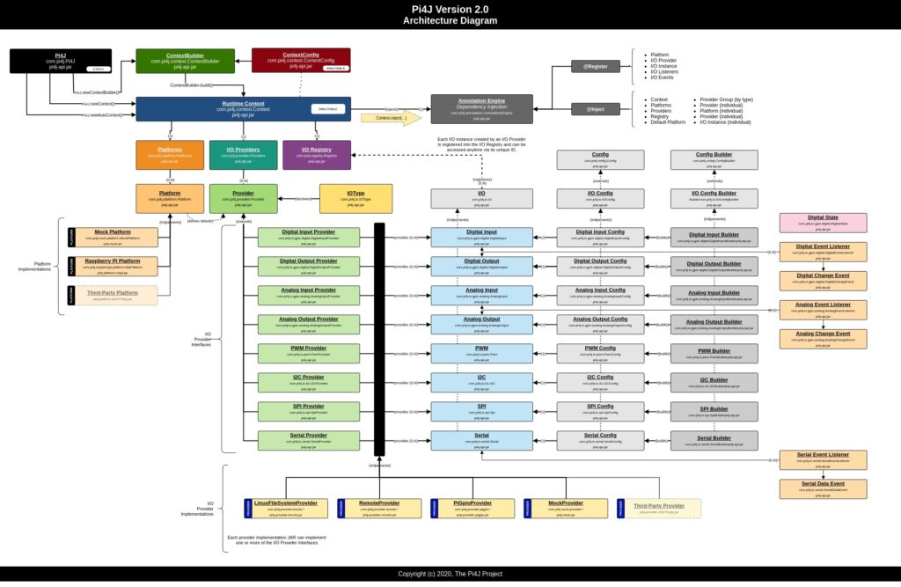

Java modules have been a big discussion point before in many places.

And this is now also causing some headaches in the Pi4J project...

About Pi4J V2 {#h2-0-about-pi4j-v2}
-----------------------------------

The Pi4J project (started in 2012) aims to unite Java programming with electronics. By using the Pi4J dependency in a project, electronic components connected to the GPIO-pins (General Purpose Input/Output) of the Raspberry Pi can be controlled as objects in the Java code. Pi4J uses native libraries to control the GPIOs so you - as a programmer - donʼt need to be fully aware of all the "magic" that relates to hardware communication.

Pi4J V.2 is a complete rewrite and **does not maintain API compatibility** with previous versions. It is not intended to be a drop-in replacement for previous versions of Pi4J. Pi4J V.2 is a completely **new design** aiming to bring **modern conventions, development practices, extensibility support, and a simplified integration experience** for Pi4J users.

To have a fully "open" architecture that is extendable with providers for specific GPIO-functions, boards,... a modular architecture was introduced in Pi4J V2. More information is available on [the Pi4J website](https://pi4j.com/architecture/).

The code of Pi4J is based on a layered approach, visualized in the picture below ([high-res version on pi4j.com](https://pi4j.com/architecture/)).
 Pi4J modular architecture

Auto detection of modules {#h2-1-auto-detection-of-modules}
-----------------------------------------------------------

Pi4J V2 uses `ServiceLoader` to detect which modules are available to communicate with the GPIOs. This allows to very dynamically extend the possibilities of the framework.

Code extract from [pi4j-core/src/.../runtime/impl/DefaultRuntime.java](https://github.com/Pi4J/pi4j-v2/blob/develop/pi4j-core/src/main/java/com/pi4j/runtime/impl/DefaultRuntime.java#L224):

<pre class="EnlighterJSRAW" data-enlighter-language="generic" data-enlighter-theme="" data-enlighter-highlight="" data-enlighter-linenumbers="" data-enlighter-lineoffset="" data-enlighter-title="" data-enlighter-group="">// detect available Pi4J Plugins by scanning the classpath looking for plugin instances
var plugins = ServiceLoader.load(Plugin.class);</pre>

The problems with the current approach {#h2-2-the-problems-with-the-current-approach}
-------------------------------------------------------------------------------------

**Pro**

* allows having a flexible architecture
* clear separation between the functionalites of the different modules
* is open for further extension (by adding additional providers)

**Cons**

* more difficult to get started for new Pi4J users
* causing confusion on how to configure a context
* not clear how to add the required dependencies
* module.info needed
* because of the use of the `ServiceLoader`, a FAT jar doesn't work

Use of modules in a Pi4J V2 project {#h2-3-use-of-modules-in-a-pi4j-v2-project}
-------------------------------------------------------------------------------

The Maven projects that are created as example applications and are part of the ["Getting Started" section](https://pi4j.com/getting-started/minimal-example-application/), can be built with `mvn clean package` and create a ready-to-run application in the `target\distribution`directory. All the modules which are defined in the project, are included here.

<pre class="EnlighterJSRAW" data-enlighter-language="generic" data-enlighter-theme="" data-enlighter-highlight="" data-enlighter-linenumbers="" data-enlighter-lineoffset="" data-enlighter-title="" data-enlighter-group="">$ cd target/distribution
$ ls -l
total 644
-rw-r--r-- 1 pi pi 364456 Jun 19 10:04 pi4j-core-2.0-SNAPSHOT.jar
-rw-r--r-- 1 pi pi   7243 Jun 19 10:04 pi4j-example-minimal-0.0.1.jar
-rw-r--r-- 1 pi pi 142461 Jun 19 10:04 pi4j-library-pigpio-2.0-SNAPSHOT.jar
-rw-r--r-- 1 pi pi  37302 Jun 19 10:04 pi4j-plugin-pigpio-2.0-SNAPSHOT.jar
-rw-r--r-- 1 pi pi  26917 Jun 19 10:04 pi4j-plugin-raspberrypi-2.0-SNAPSHOT.jar
-rwxr-xr-x 1 pi pi    101 Jun 19 10:04 run.sh
-rw-r--r-- 1 pi pi  52173 Jun 19 10:04 slf4j-api-2.0.0-alpha0.jar
-rw-r--r-- 1 pi pi  15372 Jun 19 10:04 slf4j-simple-2.0.0-alpha0.jar
$ sudo ./run.sh</pre>

Please join the discussion {#h2-4-please-join-the-discussion}
-------------------------------------------------------------

Do you have any ideas regarding this topic and how the "cons" can be converted to "pros"?

We are looking for extra feedback, possible improvements, code proposals... via [this GitHub discussion](https://github.com/Pi4J/pi4j-v2/discussions/178).

Please join!
